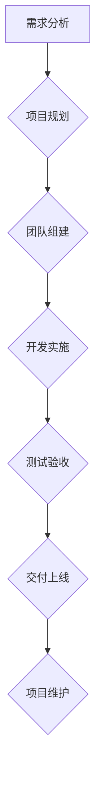
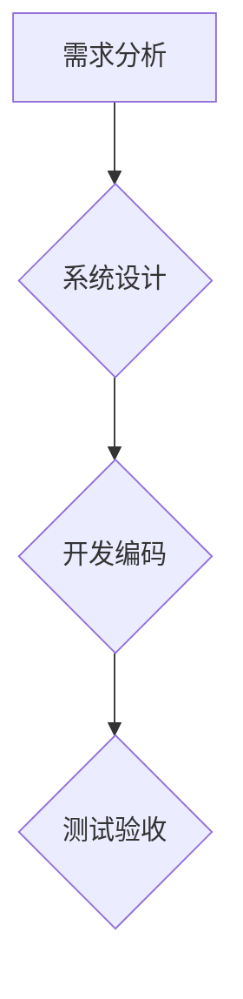

> 技术外包，项目管理，团队建设，软件开发，沟通技巧，风险控制

## 1. 背景介绍

在当今科技日新月异的时代，企业对于技术解决方案的需求日益增长。然而，许多企业自身缺乏专业的技术团队或资源，无法满足快速发展的市场需求。技术外包应运而生，成为企业解决技术难题的有效途径。技术外包是指企业将部分或全部的软件开发、技术维护等工作委托给专业的第三方公司或个人完成。

技术外包模式的兴起，为企业带来了诸多好处：

* **降低成本：** 企业可以避免招聘、培训和管理技术人员的成本，节省人力资源。
* **提高效率：** 外包公司拥有专业的技术团队和丰富的经验，可以更快、更高效地完成项目。
* **专注核心业务：** 企业可以将精力集中在自身的核心业务上，而不是被技术难题所困扰。
* **获取最新技术：** 外包公司通常会紧跟最新的技术发展趋势，可以为企业提供最先进的技术解决方案。

然而，技术外包也存在一些挑战：

* **沟通障碍：** 由于文化差异、语言障碍等原因，企业与外包公司之间可能存在沟通障碍。
* **质量控制：** 企业需要确保外包公司提供的服务质量能够满足自身的标准。
* **知识产权保护：** 企业需要妥善保护自身的知识产权，避免泄露或侵权。
* **风险控制：** 企业需要评估和控制技术外包带来的风险，例如项目延期、预算超支等。

## 2. 核心概念与联系

技术外包的核心概念包括：

* **需求分析：** 准确理解企业的技术需求，并将其转化为具体的项目目标和技术方案。
* **项目管理：** 制定项目计划、分配任务、跟踪进度、控制风险，确保项目按时、按预算完成。
* **团队建设：** 组建一支高效、专业的技术团队，并建立良好的团队合作机制。
* **沟通协调：** 建立有效的沟通机制，确保企业与外包公司之间信息畅通，及时解决问题。
* **质量保证：** 制定严格的质量标准，并进行全面的测试和验收，确保项目质量符合预期。

**Mermaid 流程图**

## 3. 核心算法原理 & 具体操作步骤

### 3.1  算法原理概述

技术外包项目管理的核心算法是基于项目生命周期的阶段性管理，通过分解项目任务、分配资源、控制进度和风险，最终实现项目目标。

### 3.2  算法步骤详解

1. **需求分析:** 
    * 详细了解企业的业务需求和技术目标。
    * 制定详细的技术方案，包括功能模块、技术架构、开发工具等。
2. **项目规划:**
    * 制定项目计划，包括项目目标、任务分解、时间安排、资源分配、预算控制等。
    * 使用项目管理工具，例如 Jira、Trello 等，进行任务管理和进度跟踪。
3. **团队组建:**
    * 根据项目需求，组建一支专业的技术团队，包括项目经理、开发工程师、测试工程师、UI/UX 设计师等。
    * 建立团队合作机制，明确各成员职责和权限。
4. **开发实施:**
    * 根据技术方案和项目计划，进行软件开发和测试工作。
    * 使用版本控制系统，例如 Git，管理代码版本和协同开发。
5. **测试验收:**
    * 进行全面的测试和验收，确保软件功能符合需求，性能稳定可靠。
    * 与企业进行验收测试，确认项目成果满足预期。
6. **交付上线:**
    * 将软件部署到生产环境，并进行上线测试和维护。
    * 提供技术文档和培训，帮助企业使用和维护软件。
7. **项目维护:**
    * 提供软件维护和技术支持服务，及时解决用户问题和bug修复。
    * 根据用户反馈和市场需求，进行软件迭代更新。

### 3.3  算法优缺点

**优点:**

* **高效:** 通过阶段性管理和资源优化，提高项目执行效率。
* **可控:** 通过项目计划和风险控制，降低项目风险和成本。
* **灵活:** 可以根据项目需求，灵活调整团队规模和资源配置。

**缺点:**

* **复杂:** 项目管理流程复杂，需要专业的项目管理人员和工具支持。
* **沟通成本:** 需要与外包公司进行频繁的沟通和协调，沟通成本较高。
* **质量控制:** 需要加强对外包公司的质量控制，确保项目质量符合预期。

### 3.4  算法应用领域

技术外包算法广泛应用于软件开发、IT服务、咨询服务等领域。

## 4. 数学模型和公式 & 详细讲解 & 举例说明

### 4.1  数学模型构建

技术外包项目管理可以采用PERT（Program Evaluation and Review Technique）网络图模型来描述项目任务之间的依赖关系和时间安排。

**PERT网络图模型**

* **节点:** 代表项目任务。
* **弧:** 代表任务之间的依赖关系。
* **时间:** 每个节点对应一个任务执行时间。

### 4.2  公式推导过程

PERT网络图模型可以用来计算项目完成时间和关键路径。

* **项目完成时间:**  

$$
T_{项目} = max(T_{关键路径})
$$

* **关键路径:**  

关键路径是指项目完成时间最长的路径，其延迟会直接影响项目整体完成时间。

### 4.3  案例分析与讲解

假设一个技术外包项目包含以下任务：

* 任务A:需求分析 (时间: 2周)
* 任务B:系统设计 (时间: 3周)
* 任务C:开发编码 (时间: 5周)
* 任务D:测试验收 (时间: 2周)

PERT网络图模型如下：

关键路径为 A -> B -> C -> D，项目完成时间为 12 周。

## 5. 项目实践：代码实例和详细解释说明

### 5.1  开发环境搭建

技术外包项目开发环境搭建需要根据项目需求和技术方案进行配置。

* **操作系统:** Linux、Windows 等。
* **编程语言:** Java、Python、C++ 等。
* **数据库:** MySQL、PostgreSQL 等。
* **开发工具:** IDE、版本控制系统、测试工具等。

### 5.2  源代码详细实现

技术外包项目源代码实现需要根据项目需求和技术方案进行编写。

* **模块化设计:** 将项目功能模块化设计，提高代码可维护性和可扩展性。
* **代码规范:** 遵循统一的代码规范，保证代码质量和可读性。
* **单元测试:** 对每个模块进行单元测试，确保代码功能正确。

### 5.3  代码解读与分析

技术外包项目代码解读需要对代码结构、逻辑和算法进行分析，理解代码的功能和工作原理。

* **代码注释:** 编写详细的代码注释，方便理解代码逻辑。
* **代码审查:** 进行代码审查，发现代码缺陷和潜在问题。
* **代码优化:** 对代码进行优化，提高代码性能和效率。

### 5.4  运行结果展示

技术外包项目运行结果展示需要对项目功能进行测试，并展示测试结果。

* **功能测试:** 对项目功能进行测试，确保功能符合需求。
* **性能测试:** 对项目性能进行测试，确保系统稳定可靠。
* **安全性测试:** 对项目安全性进行测试，确保数据安全。

## 6. 实际应用场景

技术外包广泛应用于以下场景：

* **企业软件开发:** 企业可以将软件开发工作外包给专业的软件开发公司，节省成本和时间。
* **IT基础设施建设:** 企业可以将IT基础设施建设外包给专业的IT服务公司，获得更专业的技术支持和服务。
* **数据分析和挖掘:** 企业可以将数据分析和挖掘工作外包给专业的咨询公司，获得更深入的数据洞察和商业价值。

### 6.4  未来应用展望

随着科技发展和市场需求的变化，技术外包将呈现以下趋势：

* **更细分化的服务:** 技术外包服务将更加细分化，提供更专业、更定制化的服务。
* **更智能化的管理:** 技术外包项目管理将更加智能化，利用人工智能和机器学习技术提高效率和质量。
* **更广泛的应用场景:** 技术外包将应用于更多领域，例如医疗、教育、金融等。

## 7. 工具和资源推荐

### 7.1  学习资源推荐

* **书籍:** 《软件工程导论》、《项目管理实战》
* **在线课程:** Coursera、Udemy 等平台提供丰富的项目管理和技术外包课程。
* **技术博客:** 关注技术领域的博客和论坛，了解最新的技术趋势和最佳实践。

### 7.2  开发工具推荐

* **项目管理工具:** Jira、Trello、Asana 等。
* **版本控制系统:** Git、SVN 等。
* **代码编辑器:** VS Code、Sublime Text 等。

### 7.3  相关论文推荐

* **项目管理:** 《项目管理知识体系》
* **技术外包:** 《技术外包的风险管理》

## 8. 总结：未来发展趋势与挑战

### 8.1  研究成果总结

技术外包模式已经成为企业解决技术难题的有效途径，并取得了显著的成果。

* **降低成本:** 企业通过技术外包可以节省人力、物力和时间成本。
* **提高效率:** 外包公司拥有专业的技术团队和丰富的经验，可以更快、更高效地完成项目。
* **获取最新技术:** 企业可以通过技术外包获取最新的技术解决方案。

### 8.2  未来发展趋势

技术外包将朝着以下方向发展：

* **更细分化的服务:** 技术外包服务将更加细分化，提供更专业、更定制化的服务。
* **更智能化的管理:** 技术外包项目管理将更加智能化，利用人工智能和机器学习技术提高效率和质量。
* **更广泛的应用场景:** 技术外包将应用于更多领域，例如医疗、教育、金融等。

### 8.3  面临的挑战

技术外包也面临一些挑战：

* **沟通障碍:** 由于文化差异、语言障碍等原因，企业与外包公司之间可能存在沟通障碍。
* **质量控制:** 企业需要确保外包公司提供的服务质量能够满足自身的标准。
* **知识产权保护:** 企业需要妥善保护自身的知识产权，避免泄露或侵权。
* **风险控制:** 企业需要评估和控制技术外包带来的风险，例如项目延期、预算超支等。

### 8.4  研究展望

未来，技术外包领域的研究方向包括：

* **智能化项目管理:** 利用人工智能和机器学习技术，提高技术外包项目管理的效率和质量。
* **跨文化沟通:** 研究跨文化沟通的最佳实践，解决企业与外包公司之间的沟通障碍。
* **知识产权保护:** 研究更有效的知识产权保护机制，保障企业知识产权安全。
* **风险管理:** 研究更有效的风险管理方法，降低技术外包带来的风险。

## 9. 附录：常见问题与解答

**常见问题:**

* **如何选择合适的技术外包公司？**
* **如何确保技术外包项目的质量？**
* **如何控制技术外包项目的风险？**
* **如何与技术外包公司进行有效的沟通？**

**解答:**

* 选择合适的技术外包公司需要考虑公司的规模、经验、技术实力、服务范围等因素。
* 确保技术外包项目的质量可以通过制定严格的质量标准、进行全面的测试和验收等方式实现。
* 控制技术外包项目的风险可以通过制定详细的项目计划、进行风险评估和