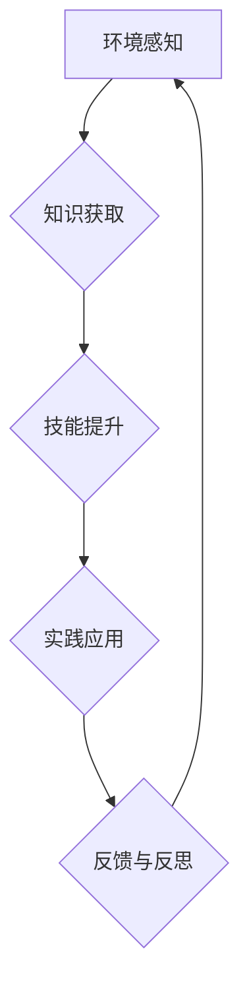

> 持续学习，管理者，技术发展，适应能力，创新驱动，知识更新，未来趋势，学习方法，个人成长

## 1. 背景介绍

在当今科技日新月异的时代，持续学习已成为管理者成功的不二法门。技术发展日新月异，市场竞争日益激烈，管理者需要不断学习新知识、新技能，才能适应不断变化的环境，带领团队取得成功。

传统的管理模式往往强调经验和权威，但这种模式在快速变化的时代已经不再适用。管理者需要具备敏锐的洞察力，能够及时识别新趋势，并制定相应的策略。而持续学习正是帮助管理者实现这一目标的关键。

## 2. 核心概念与联系

**2.1 持续学习的定义**

持续学习是指一种终身学习的理念，强调在整个职业生涯中不断学习新知识、新技能，以适应不断变化的环境和需求。它不仅仅是学习新技术，更重要的是培养学习能力、思考能力和解决问题的能力。

**2.2 持续学习与管理者成功之间的联系**

持续学习对于管理者成功至关重要，因为它能够帮助管理者：

* **适应快速变化的技术环境:** 科技发展日新月异，管理者需要不断学习新技术，才能了解最新的行业趋势，并制定相应的策略。
* **提升领导力和决策能力:** 持续学习可以帮助管理者拓宽视野，提升知识水平，从而做出更明智的决策。
* **增强团队凝聚力和创新能力:** 持续学习的氛围可以激发团队成员的学习热情，促进团队成员之间的交流和合作，从而增强团队的创新能力。
* **提升个人价值和竞争力:** 在竞争激烈的职场环境中，持续学习可以帮助管理者提升个人价值，增强竞争力，获得更好的职业发展机会。

**2.3 持续学习的架构**



## 3. 核心算法原理 & 具体操作步骤

**3.1 算法原理概述**

持续学习是一个迭代的过程，需要不断地感知环境、获取知识、提升技能、实践应用、反馈反思。

**3.2 算法步骤详解**

1. **环境感知:** 管理者需要时刻关注行业动态、市场趋势、技术发展等，了解自身所处环境的变化。
2. **知识获取:** 通过阅读书籍、参加培训、学习在线课程等方式获取新知识，并将其与自身经验进行整合。
3. **技能提升:** 将新知识转化为实际技能，可以通过实践、项目、案例等方式进行提升。
4. **实践应用:** 将学习到的知识和技能应用到实际工作中，并不断总结经验教训。
5. **反馈与反思:** 反思实践过程中的经验教训，总结成功和失败的原因，并将其反馈到知识获取和技能提升环节，不断优化学习过程。

**3.3 算法优缺点**

* **优点:** 持续学习能够帮助管理者适应快速变化的环境，提升领导力和决策能力，增强团队凝聚力和创新能力，提升个人价值和竞争力。
* **缺点:** 持续学习需要投入时间和精力，并且需要克服惰性思维和学习障碍。

**3.4 算法应用领域**

持续学习适用于所有管理者，无论其行业、职位、经验等。

## 4. 数学模型和公式 & 详细讲解 & 举例说明

**4.1 数学模型构建**

我们可以用一个简单的数学模型来描述持续学习的过程：

```latex
L(t) = L(0) + \int_0^t \alpha(s) ds
```

其中：

* $L(t)$ 表示在时间 $t$ 时刻的学习水平
* $L(0)$ 表示初始学习水平
* $\alpha(s)$ 表示在时间 $s$ 时刻的学习速率
* $\int_0^t \alpha(s) ds$ 表示从时间 0 到时间 $t$ 的学习量

**4.2 公式推导过程**

这个公式的推导过程基于微积分的知识。我们可以将学习过程看作是一个连续变化的过程，学习水平的变化率就是学习速率。

**4.3 案例分析与讲解**

假设一个管理者初始学习水平为 $L(0) = 50$，学习速率为 $\alpha(s) = 2$，那么在时间 $t = 10$ 时刻，其学习水平为：

```latex
L(10) = 50 + \int_0^{10} 2 ds = 50 + 20 = 70
```

这意味着在 10 个时间单位内，该管理者的学习水平提升了 20 个单位。

## 5. 项目实践：代码实例和详细解释说明

**5.1 开发环境搭建**

持续学习是一个需要不断实践和迭代的过程，我们可以通过搭建一个学习平台来帮助管理者进行持续学习。

**5.2 源代码详细实现**

由于篇幅限制，这里只提供一个简单的学习平台的代码框架：

```python
class LearningPlatform:
    def __init__(self):
        self.courses = []
        self.users = []

    def add_course(self, course):
        self.courses.append(course)

    def add_user(self, user):
        self.users.append(user)

    def get_courses(self):
        return self.courses

    def get_users(self):
        return self.users
```

**5.3 代码解读与分析**

这个代码框架定义了一个学习平台的类，包含了添加课程、添加用户、获取课程列表和获取用户列表等方法。

**5.4 运行结果展示**

通过运行这个代码框架，我们可以创建一个简单的学习平台，并添加课程和用户。

## 6. 实际应用场景

**6.1 持续学习平台建设**

企业可以建设自己的持续学习平台，为员工提供学习资源和学习机会，帮助员工提升技能和知识水平。

**6.2 在线学习课程开发**

教育机构和企业可以开发在线学习课程，提供给管理者学习，帮助他们掌握最新的管理知识和技能。

**6.3 知识共享平台建设**

企业可以建设知识共享平台，鼓励员工分享经验和知识，促进团队学习和成长。

**6.4 未来应用展望**

随着人工智能技术的不断发展，持续学习将更加智能化、个性化和高效化。未来，我们可以期待看到更多基于人工智能的持续学习平台和工具，帮助管理者更有效地进行持续学习。

## 7. 工具和资源推荐

**7.1 学习资源推荐**

* **书籍:** 《高效能人士的七个习惯》、《领导力》、《创新者的窘境》
* **在线课程:** Coursera、edX、Udemy
* **博客和网站:** Harvard Business Review、MIT Sloan Management Review

**7.2 开发工具推荐**

* **学习平台开发框架:** Django、Flask
* **在线学习平台:** Moodle、Canvas
* **知识共享平台:** Confluence、SharePoint

**7.3 相关论文推荐**

* **持续学习的定义和重要性:** "Lifelong Learning: A Review"
* **持续学习的算法和方法:** "Deep Learning for Lifelong Learning"
* **持续学习的应用场景:** "Lifelong Learning in Industry"

## 8. 总结：未来发展趋势与挑战

**8.1 研究成果总结**

持续学习已成为管理者成功的重要驱动力，其理论和实践不断发展，并取得了显著成果。

**8.2 未来发展趋势**

未来，持续学习将更加智能化、个性化和高效化，人工智能技术将扮演越来越重要的角色。

**8.3 面临的挑战**

持续学习面临着一些挑战，例如学习资源的获取、学习方法的改进、学习动力的保持等。

**8.4 研究展望**

未来研究将重点关注持续学习的智能化、个性化和高效化，以及如何克服持续学习面临的挑战。

## 9. 附录：常见问题与解答

**9.1 如何克服学习惰性思维？**

* 制定学习计划，并坚持执行
* 寻找学习伙伴，互相监督和鼓励
* 将学习与工作结合起来，提升学习的实用性
* 奖励自己学习的成果，增强学习的动力

**9.2 如何选择适合自己的学习方法？**

* 了解自己的学习风格，选择适合自己的学习方法
* 尝试不同的学习方法，找到最有效的学习方法
* 不断反思和调整学习方法，提高学习效率

**9.3 如何保持持续学习的热情？**

* 关注学习的意义和价值，保持学习的动力
* 将学习与个人兴趣和职业发展结合起来
* 积极参与学习社区，与他人交流学习经验


作者：禅与计算机程序设计艺术 / Zen and the Art of Computer Programming 
<end_of_turn>