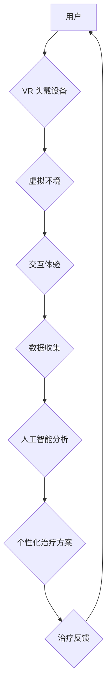

> 数字治疗、虚拟现实、心理健康、沉浸式体验、神经科学、人工智能、数据分析

## 1. 背景介绍

心理健康问题日益成为全球关注的焦点，其带来的社会和经济负担不容忽视。传统的心理治疗方法，例如认知行为疗法 (CBT) 和人际关系疗法 (IPT)，虽然有效，但存在一些局限性，例如时间成本高、地理限制、患者隐私等问题。近年来，数字治疗技术，特别是虚拟现实 (VR) 技术，为心理健康治疗带来了新的希望。

VR 技术能够创造逼真的虚拟环境，让患者沉浸其中，体验不同的场景和情境。这种沉浸式体验能够帮助患者更好地理解和应对他们的心理问题。例如，对于患有社交恐惧症的患者，VR 可以模拟社交场景，让他们在虚拟环境中练习社交技能，逐渐克服恐惧。

## 2. 核心概念与联系

**2.1 虚拟现实 (VR)**

VR 技术利用计算机图形学、传感器技术和显示技术，创造出逼真的虚拟环境，让用户能够沉浸其中，并与虚拟环境进行交互。VR 头戴设备能够捕捉用户的头部和眼球运动，并根据用户的动作调整虚拟环境的视角，从而实现逼真的沉浸式体验。

**2.2 数字治疗 (Digital Therapeutics)**

数字治疗是指利用数字技术，例如软件、应用程序、传感器和人工智能，来预防、管理和治疗疾病的医疗方法。数字治疗的目标是提供个性化、可访问、有效的治疗方案，并提高患者的治疗依从性。

**2.3 心理健康**

心理健康是指个体在生理、心理和社会方面都处于良好的状态，能够有效地应对生活中的压力和挑战。心理健康问题包括焦虑症、抑郁症、创伤后应激障碍 (PTSD) 和社交恐惧症等。

**2.4 核心概念联系**

VR 技术与数字治疗相结合，为心理健康治疗提供了新的可能性。VR 可以创造逼真的虚拟环境，模拟现实生活中的场景，让患者在安全的环境中练习应对心理问题。数字治疗平台可以整合 VR 技术，提供个性化的治疗方案，并跟踪患者的治疗进度。

**2.5 核心架构流程图**



## 3. 核心算法原理 & 具体操作步骤

**3.1 算法原理概述**

数字治疗平台中的核心算法通常包括以下几个方面：

* **用户建模:** 利用用户的数据，例如年龄、性别、症状、治疗历史等，构建用户模型，以便提供个性化的治疗方案。
* **虚拟环境生成:** 根据用户的需求和治疗目标，生成逼真的虚拟环境，模拟现实生活中的场景。
* **交互机制设计:** 设计用户与虚拟环境交互的机制，例如手势识别、语音识别、眼球追踪等，使用户能够沉浸式地体验虚拟环境。
* **数据分析与反馈:** 收集用户在虚拟环境中的行为数据，利用人工智能算法进行分析，并根据分析结果提供个性化的治疗反馈。

**3.2 算法步骤详解**

1. **用户注册和数据收集:** 用户注册平台并提供个人信息，例如年龄、性别、症状、治疗历史等。
2. **用户建模:** 利用机器学习算法，对用户的个人信息进行分析，构建用户模型，包括用户的性格特征、心理状态、治疗偏好等。
3. **虚拟环境生成:** 根据用户的治疗目标和用户模型，生成相应的虚拟环境。例如，对于患有社交恐惧症的患者，可以生成模拟社交场景的虚拟环境。
4. **交互体验:** 用户使用 VR 头戴设备进入虚拟环境，并与虚拟环境进行交互。
5. **数据收集:** VR 系统收集用户的行为数据，例如用户的动作、表情、眼球运动等。
6. **数据分析:** 利用人工智能算法，对收集到的数据进行分析，识别用户的行为模式和心理状态变化。
7. **个性化治疗反馈:** 根据数据分析结果，平台提供个性化的治疗反馈，例如指导用户如何应对虚拟环境中的挑战，提供心理支持等。

**3.3 算法优缺点**

**优点:**

* **个性化治疗:** 根据用户的个人信息和治疗目标，提供个性化的治疗方案。
* **沉浸式体验:** VR 技术能够创造逼真的虚拟环境，让患者沉浸其中，更好地理解和应对他们的心理问题。
* **可访问性:** 数字治疗平台可以提供远程治疗服务，提高患者的治疗可访问性。
* **数据驱动:** 数字治疗平台可以收集和分析用户的治疗数据，帮助医生更好地了解患者的治疗效果，并进行调整。

**缺点:**

* **技术成本:** VR 技术和人工智能算法的开发和维护成本较高。
* **伦理问题:** 数字治疗平台需要解决用户隐私、数据安全等伦理问题。
* **临床验证:** 数字治疗技术的临床验证还需要进一步加强。

**3.4 算法应用领域**

数字治疗平台可以应用于多种心理健康问题，例如：

* **焦虑症:** 利用 VR 技术模拟焦虑场景，帮助患者练习应对焦虑情绪。
* **抑郁症:** 利用 VR 技术创造积极的虚拟环境，帮助患者提升情绪和幸福感。
* **创伤后应激障碍 (PTSD):** 利用 VR 技术模拟创伤场景，帮助患者进行心理重建和康复。
* **社交恐惧症:** 利用 VR 技术模拟社交场景，帮助患者练习社交技能。

## 4. 数学模型和公式 & 详细讲解 & 举例说明

**4.1 数学模型构建**

数字治疗平台中的核心算法通常基于以下数学模型：

* **用户建模:** 可以使用贝叶斯网络、决策树或支持向量机等机器学习算法构建用户模型，预测用户的治疗效果和治疗偏好。
* **虚拟环境生成:** 可以使用3D建模软件和图形渲染技术生成逼真的虚拟环境，并使用数学公式描述虚拟环境中的物理特性和交互规则。
* **交互机制设计:** 可以使用运动捕捉技术和传感器数据分析算法设计用户与虚拟环境的交互机制，例如手势识别、语音识别、眼球追踪等。

**4.2 公式推导过程**

例如，在用户建模中，可以使用贝叶斯网络来描述用户的症状、治疗历史和治疗效果之间的关系。贝叶斯网络是一个概率图模型，可以表示变量之间的依赖关系。

假设我们有一个用户模型，包含以下变量：

* $S$: 用户的症状
* $T$: 用户的治疗历史
* $E$: 用户的治疗效果

我们可以使用贝叶斯定理来计算用户治疗效果的概率：

$$P(E|S,T) = \frac{P(S,T|E)P(E)}{P(S,T)}$$

其中：

* $P(E|S,T)$ 是用户治疗效果的概率，给定用户的症状和治疗历史。
* $P(S,T|E)$ 是用户症状和治疗历史的概率，给定用户的治疗效果。
* $P(E)$ 是用户治疗效果的先验概率。
* $P(S,T)$ 是用户症状和治疗历史的联合概率。

**4.3 案例分析与讲解**

例如，对于一个患有焦虑症的患者，我们可以使用贝叶斯网络来预测其治疗效果。如果患者的症状严重，治疗历史良好，则其治疗效果的概率会更高。

## 5. 项目实践：代码实例和详细解释说明

**5.1 开发环境搭建**

数字治疗平台的开发环境通常包括以下软件：

* **Unity3D:** 用于开发 VR 应用的跨平台游戏引擎。
* **Unreal Engine:** 另一种流行的 VR 游戏引擎。
* **Python:** 用于数据分析、机器学习和人工智能算法开发的编程语言。
* **TensorFlow:** 一个开源的机器学习框架。
* **PyTorch:** 另一个流行的机器学习框架。

**5.2 源代码详细实现**

以下是一个使用 Unity3D 开发 VR 应用的简单代码示例：

```csharp
using UnityEngine;
using UnityEngine.VR;

public class VRController : MonoBehaviour
{
    public Transform hand;

    void Update()
    {
        // 获取 VR 头戴设备的输入
        VRInput input = InputTracking.GetLocalRotation(VRNode.CenterEye);

        // 将 VR 头戴设备的旋转角度应用于手部物体
        hand.rotation = input.rotation;
    }
}
```

**5.3 代码解读与分析**

这段代码定义了一个名为 VRController 的脚本，该脚本用于控制 VR 应用中的手部物体。

* `VRInput input = InputTracking.GetLocalRotation(VRNode.CenterEye);` 获取 VR 头戴设备的旋转角度。
* `hand.rotation = input.rotation;` 将 VR 头戴设备的旋转角度应用于手部物体。

**5.4 运行结果展示**

运行这段代码后，用户可以使用 VR 头戴设备控制手部物体的旋转角度。

## 6. 实际应用场景

数字治疗平台已经开始应用于多种实际场景，例如：

* **医院:** 医院可以使用数字治疗平台提供远程心理治疗服务，提高患者的治疗可访问性。
* **学校:** 学校可以使用数字治疗平台帮助学生应对压力、焦虑和抑郁等心理问题。
* **企业:** 企业可以使用数字治疗平台帮助员工缓解工作压力、提高工作效率。

**6.4 未来应用展望**

数字治疗平台在未来将有更广泛的应用场景，例如：

* **个性化治疗:** 数字治疗平台将能够根据用户的个人信息和治疗目标，提供更加个性化的治疗方案。
* **人工智能辅助:** 人工智能将能够帮助医生更好地理解用户的治疗需求，并提供更精准的治疗建议。
* **虚拟现实增强:** VR 技术将更加逼真和沉浸式，能够提供更有效的治疗体验。

## 7. 工具和资源推荐

**7.1 学习资源推荐**

* **Coursera:** 提供有关数字治疗和 VR 技术的在线课程。
* **Udacity:** 提供有关人工智能和机器学习的在线课程。
* **MIT OpenCourseWare:** 提供有关心理学和神经科学的公开课程。

**7.2 开发工具推荐**

* **Unity3D:** 跨平台游戏引擎，用于开发 VR 应用。
* **Unreal Engine:** 另一种流行的 VR 游戏引擎。
* **TensorFlow:** 开源机器学习框架。
* **PyTorch:** 另一个流行的机器学习框架。

**7.3 相关论文推荐**

* **Virtual Reality for Mental Health Treatment: A Systematic Review and Meta-Analysis**
* **The Use of Virtual Reality in the Treatment of Anxiety Disorders: A Systematic Review**
* **Digital Therapeutics: A New Era in Healthcare**

## 8. 总结：未来发展趋势与挑战

**8.1 研究成果总结**

数字治疗平台在心理健康治疗领域取得了显著的进展，能够提供个性化、可访问、有效的治疗方案。VR 技术能够创造逼真的虚拟环境，帮助患者更好地理解和应对他们的心理问题。人工智能算法能够帮助医生更好地理解用户的治疗需求，并提供更精准的治疗建议。

**8.2 未来发展趋势**

数字治疗平台将朝着以下方向发展：

* **更加个性化:** 数字治疗平台将能够根据用户的个人信息和治疗目标，提供更加个性化的治疗方案。
* **更加智能化:** 人工智能将能够帮助医生更好地理解用户的治疗需求，并提供更精准的治疗建议。
* **更加沉浸式:** VR 技术将更加逼真和沉浸式，能够提供更有效的治疗体验。

**8.3 面临的挑战**

数字治疗平台还面临一些挑战：

* **技术成本:** VR 技术和人工智能算法的开发和维护成本较高。
* **伦理问题:** 数字治疗平台需要解决用户隐私、数据安全等伦理问题。
* **临床验证:** 数字治疗技术的临床验证还需要进一步加强。

**8.4 研究展望**

未来，数字治疗平台将继续发展，为更多的人提供心理健康服务。研究者需要继续探索新的算法和技术，提高数字治疗平台的有效性和安全性。


## 9. 附录：常见问题与解答

**9.1  VR 技术是否安全？**

