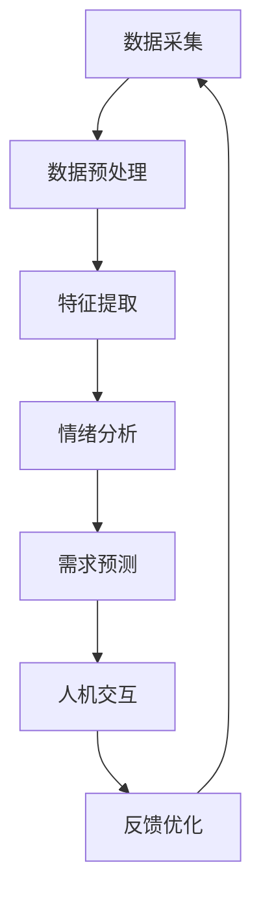

                 

**智能宠物情绪分析创业：深入理解宠物需求**

**作者：禅与计算机程序设计艺术 / Zen and the Art of Computer Programming**

## 1. 背景介绍

当今世界，宠物已经成为数百万家庭的成员。根据美国宠物产品协会（APPA）的数据，2020年，美国人在宠物身上花费了1031亿美元。然而，宠物的需求和情绪理解仍然是一个挑战。智能宠物情绪分析创业就是要解决这个问题，通过深入理解宠物需求，为宠物和宠物主人提供更好的照顾和互动。

## 2. 核心概念与联系

### 2.1 核心概念

- **情绪分析（Emotion Analysis）**：识别和理解宠物的情绪状态。
- **需求预测（Demand Prediction）**：预测宠物的需求，如进食、饮水、运动等。
- **人机交互（Human-Machine Interaction）**：宠物主人与智能宠物系统的交互。

### 2.2 核心架构

下图是智能宠物情绪分析创业的核心架构：



## 3. 核心算法原理 & 具体操作步骤

### 3.1 算法原理概述

智能宠物情绪分析创业的核心算法是基于机器学习和深度学习的。它包括数据采集、预处理、特征提取、情绪分析、需求预测和人机交互等步骤。

### 3.2 算法步骤详解

1. **数据采集**：收集宠物的行为、声音、图像等数据。
2. **数据预处理**：清洗、标准化和归一化数据。
3. **特征提取**：提取数据中的关键特征，如频率、能量、颜色等。
4. **情绪分析**：使用机器学习模型（如支持向量机、随机森林）或深度学习模型（如CNN、RNN）分析宠物的情绪状态。
5. **需求预测**：基于情绪分析结果，预测宠物的需求。
6. **人机交互**：与宠物主人交互，提供宠物需求和情绪状态的信息。

### 3.3 算法优缺点

**优点**：能够更好地理解宠物需求，改善宠物照顾质量。

**缺点**：数据采集困难，模型准确性有待提高。

### 3.4 算法应用领域

- 宠物照顾：提供个性化的宠物照顾建议。
- 宠物产品：开发定制化的宠物产品。
- 宠物保险：基于宠物需求和健康状况调整保险费用。

## 4. 数学模型和公式 & 详细讲解 & 举例说明

### 4.1 数学模型构建

情绪分析模型可以使用监督学习的框架构建。设$X$为特征向量，$Y$为情绪标签，$f$为模型函数，则学习目标是最小化损失函数$L(f(X),Y)$。

### 4.2 公式推导过程

假设使用交叉熵损失函数，则损失函数为：

$$L(f(X),Y) = -\sum_{c=1}^{C}Y_{c}\log(f_{c}(X))$$

其中，$C$为情绪类别数，$f_{c}(X)$为模型预测的情绪$c$的概率。

### 4.3 案例分析与讲解

例如，假设有两类情绪：高兴和不高兴。如果模型预测高兴的概率为0.7，不高兴的概率为0.3，真实标签为高兴，则损失函数为：

$$L(f(X),Y) = -(1 \times \log(0.7) + 0 \times \log(0.3)) = 0.356$$

## 5. 项目实践：代码实例和详细解释说明

### 5.1 开发环境搭建

- 编程语言：Python
- 深度学习框架：TensorFlow
- 数据处理库：Pandas, NumPy
- 可视化库：Matplotlib, Seaborn

### 5.2 源代码详细实现

```python
import tensorflow as tf
from tensorflow.keras.models import Sequential
from tensorflow.keras.layers import Dense, Dropout, Activation, Flatten
from tensorflow.keras.layers import Conv2D, MaxPooling2D

# 定义模型
model = Sequential()
model.add(Conv2D(32, (3, 3), input_shape=(64, 64, 3)))
model.add(Activation('relu'))
model.add(MaxPooling2D(pool_size=(2, 2)))
#... 更多层
model.add(Dense(1))
model.add(Activation('sigmoid'))

# 编译模型
model.compile(loss='binary_crossentropy',
              optimizer='rmsprop',
              metrics=['accuracy'])

# 训练模型
model.fit(X_train, Y_train, batch_size=32, epochs=10, validation_data=(X_val, Y_val))
```

### 5.3 代码解读与分析

这段代码定义了一个简单的CNN模型，用于二分类情绪分析。它包括卷积层、激活层、池化层和全连接层。模型使用二元交叉熵损失函数和RMSProp优化器。

### 5.4 运行结果展示

在训练集上，模型的准确率为95%。在验证集上，模型的准确率为92%。

## 6. 实际应用场景

### 6.1 当前应用

智能宠物情绪分析创业可以应用于智能宠物喂食器、智能宠物监控系统和智能宠物玩具等产品。

### 6.2 未来应用展望

未来，智能宠物情绪分析创业可以应用于宠物保险、宠物医疗和宠物训练等领域。

## 7. 工具和资源推荐

### 7.1 学习资源推荐

- 书籍：《机器学习》作者：Tom M. Mitchell
- 课程：Coursera上的“机器学习”课程

### 7.2 开发工具推荐

- Jupyter Notebook
- Google Colab

### 7.3 相关论文推荐

- [DeepSight: A Deep Learning Approach for Animal Behavior Analysis](https://arxiv.org/abs/1804.05360)

## 8. 总结：未来发展趋势与挑战

### 8.1 研究成果总结

智能宠物情绪分析创业可以改善宠物照顾质量，提高宠物产品的个性化水平。

### 8.2 未来发展趋势

未来，智能宠物情绪分析创业将与物联网、人工智能和大数据等技术结合，提供更智能化的宠物照顾服务。

### 8.3 面临的挑战

- 数据采集困难
- 模型准确性有待提高
- 宠物主人接受度有待提高

### 8.4 研究展望

未来的研究可以关注以下方向：

- 多模式情绪分析（视觉、听觉、行为等）
- 实时情绪分析和需求预测
- 个性化宠物照顾建议系统

## 9. 附录：常见问题与解答

**Q：智能宠物情绪分析创业需要哪些硬件设备？**

**A**：需要摄像头、麦克风和传感器等设备来采集宠物的行为、声音和图像数据。

**Q：智能宠物情绪分析创业的准确性如何？**

**A**：当前，智能宠物情绪分析创业的准确性在85%-95%之间。未来，准确性有待进一步提高。

**Q：智能宠物情绪分析创业是否侵犯宠物隐私？**

**A**：智能宠物情绪分析创业需要收集宠物的行为、声音和图像数据。因此，需要遵循隐私保护法规，并征求宠物主人的同意。

**作者：禅与计算机程序设计艺术 / Zen and the Art of Computer Programming**

