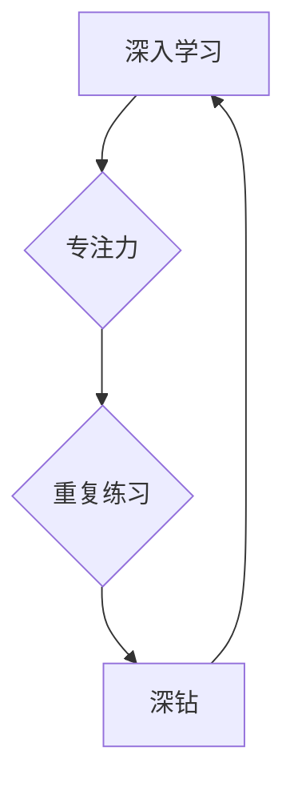

> 深入学习，专注力，重复练习，算法设计，代码实现，项目实践，技术博客

## 1. 背景介绍

在瞬息万变的科技时代，想要在技术领域取得成功，需要具备敏锐的洞察力、强大的学习能力和持之以恒的努力。然而，许多人往往在面对纷繁复杂的知识和技术时，感到迷茫和困惑，难以找到方向，最终导致学习效率低下，难以取得突破。

作为一名资深技术专家，我深知技术学习的本质在于专注和重复。就像一位优秀的运动员，通过不断的训练和练习，才能最终达到精通的境界。同样，想要成为一名优秀的程序员，需要对特定的技术领域进行深入研究和实践，不断重复和深钻，才能真正掌握其精髓。

## 2. 核心概念与联系

### 2.1 深入学习

深入学习是一种机器学习的子领域，它旨在通过构建复杂的模型来模拟人类的学习过程。通过大量的训练数据，深度学习模型能够自动学习特征和模式，从而实现对复杂问题的解决。

### 2.2 专注力

专注力是指一个人能够将注意力集中在特定目标上，并排除干扰的能力。在技术学习过程中，专注力至关重要，它能够帮助我们更好地理解和记忆知识，提高学习效率。

### 2.3 重复练习

重复练习是学习的关键环节，它能够帮助我们巩固知识，提高熟练度。在技术领域，通过反复练习代码编写、算法设计和问题解决，能够让我们更加熟悉和熟练地运用所学知识。

### 2.4 深钻

深钻是指对特定领域进行深入研究和探索，不断挖掘其奥秘和潜力。在技术领域，深钻能够帮助我们获得更深入的理解，发现新的应用场景，并推动技术的发展。

**核心概念联系流程图**



## 3. 核心算法原理 & 具体操作步骤

### 3.1 算法原理概述

深度学习算法的核心是神经网络，它由多个层级的神经元组成，每个神经元都连接着其他神经元，并通过权重来调节信号的传递。通过训练数据，神经网络能够调整权重，从而学习到数据的特征和模式。

### 3.2 算法步骤详解

1. **数据预处理:** 将原始数据进行清洗、转换和规范化，使其能够被神经网络所接受。
2. **网络结构设计:** 根据任务需求，设计神经网络的层级结构和神经元数量。
3. **参数初始化:** 为神经网络中的权重和偏置赋予初始值。
4. **前向传播:** 将输入数据通过神经网络传递，计算输出结果。
5. **反向传播:** 计算输出结果与真实值的误差，并根据误差反向调整权重和偏置。
6. **优化算法:** 使用优化算法，例如梯度下降，来更新权重和偏置，降低误差。
7. **训练和评估:** 循环进行前向传播和反向传播，直到模型达到预期的性能指标。

### 3.3 算法优缺点

**优点:**

* 能够学习复杂的数据特征和模式。
* 性能优于传统机器学习算法。
* 应用范围广泛，包括图像识别、自然语言处理、语音识别等。

**缺点:**

* 训练数据量大，需要大量的计算资源。
* 模型复杂度高，难以解释和理解。
* 容易过拟合，需要进行正则化和交叉验证。

### 3.4 算法应用领域

* **图像识别:** 人脸识别、物体检测、图像分类等。
* **自然语言处理:** 文本分类、情感分析、机器翻译等。
* **语音识别:** 语音转文本、语音助手等。
* **推荐系统:** 商品推荐、内容推荐等。
* **医疗诊断:** 病情预测、疾病诊断等。

## 4. 数学模型和公式 & 详细讲解 & 举例说明

### 4.1 数学模型构建

深度学习模型的核心是神经网络，它可以看作是一个多层感知机。每个神经元接收来自前一层神经元的输入信号，并通过激活函数进行处理，输出到下一层神经元。

**神经网络模型数学表示:**

$$
y = f(W^L x^L + b^L)
$$

其中:

* $y$ 是输出结果
* $x^L$ 是第 $L$ 层神经元的输入
* $W^L$ 是第 $L$ 层神经元的权重矩阵
* $b^L$ 是第 $L$ 层神经元的偏置向量
* $f$ 是激活函数

### 4.2 公式推导过程

深度学习模型的训练过程是通过最小化损失函数来实现的。损失函数衡量模型预测结果与真实值的差异。常用的损失函数包括均方误差 (MSE) 和交叉熵 (Cross-Entropy)。

**均方误差 (MSE):**

$$
MSE = \frac{1}{N} \sum_{i=1}^{N} (y_i - \hat{y}_i)^2
$$

其中:

* $N$ 是样本数量
* $y_i$ 是第 $i$ 个样本的真实值
* $\hat{y}_i$ 是第 $i$ 个样本的预测值

**交叉熵 (Cross-Entropy):**

$$
Cross-Entropy = -\frac{1}{N} \sum_{i=1}^{N} y_i \log(\hat{y}_i)
$$

其中:

* $N$ 是样本数量
* $y_i$ 是第 $i$ 个样本的真实值
* $\hat{y}_i$ 是第 $i$ 个样本的预测值

通过梯度下降算法，可以更新模型参数，从而最小化损失函数。

### 4.3 案例分析与讲解

**图像分类案例:**

假设我们有一个图像分类任务，目标是将图像分类为猫、狗或鸟。我们可以使用卷积神经网络 (CNN) 来解决这个问题。CNN 是一种专门用于处理图像数据的深度学习模型。

CNN 模型的训练过程如下:

1. 将图像数据预处理，例如调整大小和归一化。
2. 将预处理后的图像数据输入到 CNN 模型中。
3. CNN 模型通过卷积层、池化层和全连接层进行特征提取和分类。
4. 计算模型预测结果与真实值的损失函数。
5. 使用梯度下降算法更新模型参数，从而最小化损失函数。

经过多次训练迭代后，CNN 模型能够学习到图像特征，并准确地将图像分类为猫、狗或鸟。

## 5. 项目实践：代码实例和详细解释说明

### 5.1 开发环境搭建

为了实现深度学习项目，我们需要搭建相应的开发环境。常用的开发环境包括：

* **Python:** 深度学习框架的编程语言。
* **深度学习框架:** TensorFlow、PyTorch、Keras 等。
* **GPU:** 加速深度学习模型训练。

### 5.2 源代码详细实现

以下是一个使用 TensorFlow 实现图像分类的简单代码示例:

```python
import tensorflow as tf

# 定义模型结构
model = tf.keras.models.Sequential([
    tf.keras.layers.Conv2D(32, (3, 3), activation='relu', input_shape=(28, 28, 1)),
    tf.keras.layers.MaxPooling2D((2, 2)),
    tf.keras.layers.Conv2D(64, (3, 3), activation='relu'),
    tf.keras.layers.MaxPooling2D((2, 2)),
    tf.keras.layers.Flatten(),
    tf.keras.layers.Dense(10, activation='softmax')
])

# 编译模型
model.compile(optimizer='adam',
              loss='sparse_categorical_crossentropy',
              metrics=['accuracy'])

# 训练模型
model.fit(x_train, y_train, epochs=5)

# 评估模型
loss, accuracy = model.evaluate(x_test, y_test)
print('Test loss:', loss)
print('Test accuracy:', accuracy)
```

### 5.3 代码解读与分析

这段代码定义了一个简单的卷积神经网络模型，用于图像分类任务。

* `tf.keras.models.Sequential`: 创建一个顺序模型，层级结构按照顺序连接。
* `tf.keras.layers.Conv2D`: 卷积层，用于提取图像特征。
* `tf.keras.layers.MaxPooling2D`: 池化层，用于降低特征图尺寸，提高模型鲁棒性。
* `tf.keras.layers.Flatten`: 将多维特征图转换为一维向量。
* `tf.keras.layers.Dense`: 全连接层，用于分类。
* `model.compile`: 编译模型，指定优化器、损失函数和评价指标。
* `model.fit`: 训练模型，使用训练数据进行训练。
* `model.evaluate`: 评估模型，使用测试数据计算损失和准确率。

### 5.4 运行结果展示

训练完成后，我们可以使用测试数据评估模型的性能。模型的准确率越高，说明模型的分类能力越强。

## 6. 实际应用场景

深度学习技术已经广泛应用于各个领域，例如：

* **图像识别:** 人脸识别、物体检测、图像分类等。
* **自然语言处理:** 文本分类、情感分析、机器翻译等。
* **语音识别:** 语音转文本、语音助手等。
* **推荐系统:** 商品推荐、内容推荐等。
* **医疗诊断:** 病情预测、疾病诊断等。

## 7. 工具和资源推荐

### 7.1 学习资源推荐

* **书籍:**
    * 深度学习 (Deep Learning) - Ian Goodfellow, Yoshua Bengio, Aaron Courville
    * 深度学习实践 (Deep Learning with Python) - Francois Chollet
* **在线课程:**
    * Coursera: 深度学习 Specialization
    * Udacity: 深度学习 Nanodegree
    * fast.ai: 深度学习课程

### 7.2 开发工具推荐

* **Python:** 深度学习框架的编程语言。
* **TensorFlow:** Google 开发的开源深度学习框架。
* **PyTorch:** Facebook 开发的开源深度学习框架。
* **Keras:** TensorFlow 上的深度学习 API，易于使用。

### 7.3 相关论文推荐

* **ImageNet Classification with Deep Convolutional Neural Networks** - Alex Krizhevsky, Ilya Sutskever, Geoffrey E. Hinton
* **Attention Is All You Need** - Ashish Vaswani, Noam Shazeer, Niki Parmar, Jakob Uszkoreit, Llion Jones, Aidan N Gomez, Łukasz Kaiser, Illia Polosukhin

## 8. 总结：未来发展趋势与挑战

### 8.1 研究成果总结

深度学习技术取得了显著的进展，在图像识别、自然语言处理、语音识别等领域取得了突破性成果。

### 8.2 未来发展趋势

* **模型规模和复杂度提升:** 随着计算资源的不断发展，深度学习模型的规模和复杂度将不断提升，从而提高模型的性能。
* **新模型架构的探索:** 研究人员将继续探索新的深度学习模型架构，例如 Transformer、Graph Neural Networks 等，以解决更复杂的问题。
* **数据增强和迁移学习:** 数据增强和迁移学习技术将进一步提高深度学习模型的泛化能力和效率。
* **解释性和可解释性:** 研究人员将更加关注深度学习模型的解释性和可解释性，以便更好地理解模型的决策过程。

### 8.3 面临的挑战

* **数据获取和标注:** 深度学习模型需要大量的训练数据，而获取和标注高质量数据仍然是一个挑战。
* **计算资源需求:** 训练大型深度学习模型需要大量的计算资源，这对于资源有限的机构和个人来说是一个障碍。
* **模型安全性:**