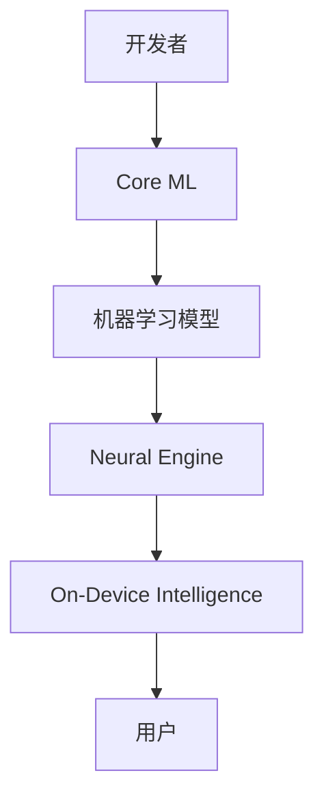

                 

**关键词：**AI应用、市场前景、苹果、iOS、机器学习、深度学习、人工智能、算法、数据、隐私、安全

## 1. 背景介绍

2021年，苹果在其开发者大会上发布了新的AI应用框架Core ML 5和新的神经引擎Neural Engine，旨在为iOS和iPadOS应用程序带来更快、更智能的体验。这些新功能和工具使得开发者能够在设备上运行更复杂的机器学习模型，从而为用户提供更丰富的AI驱动功能。本文将深入探讨苹果在AI应用领域的最新进展，分析其市场前景，并提供实践指南和工具推荐。

## 2. 核心概念与联系

### 2.1 核心概念

- **Core ML：**苹果的机器学习框架，允许开发者将机器学习模型集成到iOS、macOS、tvOS和watchOS应用程序中。
- **Neural Engine：**苹果设备内置的专用硬件，用于加速机器学习模型的推理。
- **On-Device Intelligence：**在设备上运行机器学习模型，无需连接互联网，从而提高隐私和效率。

### 2.2 核心概念联系



## 3. 核心算法原理 & 具体操作步骤

### 3.1 算法原理概述

Core ML支持各种机器学习算法，包括但不限于线性回归、逻辑回归、支持向量机、随机森林和神经网络。新的Core ML 5引入了对Transformers和Stateful模型的支持，这些模型在自然语言处理和时序数据处理方面表现出色。

### 3.2 算法步骤详解

1. **模型训练：**使用框架（如TensorFlow或PyTorch）训练机器学习模型。
2. **模型转换：**使用`coremltools`将训练好的模型转换为Core ML格式。
3. **集成到应用：**将转换后的模型集成到iOS应用中，使用Core ML API进行推理。

### 3.3 算法优缺点

**优点：**

- 更快的推理速度，得益于Neural Engine的加速。
- 更好的隐私保护，因为模型在设备上运行。
- 更少的数据使用，因为不需要连接互联网。

**缺点：**

- 模型大小限制， Core ML模型最大为150MB。
- 转换过程可能会丢失一些模型细节。

### 3.4 算法应用领域

- 图像和视频分析（物体检测、人脸识别、场景分类等）
- 自然语言处理（文本分类、语言翻译、语音识别等）
- 时序数据分析（预测分析、 anomaly detection等）

## 4. 数学模型和公式 & 详细讲解 & 举例说明

### 4.1 数学模型构建

假设我们要构建一个简单的线性回归模型来预测用户点击率。我们的特征向量`x`包含用户的年龄、性别、地理位置等信息，目标变量`y`是用户点击广告的概率。

### 4.2 公式推导过程

线性回归模型的数学公式为：

$$y = wx + b$$

其中`w`是权重向量，`b`是偏置项。我们可以使用梯度下降算法来最小化预测误差，从而学习`w`和`b`的值。

### 4.3 案例分析与讲解

我们可以使用Python和Scikit-learn来构建和训练这个模型。然后，使用`coremltools`将模型转换为Core ML格式，并集成到iOS应用中。

```python
from sklearn.linear_model import LinearRegression
from coremltools.converters import sklearn

# Assuming X_train, y_train are your training data
model = LinearRegression()
model.fit(X_train, y_train)

# Convert the model to Core ML format
coreml_model = sklearn.convert(model, "ClickThroughRateModel")
coreml_model.save("ClickThroughRate.mlmodel")
```

## 5. 项目实践：代码实例和详细解释说明

### 5.1 开发环境搭建

- **硬件：**MacOS系统的MacBook或iMac。
- **软件：**Xcode 12或更高版本，Python 3.8或更高版本，`coremltools`库。

### 5.2 源代码详细实现

以下是一个简单的Core ML集成示例，使用Swift语言编写：

```swift
import CoreML
import Vision

guard let model = try? VNCoreMLModel(for: ClickThroughRateModel().model) else {
    fatalError("Failed to load Core ML model.")
}

let request = VNCoreMLRequest(model: model) { request, error in
    guard let results = request.results as? [VNClassificationObservation],
          let topResult = results.first else {
        fatalError("Unexpected result type from VNCoreMLRequest.")
    }

    print("Predicted click-through rate: \(topResult.confidence)")
}

let handler = VNImageRequestHandler(ciImage: inputImage, options: [:])
do {
    try handler.perform([request])
} catch {
    print("Failed to perform image request: \(error)")
}
```

### 5.3 代码解读与分析

我们首先加载Core ML模型，然后创建一个`VNCoreMLRequest`对象，该对象包装了我们的模型和回调函数。我们使用`VNImageRequestHandler`来处理输入图像，并调用`perform`方法来运行推理请求。

### 5.4 运行结果展示

运行代码后，您应该会在控制台看到预测的点击率。

## 6. 实际应用场景

### 6.1 当前应用

苹果的AI应用已经广泛应用于照片应用（物体和场景识别）、Siri（语音识别和自然语言处理）、Memoji（人脸识别）等。

### 6.2 未来应用展望

未来，我们可以期待更多的AI驱动功能出现在iOS应用中，例如：

- 个性化推荐系统，根据用户行为和偏好提供定制化内容。
- 智能健康应用，使用传感器数据和机器学习模型跟踪和预测用户的健康状况。
- 自动驾驶和增强现实应用，利用设备的摄像头和传感器数据进行实时处理。

## 7. 工具和资源推荐

### 7.1 学习资源推荐

- **苹果开发者文档：**<https://developer.apple.com/documentation/coreml>
- **Core ML 5技术预览：**<https://developer.apple.com/videos/play/wwdc2021/10606/>
- **机器学习入门：**<https://www.coursera.org/learn/machine-learning>

### 7.2 开发工具推荐

- **Xcode：**<https://developer.apple.com/xcode/>
- **Jupyter Notebooks with Swift for TensorFlow：**<https://github.com/tensorflow/swift>
- **Create ML（macOS机器学习应用开发工具）：**<https://developer.apple.com/machine-learning/create-ml/>

### 7.3 相关论文推荐

- **Core ML Paper：Efficient On-Device Machine Learning with Core ML and the Neural Engine**<https://arxiv.org/abs/1712.05887>
- **Transformers：Attention is All You Need**<https://arxiv.org/abs/1706.03762>

## 8. 总结：未来发展趋势与挑战

### 8.1 研究成果总结

苹果在AI应用领域的最新进展为开发者提供了更强大的工具，使得在设备上运行复杂的机器学习模型成为可能。这将推动更多创新的AI驱动应用出现。

### 8.2 未来发展趋势

我们可以期待：

- **更小、更快的模型：**模型压缩技术的进步将使模型更小，更适合移动设备。
- **更强大的硬件：**未来的苹果设备将拥有更强大的Neural Engine，从而支持更复杂的模型。
- **更多的AI应用：**随着开发者对Core ML的掌握，我们将看到更多AI驱动的应用出现在App Store中。

### 8.3 面临的挑战

- **模型大小限制：**虽然Core ML模型的大小限制已经从100MB增加到150MB，但仍然是一个挑战，特别是对于复杂的模型。
- **隐私和安全：**虽然在设备上运行模型可以提高隐私保护，但开发者仍然需要注意数据保护和模型安全。

### 8.4 研究展望

未来的研究将关注于：

- **模型压缩和加速技术：**开发更小、更快的模型，以适应移动设备的限制。
- **隐私保护技术：**开发新的技术来保护用户数据，同时保持模型的有效性。
- **新的AI应用领域：**探索新的应用领域，如自动驾驶、增强现实和智能健康。

## 9. 附录：常见问题与解答

**Q：Core ML支持哪些机器学学习算法？**

A：Core ML支持各种机器学习算法，包括但不限于线性回归、逻辑回归、支持向量机、随机森林和神经网络。新的Core ML 5引入了对Transformers和Stateful模型的支持。

**Q：如何将TensorFlow或PyTorch模型转换为Core ML格式？**

A：您可以使用`coremltools`库将TensorFlow或PyTorch模型转换为Core ML格式。以下是一个简单的示例：

```python
from coremltools.converters import tensorflow as tf_converter

# Assuming'model.h5' is your TensorFlow model
tf_converter.convert('model.h5','model.mlmodel')
```

**Q：如何在iOS应用中集成Core ML模型？**

A：您可以使用Xcode将Core ML模型集成到iOS应用中。您需要将模型文件（.mlmodel）拖放到项目中，然后使用Core ML API进行推理。以下是一个简单的示例：

```swift
import CoreML

guard let model = try? VNCoreMLModel(for: YourModel().model) else {
    fatalError("Failed to load Core ML model.")
}

// Use the model for inference...
```

**作者：禅与计算机程序设计艺术 / Zen and the Art of Computer Programming**

