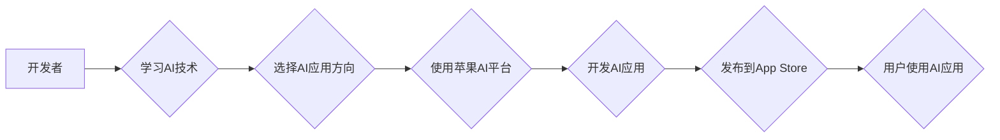

> 苹果、AI应用、开发者、机器学习、深度学习、自然语言处理、计算机视觉、应用开发

## 1. 背景介绍

近年来，人工智能（AI）技术飞速发展，已渗透到生活的方方面面。苹果公司作为科技巨头，也积极拥抱AI，并将其融入到其产品和服务中。2023年，苹果发布了一系列AI应用，为开发者提供了丰富的开发工具和资源，旨在推动AI应用的创新和发展。

苹果发布AI应用的开发者，意味着一个新的时代来临。开发者将有机会利用AI技术，打造出更智能、更便捷、更人性化的应用，为用户带来全新的体验。

## 2. 核心概念与联系

### 2.1  AI应用

AI应用是指利用人工智能技术，实现特定功能或解决特定问题的软件应用程序。AI应用可以分为以下几类：

* **自然语言处理（NLP）应用:** 能够理解和处理人类语言的应用，例如语音助手、机器翻译、文本生成等。
* **计算机视觉（CV）应用:** 能够识别和理解图像和视频的应用，例如人脸识别、物体检测、图像分类等。
* **机器学习（ML）应用:** 能够从数据中学习并不断改进的应用，例如推荐系统、预测分析、异常检测等。

### 2.2  苹果AI平台

苹果公司为开发者提供了丰富的AI平台和工具，包括：

* **Core ML:** 用于将机器学习模型集成到iOS和macOS应用中的框架。
* **Create ML:** 用于构建机器学习模型的图形界面工具。
* **Vision:** 用于图像和视频分析的框架。
* **Speech:** 用于语音识别和合成。
* **Natural Language:** 用于自然语言处理的框架。

### 2.3  开发者生态

苹果拥有庞大的开发者生态系统，包括数百万的开发者和丰富的开发资源。开发者可以利用这些资源，学习AI技术，开发AI应用，并将其发布到App Store。

**Mermaid 流程图**



## 3. 核心算法原理 & 具体操作步骤

### 3.1  算法原理概述

机器学习算法是AI应用的核心，它能够从数据中学习并不断改进。常见的机器学习算法包括：

* **监督学习:** 利用标记数据训练模型，预测新的数据标签。例如，图像分类、文本分类等。
* **无监督学习:** 利用未标记数据发现数据中的模式和结构。例如，聚类、降维等。
* **强化学习:** 通过试错学习，在环境中获得最大奖励。例如，游戏AI、机器人控制等。

### 3.2  算法步骤详解

以监督学习为例，其基本步骤如下：

1. **数据收集和预处理:** 收集相关数据，并进行清洗、转换、特征工程等预处理操作。
2. **模型选择:** 根据任务需求选择合适的机器学习模型。
3. **模型训练:** 利用标记数据训练模型，调整模型参数，使其能够准确预测新的数据标签。
4. **模型评估:** 利用测试数据评估模型的性能，例如准确率、召回率、F1-score等。
5. **模型部署:** 将训练好的模型部署到实际应用场景中。

### 3.3  算法优缺点

不同的机器学习算法具有不同的优缺点，需要根据具体任务选择合适的算法。

* **优点:** 能够自动学习数据模式，无需人工特征工程；性能优于传统算法；应用广泛。
* **缺点:** 需要大量数据进行训练；训练过程复杂；模型解释性较差。

### 3.4  算法应用领域

机器学习算法广泛应用于各个领域，例如：

* **医疗保健:** 疾病诊断、药物研发、患者风险预测等。
* **金融:** 欺诈检测、信用评分、投资决策等。
* **电商:** 商品推荐、用户画像、个性化营销等。
* **交通:** 自驾车、交通流量预测、道路安全等。

## 4. 数学模型和公式 & 详细讲解 & 举例说明

### 4.1  数学模型构建

机器学习模型通常是一个数学函数，它将输入数据映射到输出结果。例如，线性回归模型的数学表达式为：

$$y = w_0 + w_1x_1 + w_2x_2 + ... + w_nx_n$$

其中：

* $y$ 是输出结果
* $w_0, w_1, w_2, ..., w_n$ 是模型参数
* $x_1, x_2, ..., x_n$ 是输入特征

### 4.2  公式推导过程

模型参数的学习过程通常使用梯度下降算法。梯度下降算法的目标是找到使模型预测误差最小化的参数值。

梯度下降算法的基本公式为：

$$w_i = w_i - \alpha \frac{\partial Loss}{\partial w_i}$$

其中：

* $w_i$ 是模型参数
* $\alpha$ 是学习率
* $\frac{\partial Loss}{\partial w_i}$ 是损失函数对参数 $w_i$ 的梯度

### 4.3  案例分析与讲解

例如，假设我们有一个线性回归模型，用于预测房价。输入特征包括房屋面积、房间数量等，输出结果是房价。

我们可以使用梯度下降算法，训练模型参数，使其能够准确预测房价。

## 5. 项目实践：代码实例和详细解释说明

### 5.1  开发环境搭建

开发AI应用需要搭建相应的开发环境。例如，使用Python语言开发AI应用，需要安装Python解释器、机器学习库（例如TensorFlow、PyTorch）等。

### 5.2  源代码详细实现

以下是一个使用Python语言和TensorFlow库实现简单的线性回归模型的代码示例：

```python
import tensorflow as tf

# 定义模型
model = tf.keras.Sequential([
    tf.keras.layers.Dense(units=1, input_shape=[1])
])

# 定义损失函数和优化器
model.compile(loss='mean_squared_error', optimizer='sgd')

# 训练模型
model.fit(x_train, y_train, epochs=100)

# 预测房价
prediction = model.predict(x_test)
```

### 5.3  代码解读与分析

* `tf.keras.Sequential` 用于构建一个顺序模型，即层级结构的模型。
* `tf.keras.layers.Dense` 用于定义一个全连接层，每个神经元都连接到上一层的每个神经元。
* `loss='mean_squared_error'` 指定使用均方误差作为损失函数。
* `optimizer='sgd'` 指定使用随机梯度下降作为优化器。
* `model.fit()` 用于训练模型，`x_train` 和 `y_train` 是训练数据，`epochs=100` 表示训练100个epoch。
* `model.predict()` 用于预测房价，`x_test` 是测试数据。

### 5.4  运行结果展示

训练完成后，我们可以使用测试数据评估模型的性能，例如计算均方误差。

## 6. 实际应用场景

### 6.1  智能客服

AI应用可以用于构建智能客服系统，自动回答用户常见问题，提高客户服务效率。

### 6.2  个性化推荐

AI应用可以用于分析用户行为数据，提供个性化商品推荐，提升用户体验。

### 6.3  医疗诊断辅助

AI应用可以用于辅助医生进行疾病诊断，提高诊断准确率。

### 6.4  未来应用展望

随着AI技术的不断发展，其应用场景将更加广泛，例如：

* **自动驾驶:** AI驱动的自动驾驶汽车将改变交通出行方式。
* **机器人服务:** AI驱动的机器人将用于各种服务场景，例如家政服务、医疗服务等。
* **个性化教育:** AI驱动的教育系统将提供个性化的学习方案，提升教育效率。

## 7. 工具和资源推荐

### 7.1  学习资源推荐

* **Coursera:** 提供丰富的AI课程，例如Andrew Ng的机器学习课程。
* **Udacity:** 提供AI相关的职业培训课程。
* **Kaggle:** 提供AI竞赛平台和数据资源。

### 7.2  开发工具推荐

* **TensorFlow:** 开源机器学习框架。
* **PyTorch:** 开源机器学习框架。
* **Scikit-learn:** Python机器学习库。

### 7.3  相关论文推荐

* **《ImageNet Classification with Deep Convolutional Neural Networks》:** 
AlexNet论文，标志着深度学习的兴起。
* **《Attention Is All You Need》:** 
Transformer模型论文，推动了自然语言处理的进步。

## 8. 总结：未来发展趋势与挑战

### 8.1  研究成果总结

近年来，AI技术取得了长足进步，在各个领域都取得了突破性进展。

### 8.2  未来发展趋势

未来，AI技术将朝着以下方向发展：

* **更强大的计算能力:** 随着硬件技术的进步，AI模型将更加强大，能够处理更复杂的任务。
* **更丰富的应用场景:** AI技术将应用于更多领域，例如医疗保健、教育、金融等。
* **更智能的交互方式:** AI系统将能够更智能地理解和响应用户的需求。

### 8.3  面临的挑战

AI技术的发展也面临着一些挑战：

* **数据安全和隐私:** AI模型的训练需要大量数据，如何保证数据安全和隐私是一个重要问题。
* **算法可解释性:** 许多AI模型的决策过程难以解释，这可能会导致信任问题。
* **伦理问题:** AI技术的应用可能会带来一些伦理问题，例如算法偏见、工作岗位替代等。

### 8.4  研究展望

未来，我们需要继续加强对AI技术的研发，并积极应对其带来的挑战，确保AI技术能够安全、可持续地发展，造福人类社会。

## 9. 附录：常见问题与解答

### 9.1  Q1: 如何学习AI技术？

**A1:** 可以通过在线课程、书籍、实践项目等方式学习AI技术。

### 9.2  Q2: 苹果AI平台有哪些？

**A2:** 苹果AI平台包括Core ML、Create ML、Vision、Speech、Natural Language等。

### 9.3  Q3: 如何开发AI应用？

**A3:** 需要学习AI技术，选择合适的开发工具，并根据具体需求设计和开发AI应用。


作者：禅与计算机程序设计艺术 / Zen and the Art of Computer Programming 
<end_of_turn>