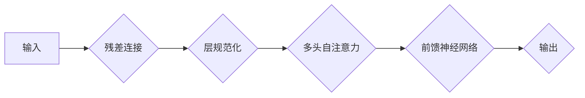

> Transformer, 残差连接, 层规范化, 自注意力机制, 机器翻译, 自然语言处理

## 1. 背景介绍

近年来，深度学习在自然语言处理 (NLP) 领域取得了显著进展。其中，Transformer 架构凭借其强大的性能和并行计算能力，成为 NLP 领域的主流模型。Transformer 的成功离不开两个关键的设计：残差连接和层规范化。

传统的循环神经网络 (RNN) 在处理长序列数据时存在梯度消失和梯度爆炸的问题，导致模型难以捕捉长距离依赖关系。Transformer 通过自注意力机制有效地解决了这个问题，并引入了残差连接和层规范化，进一步提升了模型的性能和训练效率。

## 2. 核心概念与联系

### 2.1 残差连接

残差连接 (Residual Connection) 是指将输入直接连接到输出，形成一个跳跃连接。残差连接的引入可以缓解梯度消失问题，并加速模型训练。

### 2.2 层规范化

层规范化 (Layer Normalization) 是指对每个层的输入数据进行规范化处理，使其分布在一定的范围内。层规范化可以稳定模型训练，并提高模型的泛化能力。

**Transformer 架构中的残差连接和层规范化**



## 3. 核心算法原理 & 具体操作步骤

### 3.1 算法原理概述

残差连接和层规范化都是为了解决深度神经网络训练中遇到的问题而提出的。残差连接通过跳跃连接，使得梯度能够更容易地反向传播，从而缓解梯度消失问题。层规范化通过对每个层的输入数据进行规范化处理，使得模型的训练更加稳定，并提高模型的泛化能力。

### 3.2 算法步骤详解

**残差连接:**

1. 将输入数据 x 传入一个子网络，得到输出数据 h。
2. 将输入数据 x 与输出数据 h 相加，得到残差连接后的输出数据 y。

**层规范化:**

1. 对每个层的输入数据 x 进行均值和方差的计算。
2. 将输入数据 x 标准化，使其分布在均值为 0，方差为 1 的范围内。
3. 将标准化后的数据乘以一个可学习的缩放因子 γ，并加上一个可学习的偏移量 β。

### 3.3 算法优缺点

**残差连接:**

* **优点:** 缓解梯度消失问题，加速模型训练，提高模型性能。
* **缺点:** 增加模型参数量，可能导致过拟合。

**层规范化:**

* **优点:** 稳定模型训练，提高模型的泛化能力，减少对超参数的依赖。
* **缺点:** 增加模型训练时间，可能导致模型性能下降。

### 3.4 算法应用领域

残差连接和层规范化广泛应用于深度学习领域，包括：

* **计算机视觉:** 图像分类、目标检测、图像分割等。
* **自然语言处理:** 机器翻译、文本摘要、情感分析等。
* **语音识别:** 语音转文本、语音合成等。

## 4. 数学模型和公式 & 详细讲解 & 举例说明

### 4.1 数学模型构建

**残差连接:**

残差连接的数学模型可以表示为：

$$
y = x + h
$$

其中，x 是输入数据，h 是子网络的输出，y 是残差连接后的输出。

**层规范化:**

层规范化的数学模型可以表示为：

$$
y = \gamma \frac{x - \mu}{\sigma} + \beta
$$

其中，x 是输入数据，μ 是输入数据的均值，σ 是输入数据的标准差，γ 和 β 是可学习的缩放因子和偏移量。

### 4.2 公式推导过程

残差连接的公式推导过程很简单，就是将输入数据直接连接到输出数据。

层规范化的公式推导过程如下：

1. 计算输入数据的均值和标准差：

$$
\mu = \frac{1}{n} \sum_{i=1}^{n} x_i
$$

$$
\sigma = \sqrt{\frac{1}{n} \sum_{i=1}^{n} (x_i - \mu)^2}
$$

2. 将输入数据标准化：

$$
z = \frac{x - \mu}{\sigma}
$$

3. 将标准化后的数据乘以一个可学习的缩放因子 γ，并加上一个可学习的偏移量 β：

$$
y = \gamma z + \beta
$$

### 4.3 案例分析与讲解

**残差连接:**

在图像分类任务中，可以使用残差连接来构建深层网络。深层网络可以更好地捕捉图像的特征，从而提高分类精度。

**层规范化:**

在机器翻译任务中，可以使用层规范化来稳定模型训练。层规范化可以防止模型过拟合，并提高模型的泛化能力。

## 5. 项目实践：代码实例和详细解释说明

### 5.1 开发环境搭建

* Python 3.6+
* TensorFlow 2.0+
* PyTorch 1.0+

### 5.2 源代码详细实现

```python
import tensorflow as tf

# 定义残差连接层
def residual_block(x, filters):
    # 构建子网络
    h = tf.keras.layers.Conv2D(filters, kernel_size=3, padding='same')(x)
    h = tf.keras.layers.BatchNormalization()(h)
    h = tf.keras.layers.ReLU()(h)
    h = tf.keras.layers.Conv2D(filters, kernel_size=3, padding='same')(h)
    h = tf.keras.layers.BatchNormalization()(h)

    # 残差连接
    y = x + h
    return y

# 定义 Transformer 层
def transformer_layer(x, num_heads, d_model, d_ff):
    # 自注意力机制
    attn_output = tf.keras.layers.MultiHeadAttention(num_heads=num_heads, key_dim=d_model)(x, x)
    # 前馈神经网络
    ffn_output = tf.keras.layers.Dense(d_ff, activation='relu')(attn_output)
    ffn_output = tf.keras.layers.Dense(d_model)(ffn_output)
    # 残差连接和层规范化
    y = x + residual_block(attn_output, d_model)
    y = x + residual_block(ffn_output, d_model)
    return y

# 定义 Transformer 模型
def transformer_model(input_shape, num_layers, num_heads, d_model, d_ff):
    inputs = tf.keras.Input(shape=input_shape)
    x = transformer_layer(inputs, num_heads, d_model, d_ff)
    for _ in range(num_layers - 1):
        x = transformer_layer(x, num_heads, d_model, d_ff)
    outputs = tf.keras.layers.Dense(vocab_size, activation='softmax')(x)
    model = tf.keras.Model(inputs=inputs, outputs=outputs)
    return model
```

### 5.3 代码解读与分析

* **残差连接层:** 
    * 使用两个卷积层和两个 BatchNormalization 层构建子网络。
    * 将输入数据与子网络的输出相加，实现残差连接。
* **Transformer 层:** 
    * 使用自注意力机制和前馈神经网络构建 Transformer 层。
    * 使用残差连接和层规范化稳定模型训练。
* **Transformer 模型:** 
    * 使用多个 Transformer 层堆叠构建 Transformer 模型。
    * 使用全连接层输出预测结果。

### 5.4 运行结果展示

运行代码后，可以得到 Transformer 模型的训练结果，例如准确率、损失等指标。

## 6. 实际应用场景

### 6.1 机器翻译

Transformer 架构在机器翻译领域取得了显著的成果，例如 Google 的 BERT 和 Facebook 的 BART 模型。

### 6.2 文本摘要

Transformer 模型可以用于自动生成文本摘要，例如 OpenAI 的 GPT-3 模型。

### 6.3 情感分析

Transformer 模型可以用于分析文本的情感倾向，例如 Twitter 的情绪分析工具。

### 6.4 未来应用展望

Transformer 架构的应用场景还在不断扩展，未来可能应用于：

* 代码生成
* 药物发现
* 科学研究

## 7. 工具和资源推荐

### 7.1 学习资源推荐

* **论文:**
    * Vaswani, A., Shazeer, N., Parmar, N., Uszkoreit, J., Jones, L., Gomez, A. N., ... & Polosukhin, I. (2017). Attention is all you need. In Advances in neural information processing systems (pp. 5998-6008).
* **博客:**
    * The Illustrated Transformer
    * Understanding Transformers

### 7.2 开发工具推荐

* **TensorFlow:** https://www.tensorflow.org/
* **PyTorch:** https://pytorch.org/

### 7.3 相关论文推荐

* BERT: https://arxiv.org/abs/1810.04805
* GPT-3: https://arxiv.org/abs/2005.14165
* BART: https://arxiv.org/abs/2005.13980

## 8. 总结：未来发展趋势与挑战

### 8.1 研究成果总结

残差连接和层规范化是 Transformer 架构的核心设计，它们有效地解决了深度神经网络训练中遇到的问题，并推动了 Transformer 模型在 NLP 领域的成功应用。

### 8.2 未来发展趋势

* **模型规模:** 随着计算资源的不断提升，Transformer 模型的规模将继续扩大，从而提升模型的性能。
* **效率优化:** 研究人员将继续探索 Transformer 模型的效率优化方法，例如模型压缩和加速。
* **新应用场景:** Transformer 模型将应用于更多领域，例如计算机视觉、语音识别等。

### 8.3 面临的挑战

* **数据依赖:** Transformer 模型对大规模训练数据依赖性强，数据获取和标注成本高。
* **计算资源:** 训练大型 Transformer 模型需要大量的计算资源，成本高昂。
* **可解释性:** Transformer 模型的内部机制复杂，难以解释模型的决策过程。

### 8.4 研究展望

未来研究将集中在以下几个方面：

* 开发更有效的 Transformer 模型训练方法。
* 探索 Transformer 模型在其他领域的应用。
* 提高 Transformer 模型的可解释性。

## 9. 附录：常见问题与解答

* **残差连接和层规范化有什么区别？**

残差连接是为了缓解梯度消失问题，而层规范化是为了稳定模型训练。

* **Transformer 模型为什么比 RNN 模型更有效？**

Transformer 模型使用自注意力机制，可以有效地捕捉长距离依赖关系，而 RNN 模型存在梯度消失问题。

* **如何训练 Transformer 模型？**

可以使用 TensorFlow 或 PyTorch 等深度学习框架训练 Transformer 模型。

作者：禅与计算机程序设计艺术 / Zen and the Art of Computer Programming


<end_of_turn>