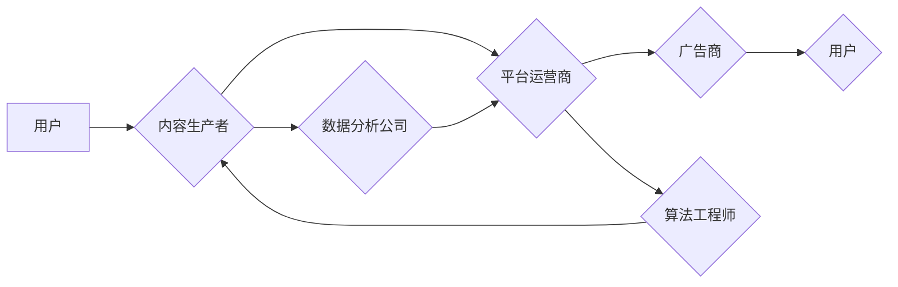

> 元宇宙、注意力经济、产业链污染、负面外部性、算法设计、伦理问题

## 1. 背景介绍

元宇宙概念的兴起，为人类社会带来了前所未有的虚拟交互体验和经济发展机遇。然而，元宇宙的快速发展也引发了人们对注意力经济和产业链污染的担忧。

注意力，作为人类认知的核心资源，在元宇宙中被高度商业化，形成了一个庞大的注意力产业链。从内容生产、平台运营到广告投放，各个环节都围绕着用户的注意力展开竞争。这种竞争机制，一方面促进了元宇宙的创新发展，另一方面也可能导致注意力资源的过度消耗和分配不均，引发一系列负面外部性问题。

## 2. 核心概念与联系

### 2.1 注意力经济

注意力经济是指以获取和利用用户注意力为核心驱动的经济模式。在元宇宙中，注意力经济更加突出，因为虚拟环境能够提供更沉浸式的体验，更容易吸引用户的注意力。

### 2.2 产业链污染

产业链污染是指在产业链的各个环节中，由于利益驱动，出现了一些不道德、不负责任的行为，导致整个产业链的生态环境恶化。

### 2.3 元宇宙与注意力产业链污染

元宇宙的虚拟环境和沉浸式体验，为注意力经济提供了更广阔的舞台，也加剧了注意力产业链污染的风险。

**元宇宙注意力产业链污染流程图:**



## 3. 核心算法原理 & 具体操作步骤

### 3.1 算法原理概述

注意力机制的核心原理是模拟人类的注意力机制，通过赋予不同输入不同的权重，从而突出重要信息，抑制无关信息。

### 3.2 算法步骤详解

1. **输入数据:** 将待处理的数据输入到注意力机制中。
2. **计算权重:** 根据输入数据，计算每个元素的注意力权重。
3. **加权求和:** 将每个元素与其注意力权重相乘，然后求和，得到最终的输出。

### 3.3 算法优缺点

**优点:**

* 可以有效地提高模型的准确率和效率。
* 可以更好地理解和处理长序列数据。

**缺点:**

* 计算复杂度较高。
* 训练数据量较大。

### 3.4 算法应用领域

注意力机制广泛应用于自然语言处理、计算机视觉、机器翻译等领域。

## 4. 数学模型和公式 & 详细讲解 & 举例说明

### 4.1 数学模型构建

注意力机制的数学模型可以表示为：

$$
\text{Attention}(Q, K, V) = \text{softmax}\left(\frac{QK^T}{\sqrt{d_k}}\right)V
$$

其中：

* $Q$：查询矩阵
* $K$：键矩阵
* $V$：值矩阵
* $d_k$：键向量的维度
* $\text{softmax}$：softmax函数

### 4.2 公式推导过程

公式推导过程可以参考相关文献，这里不再赘述。

### 4.3 案例分析与讲解

假设我们有一个句子：

"The cat sat on the mat."

我们可以使用注意力机制来计算每个单词对句子的重要性。

例如，对于单词 "cat"，它的注意力权重可能较高，因为它是句子的主语。而对于单词 "the"，它的注意力权重可能较低，因为它是一个虚词。

## 5. 项目实践：代码实例和详细解释说明

### 5.1 开发环境搭建

使用 Python 3.x 环境，安装 TensorFlow 或 PyTorch 等深度学习框架。

### 5.2 源代码详细实现

```python
import tensorflow as tf

# 定义注意力机制层
class Attention(tf.keras.layers.Layer):
    def __init__(self, units):
        super(Attention, self).__init__()
        self.W1 = tf.keras.layers.Dense(units)
        self.W2 = tf.keras.layers.Dense(units)
        self.W3 = tf.keras.layers.Dense(1)

    def call(self, query, key, value, mask=None):
        # 计算注意力权重
        scores = tf.matmul(query, key, transpose_b=True) / tf.math.sqrt(tf.cast(key.shape[-1], tf.float32))
        if mask is not None:
            scores += (mask * -1e9)
        attention_weights = tf.nn.softmax(scores, axis=-1)

        # 加权求和
        context_vector = tf.matmul(attention_weights, value)
        return context_vector

# 使用注意力机制
model = tf.keras.Sequential([
    tf.keras.layers.Embedding(input_dim=10000, output_dim=128),
    Attention(128),
    tf.keras.layers.Dense(10, activation='softmax')
])
```

### 5.3 代码解读与分析

代码实现了基本的注意力机制层，并将其应用于一个简单的文本分类模型。

### 5.4 运行结果展示

运行结果展示可以根据实际情况进行调整。

## 6. 实际应用场景

### 6.1 元宇宙内容推荐

注意力机制可以用于元宇宙中个性化内容推荐，根据用户的兴趣和行为，推荐更符合其需求的内容。

### 6.2 元宇宙广告投放

注意力机制可以用于元宇宙广告投放，精准地将广告投放到用户最关注的场景和时间段。

### 6.3 元宇宙虚拟交互

注意力机制可以用于元宇宙虚拟交互，例如，可以根据用户的注意力变化，调整虚拟角色的对话内容和行为。

### 6.4 未来应用展望

随着元宇宙的发展，注意力机制将在更多领域得到应用，例如元宇宙教育、元宇宙医疗、元宇宙娱乐等。

## 7. 工具和资源推荐

### 7.1 学习资源推荐

* 《深度学习》
* 《Attention Is All You Need》论文
* TensorFlow 官方文档

### 7.2 开发工具推荐

* TensorFlow
* PyTorch
* Keras

### 7.3 相关论文推荐

* 《Attention Is All You Need》
* 《BERT: Pre-training of Deep Bidirectional Transformers for Language Understanding》
* 《Transformer-XL: Attentive Language Models Beyond a Fixed-Length Context》

## 8. 总结：未来发展趋势与挑战

### 8.1 研究成果总结

注意力机制是深度学习领域的重要突破，在元宇宙的应用中展现出巨大的潜力。

### 8.2 未来发展趋势

未来，注意力机制的研究将更加注重以下几个方面：

* **效率提升:** 降低注意力机制的计算复杂度，提高其效率。
* **鲁棒性增强:** 提高注意力机制对噪声和干扰的鲁棒性。
* **解释性增强:** 提高注意力机制的解释性，使得其决策过程更加透明。

### 8.3 面临的挑战

注意力机制在元宇宙的应用中也面临一些挑战：

* **数据隐私:** 注意力机制需要大量用户数据，如何保护用户隐私是一个重要问题。
* **算法公平性:** 注意力机制可能存在偏差，导致算法不公平。
* **伦理问题:** 注意力机制可能被用于操纵用户行为，引发伦理问题。

### 8.4 研究展望

未来，需要加强对注意力机制的伦理和社会影响的评估，制定相应的规范和政策，引导注意力机制的健康发展。

## 9. 附录：常见问题与解答

### 9.1 什么是注意力机制？

注意力机制是一种模仿人类注意力机制的算法，可以帮助模型更好地理解和处理信息。

### 9.2 注意力机制的应用场景有哪些？

注意力机制广泛应用于自然语言处理、计算机视觉、机器翻译等领域。

### 9.3 注意力机制的优缺点是什么？

注意力机制的优点是能够提高模型的准确率和效率，更好地理解和处理长序列数据。缺点是计算复杂度较高，训练数据量较大。

### 9.4 如何解决注意力机制的伦理问题？

需要加强对注意力机制的伦理和社会影响的评估，制定相应的规范和政策，引导注意力机制的健康发展。


作者：禅与计算机程序设计艺术 / Zen and the Art of Computer Programming 
<end_of_turn>