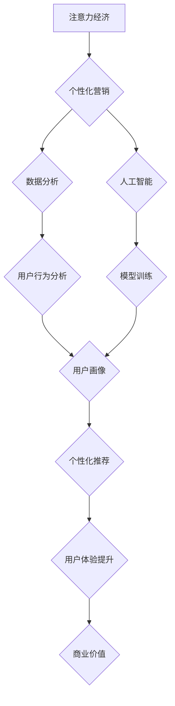

>  注意力经济, 个性化营销, 人工智能, 深度学习, 自然语言处理, 算法, 模型, 数据分析, 用户行为

## 1. 背景介绍

在当今信息爆炸的时代，人们每天面临着海量的资讯和信息流。如何有效地获取和处理这些信息，成为了一个巨大的挑战。同时，企业也面临着如何将信息传递给目标用户，并使其产生积极的反馈的难题。在这种背景下，“注意力经济”应运而生。

注意力经济的核心概念是，注意力是稀缺的资源，而获取和保持用户的注意力是企业竞争的关键。随着互联网和移动互联网的发展，用户对信息的获取方式发生了巨大变化，碎片化信息和信息过载成为常态。在这种情况下，个性化营销应运而生，它旨在根据用户的兴趣、需求和行为，提供定制化的信息和服务，从而提高用户体验和营销效果。

## 2. 核心概念与联系

### 2.1 注意力经济

注意力经济是指在信息过载的时代，人们对信息的获取和处理能力有限，而注意力是稀缺的资源。企业需要通过提供有价值、吸引人的内容，来获取用户的注意力，并将其转化为商业价值。

### 2.2 个性化营销

个性化营销是指根据用户的个人特征和行为，提供定制化的产品、服务和信息，以满足用户的个性化需求。它通过数据分析和人工智能技术，对用户的兴趣、偏好、购买行为等进行分析，并根据分析结果，提供个性化的推荐、广告和内容。

### 2.3 核心概念联系

注意力经济和个性化营销是相互关联的两个概念。个性化营销是注意力经济的应用场景之一。通过提供个性化的信息和服务，企业可以更好地吸引用户的注意力，并将其转化为商业价值。



## 3. 核心算法原理 & 具体操作步骤

### 3.1 算法原理概述

个性化营销的核心算法原理是基于用户的行为数据和特征，构建用户画像，并根据用户画像，进行个性化推荐和内容定制。常用的算法包括：

* **协同过滤算法:** 基于用户的历史行为数据，推荐与用户兴趣相似的其他用户或物品。
* **内容过滤算法:** 基于用户的兴趣偏好，推荐与用户兴趣相关的物品或内容。
* **深度学习算法:** 利用深度神经网络，从用户的行为数据中学习用户特征，并进行个性化推荐。

### 3.2 算法步骤详解

以协同过滤算法为例，其具体操作步骤如下：

1. **数据收集:** 收集用户的行为数据，例如浏览记录、购买记录、评分记录等。
2. **数据预处理:** 对收集到的数据进行清洗、转换和格式化，以便于算法的训练和使用。
3. **用户相似度计算:** 利用距离度量或相似度度量，计算用户之间的相似度。
4. **推荐物品:** 根据用户与其他用户的相似度，推荐与相似用户喜欢的物品。

### 3.3 算法优缺点

**协同过滤算法:**

* **优点:** 可以发现用户之间的隐性关系，推荐个性化的物品。
* **缺点:** 数据稀疏性问题，新用户和新物品的推荐效果较差。

**内容过滤算法:**

* **优点:** 可以根据用户的兴趣偏好，推荐相关的物品。
* **缺点:** 容易陷入“信息茧房”问题，推荐的物品过于单一。

**深度学习算法:**

* **优点:** 可以学习用户更复杂的特征，推荐更精准的物品。
* **缺点:** 需要大量的训练数据，训练成本较高。

### 3.4 算法应用领域

个性化营销算法广泛应用于以下领域：

* **电商平台:** 商品推荐、个性化广告、用户画像分析。
* **社交媒体:** 内容推荐、用户匹配、广告投放。
* **新闻媒体:** 个性化新闻推荐、内容定制。
* **金融服务:** 个性化理财建议、风险评估。

## 4. 数学模型和公式 & 详细讲解 & 举例说明

### 4.1 数学模型构建

协同过滤算法的数学模型可以表示为用户-物品评分矩阵，其中每个元素代表用户对物品的评分。

假设有N个用户和M个物品，用户-物品评分矩阵可以表示为一个N x M的矩阵R，其中R(i,j)表示用户i对物品j的评分。

### 4.2 公式推导过程

用户相似度计算可以使用余弦相似度公式：

$$
\text{相似度}(u_i, u_j) = \frac{\sum_{k=1}^{M} R(i,k) * R(j,k)}{\sqrt{\sum_{k=1}^{M} R(i,k)^2} * \sqrt{\sum_{k=1}^{M} R(j,k)^2}}
$$

其中：

* $u_i$ 和 $u_j$ 分别表示用户i和用户j。
* $R(i,k)$ 和 $R(j,k)$ 分别表示用户i和用户j对物品k的评分。
* $M$ 表示物品的数量。

### 4.3 案例分析与讲解

假设有两个用户A和B，他们的评分矩阵如下：

| 物品 | A | B |
|---|---|---|
| 1 | 5 | 4 |
| 2 | 3 | 2 |
| 3 | 4 | 5 |
| 4 | 2 | 3 |

根据余弦相似度公式，我们可以计算用户A和用户B的相似度：

$$
\text{相似度}(A, B) = \frac{(5*4) + (3*2) + (4*5) + (2*3)}{\sqrt{(5^2 + 3^2 + 4^2 + 2^2)} * \sqrt{(4^2 + 2^2 + 5^2 + 3^2)}}
$$

$$
\text{相似度}(A, B) = \frac{20 + 6 + 20 + 6}{\sqrt{54} * \sqrt{54}}
$$

$$
\text{相似度}(A, B) = \frac{52}{54} = 0.963
$$

因此，用户A和用户B的相似度为0.963，说明他们具有较高的相似度。

## 5. 项目实践：代码实例和详细解释说明

### 5.1 开发环境搭建

本项目使用Python语言进行开发，所需的库包括：

* **pandas:** 数据处理库
* **numpy:** 数值计算库
* **scikit-learn:** 机器学习库

### 5.2 源代码详细实现

```python
import pandas as pd
from sklearn.metrics.pairwise import cosine_similarity

# 加载用户-物品评分矩阵
ratings = pd.read_csv('ratings.csv')

# 计算用户之间的余弦相似度
user_similarity = cosine_similarity(ratings)

# 获取用户A和用户B的相似度
user_A = 0
user_B = 1
similarity = user_similarity[user_A, user_B]

# 打印相似度
print(f'用户A和用户B的相似度为: {similarity}')
```

### 5.3 代码解读与分析

* **加载数据:** 使用pandas库读取用户-物品评分矩阵数据。
* **计算相似度:** 使用scikit-learn库的cosine_similarity函数计算用户之间的余弦相似度。
* **获取相似度:** 根据用户ID获取用户之间的相似度值。
* **打印结果:** 打印用户A和用户B的相似度值。

### 5.4 运行结果展示

运行上述代码后，会输出用户A和用户B的相似度值。

## 6. 实际应用场景

### 6.1 电商平台

电商平台可以利用个性化营销算法，根据用户的浏览记录、购买记录等数据，推荐个性化的商品，提高用户转化率。

### 6.2 社交媒体

社交媒体平台可以利用个性化营销算法，根据用户的兴趣偏好，推荐相关的用户和内容，提高用户粘性和活跃度。

### 6.3 新闻媒体

新闻媒体可以利用个性化营销算法，根据用户的阅读习惯，推荐个性化的新闻内容，提高用户阅读体验。

### 6.4 未来应用展望

随着人工智能技术的不断发展，个性化营销将更加智能化、精准化。未来，个性化营销将应用于更多领域，例如教育、医疗、金融等，为用户提供更加个性化的服务和体验。

## 7. 工具和资源推荐

### 7.1 学习资源推荐

* **书籍:**
    * 《深度学习》
    * 《机器学习实战》
    * 《Python数据科学手册》
* **在线课程:**
    * Coursera
    * edX
    * Udacity

### 7.2 开发工具推荐

* **Python:** 
* **pandas:** 数据处理库
* **numpy:** 数值计算库
* **scikit-learn:** 机器学习库
* **TensorFlow:** 深度学习框架
* **PyTorch:** 深度学习框架

### 7.3 相关论文推荐

* **Collaborative Filtering for Implicit Feedback Datasets**
* **Deep Learning for Recommender Systems**
* **Personalized Recommendations Using Matrix Factorization Techniques**

## 8. 总结：未来发展趋势与挑战

### 8.1 研究成果总结

个性化营销算法在提高用户体验、提升营销效果方面取得了显著成果。

### 8.2 未来发展趋势

* **更精准的推荐:** 利用更先进的机器学习算法和深度学习模型，实现更精准的个性化推荐。
* **多模态数据融合:** 将文本、图像、视频等多模态数据融合，构建更全面的用户画像，实现更个性化的服务。
* **隐私保护:** 关注用户隐私保护，开发更加安全、可靠的个性化营销算法。

### 8.3 面临的挑战

* **数据稀疏性:** 许多用户和物品的评分数据都比较稀疏，这会影响算法的准确性。
* **冷启动问题:** 新用户和新物品的推荐效果较差，需要开发新的算法和策略来解决。
* **用户反馈:** 用户反馈数据的不完整性和不一致性，也会影响算法的训练和效果。

### 8.4 研究展望

未来，个性化营销算法将朝着更智能化、更精准化、更安全的方向发展。研究者需要不断探索新的算法和技术，以应对数据稀疏性、冷启动问题等挑战，并关注用户隐私保护，为用户提供更加个性化、安全、可靠的服务。

## 9. 附录：常见问题与解答

### 9.1 如何解决数据稀疏性问题？

数据稀疏性问题可以通过以下方法解决：

* **使用协同过滤算法的变体:** 例如，基于矩阵分解的协同过滤算法，可以更好地处理数据稀疏性问题。
* **利用内容过滤算法:** 根据用户的兴趣偏好，推荐相关的物品，即使用户评分数据稀疏，也能提供一些推荐结果。
* **使用深度学习算法:** 深度学习算法可以学习用户更复杂的特征，即使数据稀疏，也能获得较好的推荐效果。

### 9.2 如何解决冷启动问题？

冷启动问题可以通过以下方法解决：

* **利用用户属性信息:** 例如，用户的年龄、性别、职业等信息，可以作为用户的初始特征，帮助推荐系统进行初始推荐。
* **利用物品属性信息:** 例如，物品的类别、价格、描述等信息，可以作为物品的初始特征，帮助推荐系统进行初始推荐。
* **使用基于内容的推荐算法:** 根据物品的属性信息，推荐与用户兴趣相关的物品。

### 9.3 如何保证用户隐私？

在个性化