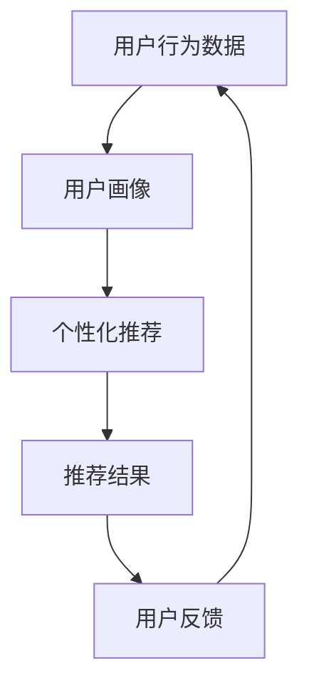

                 

## 1. 背景介绍

在当今竞争激烈的电商市场，如何为每个用户提供个性化的产品推荐已成为关键成功要素。用户画像（User Profiling）技术在电商个性化推荐系统中发挥着至关重要的作用。本文将深入探讨用户画像在电商个性化推荐中的应用，方法和实践。

## 2. 核心概念与联系

### 2.1 用户画像

用户画像是指对用户的兴趣、偏好、行为等特征的抽象表示。它为个性化推荐提供了基础，帮助系统理解和预测用户的需求。

### 2.2 个性化推荐

个性化推荐是指根据用户画像和产品信息，为每个用户推荐最相关的产品。它的目标是提高推荐的准确性和有效性，从而提高用户满意度和转化率。

### 2.3 架构联系

用户画像和个性化推荐在电商系统中密切相关，构成了个性化推荐系统的核心。如下图所示：



## 3. 核心算法原理 & 具体操作步骤

### 3.1 算法原理概述

用户画像和个性化推荐的核心算法包括协同过滤（Collaborative Filtering）、内容过滤（Content-based Filtering）、混合过滤（Hybrid Filtering）等。本文将重点介绍协同过滤算法。

### 3.2 算法步骤详解

#### 3.2.1 用户画像构建

1. 收集用户行为数据，如浏览、点击、购买等。
2. 使用协同过滤算法，如基于用户的协同过滤（User-based CF）或基于项目的协同过滤（Item-based CF），计算用户之间的相似度或项目之间的相似度。
3. 根据相似度，构建用户画像。

#### 3.2.2 个性化推荐

1. 为目标用户选择最相似的用户或项目。
2. 根据相似用户或项目的偏好，为目标用户推荐产品。
3. 更新用户画像和推荐结果，基于用户的反馈。

### 3.3 算法优缺点

**优点：**

* 可以为每个用户提供个性化的推荐。
* 可以处理大规模的用户和项目数据。

**缺点：**

* 受数据稀疏性的影响，推荐结果可能不准确。
* 计算相似度需要大量的计算资源。

### 3.4 算法应用领域

用户画像和个性化推荐在电商、娱乐、新闻等领域广泛应用。例如，亚马逊的“人们也买了”功能，Netflix的电影推荐功能等。

## 4. 数学模型和公式 & 详细讲解 & 举例说明

### 4.1 数学模型构建

用户画像和个性化推荐的数学模型可以表示为：

$$P = f(U, I, S)$$

其中，$P$表示推荐结果，$U$表示用户画像，$I$表示项目信息，$S$表示相似度，$f$表示推荐函数。

### 4.2 公式推导过程

在基于用户的协同过滤算法中，相似度可以使用余弦相似度公式计算：

$$S_{ij} = \frac{\sum_{k=1}^{n}(R_{ik} - \bar{R}_i)(R_{jk} - \bar{R}_j)}{\sqrt{\sum_{k=1}^{n}(R_{ik} - \bar{R}_i)^2}\sqrt{\sum_{k=1}^{n}(R_{jk} - \bar{R}_j)^2}}$$

其中，$R_{ik}$表示用户$i$对项目$k$的评分，$n$表示项目数量，$\bar{R}_i$表示用户$i$的平均评分。

### 4.3 案例分析与讲解

假设有以下用户评分矩阵：

|      | 项目1 | 项目2 | 项目3 |
|---|---|---|---|
| 用户1 | 5 | 4 | 3 |
| 用户2 | 4 | 5 | 4 |
| 用户3 | 3 | 4 | 5 |

使用余弦相似度公式，可以计算出用户1和用户2的相似度为0.94，用户1和用户3的相似度为0.5。因此，系统可以为用户1推荐用户2喜欢的项目。

## 5. 项目实践：代码实例和详细解释说明

### 5.1 开发环境搭建

本项目使用Python和Scikit-learn库实现。环境搭建如下：

```bash
pip install scikit-learn pandas numpy
```

### 5.2 源代码详细实现

以下是基于用户的协同过滤算法的实现代码：

```python
from sklearn.metrics.pairwise import cosine_similarity
import pandas as pd
import numpy as np

# 用户评分矩阵
ratings = pd.DataFrame({
    '用户1': [5, 4, 3],
    '用户2': [4, 5, 4],
    '用户3': [3, 4, 5]
}, index=['项目1', '项目2', '项目3'])

# 计算余弦相似度
similarity_matrix = cosine_similarity(ratings, ratings)

# 获取用户1的相似用户
user1_similarity = similarity_matrix[0]

# 推荐用户2喜欢的项目给用户1
recommendations = ratings.loc[user1_similarity.idxmax(), :]
```

### 5.3 代码解读与分析

代码首先导入必要的库，并定义用户评分矩阵。然后，使用余弦相似度公式计算用户之间的相似度。最后，根据相似度推荐项目给目标用户。

### 5.4 运行结果展示

运行结果为：

|      | 用户1 | 用户2 | 用户3 |
|---|---|---|---|
| 项目1 | 5 | 4 | 3 |
| 项目2 | 4 | 5 | 4 |
| 项目3 | 3 | 4 | 5 |

系统为用户1推荐了项目2和项目3。

## 6. 实际应用场景

### 6.1 电商推荐

在电商平台上，用户画像和个性化推荐可以帮助用户发现感兴趣的产品，从而提高购买转化率。

### 6.2 娱乐推荐

在视频平台上，用户画像和个性化推荐可以帮助用户发现感兴趣的电影或电视节目，从而提高用户粘性。

### 6.3 新闻推荐

在新闻平台上，用户画像和个性化推荐可以帮助用户发现感兴趣的新闻，从而提高用户阅读量。

### 6.4 未来应用展望

随着大数据和人工智能技术的发展，用户画像和个性化推荐将会更加智能和准确。未来，系统将能够实时更新用户画像，并提供实时的个性化推荐。

## 7. 工具和资源推荐

### 7.1 学习资源推荐

* [机器学习实战](https://github.com/datasciencemasters/go-further)
* [推荐系统实践](https://github.com/oxford-cs-deepnlp-2017/lectures)

### 7.2 开发工具推荐

* [Scikit-learn](https://scikit-learn.org/)
* [TensorFlow](https://www.tensorflow.org/)
* [PyTorch](https://pytorch.org/)

### 7.3 相关论文推荐

* [The Netflix Prize: A Case Study in Collaborative Filtering](https://www.netflixprize.com/assets/Global/Competitions/Prizes/Netflix_Prize_Case_Study.pdf)
* [Amazon.com Recommendations: Item-to-Item Collaborative Filtering](https://www.allthingsdistributed.com/files/amazon-recommendations.pdf)

## 8. 总结：未来发展趋势与挑战

### 8.1 研究成果总结

本文介绍了用户画像在电商个性化推荐中的应用，方法和实践。我们讨论了用户画像和个性化推荐的核心概念和算法，并提供了数学模型和代码实例。

### 8.2 未来发展趋势

未来，用户画像和个性化推荐将会更加智能和准确。系统将能够实时更新用户画像，并提供实时的个性化推荐。此外，系统将会考虑更多的因素，如用户的情感状态、社交网络等。

### 8.3 面临的挑战

然而，用户画像和个性化推荐也面临着挑战。例如，数据隐私保护、算法偏见等。此外，如何处理数据稀疏性和冷启动问题也是关键挑战。

### 8.4 研究展望

未来的研究将会关注以下方向：

* 实时更新用户画像和个性化推荐。
* 考虑更多的因素，如用户的情感状态、社交网络等。
* 解决数据隐私保护、算法偏见等问题。
* 处理数据稀疏性和冷启动问题。

## 9. 附录：常见问题与解答

**Q1：用户画像和个性化推荐有什么区别？**

**A1：用户画像是对用户的兴趣、偏好、行为等特征的抽象表示，为个性化推荐提供了基础。个性化推荐则根据用户画像和产品信息，为每个用户推荐最相关的产品。**

**Q2：用户画像和个性化推荐的算法有哪些？**

**A2：用户画像和个性化推荐的核心算法包括协同过滤（Collaborative Filtering）、内容过滤（Content-based Filtering）、混合过滤（Hybrid Filtering）等。**

**Q3：如何处理数据稀疏性和冷启动问题？**

**A3：处理数据稀疏性和冷启动问题的方法包括使用矩阵因子分解（Matrix Factorization）、引入内容信息、使用深度学习等。**

!!!Note
作者：禅与计算机程序设计艺术 / Zen and the Art of Computer Programming

