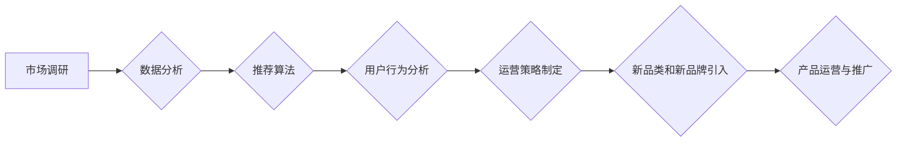

> 电商平台, 供给能力, 新品类, 新品牌, 引入策略, 数据分析, 推荐算法, 用户行为, 运营策略

## 1. 背景介绍

在当今激烈的电商市场竞争中，供给能力的提升至关重要。电商平台需要不断引入新品类和新品牌，以满足用户日益增长的需求，并保持市场竞争力。然而，新品类和新品牌的引入并非易事，需要平台进行深入的市场调研、产品分析、用户行为研究以及运营策略制定。

传统的电商平台往往采用人工筛选的方式引入新品类和新品牌，这种方式效率低下，容易出现主观偏差和漏网之鱼。随着人工智能技术的快速发展，电商平台开始探索利用数据分析、推荐算法等技术手段，提升新品类和新品牌的引入效率和精准度。

## 2. 核心概念与联系

**2.1  供给能力提升**

供给能力是指电商平台能够提供给用户的新产品和服务的能力。供给能力的提升可以从以下几个方面着手：

* **新品类拓展:** 持续引入新的产品类别，满足用户多样化的需求。
* **新品牌引入:** 挖掘和引入优质的新品牌，丰富平台的产品生态。
* **库存优化:** 通过数据分析和预测模型，优化库存管理，避免缺货和积压。
* **物流配送:** 提升物流配送效率，缩短配送时间，提高用户体验。

**2.2  数据驱动决策**

数据驱动决策是指利用数据分析和挖掘技术，为平台运营决策提供依据。在新品类和新品牌引入过程中，数据驱动决策可以帮助平台：

* **识别市场趋势:** 通过分析用户搜索、浏览、购买等行为数据，识别市场上潜在的热门新品类和新品牌。
* **评估产品潜力:** 通过分析产品属性、用户评价、销售数据等，评估产品的市场潜力和盈利能力。
* **优化运营策略:** 通过分析用户行为数据，优化新品类和新品牌的推广策略、定价策略、促销策略等。

**2.3  推荐算法**

推荐算法是指利用机器学习技术，根据用户的历史行为和偏好，推荐用户可能感兴趣的产品和品牌。在新品类和新品牌引入过程中，推荐算法可以帮助平台：

* **精准推荐:** 将新品类和新品牌推荐给最有可能感兴趣的用户，提高转化率。
* **个性化体验:** 为不同用户提供个性化的产品推荐，提升用户体验。
* **新产品推广:** 通过推荐算法，将新品类和新品牌推向更广泛的用户群体，加速产品推广。

**2.4  用户行为分析**

用户行为分析是指通过分析用户的行为数据，了解用户的需求、偏好和购物习惯。在新品类和新品牌引入过程中，用户行为分析可以帮助平台：

* **洞察用户需求:** 通过分析用户搜索、浏览、购买等行为数据，了解用户对新品类和新品牌的潜在需求。
* **预测用户行为:** 通过建立用户行为模型，预测用户对新品类和新品牌的购买意愿和行为模式。
* **优化产品设计:** 通过分析用户反馈和行为数据，优化新品类和新品牌的属性、功能和设计，提高用户满意度。

**2.5  运营策略**

运营策略是指平台针对新品类和新品牌引入，制定的一系列推广、营销、促销等活动。运营策略需要根据平台的实际情况、用户的需求和产品的特点进行制定。

**2.6  流程图**



## 3. 核心算法原理 & 具体操作步骤

### 3.1  算法原理概述

在电商平台新品类和新品牌引入过程中，推荐算法是核心技术之一。推荐算法通过分析用户的历史行为和偏好，预测用户对新品类和新品牌的兴趣，并将其推荐给用户。常见的推荐算法包括：

* **基于内容的推荐:** 根据产品的属性和用户对产品的历史评价，推荐与用户兴趣相符的产品。
* **基于协同过滤的推荐:** 根据用户的历史购买行为和与用户兴趣相似的其他用户的购买行为，推荐用户可能感兴趣的产品。
* **基于深度学习的推荐:** 利用深度学习模型，从用户的行为数据中学习用户兴趣和偏好，进行更精准的推荐。

### 3.2  算法步骤详解

以基于协同过滤的推荐算法为例，其具体步骤如下：

1. **数据收集:** 收集用户的历史购买行为数据，包括用户ID、商品ID、购买时间等信息。
2. **用户-商品矩阵构建:** 将用户和商品信息构建成一个用户-商品矩阵，其中每个元素表示用户对商品的评分或购买行为。
3. **相似用户/商品计算:** 利用协同过滤算法，计算用户之间的相似度或商品之间的相似度。
4. **推荐生成:** 根据用户的相似用户或商品，推荐用户可能感兴趣的新品类和新品牌。

### 3.3  算法优缺点

**优点:**

* **精准度高:** 基于协同过滤的推荐算法能够根据用户的历史行为和偏好，进行精准的推荐。
* **可解释性强:** 算法的推荐结果可以解释为用户与相似用户的共同兴趣。

**缺点:**

* **冷启动问题:** 对于新用户和新商品，由于缺乏历史数据，难以进行准确的推荐。
* **数据稀疏性:** 用户-商品矩阵往往存在数据稀疏性问题，影响算法的准确性。

### 3.4  算法应用领域

基于协同过滤的推荐算法广泛应用于电商平台、视频网站、音乐平台等领域，用于推荐商品、视频、音乐等内容。

## 4. 数学模型和公式 & 详细讲解 & 举例说明

### 4.1  数学模型构建

**用户-商品矩阵:**

设用户集合为U，商品集合为I，则用户-商品矩阵为一个m×n的矩阵，其中m=|U|，n=|I|。矩阵元素u<sub>ij</sub>表示用户u<sub>i</sub>对商品i<sub>j</sub>的评分或购买行为。

**相似度计算:**

常用的相似度计算方法包括余弦相似度、皮尔逊相关系数、马氏距离等。

**余弦相似度:**

设用户u<sub>i</sub>和u<sub>j</sub>的向量为v<sub>i</sub>和v<sub>j</sub>，则其余弦相似度为：

$$
\text{相似度}(u_i, u_j) = \frac{v_i \cdot v_j}{||v_i|| ||v_j||}
$$

其中，v<sub>i</sub>·v<sub>j</sub>表示向量v<sub>i</sub>和v<sub>j</sub>的点积，||v<sub>i</sub>||和||v<sub>j</sub>||分别表示向量v<sub>i</sub>和v<sub>j</sub>的模长。

### 4.2  公式推导过程

余弦相似度的推导过程如下：

1. 两个向量的点积表示两个向量在同一方向上的投影长度。
2. 向量的模长表示向量的长度。
3. 余弦相似度等于两个向量的点积除以两个向量的长度的乘积，表示两个向量在同一方向上的投影长度与两个向量长度的乘积的比值。

### 4.3  案例分析与讲解

假设有两个用户，用户A购买了商品1、2、3，用户B购买了商品2、3、4。

构建用户-商品矩阵：

```
用户 | 商品1 | 商品2 | 商品3 | 商品4
------- | -------- | -------- | -------- | --------
用户A | 1 | 1 | 1 | 0
用户B | 0 | 1 | 1 | 1
```

计算用户A和用户B的余弦相似度：

$$
\text{相似度}(A, B) = \frac{(1 \times 0) + (1 \times 1) + (1 \times 1) + (0 \times 1)}{\sqrt{1^2 + 1^2 + 1^2 + 0^2} \sqrt{0^2 + 1^2 + 1^2 + 1^2}} = \frac{2}{\sqrt{3} \sqrt{3}} = \frac{2}{3}
$$

结果表明，用户A和用户B的余弦相似度为0.67，说明用户A和用户B的兴趣有一定的相似性。

## 5. 项目实践：代码实例和详细解释说明

### 5.1  开发环境搭建

* 操作系统：Linux/macOS/Windows
* Python版本：3.6+
* 依赖库：pandas, numpy, scikit-learn

### 5.2  源代码详细实现

```python
import pandas as pd
from sklearn.metrics.pairwise import cosine_similarity

# 加载用户-商品矩阵数据
data = pd.read_csv('user_item_matrix.csv')

# 计算用户之间的余弦相似度
user_similarity = cosine_similarity(data)

# 获取用户A的相似用户
user_A_id = 0  # 用户A的ID
similar_users = user_similarity[user_A_id].argsort()[:-6:-1]  # 获取前5个相似用户

# 推荐商品给用户A
recommended_items = []
for user_id in similar_users:
    user_items = data.iloc[user_id].values
    for item_id in range(len(user_items)):
        if user_items[item_id] == 1 and item_id not in recommended_items:
            recommended_items.append(item_id)

# 打印推荐结果
print(f"推荐给用户A的商品：{recommended_items}")
```

### 5.3  代码解读与分析

* 代码首先加载用户-商品矩阵数据。
* 然后使用scikit-learn库中的cosine_similarity函数计算用户之间的余弦相似度。
* 获取用户A的相似用户，并根据相似用户的购买行为推荐商品给用户A。

### 5.4  运行结果展示

运行代码后，将输出用户A的推荐商品列表。

## 6. 实际应用场景

### 6.1  电商平台新品类推荐

电商平台可以利用推荐算法，根据用户的历史购买行为和浏览记录，推荐新品类，帮助用户发现新的产品和满足新的需求。

### 6.2  新品牌入驻推荐

电商平台可以利用推荐算法，根据用户的兴趣偏好和品牌评价，推荐新品牌入驻，帮助平台引入优质的新品牌，丰富平台的产品生态。

### 6.3  个性化商品推荐

电商平台可以利用推荐算法，为每个用户提供个性化的商品推荐，提高用户体验和转化率。

### 6.4  未来应用展望

随着人工智能技术的不断发展，推荐算法将更加精准、个性化和智能化。未来，推荐算法将在电商平台的新品类和新品牌引入过程中发挥更加重要的作用，帮助平台提升供给能力，满足用户需求，实现可持续发展。

## 7. 工具和资源推荐

### 7.1  学习资源推荐

* **书籍:**
    * 《推荐系统实践》
    * 《机器学习》
* **在线课程:**
    * Coursera: Recommender Systems
    * edX: Machine Learning

### 7.2  开发工具推荐

* **Python:** 
    * pandas
    * numpy
    * scikit-learn
* **Spark:** 
    * Apache Spark MLlib

### 7.3  相关论文推荐

* **Collaborative Filtering for Implicit Feedback Datasets**
* **Matrix Factorization Techniques for Recommender Systems**

## 8. 总结：未来发展趋势与挑战

### 8.1  研究成果总结

本文介绍了电商平台新品类和新品牌引入过程中，数据驱动决策、推荐算法和用户行为分析等关键技术。通过案例分析，展示了基于协同过滤的推荐算法的应用场景和实现方法。

### 8.2  未来发展趋势

* **深度学习推荐:** 利用深度学习模型，从用户的行为数据中学习更深层的