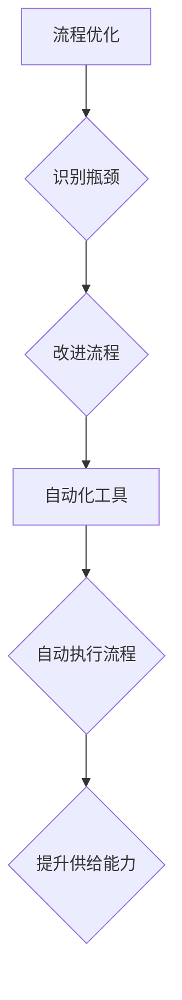

> 电商平台, 供给能力, 流程优化, 自动化工具, 机器学习, 数据分析, 供应链管理

## 1. 背景介绍

在当今激烈的电商市场竞争中，供给能力的提升至关重要。电商平台需要能够快速、高效地响应用户需求，提供充足的商品和服务。然而，传统的电商平台供给链往往存在着流程冗长、效率低下、成本高昂等问题。为了解决这些问题，电商平台需要不断探索新的技术和方法，提升供给能力。

## 2. 核心概念与联系

**2.1  供给能力提升**

供给能力是指电商平台能够提供商品和服务的总量和速度。它包括以下几个方面：

* **商品种类丰富度:** 平台上提供的商品种类数量和多样性。
* **库存充足性:** 平台能够满足用户需求的商品库存量。
* **物流配送效率:** 商品从仓库到用户手中的配送速度和可靠性。
* **售后服务质量:** 平台为用户提供售后服务的及时性和专业性。

**2.2  流程优化**

流程优化是指通过分析和改进现有流程，提高效率、降低成本、提升用户体验。在电商平台供给链中，流程优化可以应用于以下环节：

* **商品上架流程:** 简化商品上架流程，缩短上架时间。
* **库存管理流程:** 优化库存管理策略，提高库存利用率。
* **物流配送流程:** 优化配送路线和配送方式，提高配送效率。
* **售后服务流程:** 简化售后服务流程，提高服务效率。

**2.3  自动化工具**

自动化工具是指能够自动执行特定任务的软件工具。在电商平台供给链中，自动化工具可以应用于以下环节：

* **商品数据采集:** 自动采集商品信息，例如价格、库存、描述等。
* **订单处理:** 自动处理用户订单，例如生成物流单号、通知发货等。
* **库存管理:** 自动更新库存信息，提醒补货等。
* **物流配送:** 自动生成配送路线，安排配送车辆等。

**2.4  流程优化与自动化工具的联系**

流程优化和自动化工具是互补的，可以共同提升电商平台供给能力。流程优化可以帮助识别流程中的瓶颈和冗余环节，而自动化工具可以帮助自动执行优化后的流程，提高效率和准确性。



## 3. 核心算法原理 & 具体操作步骤

**3.1  算法原理概述**

在电商平台供给能力提升中，可以应用多种算法原理，例如机器学习、数据分析、优化算法等。

* **机器学习:** 可以用于预测用户需求、优化库存管理、提高物流配送效率等。
* **数据分析:** 可以用于分析用户行为、商品销售数据、物流配送数据等，发现供给链中的问题和改进方向。
* **优化算法:** 可以用于优化配送路线、分配库存等，提高供给链的效率和成本效益。

**3.2  算法步骤详解**

以机器学习为例，其在电商平台供给能力提升中的应用步骤如下：

1. **数据收集:** 收集用户行为数据、商品销售数据、物流配送数据等。
2. **数据预处理:** 对收集到的数据进行清洗、转换、特征工程等处理，使其适合机器学习模型的训练。
3. **模型选择:** 选择合适的机器学习模型，例如回归模型、分类模型、聚类模型等。
4. **模型训练:** 使用预处理后的数据训练机器学习模型。
5. **模型评估:** 使用测试数据评估模型的性能，并进行模型调优。
6. **模型部署:** 将训练好的模型部署到生产环境中，用于预测用户需求、优化库存管理、提高物流配送效率等。

**3.3  算法优缺点**

* **优点:** 能够自动学习和发现模式，提高预测准确率和效率。
* **缺点:** 需要大量的训练数据，模型训练时间较长，模型解释性较差。

**3.4  算法应用领域**

* **用户需求预测:** 预测用户对特定商品的需求量，帮助平台优化库存管理。
* **商品推荐:** 根据用户的历史购买记录和浏览行为，推荐用户可能感兴趣的商品。
* **物流配送优化:** 优化配送路线和配送方式，提高配送效率和降低成本。

## 4. 数学模型和公式 & 详细讲解 & 举例说明

**4.1  数学模型构建**

在电商平台供给能力提升中，可以使用数学模型来描述和分析各种现象。例如，可以使用线性规划模型来优化库存管理，可以使用 queuing theory 模型来分析物流配送效率。

**4.2  公式推导过程**

以线性规划模型为例，其目标函数和约束条件可以表示为以下公式：

* **目标函数:** 
$$
\text{Maximize } Z = \sum_{i=1}^{n} c_i x_i
$$

其中，$Z$ 是目标函数值，$c_i$ 是第 $i$ 种商品的利润，$x_i$ 是第 $i$ 种商品的生产量。

* **约束条件:**
$$
\sum_{i=1}^{n} a_{ij} x_i \leq b_j, \quad j = 1, 2, ..., m
$$

其中，$a_{ij}$ 是第 $i$ 种商品的第 $j$ 种资源消耗量，$b_j$ 是第 $j$ 种资源的总供应量。

**4.3  案例分析与讲解**

假设电商平台需要决定生产哪些商品，以最大化利润。平台有两种商品，商品 A 的利润为 10 元，商品 B 的利润为 15 元。平台有两种资源，资源 1 的总供应量为 100 个，资源 2 的总供应量为 80 个。商品 A 每生产 1 个需要消耗 2 个资源 1 和 1 个资源 2，商品 B 每生产 1 个需要消耗 1 个资源 1 和 2 个资源 2。

可以使用线性规划模型来解决这个问题。目标函数为最大化利润，约束条件为资源消耗量不超过资源总供应量。通过求解线性规划模型，可以得到最佳的生产方案，即生产多少个商品 A 和商品 B，以最大化利润。

## 5. 项目实践：代码实例和详细解释说明

**5.1  开发环境搭建**

* 操作系统: Ubuntu 20.04
* 编程语言: Python 3.8
* 开发工具: Jupyter Notebook, PyCharm
* 库依赖: pandas, numpy, scikit-learn, matplotlib

**5.2  源代码详细实现**

```python
import pandas as pd
from sklearn.linear_model import LinearRegression

# 数据加载
data = pd.read_csv('sales_data.csv')

# 数据预处理
X = data[['广告投入', '促销活动']]
y = data['销售额']

# 模型训练
model = LinearRegression()
model.fit(X, y)

# 模型评估
# ...

# 模型预测
new_data = pd.DataFrame({'广告投入': [1000], '促销活动': [True]})
predicted_sales = model.predict(new_data)

print(f'预测销售额: {predicted_sales[0]}')
```

**5.3  代码解读与分析**

* 代码首先加载销售数据，并进行数据预处理，将特征变量和目标变量分离。
* 然后，使用线性回归模型训练模型，并使用测试数据评估模型性能。
* 最后，使用训练好的模型预测新的销售额。

**5.4  运行结果展示**

运行代码后，会输出预测的销售额。

## 6. 实际应用场景

**6.1  库存管理优化**

利用机器学习算法预测用户需求，可以帮助电商平台优化库存管理，避免库存积压或缺货。

**6.2  物流配送效率提升**

利用优化算法优化配送路线和配送方式，可以提高物流配送效率，降低成本。

**6.3  个性化商品推荐**

利用数据分析和机器学习算法分析用户行为，可以提供个性化商品推荐，提升用户体验。

**6.4  未来应用展望**

随着人工智能技术的不断发展，电商平台供给能力提升将会有更加广泛的应用场景，例如：

* **智能化仓储管理:** 利用机器人和人工智能技术实现自动化仓储管理，提高效率和准确性。
* **个性化供应链:** 根据用户的个性化需求，构建个性化的供应链，提供更加定制化的商品和服务。
* **预测性维护:** 利用机器学习算法预测设备故障，提前进行维护，避免设备停机和生产中断。

## 7. 工具和资源推荐

**7.1  学习资源推荐**

* **书籍:**
    * 《机器学习》 - 周志华
    * 《数据挖掘：概念与技术》 - Pang-Ning Tan, Michael Steinbach, Vipin Kumar
* **在线课程:**
    * Coursera: Machine Learning
    * edX: Data Science Fundamentals

**7.2  开发工具推荐**

* **Python:** 
    * Jupyter Notebook
    * PyCharm
* **机器学习库:**
    * scikit-learn
    * TensorFlow
    * PyTorch

**7.3  相关论文推荐**

* **Supply Chain Management with Machine Learning:** https://arxiv.org/abs/1906.04137
* **Deep Learning for Supply Chain Optimization:** https://arxiv.org/abs/1809.04174

## 8. 总结：未来发展趋势与挑战

**8.1  研究成果总结**

本文介绍了电商平台供给能力提升的必要性、核心概念、算法原理、项目实践以及未来发展趋势。通过流程优化和自动化工具的应用，电商平台可以提高效率、降低成本、提升用户体验。

**8.2  未来发展趋势**

* **人工智能技术的进一步发展:** 人工智能技术将更加深入地应用于电商平台供给链，例如，利用深度学习算法进行更精准的用户需求预测和商品推荐。
* **云计算和大数据技术的融合:** 云计算和大数据技术将为电商平台提供更加强大的数据处理能力和计算能力，支持更复杂的算法模型和更精准的数据分析。
* **区块链技术的应用:** 区块链技术可以提高供应链的透明度和安全性，帮助电商平台构建更加可信赖的供给链体系。

**8.3  面临的挑战**

* **数据质量问题:** 

电商平台需要收集和处理海量数据，数据质量问题会影响算法的准确性和可靠性。
* **算法模型的解释性问题:** 

一些机器学习算法模型的内部机制难以解释，这可能会导致决策的透明度和可信度降低。
* **技术人才短缺:** 

电商平台需要大量的技术人才来开发和维护自动化工具和算法模型，而技术人才的短缺是一个普遍的挑战。

**8.4  研究展望**

未来，研究者将继续探索新的算法模型、技术手段和应用场景，以进一步提升电商平台供给能力，构建更加智能化、高效化和可持续的供应链体系。

## 9. 附录：常见问题与解答

**9.1  问题:** 如何评估机器学习模型的性能？

**9.2  解答:** 可以使用多种指标来评估机器学习模型的性能，例如准确率、召回率、F1-score、AUC等。

**9.3  问题:** 如何解决数据质量问题？

**9.4  解答:** 可以通过数据清洗、数据转换、数据标准化等方法来解决数据质量问题。

**9.5  问题:** 如何提高算法模型的解释性？

**9.6  解答:** 可以使用可解释机器学习算法，或者使用可视化工具来解释算法模型的决策过程。


作者：禅与计算机程序设计艺术 / Zen and the Art of Computer Programming 
<end_of_turn>