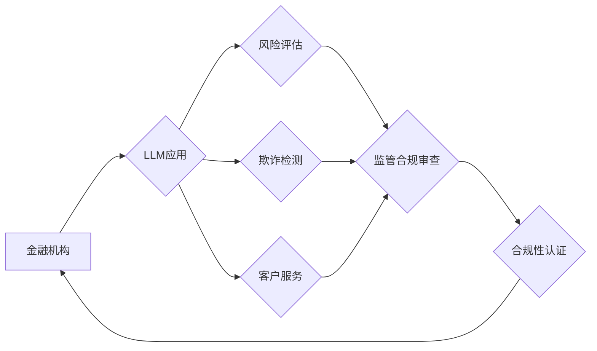

> Large Language Model (LLM), 监管合规, 金融稳定, 风险管理, 算法透明度, 数据隐私, 伦理规范

## 1. 背景介绍

近年来，大型语言模型（LLM）在自然语言处理领域取得了突破性的进展，展现出强大的文本生成、理解和翻译能力。其应用范围不断拓展，涵盖了金融、医疗、教育等多个领域。在金融领域，LLM被用于客户服务、风险评估、欺诈检测、投资分析等方面，为金融机构带来了效率提升和成本降低的机遇。然而，LLM的应用也带来了新的挑战，特别是监管合规方面。

金融行业高度依赖于法律法规和监管政策，任何违规行为都可能导致严重后果。LLM的复杂性和黑盒属性使得其在金融应用中的监管合规性成为一个关键问题。如何确保LLM在金融领域的应用符合相关法律法规，并有效地管理其带来的风险，是金融机构和监管机构共同面临的挑战。

## 2. 核心概念与联系

**2.1 监管合规**

监管合规是指金融机构在运营过程中必须遵守相关法律法规和监管政策的行为准则。金融监管机构制定并实施一系列规则和标准，以确保金融市场稳定、保护消费者权益，并防止金融犯罪。

**2.2 LLM在金融领域的应用**

LLM在金融领域的应用主要集中在以下几个方面：

* **客户服务:** 利用LLM构建智能客服系统，能够自动回答客户常见问题，提高服务效率。
* **风险评估:** 利用LLM分析海量金融数据，识别潜在的风险，帮助金融机构进行更精准的风险评估。
* **欺诈检测:** 利用LLM识别异常交易行为，提高欺诈检测的准确率。
* **投资分析:** 利用LLM分析市场数据和新闻信息，为投资者提供投资建议。

**2.3 监管合规与LLM的挑战**

LLM在金融领域的应用带来了以下监管合规挑战：

* **算法透明度:** LLM的训练数据和模型结构通常是复杂的，难以理解其决策逻辑，这使得监管机构难以评估其合规性。
* **数据隐私:** LLM的训练需要大量数据，其中可能包含敏感的个人信息，如何保护数据隐私成为一个重要问题。
* **伦理规范:** LLM的决策可能受到训练数据中的偏见影响，导致不公平或歧视性结果，需要制定相应的伦理规范。

**2.4 监管合规解决方案**

为了解决LLM在金融领域的监管合规挑战，需要采取以下措施：

* **提高算法透明度:** 开发可解释的LLM模型，使决策逻辑更加透明，便于监管机构进行审查。
* **加强数据隐私保护:** 采用数据脱敏技术，保护敏感个人信息，并严格遵守数据安全法规。
* **制定伦理规范:** 制定LLM应用的伦理规范，避免算法决策产生不公平或歧视性结果。

**2.5 Mermaid 流程图**



## 3. 核心算法原理 & 具体操作步骤

**3.1 算法原理概述**

LLM的核心算法原理是基于深度学习的Transformer模型。Transformer模型利用自注意力机制，能够捕捉文本序列中的长距离依赖关系，从而实现更准确的文本理解和生成。

**3.2 算法步骤详解**

LLM的训练过程主要包括以下步骤：

1. **数据预处理:** 收集和清洗文本数据，将其转换为模型可识别的格式。
2. **模型构建:** 根据Transformer模型架构，构建LLM模型。
3. **模型训练:** 利用训练数据，训练LLM模型，使其能够生成符合语义和语法规则的文本。
4. **模型评估:** 使用测试数据评估模型的性能，并根据评估结果进行模型调优。
5. **模型部署:** 将训练好的模型部署到实际应用场景中。

**3.3 算法优缺点**

**优点:**

* 强大的文本理解和生成能力
* 能够捕捉文本序列中的长距离依赖关系
* 训练效率高

**缺点:**

* 模型复杂度高，训练成本高
* 算法透明度低，难以解释决策逻辑
* 容易受到训练数据中的偏见影响

**3.4 算法应用领域**

LLM的应用领域非常广泛，包括：

* 自然语言处理
* 机器翻译
* 文本摘要
* 情感分析
* 代码生成

## 4. 数学模型和公式 & 详细讲解 & 举例说明

**4.1 数学模型构建**

LLM的数学模型主要基于Transformer架构，其核心是自注意力机制。自注意力机制能够计算每个词在句子中的重要性，并根据这些重要性权重进行文本编码。

**4.2 公式推导过程**

自注意力机制的计算公式如下：

$$
Attention(Q, K, V) = softmax(\frac{QK^T}{\sqrt{d_k}})V
$$

其中：

* $Q$：查询矩阵
* $K$：键矩阵
* $V$：值矩阵
* $d_k$：键向量的维度
* $softmax$：softmax函数

**4.3 案例分析与讲解**

假设我们有一个句子“我爱学习编程”，其词向量表示为：

* 我：[0.1, 0.2, 0.3]
* 爱：[0.4, 0.5, 0.6]
* 学习：[0.7, 0.8, 0.9]
* 编程：[1.0, 1.1, 1.2]

利用自注意力机制，我们可以计算每个词在句子中的重要性权重，例如，“学习”的权重可能比“我”高，因为“学习”与“编程”的关系更紧密。

## 5. 项目实践：代码实例和详细解释说明

**5.1 开发环境搭建**

LLM的开发环境通常需要安装Python、深度学习框架（如TensorFlow或PyTorch）以及必要的库。

**5.2 源代码详细实现**

LLM的源代码实现非常复杂，需要大量的代码和模型参数。这里只提供一个简单的LLM模型训练代码示例：

```python
import tensorflow as tf

# 定义模型架构
model = tf.keras.Sequential([
    tf.keras.layers.Embedding(input_dim=vocab_size, output_dim=embedding_dim),
    tf.keras.layers.LSTM(units=hidden_size),
    tf.keras.layers.Dense(units=vocab_size, activation='softmax')
])

# 编译模型
model.compile(optimizer='adam', loss='sparse_categorical_crossentropy', metrics=['accuracy'])

# 训练模型
model.fit(train_data, train_labels, epochs=num_epochs)
```

**5.3 代码解读与分析**

这段代码定义了一个简单的LLM模型，其架构包括嵌入层、LSTM层和全连接层。嵌入层将词向量表示为稠密的向量，LSTM层能够捕捉文本序列中的长距离依赖关系，全连接层输出每个词的概率分布。

**5.4 运行结果展示**

训练完成后，可以利用模型对新的文本进行预测，例如生成下一个词。

## 6. 实际应用场景

**6.1 风险评估**

LLM可以分析海量金融数据，识别潜在的风险，例如客户信用风险、市场风险、操作风险等。

**6.2 欺诈检测**

LLM可以识别异常交易行为，例如虚假交易、洗钱等，提高欺诈检测的准确率。

**6.3 客户服务**

LLM可以构建智能客服系统，自动回答客户常见问题，提高服务效率。

**6.4 未来应用展望**

LLM在金融领域的应用前景广阔，未来可能在以下方面得到更广泛的应用：

* 个性化金融服务
* 自动化投资决策
* 金融监管智能化

## 7. 工具和资源推荐

**7.1 学习资源推荐**

* **书籍:**
    * 《深度学习》
    * 《自然语言处理》
* **在线课程:**
    * Coursera
    * edX

**7.2 开发工具推荐**

* **深度学习框架:** TensorFlow, PyTorch
* **自然语言处理库:** NLTK, spaCy

**7.3 相关论文推荐**

* **BERT:** Devlin et al. (2018)
* **GPT-3:** Brown et al. (2020)
* **T5:** Raffel et al. (2019)

## 8. 总结：未来发展趋势与挑战

**8.1 研究成果总结**

LLM在金融领域的应用取得了显著进展，为金融机构带来了效率提升和成本降低的机遇。

**8.2 未来发展趋势**

LLM的未来发展趋势包括：

* 模型规模和性能的提升
* 算法透明度和可解释性的增强
* 针对金融领域的定制化模型开发

**8.3 面临的挑战**

LLM在金融领域的应用也面临着一些挑战：

* 监管合规性
* 数据隐私保护
* 伦理规范

**8.4 研究展望**

未来研究方向包括：

* 开发可解释的LLM模型
* 建立LLM应用的伦理规范
* 研究LLM在金融领域的长期影响

## 9. 附录：常见问题与解答

**9.1 如何评估LLM的监管合规性？**

评估LLM的监管合规性需要考虑以下因素：

* 模型的透明度
* 数据的隐私保护
* 算法的公平性

**9.2 如何保护LLM训练数据中的隐私信息？**

可以采用数据脱敏技术，例如将敏感信息替换为随机值或编码。

**9.3 如何避免LLM算法产生不公平或歧视性结果？**

需要在训练数据中进行去偏见处理，并制定相应的伦理规范。


作者：禅与计算机程序设计艺术 / Zen and the Art of Computer Programming 
<end_of_turn>