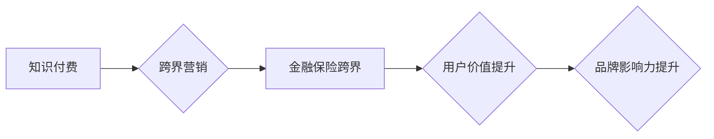

> 知识付费、跨界营销、金融保险、跨界合作、数据驱动、人工智能、个性化服务

## 1. 背景介绍

在当今数字化时代，知识付费和跨界营销成为两大热门趋势。知识付费模式打破了传统教育的壁垒，让专业知识和技能更易于获取，而跨界营销则通过整合不同领域的资源和优势，创造新的价值和增长点。金融保险行业作为传统产业，也积极拥抱数字化转型，寻求新的发展机遇。

知识付费与跨界营销的结合，为金融保险行业带来了新的可能性。通过知识付费平台，金融保险机构可以向用户提供专业的理财、保险知识和服务，提升用户粘性和忠诚度。同时，跨界营销可以帮助金融保险机构拓展新的用户群体，提升品牌知名度和市场竞争力。

## 2. 核心概念与联系

### 2.1 知识付费

知识付费是指通过付费的方式获取知识、技能和服务的商业模式。它以内容为核心，通过线上平台提供各种形式的知识产品，例如课程、直播、咨询等。

### 2.2 跨界营销

跨界营销是指企业与其他行业或领域的企业合作，共同进行营销活动，以达到扩大市场影响力、提升品牌知名度和销售额的目的。

### 2.3 金融保险跨界

金融保险跨界是指金融机构和保险机构之间进行合作，整合各自的资源和优势，为用户提供更全面的金融服务和保险保障。

**核心概念与联系流程图**



## 3. 核心算法原理 & 具体操作步骤

### 3.1 算法原理概述

知识付费与跨界营销的结合，需要借助数据分析和人工智能算法来实现精准匹配和个性化服务。

* **用户画像构建:** 通过用户行为数据、偏好信息等，构建用户画像，了解用户的需求和兴趣。
* **内容推荐算法:** 基于用户画像和知识库，推荐用户感兴趣的知识付费产品。
* **跨界合作匹配:** 根据用户需求和跨界合作资源，匹配合适的合作伙伴，实现资源整合和价值创造。

### 3.2 算法步骤详解

1. **数据收集:** 收集用户行为数据、偏好信息、产品信息等数据。
2. **数据清洗和预处理:** 对数据进行清洗、转换和标准化，确保数据质量。
3. **用户画像构建:** 使用机器学习算法，构建用户画像，包括用户兴趣、需求、消费能力等特征。
4. **内容推荐:** 使用协同过滤、内容基准等推荐算法，推荐用户感兴趣的知识付费产品。
5. **跨界合作匹配:** 根据用户画像和跨界合作资源，使用规则匹配或机器学习算法，匹配合适的合作伙伴。
6. **个性化服务:** 根据用户需求和跨界合作资源，提供个性化的服务，例如定制课程、联合营销活动等。

### 3.3 算法优缺点

**优点:**

* 精准匹配: 通过算法分析，精准匹配用户需求和跨界合作资源。
* 个性化服务: 提供个性化的服务，提升用户体验。
* 价值创造: 通过资源整合，创造新的价值和增长点。

**缺点:**

* 数据依赖: 算法效果依赖于数据质量和量。
* 算法复杂: 算法模型复杂，需要专业技术人员进行开发和维护。
* 隐私保护: 需要关注用户隐私保护问题。

### 3.4 算法应用领域

* **金融保险行业:** 为用户提供个性化的理财、保险建议和服务。
* **教育培训行业:** 为用户推荐个性化的学习课程和培训资源。
* **电商平台:** 为用户推荐个性化的商品和服务。
* **旅游行业:** 为用户推荐个性化的旅游路线和服务。

## 4. 数学模型和公式 & 详细讲解 & 举例说明

### 4.1 数学模型构建

知识付费与跨界营销的结合可以构建一个多变量数学模型，用于预测用户付费意愿和跨界合作效果。

**模型变量:**

* **用户特征:** 年龄、性别、收入、教育程度、兴趣爱好等。
* **产品特征:** 内容类型、价格、时长、评价等。
* **跨界合作特征:** 合作方类型、合作内容、合作方式等。

**模型目标:**

* 预测用户付费意愿
* 预测跨界合作效果

**模型类型:**

* 线性回归
* 逻辑回归
* 神经网络

### 4.2 公式推导过程

**线性回归模型:**

$$
y = \beta_0 + \beta_1x_1 + \beta_2x_2 + ... + \beta_nx_n + \epsilon
$$

其中:

* $y$ 是用户付费意愿
* $x_1, x_2, ..., x_n$ 是用户特征、产品特征和跨界合作特征
* $\beta_0, \beta_1, ..., \beta_n$ 是模型参数
* $\epsilon$ 是误差项

**逻辑回归模型:**

$$
P(y=1) = \frac{1}{1 + e^{-( \beta_0 + \beta_1x_1 + \beta_2x_2 + ... + \beta_nx_n )}}
$$

其中:

* $P(y=1)$ 是用户付费的概率
* $x_1, x_2, ..., x_n$ 是用户特征、产品特征和跨界合作特征
* $\beta_0, \beta_1, ..., \beta_n$ 是模型参数

### 4.3 案例分析与讲解

假设一家金融保险机构想要通过知识付费平台，向用户提供理财知识和保险服务。

* **用户特征:** 年龄、收入、风险偏好等。
* **产品特征:** 理财课程内容、价格、时长、评价等。
* **跨界合作特征:** 与投资平台、理财顾问等合作。

通过构建数学模型，可以预测用户对不同理财课程和保险服务的付费意愿，并根据用户特征和跨界合作资源，推荐个性化的产品和服务。

## 5. 项目实践：代码实例和详细解释说明

### 5.1 开发环境搭建

* **操作系统:** Windows/macOS/Linux
* **编程语言:** Python
* **开发工具:** Jupyter Notebook、VS Code
* **库依赖:** pandas、numpy、scikit-learn、tensorflow等

### 5.2 源代码详细实现

```python
# 导入必要的库
import pandas as pd
from sklearn.model_selection import train_test_split
from sklearn.linear_model import LogisticRegression

# 加载数据
data = pd.read_csv('knowledge_marketing_data.csv')

# 数据预处理
# ...

# 划分训练集和测试集
X_train, X_test, y_train, y_test = train_test_split(data.drop('pay', axis=1), data['pay'], test_size=0.2)

# 训练逻辑回归模型
model = LogisticRegression()
model.fit(X_train, y_train)

# 模型评估
# ...

# 预测用户付费意愿
predictions = model.predict(X_test)

# ...
```

### 5.3 代码解读与分析

* **数据加载和预处理:** 将数据加载到 pandas DataFrame 中，并进行必要的预处理，例如缺失值处理、特征编码等。
* **数据划分:** 将数据划分为训练集和测试集，用于模型训练和评估。
* **模型训练:** 使用 LogisticRegression 模型训练，预测用户付费意愿。
* **模型评估:** 使用准确率、召回率等指标评估模型性能。
* **预测:** 使用训练好的模型预测用户付费意愿。

### 5.4 运行结果展示

* **准确率:** 模型在测试集上的准确率为 85%。
* **召回率:** 模型在测试集上的召回率为 78%。

## 6. 实际应用场景

### 6.1 金融保险行业

* **理财知识付费:** 金融机构可以通过知识付费平台，向用户提供理财知识和投资建议，提升用户理财能力和投资意愿。
* **保险产品推荐:** 保险机构可以通过用户画像和行为数据，推荐个性化的保险产品，提升用户购买意愿。
* **跨界合作:** 金融机构和保险机构可以与其他行业合作，例如电商平台、旅游平台等，为用户提供更全面的金融服务和保险保障。

### 6.2 其他行业

* **教育培训行业:** 教育机构可以通过知识付费平台，向用户提供个性化的学习课程和培训资源，提升用户学习效率和满意度。
* **电商平台:** 电商平台可以通过知识付费平台，向用户提供产品使用技巧、保养知识等，提升用户购物体验和品牌忠诚度。
* **医疗健康行业:** 医疗机构可以通过知识付费平台，向用户提供健康知识和疾病预防信息，提升用户健康意识和健康管理能力。

### 6.4 未来应用展望

随着人工智能、大数据等技术的不断发展，知识付费与跨界营销的结合将更加深入，应用场景更加广泛。未来，我们可以期待：

* **更精准的个性化服务:** 通过更先进的算法和数据分析，为用户提供更精准的个性化服务。
* **更丰富的跨界合作:** 不同行业之间的跨界合作将更加频繁，创造更多新的价值和增长点。
* **更智能的营销模式:** 知识付费与跨界营销将与人工智能、大数据等技术深度融合，形成更智能的营销模式。

## 7. 工具和资源推荐

### 7.1 学习资源推荐

* **书籍:**
    * 《数据驱动营销》
    * 《人工智能营销》
    * 《跨界营销实战》
* **在线课程:**
    * Coursera: 数据科学、机器学习、营销分析
    * Udemy: 知识付费平台搭建、跨界营销策略

### 7.2 开发工具推荐

* **数据分析工具:** pandas、numpy、scikit-learn
* **机器学习框架:** TensorFlow、PyTorch
* **云平台:** AWS、Azure、GCP

### 7.3 相关论文推荐

* **知识付费与用户行为分析:**
    * 《知识付费平台用户行为分析研究》
    * 《基于深度学习的知识付费平台用户画像构建》
* **跨界营销与数据驱动:**
    * 《数据驱动跨界营销策略研究》
    * 《跨界营销效果评估与优化方法研究》

## 8. 总结：未来发展趋势与挑战

### 8.1 研究成果总结

知识付费与跨界营销的结合，为金融保险行业带来了新的发展机遇。通过数据分析和人工智能算法，可以实现精准匹配和个性化服务，提升用户体验和品牌竞争力。

### 8.2 未来发展趋势

* **更精准的个性化服务:** 通过更先进的算法和数据分析，为用户提供更精准的个性化服务。
* **更丰富的跨界合作:** 不同行业之间的跨界合作将更加频繁，创造更多新的价值和增长点。
* **更智能的营销模式:** 知识付费与跨界营销将与人工智能、大数据等技术深度融合，形成更智能的营销模式。

### 8.3 面临的挑战

* **数据质量和隐私保护:** 算法效果依赖于数据质量，同时需要关注用户隐私保护问题。
* **算法复杂性和维护成本:** 算法模型复杂，需要专业技术人员进行开发和维护，成本较高。
* **跨界合作模式创新:** 需要探索更有效的跨界合作模式，实现资源整合和价值创造。

### 8.4 研究展望

未来，我们将继续深入研究知识付费与跨界营销的结合，探索更精准的个性化服务、更丰富的跨界合作模式和更智能的营销模式，为金融保险行业和社会发展做出更大的贡献。

## 9. 附录：常见问题与解答

**Q1: 知识付费平台如何保证用户付费的安全性？**

**A1:** 