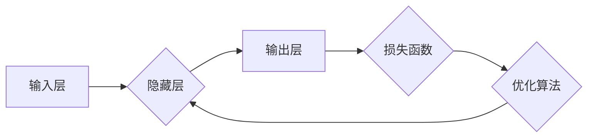

> 神经网络,深度学习,机器学习,人工智能,计算机视觉,自然语言处理,数据分析

## 1. 背景介绍

人工智能（AI）正以惊人的速度发展，深刻地改变着我们生活的方方面面。其中，神经网络作为人工智能的核心技术之一，在推动社会进步方面发挥着越来越重要的作用。从自动驾驶汽车到智能语音助手，从医疗诊断到金融风险评估，神经网络的应用场景日益广泛，为人类社会带来了前所未有的便利和机遇。

然而，神经网络的强大能力也伴随着一些挑战和伦理问题。如何确保神经网络的安全性、可靠性和公平性？如何避免神经网络被用于恶意目的？这些问题都需要我们认真思考和探讨。

## 2. 核心概念与联系

### 2.1 神经网络的起源与灵感

神经网络的灵感来源于人类大脑的结构和功能。大脑由数十亿的神经元组成，这些神经元通过复杂的连接相互传递信息，从而实现各种认知功能。神经网络试图模仿这种结构和机制，构建一个能够学习和解决复杂问题的计算模型。

### 2.2 神经网络的基本结构

神经网络由多个层组成，每一层都包含多个神经元。这些神经元之间通过连接进行信息传递，每个连接都有一个权重，代表着连接强度的程度。

* **输入层:**接收原始数据，例如图像像素、文本字符等。
* **隐藏层:**对输入数据进行处理和转换，提取特征和模式。
* **输出层:**输出最终结果，例如分类标签、预测值等。

### 2.3 激活函数

激活函数是神经网络中一个重要的组成部分，它决定了神经元对输入信号的响应方式。常见的激活函数包括 sigmoid 函数、ReLU 函数、tanh 函数等。

### 2.4 损失函数

损失函数用于衡量神经网络的预测结果与真实值的差异。神经网络的训练过程就是通过不断调整连接权重，最小化损失函数的值。

### 2.5 优化算法

优化算法用于更新神经网络的连接权重，使其朝着最小化损失函数的方向前进。常见的优化算法包括梯度下降法、Adam 算法、RMSprop 算法等。

**Mermaid 流程图**



## 3. 核心算法原理 & 具体操作步骤

### 3.1 算法原理概述

神经网络的训练过程是一个迭代的过程，它通过以下步骤来学习数据并提高预测精度：

1. **前向传播:** 将输入数据传递到神经网络中，计算每个神经元的输出值。
2. **反向传播:** 计算损失函数的值，并根据梯度下降法更新连接权重。
3. **重复步骤1和2:** 直到损失函数达到最小值或训练次数达到上限。

### 3.2 算法步骤详解

1. **初始化连接权重:** 将所有连接权重随机初始化。
2. **前向传播:** 将输入数据传递到神经网络中，计算每个神经元的输出值。
3. **计算损失函数:** 比较神经网络的预测结果与真实值之间的差异，计算损失函数的值。
4. **反向传播:** 计算损失函数对每个连接权重的梯度，并根据梯度下降法更新连接权重。
5. **重复步骤2-4:** 直到损失函数达到最小值或训练次数达到上限。

### 3.3 算法优缺点

**优点:**

* **强大的学习能力:** 神经网络能够学习复杂的数据模式，并进行精准的预测。
* **适应性强:** 神经网络可以适应不同的数据类型和任务需求。
* **自动特征提取:** 神经网络能够自动提取数据的特征，无需人工干预。

**缺点:**

* **训练时间长:** 神经网络的训练过程通常需要很长时间，尤其是在处理大规模数据集时。
* **参数量大:** 神经网络的参数量很大，需要大量的计算资源进行训练和推理。
* **可解释性差:** 神经网络的决策过程比较复杂，难以解释其背后的逻辑。

### 3.4 算法应用领域

神经网络在各个领域都有广泛的应用，例如：

* **计算机视觉:** 图像识别、物体检测、图像分割、人脸识别等。
* **自然语言处理:** 文本分类、情感分析、机器翻译、文本生成等。
* **语音识别:** 语音转文本、语音助手等。
* **医疗诊断:** 疾病预测、影像分析、药物研发等。
* **金融风险评估:** 欺诈检测、信用评分、投资预测等。

## 4. 数学模型和公式 & 详细讲解 & 举例说明

### 4.1 数学模型构建

神经网络的数学模型可以表示为一个多层感知机（MLP），其结构由输入层、隐藏层和输出层组成。每个神经元接收来自前一层神经元的输入信号，并通过激活函数进行处理，输出到下一层神经元。

### 4.2 公式推导过程

**前向传播公式:**

$$
y_j = f(\sum_{i=1}^{n} w_{ji}x_i + b_j)
$$

其中：

* $y_j$ 是第 $j$ 个神经元的输出值。
* $f$ 是激活函数。
* $w_{ji}$ 是第 $i$ 个输入神经元到第 $j$ 个隐藏神经元的连接权重。
* $x_i$ 是第 $i$ 个输入神经元的输入值。
* $b_j$ 是第 $j$ 个隐藏神经元的偏置值。

**损失函数:**

$$
L = \frac{1}{N} \sum_{i=1}^{N} \left\| y_i - \hat{y}_i \right\|^2
$$

其中：

* $L$ 是损失函数的值。
* $N$ 是样本数量。
* $y_i$ 是第 $i$ 个样本的真实值。
* $\hat{y}_i$ 是第 $i$ 个样本的预测值。

**梯度下降公式:**

$$
\Delta w_{ji} = -\eta \frac{\partial L}{\partial w_{ji}}
$$

其中：

* $\Delta w_{ji}$ 是连接权重 $w_{ji}$ 的更新量。
* $\eta$ 是学习率。

### 4.3 案例分析与讲解

**举例说明:**

假设我们有一个简单的神经网络，用于识别手写数字 0 到 9。输入层有 784 个神经元，对应于图像的 28x28 像素。隐藏层有 128 个神经元，输出层有 10 个神经元，对应于 0 到 9 的数字类别。

通过训练数据，神经网络会学习到每个连接权重和偏置值，使得其能够将输入图像映射到正确的数字类别。

## 5. 项目实践：代码实例和详细解释说明

### 5.1 开发环境搭建

* **操作系统:** Linux, macOS, Windows
* **编程语言:** Python
* **深度学习框架:** TensorFlow, PyTorch, Keras

### 5.2 源代码详细实现

```python
import tensorflow as tf

# 定义模型结构
model = tf.keras.models.Sequential([
    tf.keras.layers.Flatten(input_shape=(28, 28)),
    tf.keras.layers.Dense(128, activation='relu'),
    tf.keras.layers.Dense(10, activation='softmax')
])

# 编译模型
model.compile(optimizer='adam',
              loss='sparse_categorical_crossentropy',
              metrics=['accuracy'])

# 加载训练数据
(x_train, y_train), (x_test, y_test) = tf.keras.datasets.mnist.load_data()

# 训练模型
model.fit(x_train, y_train, epochs=5)

# 评估模型
loss, accuracy = model.evaluate(x_test, y_test)
print('Test loss:', loss)
print('Test accuracy:', accuracy)
```

### 5.3 代码解读与分析

* **模型结构:** 该代码定义了一个简单的多层感知机模型，包含一个扁平化层、一个隐藏层和一个输出层。
* **编译模型:** 使用 Adam 优化器、稀疏类别交叉熵损失函数和精度指标来编译模型。
* **加载训练数据:** 使用 MNIST 数据集作为训练数据。
* **训练模型:** 使用 `fit()` 方法训练模型，训练 5 个 epochs。
* **评估模型:** 使用 `evaluate()` 方法评估模型在测试集上的性能。

### 5.4 运行结果展示

训练完成后，模型会输出测试集上的损失值和精度值。

## 6. 实际应用场景

### 6.1 计算机视觉

* **图像识别:** 神经网络可以识别图像中的物体、场景和人物。例如，自动驾驶汽车使用神经网络识别道路、行人和其他车辆。
* **物体检测:** 神经网络可以检测图像中多个物体的位置和类别。例如，在监控视频中检测入侵者。
* **图像分割:** 神经网络可以将图像分割成不同的区域，例如分割图像中的前景和背景。

### 6.2 自然语言处理

* **文本分类:** 神经网络可以将文本分类到不同的类别，例如垃圾邮件过滤、情感分析。
* **机器翻译:** 神经网络可以将文本从一种语言翻译成另一种语言。例如，Google Translate 使用神经网络进行机器翻译。
* **文本生成:** 神经网络可以生成文本，例如写新闻报道、诗歌或小说。

### 6.3 其他应用场景

* **语音识别:** 神经网络可以将语音转为文本，例如语音助手 Siri 和 Alexa。
* **医疗诊断:** 神经网络可以辅助医生诊断疾病，例如分析医学影像和预测患者的风险。
* **金融风险评估:** 神经网络可以识别欺诈交易和评估投资风险。

### 6.4 未来应用展望

随着人工智能技术的不断发展，神经网络的应用场景将会更加广泛。例如：

* **个性化教育:** 根据学生的学习情况，提供个性化的学习内容和教学方法。
* **智能家居:** 通过神经网络，智能家居设备可以更好地理解用户的需求，提供更便捷的服务。
* **自动驾驶:** 神经网络将成为自动驾驶汽车的核心技术，实现更安全、更智能的驾驶体验。

## 7. 工具和资源推荐

### 7.1 学习资源推荐

* **书籍:**
    * 《深度学习》
    * 《神经网络与深度学习》
    * 《动手学深度学习》
* **在线课程:**
    * Coursera: 深度学习 Specialization
    * Udacity: Deep Learning Nanodegree
    * fast.ai: Practical Deep Learning for Coders

### 7.2 开发工具推荐

* **深度学习框架:** TensorFlow, PyTorch, Keras
* **编程语言:** Python
* **数据可视化工具:** Matplotlib, Seaborn

### 7.3 相关论文推荐

* **AlexNet:** ImageNet Classification with Deep Convolutional Neural Networks
* **VGGNet:** Very Deep Convolutional Networks for Large-Scale Image Recognition
* **ResNet:** Deep Residual Learning for Image Recognition

## 8. 总结：未来发展趋势与挑战

### 8.1 研究成果总结

近年来，神经网络在各个领域取得了显著的成果，例如图像识别、自然语言处理、语音识别等。这些成果推动了人工智能技术的快速发展，并为人类社会带来了许多便利。

### 8.2 未来发展趋势

* **模型规模和复杂度:** 神经网络模型的规模和复杂度将继续增加，从而提高其学习能力和性能。
* **新颖的网络架构:** 研究人员将继续探索新的神经网络架构，例如 Transformer、Graph Neural Network 等，以解决更复杂的任务。
* **边缘计算:** 将神经网络部署到边缘设备上，实现更快速的推理速度和更低的延迟。
* **可解释性:** 研究如何提高神经网络的可解释性，使其决策过程更加透明和可理解。

### 8.3 面临的挑战

* **数据获取和标注:** 训练高