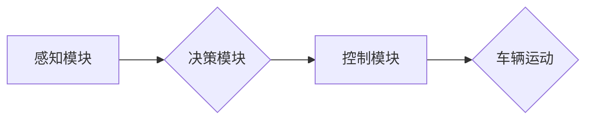

> 自动驾驶, 端到端学习, 深度学习, 计算机视觉, 传感器融合, 决策控制, 安全可靠性, 伦理问题

## 1. 背景介绍

自动驾驶技术作为未来交通运输的重要发展方向，近年来取得了显著进展。从早期基于规则的控制系统到如今的深度学习驱动的端到端自动驾驶，技术演进速度惊人。端到端自动驾驶，顾名思义，是指将感知、决策和控制等多个模块整合在一起，通过深度学习模型直接从传感器数据中学习驾驶策略，实现车辆从感知环境到做出控制决策的全流程自动化。

端到端自动驾驶的优势在于其学习能力强、适应性好，能够在复杂多变的驾驶场景中表现出更灵活的驾驶行为。然而，实现端到端自动驾驶的落地也面临着诸多技术挑战，其中一些关键卡点需要我们深入思考和解决。

## 2. 核心概念与联系

端到端自动驾驶的核心概念包括感知、决策和控制三个模块，它们之间相互关联，共同完成自动驾驶任务。

**感知模块**负责获取车辆周围环境的信息，主要依赖于传感器数据，例如摄像头、雷达、激光雷达等。这些传感器会采集到不同类型的信号，需要进行数据融合和处理，才能形成完整的环境感知图。

**决策模块**根据感知模块获取的环境信息，分析驾驶场景，并做出相应的驾驶决策，例如转向、加速、减速等。决策模块通常采用强化学习算法，通过学习大量的驾驶数据，不断优化驾驶策略。

**控制模块**根据决策模块的指令，控制车辆的各个部件，例如油门、刹车、方向盘等，实现车辆的运动控制。控制模块需要保证控制指令的准确性和实时性，才能确保车辆的安全行驶。

**Mermaid 流程图：**



## 3. 核心算法原理 & 具体操作步骤

### 3.1  算法原理概述

端到端自动驾驶的核心算法是深度学习，它能够从海量数据中学习复杂的特征和模式，并将其应用于驾驶决策。常用的深度学习算法包括卷积神经网络（CNN）、循环神经网络（RNN）和强化学习算法等。

CNN擅长处理图像数据，可以用于感知模块的图像识别和场景理解。RNN擅长处理序列数据，可以用于决策模块的驾驶策略预测。强化学习算法可以训练决策模块，使其能够在复杂驾驶场景中做出最优决策。

### 3.2  算法步骤详解

**感知模块：**

1. **数据采集:** 使用摄像头、雷达、激光雷达等传感器采集车辆周围环境数据。
2. **数据预处理:** 对采集到的数据进行预处理，例如图像增强、数据去噪等。
3. **特征提取:** 使用CNN提取图像特征，例如道路边界、行人、车辆等。
4. **环境建模:** 将提取到的特征融合，构建车辆周围环境的3D模型。

**决策模块：**

1. **状态表示:** 将环境模型和车辆状态信息表示为决策模块可以理解的格式。
2. **策略学习:** 使用强化学习算法，例如DQN、A2C等，学习驾驶策略。
3. **决策生成:** 根据当前状态和学习到的策略，生成驾驶决策，例如转向、加速、减速等。

**控制模块：**

1. **控制指令生成:** 将决策模块生成的驾驶决策转换为车辆控制指令。
2. **控制执行:** 将控制指令发送到车辆的各个部件，例如油门、刹车、方向盘等，实现车辆的运动控制。

### 3.3  算法优缺点

**优点:**

* 学习能力强，能够从海量数据中学习复杂的驾驶策略。
* 适应性好，能够在复杂多变的驾驶场景中表现出灵活的驾驶行为。
* 减少了人工设计规则的复杂度，提高了系统开发效率。

**缺点:**

* 数据依赖性强，需要大量的标注数据进行训练。
* 训练成本高，需要强大的计算资源和时间。
* 缺乏可解释性，难以理解模型的决策过程。

### 3.4  算法应用领域

端到端自动驾驶算法广泛应用于自动驾驶汽车、无人机、机器人等领域。

## 4. 数学模型和公式 & 详细讲解 & 举例说明

### 4.1  数学模型构建

端到端自动驾驶的数学模型通常基于深度学习框架，例如TensorFlow、PyTorch等。模型的结构和参数需要根据具体的应用场景进行设计和训练。

**感知模块:**

* **图像分类:** 使用CNN进行图像分类，将图像映射到不同的类别，例如道路、行人、车辆等。
* **目标检测:** 使用YOLO、SSD等算法进行目标检测，识别图像中的目标，并预测其位置和类别。

**决策模块:**

* **强化学习:** 使用DQN、A2C等算法进行强化学习，训练一个策略网络，该网络可以根据当前状态预测最优的驾驶动作。

**控制模块:**

* **运动规划:** 使用运动规划算法，例如A*算法、RRT算法等，规划车辆在环境中的运动轨迹。

### 4.2  公式推导过程

强化学习算法的核心是价值函数和策略网络。

* **价值函数:** 用于评估某个状态下采取某个动作的长期回报。
* **策略网络:** 用于根据当前状态预测最优的动作。

DQN算法的价值函数公式如下：

$$
V(s) = \max_{\pi} \mathbb{E}_{\tau \sim \pi}[R_t + \gamma R_{t+1} + \gamma^2 R_{t+2} + ...]
$$

其中：

* $s$ 是当前状态
* $\pi$ 是策略
* $R_t$ 是在时间步 $t$ 获得的回报
* $\gamma$ 是折扣因子

策略网络的输出是动作概率分布，可以使用softmax函数进行归一化。

### 4.3  案例分析与讲解

假设一辆自动驾驶汽车行驶在一条道路上，前方出现了一个行人。感知模块识别到行人，并将其位置信息传递给决策模块。决策模块根据当前状态和学习到的策略，预测最优的动作是减速并避让行人。控制模块根据决策模块的指令，控制车辆减速并转向避让行人。

## 5. 项目实践：代码实例和详细解释说明

### 5.1  开发环境搭建

自动驾驶项目开发通常需要使用Python语言和深度学习框架，例如TensorFlow、PyTorch等。需要安装相应的软件包，例如NumPy、Pandas、OpenCV等。

### 5.2  源代码详细实现

以下是一个简单的端到端自动驾驶代码示例，使用TensorFlow框架实现一个简单的感知模块，用于识别道路边界。

```python
import tensorflow as tf

# 定义模型结构
model = tf.keras.models.Sequential([
    tf.keras.layers.Conv2D(32, (3, 3), activation='relu', input_shape=(64, 64, 3)),
    tf.keras.layers.MaxPooling2D((2, 2)),
    tf.keras.layers.Conv2D(64, (3, 3), activation='relu'),
    tf.keras.layers.MaxPooling2D((2, 2)),
    tf.keras.layers.Flatten(),
    tf.keras.layers.Dense(10, activation='softmax')
])

# 编译模型
model.compile(optimizer='adam',
              loss='sparse_categorical_crossentropy',
              metrics=['accuracy'])

# 训练模型
model.fit(x_train, y_train, epochs=10)

# 评估模型
loss, accuracy = model.evaluate(x_test, y_test)
print('Loss:', loss)
print('Accuracy:', accuracy)
```

### 5.3  代码解读与分析

这段代码定义了一个简单的卷积神经网络模型，用于识别道路边界。模型包含两个卷积层和两个最大池化层，用于提取图像特征。最后是一个全连接层，用于分类道路边界。

### 5.4  运行结果展示

训练完成后，可以将模型应用于新的图像数据，预测道路边界的类别。

## 6. 实际应用场景

端到端自动驾驶技术在多个实际应用场景中得到应用，例如：

* **自动驾驶汽车:** 实现车辆的自动驾驶功能，提高驾驶安全性、效率和舒适性。
* **无人配送:** 实现无人驾驶车辆的配送服务，例如快递、食品配送等。
* **无人农业:** 实现无人驾驶车辆在农田中的作业，例如播种、施肥、收获等。

### 6.4  未来应用展望

未来，端到端自动驾驶技术将应用于更多领域，例如：

* **智能交通:** 实现交通流量优化、拥堵缓解等。
* **城市规划:** 优化城市道路布局、公共交通系统等。
* **医疗救护:** 实现快速、高效的医疗救护服务。

## 7. 工具和资源推荐

### 7.1  学习资源推荐

* **书籍:**
    * Deep Learning by Ian Goodfellow, Yoshua Bengio, and Aaron Courville
    * Hands-On Machine Learning with Scikit-Learn, Keras & TensorFlow by Aurélien Géron
* **在线课程:**
    * TensorFlow Tutorials: https://www.tensorflow.org/tutorials
    * PyTorch Tutorials: https://pytorch.org/tutorials/

### 7.2  开发工具推荐

* **深度学习框架:** TensorFlow, PyTorch
* **计算机视觉库:** OpenCV, Pillow
* **数据处理库:** NumPy, Pandas

### 7.3  相关论文推荐

* **End to End Learning for Self-Driving Cars** by Bojarski et al. (2016)
* **Learning to Drive with Deep Reinforcement Learning** by Schulman et al. (2015)
* **Deep Reinforcement Learning for Autonomous Driving** by Wang et al. (2018)

## 8. 总结：未来发展趋势与挑战

### 8.1  研究成果总结

端到端自动驾驶技术取得了显著进展，能够实现车辆在复杂驾驶场景中的自动驾驶。深度学习算法的应用使得自动驾驶系统具备了更强的学习能力和适应性。

### 8.2  未来发展趋势

* **更强大的计算能力:** 随着计算能力的提升，自动驾驶模型可以变得更加复杂，能够处理更多信息，做出更精细的决策。
* **更丰富的传感器数据:** 多传感器融合技术将进一步提高自动驾驶系统的感知能力，使其能够更好地理解周围环境。
* **更安全的驾驶策略:** 研究人员将继续探索更安全的驾驶策略，确保自动驾驶系统的可靠性和安全性。

### 8.3  面临的挑战

* **数据安全和隐私:** 自动驾驶系统需要收集大量的用户数据，如何保证数据安全和隐私是一个重要的挑战。
* **伦理问题:** 自动驾驶系统在遇到紧急情况时，如何做出道德决策是一个需要认真思考的伦理问题。
* **法律法规:** 自动驾驶技术的应用需要完善的法律法规，明确自动驾驶系统的责任和义务。

### 8.4  研究展望

未来，端到端自动驾驶技术将继续朝着更安全、更可靠、更智能的方向发展。研究人员将继续探索新的算法、新的技术，推动自动驾驶技术的发展。

## 9. 附录：常见问题与解答

**常见问题:**

* **端到端自动驾驶和传统自动驾驶有什么区别？**

**解答:**

端到端自动驾驶采用深度学习算法，直接从传感器数据中学习驾驶策略，而传统自动驾驶则依赖于人工设计的规则和模型。

* **端到端自动驾驶技术有哪些应用场景？**

**解答:**

端到端自动驾驶技术应用于自动驾驶汽车、无人配送、无人农业等领域。

* **端到端自动驾驶技术面临哪些挑战？**

**解答:**

端到端自动驾驶技术面临数据安全、隐私、伦理问题、法律法规等挑战。

作者：禅与计算机程序设计艺术 / Zen and the Art of Computer Programming


<end_of_turn>