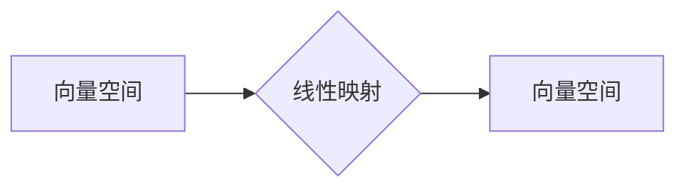

> 线性代数，矩阵，线性映射，向量空间，基底，线性变换，特征值，特征向量，应用场景

## 1. 背景介绍

线性代数作为数学领域的重要分支，为计算机科学、数据科学、人工智能等领域提供了强大的理论基础和工具。它以向量、矩阵和线性变换为核心概念，为解决各种复杂问题提供了简洁高效的框架。

在计算机科学中，线性代数应用广泛，例如：

* **图像处理和计算机视觉:** 图像可以表示为矩阵，线性代数算法可以用于图像变换、滤波、特征提取等操作。
* **机器学习和深度学习:** 线性回归、逻辑回归、支持向量机等机器学习算法都依赖于线性代数的原理。深度学习模型中的神经网络层也利用矩阵运算进行参数更新和特征提取。
* **图形学和游戏开发:** 3D图形渲染、物体变换、光照计算等都需要用到线性代数的知识。
* **数据分析和数据挖掘:** 线性代数可以用于数据降维、特征选择、聚类分析等数据分析任务。

## 2. 核心概念与联系

### 2.1 向量空间

向量空间是一个集合，其中元素称为向量，并满足以下条件：

* **加法封闭性:** 两个向量的和仍然属于该向量空间。
* **数乘封闭性:** 向量与标量的乘积仍然属于该向量空间。
* **结合律:** (u + v) + w = u + (v + w)
* **交换律:** u + v = v + u
* **零向量:** 存在一个零向量，满足 u + 0 = u
* **逆向量:** 对于每个向量 u，存在一个逆向量 -u，满足 u + (-u) = 0
* **分配律:** k(u + v) = ku + kv

### 2.2 线性映射

线性映射是一种将一个向量空间映射到另一个向量空间的函数，它满足以下条件：

* **保加法:** f(u + v) = f(u) + f(v)
* **保数乘:** f(ku) = kf(u)

线性映射可以表示为矩阵乘法，矩阵的每一行对应一个线性映射的输出，每一列对应一个输入向量的分量。

### 2.3 矩阵

矩阵是一种数的排列，通常用方括号表示。矩阵可以表示线性映射，也可以用于进行矩阵运算，例如加法、减法、乘法、转置等。

**Mermaid 流程图**



## 3. 核心算法原理 & 具体操作步骤

### 3.1 算法原理概述

线性代数算法的核心是利用矩阵和向量之间的运算关系来解决问题。常见的线性代数算法包括：

* **矩阵分解:** 将一个矩阵分解成多个简单矩阵的乘积，例如LU分解、QR分解等。
* **求逆矩阵:** 求解一个矩阵的逆矩阵，用于解决线性方程组等问题。
* **特征值和特征向量:** 求解一个矩阵的特征值和特征向量，用于分析矩阵的性质和进行数据降维等操作。

### 3.2 算法步骤详解

以下以求解线性方程组为例，详细说明线性代数算法的步骤：

1. **将线性方程组表示为矩阵形式:** 将系数矩阵和常数项向量组合成一个矩阵方程。
2. **进行矩阵分解:** 使用LU分解等方法将系数矩阵分解成多个简单矩阵。
3. **求解前向和后向代入:** 利用分解后的矩阵，通过前向和后向代入法求解未知数。

### 3.3 算法优缺点

线性代数算法具有以下优点：

* **效率高:** 矩阵运算可以利用计算机的并行计算能力进行加速。
* **通用性强:** 可以应用于各种线性问题。
* **理论基础扎实:** 基于数学原理，具有良好的可解释性和可靠性。

缺点：

* **计算量大:** 对于大型矩阵，计算量可能很大。
* **数值稳定性问题:** 某些算法可能存在数值稳定性问题，导致结果不准确。

### 3.4 算法应用领域

线性代数算法广泛应用于以下领域：

* **科学计算:** 物理模拟、工程分析、天体动力学等。
* **数据科学:** 数据分析、机器学习、深度学习等。
* **图像处理:** 图像变换、滤波、特征提取等。
* **图形学:** 3D图形渲染、物体变换、光照计算等。

## 4. 数学模型和公式 & 详细讲解 & 举例说明

### 4.1 数学模型构建

线性代数的核心数学模型是向量空间和线性映射。

* **向量空间:**  一个集合 V，其中元素称为向量，并满足加法和数乘封闭性，以及其他公理。
* **线性映射:**  一个函数 f: V -> W，其中 V 和 W 是两个向量空间，满足保加法和保数乘性质。

### 4.2 公式推导过程

**矩阵乘法:**

设 A 是 m×n 矩阵，B 是 n×p 矩阵，则它们的乘积 C 是 m×p 矩阵，其元素 c<sub>ij</sub> 为：

$$c_{ij} = \sum_{k=1}^{n} a_{ik}b_{kj}$$

**逆矩阵:**

如果一个方阵 A 的行列式不为零，则存在一个逆矩阵 A<sup>-1</sup>，满足：

$$AA^{-1} = A^{-1}A = I$$

其中 I 是单位矩阵。

**特征值和特征向量:**

对于一个方阵 A，如果存在一个非零向量 v 和一个标量 λ，满足：

$$Av = \lambda v$$

则 λ 称为 A 的特征值，v 称为 A 的特征向量。

### 4.3 案例分析与讲解

**图像旋转:**

将图像表示为矩阵，可以使用旋转矩阵进行图像旋转。旋转矩阵是一个正交矩阵，其行列式为 1 或 -1。

**数据降维:**

可以使用主成分分析 (PCA) 等方法，将高维数据降维到低维空间。PCA 基于特征值和特征向量，选择具有最大方差的特征向量作为降维方向。

## 5. 项目实践：代码实例和详细解释说明

### 5.1 开发环境搭建

本项目使用 Python 语言进行开发，并使用 NumPy 和 SciPy 等库进行线性代数运算。

### 5.2 源代码详细实现

```python
import numpy as np

# 定义一个矩阵
A = np.array([[1, 2], [3, 4]])

# 计算矩阵的转置
A_transpose = A.transpose()

# 计算矩阵的逆矩阵
A_inverse = np.linalg.inv(A)

# 计算矩阵的特征值和特征向量
eigenvalues, eigenvectors = np.linalg.eig(A)

# 打印结果
print("矩阵 A:")
print(A)
print("矩阵 A 的转置:")
print(A_transpose)
print("矩阵 A 的逆矩阵:")
print(A_inverse)
print("矩阵 A 的特征值:")
print(eigenvalues)
print("矩阵 A 的特征向量:")
print(eigenvectors)
```

### 5.3 代码解读与分析

* `np.array()` 函数用于创建 NumPy 数组。
* `A.transpose()` 函数用于计算矩阵的转置。
* `np.linalg.inv()` 函数用于计算矩阵的逆矩阵。
* `np.linalg.eig()` 函数用于计算矩阵的特征值和特征向量。

### 5.4 运行结果展示

运行上述代码，将输出矩阵 A、其转置、逆矩阵、特征值和特征向量。

## 6. 实际应用场景

### 6.1 图像处理

* **图像旋转:** 使用旋转矩阵将图像旋转到指定角度。
* **图像缩放:** 使用缩放矩阵将图像放大或缩小。
* **图像滤波:** 使用卷积核进行图像滤波，例如高斯滤波、Sobel 算子等。

### 6.2 机器学习

* **线性回归:** 使用线性方程模型预测连续变量。
* **逻辑回归:** 使用逻辑函数将线性模型输出映射到概率空间，用于分类问题。
* **支持向量机:** 使用线性分类器将数据点划分为不同的类别。

### 6.3 其他应用场景

* **数据分析:** 数据降维、特征选择、聚类分析等。
* **图形学:** 3D图形渲染、物体变换、光照计算等。
* **信号处理:** 信号滤波、信号压缩等。

### 6.4 未来应用展望

随着人工智能和机器学习的发展，线性代数在这些领域将发挥越来越重要的作用。例如：

* **深度学习:** 深度学习模型中大量使用矩阵运算，线性代数是深度学习的基础。
* **强化学习:** 强化学习算法也依赖于线性代数的原理，用于状态空间的表示和策略更新。
* **自动驾驶:** 自动驾驶系统需要处理大量传感器数据，线性代数可以用于数据分析、路径规划和控制算法。

## 7. 工具和资源推荐

### 7.1 学习资源推荐

* **书籍:**
    * 《线性代数及其应用》 - Gilbert Strang
    * 《线性代数及其应用》 - David C. Lay
    * 《矩阵分析》 - Roger A. Horn
* **在线课程:**
    * MIT OpenCourseWare: Linear Algebra
    * Coursera: Linear Algebra
    * edX: Linear Algebra

### 7.2 开发工具推荐

* **Python:** 
    * NumPy: 用于高效的数值计算和矩阵运算。
    * SciPy: 提供了线性代数、优化、统计等科学计算工具。
    * Pandas: 用于数据分析和处理。
* **MATLAB:** 
    * 专门用于数值计算和工程分析的软件。
    * 提供了丰富的线性代数工具和函数。

### 7.3 相关论文推荐

* **Eigenvalues and Eigenvectors:**
    * "Eigenvalues and Eigenvectors" by Gilbert Strang
* **Singular Value Decomposition:**
    * "Singular Value Decomposition" by Gene Golub and Charles Van Loan
* **Principal Component Analysis:**
    * "Principal Component Analysis" by Jolliffe

## 8. 总结：未来发展趋势与挑战

### 8.1 研究成果总结

线性代数作为数学领域的重要分支，为计算机科学、数据科学、人工智能等领域提供了强大的理论基础和工具。

### 8.2 未来发展趋势

* **更高效的算法:** 随着计算能力的提升，研究更高效的线性代数算法将成为一个重要方向。
* **更广泛的应用:** 线性代数将应用于更多领域，例如生物信息学、金融建模等。
* **理论研究:** 探索线性代数的更深层次的理论问题，例如非线性代数、量子代数等。

### 8.3 面临的挑战

* **数值稳定性问题:** 某些线性代数算法可能存在数值稳定性问题，需要开发更稳定的算法。
* **大规模数据处理:** 对于大规模数据，线性代数算法的计算量可能很大，需要开发更有效的处理方法。
* **理论与实践的结合:** 将线性代数的理论研究与实际应用结合起来，是未来发展的重要方向。

### 8.4 研究展望

未来，线性代数将继续发展，为解决更复杂的问题提供更强大的工具。


## 9. 附录：常见问题与解答

### 9.1 什么是线性方程组？

线性方程组是指由多个线性方程组成的方程组。每个方程都包含未知数，且未知数的指数为 1。

### 9.2 如何求解线性方程组？

可以使用高斯消元法、LU 分解法等方法求解线性方程组。

### 9.3 什么是特征值和特征向量？

特征值和特征向量是线性代数中重要的概念。特征值是与矩阵相对应的标量，特征向量是与矩阵相对应的非零向量。

###