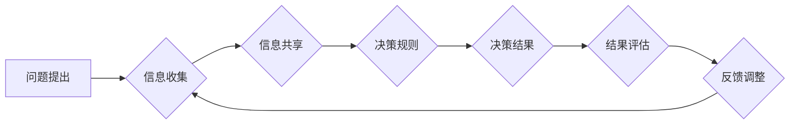

>群体智慧，协同决策，人工智能，机器学习，优化算法，分布式计算，大数据分析

## 1. 背景介绍

在当今数据爆炸的时代，面对复杂多变的决策问题，传统的单点决策模式已显不足。如何有效地汇集众智，从海量数据中挖掘决策线索，并做出更优的决策，成为一个亟待解决的难题。群体智慧，作为一种新兴的决策模式，以其独特的优势，为我们提供了新的思路和方法。

群体智慧是指由多个个体协同合作，通过信息共享和交互，最终达到比单个个体更优的决策结果。这种现象在自然界中随处可见，例如蜂群的集体决策、鸟群的迁徙路线选择等。近年来，随着人工智能、机器学习等技术的快速发展，群体智慧的研究也取得了长足的进步，并逐渐应用于各个领域，例如金融投资、市场营销、医疗诊断等。

## 2. 核心概念与联系

群体智慧的核心概念包括：

* **个体智能:** 指单个个体所拥有的知识、能力和判断力。
* **信息共享:** 个体之间通过各种方式交换信息，例如交流、协作、竞争等。
* **群体协同:** 个体根据共享的信息，共同进行决策或解决问题。
* **群体智能:** 指群体通过协同合作，最终达到的决策结果或解决问题的能力，通常优于单个个体的能力。

**群体智慧决策流程图:**



## 3. 核心算法原理 & 具体操作步骤

群体智慧算法旨在模拟群体决策过程，通过个体之间的交互和信息传递，最终达到群体智能。常见的群体智慧算法包括：

* **蚁群算法:** 借鉴蚂蚁寻找食物的群体行为，通过模拟蚂蚁信息素的传播，寻找最优路径。
* **粒子群算法:** 借鉴鸟群觅食的行为，通过模拟粒子群的运动轨迹，寻找最优解。
* **蜂群算法:** 借鉴蜜蜂寻找花蜜的行为，通过模拟蜂群的协作和竞争，寻找最优解。

### 3.1  算法原理概述

这些算法的核心原理是：

* **个体行为:** 个体根据自身状态和环境信息，采取一定的行动，例如选择路径、更新位置等。
* **信息传递:** 个体通过信息共享，例如信息素、粒子位置等，影响其他个体的行为。
* **群体进化:** 通过个体行为和信息传递的交互，群体逐渐朝着最优解方向进化。

### 3.2  算法步骤详解

以蚁群算法为例，其具体操作步骤如下：

1. **初始化:** 随机生成若干个蚂蚁，每个蚂蚁都拥有一个初始路径。
2. **信息素更新:** 每个蚂蚁在移动过程中，会向路径上留下信息素，信息素浓度越高，路径越容易被选择。
3. **路径选择:** 每个蚂蚁在选择下一个节点时，会根据路径上的信息素浓度和节点的吸引力进行概率选择。
4. **循环迭代:** 重复步骤2和3，直到达到预设的迭代次数或找到最优解。

### 3.3  算法优缺点

**优点:**

* **全局搜索能力强:** 能够有效地探索整个搜索空间，找到全局最优解。
* **鲁棒性强:** 对噪声和随机性具有较强的抵抗能力。
* **易于实现:** 算法原理简单，易于编程实现。

**缺点:**

* **收敛速度慢:** 算法的收敛速度相对较慢，需要较长的迭代次数才能找到最优解。
* **参数设置敏感:** 算法的性能受参数设置的影响较大，需要进行仔细的调优。

### 3.4  算法应用领域

群体智慧算法广泛应用于以下领域:

* **路径规划:** 寻找最优路径，例如物流配送、无人驾驶等。
* **资源分配:** 优化资源分配，例如电力调度、网络流量控制等。
* **组合优化:** 解决组合优化问题，例如生产调度、任务分配等。
* **机器学习:** 用于特征选择、参数优化等。

## 4. 数学模型和公式 & 详细讲解 & 举例说明

群体智慧算法的数学模型通常基于概率论和统计学，通过定义个体行为、信息传递和群体进化等过程的数学公式，来描述群体决策过程。

### 4.1  数学模型构建

以蚁群算法为例，其数学模型主要包括以下几个方面:

* **信息素更新公式:** 描述信息素浓度随时间变化的规律。
* **路径选择概率公式:** 描述蚂蚁选择路径的概率分布。
* **吸引力函数:** 描述节点的吸引力，例如节点的价值、距离等。

### 4.2  公式推导过程

信息素更新公式通常采用以下形式:

$$
\tau_{ij}(t+1) = (1-\rho) \tau_{ij}(t) + \sum_{k=1}^{m} \Delta \tau_{ij}^k
$$

其中:

* $\tau_{ij}(t)$ 表示时间 $t$ 时，路径 $(i,j)$ 上的信息素浓度。
* $\rho$ 表示信息素挥发系数。
* $\Delta \tau_{ij}^k$ 表示第 $k$ 只蚂蚁在路径 $(i,j)$ 上留下的信息素量。
* $m$ 表示蚂蚁的数量。

路径选择概率公式通常采用以下形式:

$$
P_{ij}^k = \frac{\tau_{ij}(t)^\alpha \eta_{ij}^\beta}{\sum_{l \in N_i} \tau_{il}(t)^\alpha \eta_{il}^\beta}
$$

其中:

* $P_{ij}^k$ 表示第 $k$ 只蚂蚁选择路径 $(i,j)$ 的概率。
* $\alpha$ 和 $\beta$ 是权重参数，控制信息素和吸引力的影响程度。
* $N_i$ 表示节点 $i$ 的邻居节点集合。
* $\eta_{ij}$ 表示路径 $(i,j)$ 的吸引力。

### 4.3  案例分析与讲解

假设我们有一个城市地图，需要找到从起点到终点的最短路径。我们可以使用蚁群算法来解决这个问题。

1. **初始化:** 随机生成若干个蚂蚁，每个蚂蚁都拥有一个初始路径。
2. **信息素更新:** 每个蚂蚁在移动过程中，会向路径上留下信息素，信息素浓度越高，路径越容易被选择。
3. **路径选择:** 每个蚂蚁在选择下一个节点时，会根据路径上的信息素浓度和节点的距离进行概率选择。
4. **循环迭代:** 重复步骤2和3，直到达到预设的迭代次数或找到最优解。

通过迭代过程，蚂蚁们会逐渐发现最短路径，并向该路径留下更多的信息素，最终导致群体趋向于最优解。

## 5. 项目实践：代码实例和详细解释说明

为了更好地理解群体智慧算法的实现，我们可以通过一个简单的项目实践来进行说明。

### 5.1  开发环境搭建

本项目使用 Python 语言进行开发，所需的库包括：

* NumPy: 用于数值计算。
* Matplotlib: 用于数据可视化。

### 5.2  源代码详细实现

```python
import numpy as np
import matplotlib.pyplot as plt

# 参数设置
num_ants = 10
iterations = 100
alpha = 1
beta = 2
rho = 0.5

# 城市地图
cities = np.array([[0, 0], [1, 1], [2, 0], [0, 2]])

# 信息素矩阵
tau = np.ones((cities.shape[0], cities.shape[0]))

# 距离矩阵
distances = np.linalg.norm(cities[:, np.newaxis] - cities, axis=2)

# 蚂蚁路径
paths = np.random.randint(0, cities.shape[0], size=(num_ants, iterations))

# 迭代计算
for i in range(iterations):
    for ant in range(num_ants):
        # 选择下一个城市
        next_city = np.argmax(
            (tau[paths[ant, i], :] ** alpha) * (1 / distances[paths[ant, i], :]) ** beta
        )
        # 更新路径
        paths[ant, i + 1] = next_city
    # 更新信息素
    for ant in range(num_ants):
        tau[paths[ant, :], paths[ant, 1:]] *= 1 - rho
        tau[paths[ant, -1], paths[ant, -2]] *= 1 - rho

# 最短路径
shortest_path = np.argmin(np.sum(tau, axis=1))
```

### 5.3  代码解读与分析

代码首先定义了算法的参数，例如蚂蚁数量、迭代次数、信息素权重、吸引力权重等。然后，定义了城市地图、信息素矩阵和距离矩阵。

接下来，代码模拟了蚂蚁的移动过程，每个蚂蚁根据信息素浓度和距离选择下一个城市，并更新路径。同时，代码也更新了信息素浓度，使最优路径的信息素浓度更高。

最后，代码通过计算所有路径的总信息素浓度，找到最短路径。

### 5.4  运行结果展示

运行代码后，可以得到蚂蚁的路径轨迹和最短路径。通过可视化展示，可以直观地观察群体智慧算法的决策过程。

## 6. 实际应用场景

群体智慧算法在各个领域都有着广泛的应用场景，例如:

### 6.1  金融投资

* **股票预测:** 利用群体智慧算法分析股票市场数据，预测股票价格走势。
* **风险管理:** 识别和评估金融风险，制定风险控制策略。

### 6.2  市场营销

* **广告投放:** 根据用户行为数据，优化广告投放策略，提高广告效果。
* **产品推荐:** 根据用户喜好和购买历史，推荐个性化产品。

### 6.3  医疗诊断

* **疾病诊断:** 分析患者症状和病历数据，辅助医生进行疾病诊断。
* **药物研发:** 探索新的药物组合和治疗方案。

### 6.4  未来应用展望

随着人工智能和机器学习技术的不断发展，群体智慧算法的应用场景将会更加广泛，例如:

* **智能交通:** 优化交通流量，提高道路通行效率。
* **智能制造:** 自动化生产流程，提高生产效率和质量。
* **智能城市:** 建设智慧城市，提高城市管理水平。

## 7. 工具和资源推荐

### 7.1  学习资源推荐

* **书籍:**
    * 《群体智慧》
    * 《人工智能：现代方法》
* **在线课程:**
    * Coursera: 人工智能课程
    * edX: 机器学习课程

### 7.2  开发工具推荐

* **Python:** 广泛应用于人工智能和机器学习领域。
* **NumPy:** 用于数值计算。
* **Scikit-learn:** 机器学习库。
* **TensorFlow:** 深度学习框架。

### 7.3  相关论文推荐

* **Ant Colony Optimization: A Metaheuristic Approach to Combinatorial Optimization Problems**
* **Particle Swarm Optimization: Basic Concepts, Variants and Applications**
* **Bee Colony Optimization: A Novel Approach to Optimization Problems**

## 8. 总结：未来发展趋势与挑战

群体智慧算法作为一种新兴的决策模式，具有广阔的应用前景。未来，群体智慧算法的发展趋势包括:

* **算法的改进:** 提高算法的效率、鲁棒性和适应性。
* **应用领域的拓展:** 将群体智慧算法应用于更多领域，例如医疗、教育、能源等。
* **与其他技术的融合:** 将群体智慧算法与其他人工智能技术融合，例如深度学习、强化学习等，构建更智能的决策系统。

然而，群体智慧算法也面临