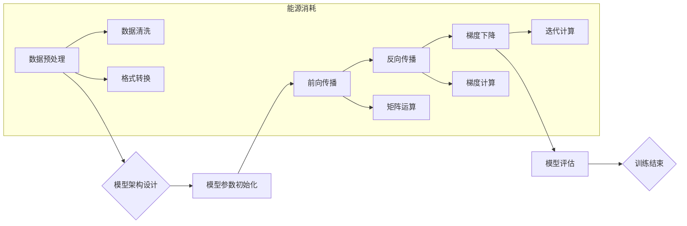

> 大模型, 能源消耗, 碳排放, 优化算法, 硬件架构, 可持续发展, 计算效率

## 1. 背景介绍

近年来，大模型（Large Language Model，LLM）在自然语言处理、计算机视觉、代码生成等领域取得了令人瞩目的成就。这些模型拥有庞大的参数量和强大的学习能力，能够处理复杂的任务并生成高质量的输出。然而，大模型的训练和部署也带来了巨大的能源消耗和碳排放问题，成为该产业面临的新挑战。

随着大模型规模的不断扩大，训练所需的计算资源和能源消耗呈指数级增长。例如，GPT-3 的训练需要消耗数千台GPU的计算能力，持续运行数周，产生的碳排放量相当于数百辆汽车行驶一年的量级。这种高昂的能源成本不仅对环境造成负担，也对大模型的可持续发展构成威胁。

## 2. 核心概念与联系

### 2.1 大模型训练流程

大模型的训练是一个复杂的过程，主要包括以下几个步骤：

1. **数据预处理:** 收集和清洗海量文本数据，将其转换为模型可理解的格式。
2. **模型架构设计:** 根据任务需求设计模型的结构，包括层数、节点数量、激活函数等。
3. **模型参数初始化:** 为模型的参数赋予初始值，通常采用随机初始化的方法。
4. **前向传播:** 将输入数据通过模型层级传递，最终得到输出结果。
5. **反向传播:** 计算输出结果与真实值的误差，并根据误差反向调整模型参数。
6. **梯度下降:** 使用优化算法，例如随机梯度下降（SGD）或Adam，更新模型参数，降低模型误差。
7. **模型评估:** 在测试集上评估模型的性能，并根据评估结果调整训练参数。

### 2.2 能源消耗与训练流程

大模型训练的能源消耗主要集中在以下几个环节：

1. **数据预处理:** 数据清洗、格式转换等操作需要消耗大量的计算资源。
2. **前向传播和反向传播:** 模型参数的更新需要进行大量的矩阵运算，消耗大量的计算能耗。
3. **梯度下降:** 优化算法的迭代过程需要反复计算梯度，消耗大量的计算能耗。

### 2.3 能源消耗与模型规模

模型规模与能源消耗之间存在着密切的正相关关系。随着模型参数量的增加，训练所需的计算资源和能源消耗也会显著增加。

**Mermaid 流程图**



## 3. 核心算法原理 & 具体操作步骤

### 3.1  算法原理概述

大模型训练的核心算法是深度学习算法，其中最常用的算法是反向传播算法。反向传播算法通过计算误差梯度，逐步调整模型参数，使得模型输出与真实值之间的误差最小化。

### 3.2  算法步骤详解

1. **前向传播:** 将输入数据通过模型层级传递，最终得到输出结果。
2. **损失函数计算:** 计算输出结果与真实值的误差，使用损失函数衡量误差的大小。
3. **反向传播:** 计算误差梯度，并反向传播到模型各个层级。
4. **参数更新:** 使用优化算法，例如随机梯度下降（SGD）或Adam，更新模型参数，降低模型误差。

### 3.3  算法优缺点

**优点:**

* 能够学习复杂的非线性关系。
* 具有强大的泛化能力，能够应用于各种任务。

**缺点:**

* 训练过程需要大量的计算资源和时间。
* 容易陷入局部最优解。
* 对训练数据质量要求较高。

### 3.4  算法应用领域

反向传播算法广泛应用于各种深度学习任务，例如：

* 自然语言处理：文本分类、机器翻译、问答系统等。
* 计算机视觉：图像识别、目标检测、图像分割等。
* 语音识别：语音转文本、语音合成等。

## 4. 数学模型和公式 & 详细讲解 & 举例说明

### 4.1  数学模型构建

大模型训练的数学模型主要包括损失函数、优化算法和激活函数。

**损失函数:** 用于衡量模型输出与真实值的误差。常用的损失函数包括均方误差（MSE）、交叉熵损失（Cross-Entropy Loss）等。

**优化算法:** 用于更新模型参数，降低模型误差。常用的优化算法包括随机梯度下降（SGD）、Adam、RMSprop等。

**激活函数:** 用于引入非线性，使得模型能够学习复杂的非线性关系。常用的激活函数包括ReLU、Sigmoid、Tanh等。

### 4.2  公式推导过程

**均方误差损失函数:**

$$
L = \frac{1}{N} \sum_{i=1}^{N} (y_i - \hat{y}_i)^2
$$

其中：

* $L$ 为损失函数值。
* $N$ 为样本数量。
* $y_i$ 为真实值。
* $\hat{y}_i$ 为模型预测值。

**随机梯度下降算法:**

$$
\theta = \theta - \alpha \nabla L(\theta)
$$

其中：

* $\theta$ 为模型参数。
* $\alpha$ 为学习率。
* $\nabla L(\theta)$ 为损失函数关于参数 $\theta$ 的梯度。

### 4.3  案例分析与讲解

假设我们训练一个简单的线性回归模型，用于预测房价。模型输入特征包括房屋面积和房间数量，输出为房价。

我们可以使用均方误差损失函数和随机梯度下降算法进行训练。在训练过程中，模型会不断调整参数，使得预测的房价与真实房价之间的误差最小化。

## 5. 项目实践：代码实例和详细解释说明

### 5.1  开发环境搭建

大模型训练通常需要使用高性能计算平台，例如GPU集群。

### 5.2  源代码详细实现

```python
import tensorflow as tf

# 定义模型
model = tf.keras.Sequential([
    tf.keras.layers.Dense(64, activation='relu', input_shape=(2,)),
    tf.keras.layers.Dense(1)
])

# 定义损失函数和优化器
loss_fn = tf.keras.losses.MeanSquaredError()
optimizer = tf.keras.optimizers.Adam(learning_rate=0.001)

# 训练模型
for epoch in range(10):
    for batch in dataset:
        with tf.GradientTape() as tape:
            predictions = model(batch)
            loss = loss_fn(batch[:, -1], predictions)
        gradients = tape.gradient(loss, model.trainable_variables)
        optimizer.apply_gradients(zip(gradients, model.trainable_variables))

# 保存模型
model.save('house_price_model.h5')
```

### 5.3  代码解读与分析

这段代码定义了一个简单的线性回归模型，并使用随机梯度下降算法进行训练。

* `tf.keras.Sequential` 用于构建模型层级。
* `tf.keras.layers.Dense` 用于定义全连接层。
* `activation='relu'` 指定激活函数为ReLU。
* `input_shape=(2,)` 指定输入特征维度为2。
* `loss_fn` 指定损失函数为均方误差。
* `optimizer` 指定优化器为Adam。
* `for epoch in range(10)` 表示训练10个epoch。
* `for batch in dataset` 表示对训练数据进行批处理训练。
* `tf.GradientTape()` 用于记录梯度信息。
* `optimizer.apply_gradients()` 用于更新模型参数。

### 5.4  运行结果展示

训练完成后，我们可以使用保存的模型进行预测。

## 6. 实际应用场景

大模型在各个领域都有着广泛的应用场景，例如：

* **自然语言处理:** 机器翻译、文本摘要、问答系统、聊天机器人等。
* **计算机视觉:** 图像识别、目标检测、图像分割、视频分析等。
* **语音识别:** 语音转文本、语音合成、语音助手等。
* **代码生成:** 代码自动补全、代码生成、代码翻译等。

## 7. 工具和资源推荐

### 7.1  学习资源推荐

* **书籍:**
    * Deep Learning by Ian Goodfellow, Yoshua Bengio, and Aaron Courville
    * Hands-On Machine Learning with Scikit-Learn, Keras & TensorFlow by Aurélien Géron
* **在线课程:**
    * TensorFlow Tutorials: https://www.tensorflow.org/tutorials
    * Deep Learning Specialization by Andrew Ng: https://www.deeplearning.ai/

### 7.2  开发工具推荐

* **TensorFlow:** https://www.tensorflow.org/
* **PyTorch:** https://pytorch.org/
* **JAX:** https://jax.readthedocs.io/en/latest/

### 7.3  相关论文推荐

* Attention Is All You Need (Vaswani et al., 2017)
* BERT: Pre-training of Deep Bidirectional Transformers for Language Understanding (Devlin et al., 2018)
* GPT-3: Language Models are Few-Shot Learners (Brown et al., 2020)

## 8. 总结：未来发展趋势与挑战

### 8.1  研究成果总结

近年来，大模型在各个领域取得了令人瞩目的成就，展现出强大的学习能力和应用潜力。

### 8.2  未来发展趋势

* **模型规模继续扩大:** 随着计算资源的不断提升，大模型的规模将继续扩大，模型能力将进一步增强。
* **模型架构创新:** 研究人员将探索新的模型架构，例如Transformer变体、混合模型等，以提高模型效率和性能。
* **多模态学习:** 大模型将融合文本、图像、音频等多模态数据，实现更全面的理解和生成能力。
* **可解释性研究:** 研究人员将致力于提高大模型的可解释性，使得模型决策更加透明和可理解。

### 8.3  面临的挑战

* **能源消耗:** 大模型训练和部署的能源消耗巨大，对环境造成负担。
* **数据隐私:** 大模型训练需要海量数据，如何保护数据隐私是一个重要挑战。
* **公平性与偏见:** 大模型可能存在公平性问题和偏见，需要进行相应的调优和改进。

### 8.4  研究展望

未来，大模型研究将继续朝着更安全、更可持续、更公平的方向发展。

## 9. 附录：常见问题与解答

**Q1: 如何降低大模型的能源消耗？**

**A1:**

* 使用更有效的训练算法和优化器。
* 采用混合精度训练，使用低精度数据进行部分计算。
* 利用模型剪枝和量化技术，减少模型参数量。
* 优化硬件架构，提高计算效率。

**Q2: 如何解决大模型的公平性问题？**

**A2:**

* 使用多样化的训练数据，避免数据偏差。
* 开发公平性评估指标，监测模型的公平性。
* 使用公平性约束，引导模型学习公平的决策规则。

**Q3: 如何保护大模型训练的数据隐私？**

**A3:**

* 使用联邦学习等隐私保护技术，避免数据集中化。
* 对敏感数据进行脱敏处理，保护个人隐私。
* 遵守相关数据隐私法规，确保数据安全。


作者：禅与计算机程序设计艺术 / Zen and the Art of Computer Programming 
<end_of_turn>