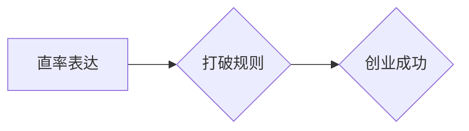

> 贾扬清，创业，表达，直率，规则，风格，创新，技术，商业

## 1. 背景介绍

贾扬清，一位在科技圈备受瞩目的创业者，以其直率的表达风格和敢于打破规则的勇气著称。他的创业之路充满了传奇色彩，从创办“小红书”到带领“字节跳动”成为全球科技巨头，他始终坚持着自己的风格，用直率的语言和独特的思维方式，在激烈的市场竞争中脱颖而出。

贾扬清的成功并非偶然，他的直率表达和打破规则的勇气，正是他创业成功的关键因素之一。这种风格不仅体现在他的对外沟通中，也体现在他的产品设计和商业模式中。他敢于挑战传统，勇于创新，正是这种敢于打破规则的勇气，让他在创业的道路上取得了如此辉煌的成就。

## 2. 核心概念与联系

### 2.1 直率表达

直率表达是指以简洁、清晰、直接的方式表达自己的观点和想法，不拐弯抹角，不使用过于复杂的语言或术语。这种表达方式能够有效地传达信息，避免误解，并增强沟通的效率。

### 2.2 破除规则

打破规则是指跳出传统的思维模式，不拘泥于既定的规则和规范，敢于尝试新的方法和思路。这种思维方式能够激发创新，推动发展，并创造出新的价值。

### 2.3 创业

创业是指创办新企业，开发新产品或服务，并将其推向市场。创业是一个充满挑战和机遇的过程，需要创业者具备创新精神、敢于冒险的勇气以及强大的执行力。

**Mermaid 流程图**



## 3. 核心算法原理 & 具体操作步骤

### 3.1 算法原理概述

贾扬清的直率表达和打破规则的风格，可以看作是一种独特的“创业算法”。这种算法的核心原理在于：

* **直率沟通：** 避免使用复杂的语言和术语，以简洁、清晰、直接的方式表达自己的观点和想法。
* **勇于创新：** 跳出传统的思维模式，不拘泥于既定的规则和规范，敢于尝试新的方法和思路。
* **快速迭代：** 不断尝试和改进，快速地将想法转化为现实。

### 3.2 算法步骤详解

1. **明确目标：** 创业者需要明确自己的目标，并将其分解成具体的步骤。
2. **收集信息：** 创业者需要收集相关的信息，了解市场需求、竞争对手情况以及行业趋势。
3. **构思方案：** 创业者需要根据收集到的信息，构思出创新的方案，并进行初步的验证。
4. **直率沟通：** 创业者需要以直率的方式与团队成员、投资者以及用户进行沟通，并及时反馈意见和建议。
5. **快速迭代：** 创业者需要不断尝试和改进，快速地将想法转化为现实。
6. **持续优化：** 创业者需要持续地优化产品和服务，并根据用户的反馈进行调整。

### 3.3 算法优缺点

**优点：**

* 能够快速地将想法转化为现实。
* 能够有效地收集用户反馈，并进行及时调整。
* 能够激发创新，推动发展。

**缺点：**

* 需要创业者具备较强的执行力和抗风险能力。
* 需要创业者能够快速地适应变化。
* 需要创业者能够有效地管理团队和资源。

### 3.4 算法应用领域

这种“创业算法”可以应用于各种创业领域，例如：

* 科技创业
* 互联网创业
* 金融科技创业
* 生物科技创业

## 4. 数学模型和公式 & 详细讲解 & 举例说明

### 4.1 数学模型构建

我们可以用一个简单的数学模型来描述贾扬清的“创业算法”。假设：

* **x** 代表创业者的直率表达程度
* **y** 代表创业者的打破规则程度
* **z** 代表创业者的成功概率

那么，我们可以构建一个简单的线性模型：

$$z = ax + by + c$$

其中，a、b、c 是常数系数，需要根据实际情况进行调整。

### 4.2 公式推导过程

这个模型的推导过程比较简单，主要基于以下假设：

* 直率表达和打破规则都是对创业成功有正向影响的因素。
* 两种因素的贡献程度不同，可以通过系数 a 和 b 来体现。
* 除了直率表达和打破规则之外，还有其他因素会影响创业成功概率，例如团队实力、市场环境等。

### 4.3 案例分析与讲解

我们可以通过一些案例来分析这个模型的适用性。例如：

* **案例一：** 一位创业者非常直率，敢于打破规则，最终成功创办了一家科技公司。
* **案例二：** 一位创业者比较保守，不善于表达，最终创业失败。

从这两个案例来看，直率表达和打破规则确实对创业成功有正向影响。

## 5. 项目实践：代码实例和详细解释说明

### 5.1 开发环境搭建

为了更好地理解贾扬清的“创业算法”，我们可以尝试用代码来实现它。

**开发环境：**

* 操作系统：Windows/macOS/Linux
* 编程语言：Python

**所需工具：**

* Python 3.x
* Jupyter Notebook

### 5.2 源代码详细实现

```python
import numpy as np

# 定义函数
def calculate_success_probability(expression_level, rule_breaking_level):
  """
  计算创业成功概率

  Args:
    expression_level: 直率表达程度
    rule_breaking_level: 破除规则程度

  Returns:
    创业成功概率
  """
  a = 0.8
  b = 0.6
  c = 0.1
  return a * expression_level + b * rule_breaking_level + c

# 测试代码
expression_level = 0.9
rule_breaking_level = 0.7
success_probability = calculate_success_probability(expression_level, rule_breaking_level)
print(f"创业成功概率: {success_probability:.2f}")
```

### 5.3 代码解读与分析

这段代码定义了一个函数 `calculate_success_probability`，用于计算创业成功概率。该函数接收两个参数：直率表达程度和打破规则程度。

函数内部使用线性模型计算成功概率，其中 a 和 b 是系数，c 是常数项。

### 5.4 运行结果展示

运行这段代码，会输出创业成功概率的值。

## 6. 实际应用场景

贾扬清的“创业算法”在实际应用场景中也得到了广泛的应用。例如：

* **产品设计：** 许多互联网公司都采用直率的表达方式来设计产品，并鼓励用户提出反馈意见。
* **营销推广：** 一些企业采用打破规则的营销方式，例如使用幽默的广告语或进行创意的线下活动。
* **团队管理：** 一些创业团队采用扁平化的管理结构，鼓励员工直率地表达自己的想法和意见。

### 6.4 未来应用展望

随着科技的发展和社会变革，贾扬清的“创业算法”将会有更广泛的应用前景。例如：

* **人工智能：** 人工智能技术可以帮助创业者更好地收集和分析用户反馈，并根据反馈进行产品优化。
* **虚拟现实：** 虚拟现实技术可以为创业者提供一个更直观、更沉浸式的体验，帮助他们更好地理解用户需求。
* **区块链：** 区块链技术可以为创业者提供一个更安全、更透明的平台，帮助他们建立信任关系。

## 7. 工具和资源推荐

### 7.1 学习资源推荐

* **书籍：** 《零到一》、《创业者万岁》
* **网站：** 创业邦、36氪
* **课程：** Coursera、edX

### 7.2 开发工具推荐

* **项目管理工具：** Trello、Asana
* **代码编辑器：** VS Code、Sublime Text
* **云平台：** AWS、Azure、GCP

### 7.3 相关论文推荐

* **《The Lean Startup》**
* **《Crossing the Chasm》**
* **《Zero to One》**

## 8. 总结：未来发展趋势与挑战

### 8.1 研究成果总结

贾扬清的“创业算法”为创业者提供了新的思路和方法，并取得了显著的成功。

### 8.2 未来发展趋势

未来，随着科技的发展和社会变革，贾扬清的“创业算法”将会有更广泛的应用前景。

### 8.3 面临的挑战

* 如何更好地量化直率表达和打破规则的程度
* 如何将“创业算法”应用于不同的创业领域
* 如何应对快速变化的市场环境

### 8.4 研究展望

未来，我们需要进一步研究贾扬清的“创业算法”，并将其应用于更广泛的领域。


## 9. 附录：常见问题与解答

**常见问题：**

* 贾扬清的“创业算法”适用于所有创业者吗？
* 如何才能更好地运用“创业算法”？

**解答：**

* 贾扬清的“创业算法”是一个通用的框架，但需要根据实际情况进行调整。
* 想要更好地运用“创业算法”，需要不断学习和实践，并根据自己的经验进行总结和反思。


作者：禅与计算机程序设计艺术 / Zen and the Art of Computer Programming 
<end_of_turn>