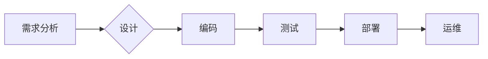
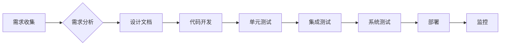

> 规模化生产，流水线，自动化，效率，流程优化，软件开发，DevOps

## 1. 背景介绍

在工业革命的浪潮中，福特汽车公司凭借其创新的流水线生产模式，彻底改变了汽车制造业的格局。福特的流水线生产，将汽车制造过程分解成一系列独立的、高度标准化的操作步骤，并通过机械化和分工协作，实现了高效、快速、低成本的生产。

然而，福特的流水线生产模式不仅仅局限于制造业，其核心思想和实践经验也为软件开发领域提供了宝贵的启示。随着软件开发规模的不断扩大，传统的开发模式已经难以满足快速迭代、高效交付的需求。借鉴福特流水线生产的精髓，我们可以将软件开发流程进行优化，实现规模化生产，提高开发效率和产品质量。

## 2. 核心概念与联系

### 2.1 流水线生产模式

流水线生产模式的核心思想是将生产过程分解成一系列独立的、高度标准化的操作步骤，并通过机械化和分工协作，实现高效、快速、低成本的生产。

**流程图：**



### 2.2 软件开发与流水线生产的联系

将流水线生产模式应用于软件开发，可以将软件开发流程分解成一系列独立的、高度标准化的步骤，例如需求分析、设计、编码、测试、部署和运维。通过自动化工具和流程管控，实现高效、快速、低成本的软件开发。

**软件开发流水线：**



## 3. 核心算法原理 & 具体操作步骤

### 3.1 算法原理概述

软件开发流水线的核心算法原理是基于流程管控和自动化工具的实现。通过将软件开发流程分解成一系列独立的步骤，并使用自动化工具进行执行和监控，可以实现高效、快速、低成本的软件开发。

### 3.2 算法步骤详解

1. **需求收集:** 收集用户需求，并进行整理和分析。
2. **需求分析:** 对收集到的需求进行详细分析，并制定开发方案。
3. **设计文档:** 根据开发方案，编写详细的设计文档，包括系统架构、数据库设计、接口定义等。
4. **代码开发:** 根据设计文档，进行代码开发。
5. **单元测试:** 对开发的代码进行单元测试，确保代码的正确性和可靠性。
6. **集成测试:** 对多个模块的代码进行集成测试，确保模块之间的接口正确。
7. **系统测试:** 对整个系统进行测试，确保系统功能的完整性和性能。
8. **部署:** 将测试通过的代码部署到生产环境。
9. **监控:** 对部署到生产环境的系统进行监控，及时发现和解决问题。

### 3.3 算法优缺点

**优点:**

* **提高效率:** 通过自动化工具和流程管控，可以大幅提高软件开发效率。
* **降低成本:** 通过标准化流程和自动化工具，可以降低软件开发成本。
* **提高质量:** 通过严格的测试流程，可以提高软件质量。
* **缩短交付周期:** 通过流水线化的开发流程，可以缩短软件交付周期。

**缺点:**

* **流程僵化:** 流水线化的开发流程可能会导致流程过于僵化，难以适应快速变化的需求。
* **自动化工具依赖:** 流水线化的开发流程依赖于自动化工具，如果工具出现问题，可能会导致开发流程中断。
* **人员技能要求:** 流水线化的开发流程需要开发人员具备一定的自动化工具和流程管控技能。

### 3.4 算法应用领域

软件开发流水线可以应用于各种软件开发领域，例如：

* **Web 应用开发:** 
* **移动应用开发:** 
* **企业级软件开发:** 
* **游戏开发:** 

## 4. 数学模型和公式 & 详细讲解 & 举例说明

### 4.1 数学模型构建

在软件开发流水线中，我们可以使用数学模型来描述开发流程的效率和成本。例如，我们可以使用以下公式来计算软件开发的平均交付时间：

$$T_{avg} = \frac{T_1 + T_2 + ... + T_n}{n}$$

其中：

* $T_{avg}$ 是软件开发的平均交付时间。
* $T_1, T_2, ..., T_n$ 是每个开发阶段的时间。
* $n$ 是软件开发阶段的总数。

### 4.2 公式推导过程

该公式的推导过程很简单，就是将每个开发阶段的时间加起来，然后除以开发阶段的总数。

### 4.3 案例分析与讲解

假设一个软件开发项目包含以下几个阶段：需求分析、设计、编码、测试和部署，每个阶段的时间分别为：

* 需求分析：2周
* 设计：1周
* 编码：4周
* 测试：2周
* 部署：1周

那么，该项目的平均交付时间为：

$$T_{avg} = \frac{2 + 1 + 4 + 2 + 1}{5} = 2.2 \text{ 周}$$

## 5. 项目实践：代码实例和详细解释说明

### 5.1 开发环境搭建

为了实现软件开发流水线，我们需要搭建一个合适的开发环境。开发环境通常包括以下几个部分：

* **版本控制系统:** 用于管理代码版本，例如 Git。
* **构建工具:** 用于自动化构建软件，例如 Maven 或 Gradle。
* **测试工具:** 用于自动化测试软件，例如 JUnit 或 Selenium。
* **部署工具:** 用于自动化部署软件，例如 Jenkins 或 Ansible。

### 5.2 源代码详细实现

由于篇幅限制，这里只提供一个简单的代码示例，演示如何使用 Jenkins 进行自动化构建和部署。

```yaml
pipeline {
    agent any

    stages {
        stage('Build') {
            steps {
                sh 'mvn clean package'
            }
        }
        stage('Deploy') {
            steps {
                sh 'scp target/*.war user@host:/path/to/deploy'
            }
        }
    }
}
```

### 5.3 代码解读与分析

这段代码定义了一个 Jenkins Pipeline，包含两个阶段：Build 和 Deploy。

* **Build 阶段:** 使用 Maven 命令构建软件。
* **Deploy 阶段:** 使用 scp 命令将构建好的软件部署到远程服务器。

### 5.4 运行结果展示

当 Jenkins 运行该 Pipeline 时，它会自动执行 Build 和 Deploy 阶段，并将构建好的软件部署到远程服务器。

## 6. 实际应用场景

### 6.1 软件开发团队

软件开发团队可以利用流水线生产模式，提高开发效率，降低开发成本，提高软件质量。

### 6.2 大型企业

大型企业可以利用流水线生产模式，实现规模化软件开发，满足其庞大的业务需求。

### 6.3 开源项目

开源项目也可以利用流水线生产模式，提高开发效率，吸引更多开发者参与。

### 6.4 未来应用展望

随着人工智能、云计算等技术的不断发展，软件开发流水线将会更加智能化、自动化和高效化。

## 7. 工具和资源推荐

### 7.1 学习资源推荐

* **书籍:**
    * 《The Phoenix Project: A Novel About IT, DevOps, and Helping Your Business Win》
    * 《Continuous Delivery: Reliable Software Releases through Build, Test, and Deployment Automation》
* **网站:**
    * https://www.atlassian.com/
    * https://www.jenkins.io/

### 7.2 开发工具推荐

* **版本控制系统:** Git
* **构建工具:** Maven, Gradle
* **测试工具:** JUnit, Selenium
* **部署工具:** Jenkins, Ansible

### 7.3 相关论文推荐

* **Continuous Integration and Continuous Delivery: A Systematic Mapping Study**
* **DevOps: A Systematic Literature Review**

## 8. 总结：未来发展趋势与挑战

### 8.1 研究成果总结

本文介绍了福特流水线生产模式的原理和应用，并将其与软件开发进行了联系。通过自动化工具和流程管控，软件开发流水线可以提高开发效率，降低开发成本，提高软件质量。

### 8.2 未来发展趋势

未来，软件开发流水线将会更加智能化、自动化和高效化。人工智能、机器学习等技术将会被更加广泛地应用于软件开发流水线，实现更智能的代码分析、测试和部署。

### 8.3 面临的挑战

软件开发流水线也面临着一些挑战，例如：

* **流程僵化:** 流水线化的开发流程可能会导致流程过于僵化，难以适应快速变化的需求。
* **自动化工具依赖:** 流水线化的开发流程依赖于自动化工具，如果工具出现问题，可能会导致开发流程中断。
* **人员技能要求:** 流水线化的开发流程需要开发人员具备一定的自动化工具和流程管控技能。

### 8.4 研究展望

未来，我们需要继续研究如何克服软件开发流水线面临的挑战，使其更加灵活、可靠和高效。


## 9. 附录：常见问题与解答

### 9.1 什么是软件开发流水线？

软件开发流水线是一种将软件开发流程自动化和标准化的方法，通过一系列的工具和流程，实现高效、快速、低成本的软件开发。

### 9.2 软件开发流水线有哪些优势？

软件开发流水线可以提高开发效率，降低开发成本，提高软件质量，缩短交付周期。

### 9.3 如何搭建软件开发流水线？

搭建软件开发流水线需要选择合适的工具和平台，例如 Jenkins、GitLab CI/CD 等。

### 9.4 软件开发流水线有哪些挑战？

软件开发流水线面临着流程僵化、自动化工具依赖、人员技能要求等挑战。

### 9.5 软件开发流水线有哪些未来发展趋势？

未来，软件开发流水线将会更加智能化、自动化和高效化，人工智能、机器学习等技术将会被更加广泛地应用于软件开发流水线。


作者：禅与计算机程序设计艺术 / Zen and the Art of Computer Programming 
<end_of_turn>