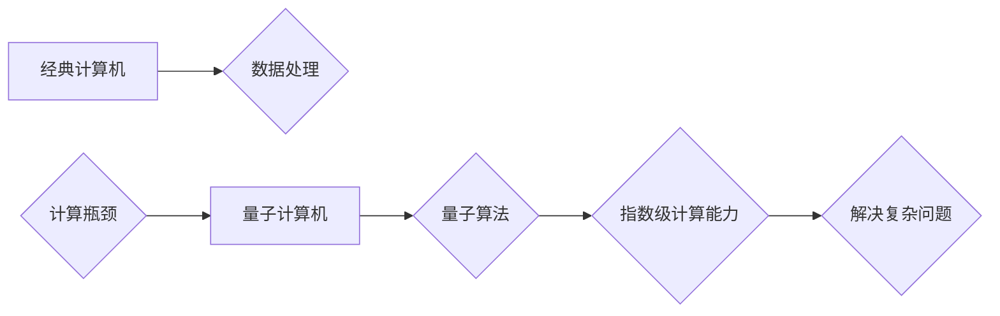

> 量子计算，量子位，叠加态，纠缠态，量子算法，量子霸权，量子计算机

## 1. 背景介绍

随着摩尔定律的放缓，传统计算机的计算能力发展逐渐遇到瓶颈。面对日益复杂的科学问题和海量数据处理需求，人们开始探索新的计算 paradigms。量子计算作为一种颠覆性的计算模式，凭借其独特的量子力学原理，展现出超越经典计算机的巨大潜力。

量子计算的核心在于利用量子力学中的叠加态和纠缠态等特性，构建量子比特（qubit）作为计算单元。与经典计算机的比特只能处于0或1状态不同，量子比特可以同时处于0和1的叠加态，从而实现指数级的计算能力提升。

## 2. 核心概念与联系

### 2.1 量子比特（Qubit）

量子比特是量子计算的基本单元，与经典计算机中的比特类似，但其状态可以是叠加态，即同时处于0和1状态。

### 2.2 叠加态（Superposition）

叠加态是指量子比特可以同时处于多个状态的特性。例如，一个量子比特可以处于0和1的叠加态，其状态可以用一个复数的线性组合来表示。

### 2.3 纠缠态（Entanglement）

纠缠态是指两个或多个量子比特之间相互关联的特性。当两个量子比特纠缠在一起时，即使它们相隔很远，测量一个量子比特的状态也会瞬间影响另一个量子比特的状态。

### 2.4 量子门（Quantum Gate）

量子门是量子计算中的逻辑操作，类似于经典计算机中的逻辑门，但其作用是改变量子比特的状态。常见的量子门包括Hadamard门、CNOT门等。

### 2.5 量子算法（Quantum Algorithm）

量子算法是利用量子力学原理设计的一种算法，其计算效率通常优于经典算法。著名的量子算法包括 Shor 算法、Grover 算法等。

**Mermaid 流程图**



## 3. 核心算法原理 & 具体操作步骤

### 3.1  算法原理概述

Shor 算法是一种用于因数分解的量子算法，其计算效率远超经典算法。它利用量子叠加和纠缠态的特性，将因数分解问题转化为一个可高效解决的量子问题。

### 3.2  算法步骤详解

1. **量子初始化:** 将量子比特初始化为|0⟩状态。
2. **量子门操作:** 使用一系列量子门操作将量子比特置于特定的叠加态。
3. **量子测量:** 对量子比特进行测量，获得结果。
4. **结果分析:** 分析测量结果，并利用经典算法进行进一步处理，最终得到因数分解的结果。

### 3.3  算法优缺点

**优点:**

* 计算效率远超经典算法。
* 能够解决目前经典算法难以解决的复杂问题。

**缺点:**

* 需要构建和控制复杂的量子计算机。
* 算法实现较为复杂，需要深入理解量子力学原理。

### 3.4  算法应用领域

* **密码学:** Shor 算法可以破解基于大数分解的密码系统，对现有的加密技术构成威胁。
* **材料科学:** 因数分解是材料科学中许多重要问题的关键，Shor 算法可以加速材料设计和发现。
* **药物研发:** 量子计算可以加速药物研发过程，例如预测药物与蛋白质的相互作用。

## 4. 数学模型和公式 & 详细讲解 & 举例说明

### 4.1  数学模型构建

Shor 算法的核心是利用量子叠加和量子傅里叶变换来解决因数分解问题。

**量子叠加:**

量子比特可以处于多个状态的叠加态，可以用复数的线性组合来表示。例如，一个量子比特可以处于|0⟩和|1⟩的叠加态：

$$
|\psi\rangle = \alpha|0\rangle + \beta|1\rangle
$$

其中，α和β是复数系数，满足|α|² + |β|² = 1。

**量子傅里叶变换:**

量子傅里叶变换是一种将量子态从基态空间变换到频率空间的变换。它可以将一个量子态的叠加态分解成多个频率分量。

### 4.2  公式推导过程

Shor 算法的具体公式推导过程较为复杂，涉及到量子代数、线性代数等多个数学分支。

### 4.3  案例分析与讲解

假设我们要分解一个整数N，Shor 算法可以将这个问题转化为求解一个模N的周期性函数。通过量子叠加和量子傅里叶变换，可以高效地找到这个周期性函数的周期，从而得到N的因数。

## 5. 项目实践：代码实例和详细解释说明

### 5.1  开发环境搭建

需要使用量子计算软件平台，例如 IBM Quantum Experience、Google Quantum AI 等。

### 5.2  源代码详细实现

由于量子算法的实现较为复杂，这里只提供一个简单的量子门操作的代码示例：

```python
from qiskit import QuantumCircuit, Aer, execute

# 创建一个量子电路
qc = QuantumCircuit(1)

# 应用Hadamard门
qc.h(0)

# 模拟运行电路
simulator = Aer.get_backend('qasm_simulator')
job = execute(qc, simulator, shots=1024)
result = job.result()

# 获取测量结果
counts = result.get_counts(qc)
print(counts)
```

### 5.3  代码解读与分析

这段代码创建了一个量子电路，并应用了Hadamard门操作。Hadamard门可以将量子比特从|0⟩状态变换到|0⟩和|1⟩的叠加态。

### 5.4  运行结果展示

运行结果会显示量子比特测量到的状态，例如：

```
{0: 512, 1: 512}
```

这表明量子比特以50%的概率处于|0⟩状态，以50%的概率处于|1⟩状态。

## 6. 实际应用场景

### 6.1  密码学

Shor 算法可以破解RSA加密算法，这是一种广泛应用于网络安全和电子商务的加密算法。

### 6.2  材料科学

量子计算可以加速材料设计和发现，例如预测新材料的性能和稳定性。

### 6.3  药物研发

量子计算可以加速药物研发过程，例如预测药物与蛋白质的相互作用。

### 6.4  未来应用展望

量子计算在未来将应用于更多领域，例如人工智能、金融建模、优化问题等。

## 7. 工具和资源推荐

### 7.1  学习资源推荐

* **书籍:**
    * "Quantum Computation and Quantum Information" by Michael A. Nielsen and Isaac L. Chuang
    * "Quantum Computing for Computer Scientists" by Noson S. Yanofsky and Mirco A. Mannucci
* **在线课程:**
    * Coursera: "Quantum Computing" by IBM
    * edX: "Quantum Computing Fundamentals" by Microsoft

### 7.2  开发工具推荐

* **Qiskit:** 一个开源的量子计算软件开发平台。
* **Cirq:** 一个由Google开发的量子计算软件开发平台。
* **PennyLane:** 一个用于量子机器学习的开源软件库。

### 7.3  相关论文推荐

* "A polynomial-time algorithm for prime factorization" by Peter W. Shor
* "Quantum computation and quantum information" by Michael A. Nielsen and Isaac L. Chuang

## 8. 总结：未来发展趋势与挑战

### 8.1  研究成果总结

量子计算是一个新兴的领域，近年来取得了显著进展。量子算法的开发、量子硬件的构建、量子软件的开发等方面都取得了突破。

### 8.2  未来发展趋势

* **量子硬件的规模化发展:** 构建更大规模、更稳定、更可靠的量子计算机。
* **量子算法的不断创新:** 开发更多高效的量子算法，解决更复杂的问题。
* **量子软件生态系统的构建:** 发展完善的量子软件开发工具、编程语言和应用平台。

### 8.3  面临的挑战

* **量子硬件的稳定性和可靠性:** 量子比特容易受到环境噪声的影响，需要提高量子硬件的稳定性和可靠性。
* **量子算法的开发难度:** 量子算法的开发难度很大，需要深入理解量子力学原理和算法设计方法。
* **量子软件生态系统的建设:** 需要构建完善的量子软件生态系统，包括开发工具、编程语言、应用平台等。

### 8.4  研究展望

量子计算是一个充满挑战和机遇的领域，未来将继续吸引众多研究者的关注。随着量子硬件的不断发展和量子算法的不断创新，量子计算将逐渐走向实用化，并对人类社会产生深远的影响。

## 9. 附录：常见问题与解答

### 9.1  什么是量子霸权？

量子霸权是指量子计算机在某些特定任务上超越经典计算机的计算能力。

### 9.2  量子计算机何时会实现量子霸权？

目前尚无确切的时间表，但预计在未来几年或几十年内，量子计算机可能会实现量子霸权。

### 9.3  量子计算对社会有哪些影响？

量子计算将对多个领域产生深远影响，例如密码学、材料科学、药物研发、人工智能等。

### 9.4  如何学习量子计算？

可以通过阅读书籍、参加在线课程、参与开源项目等方式学习量子计算。

作者：禅与计算机程序设计艺术 / Zen and the Art of Computer Programming


<end_of_turn>