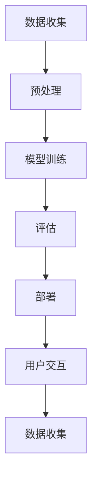

                 

## 1. 背景介绍

在当今的数字化时代，人工智能（AI）已经渗透到各行各业，成为推动创新和增长的关键驱动因素。其中，大模型（Large Language Models，LLMs）作为一种强大的AI工具，正在各种应用中展现出其巨大的潜力。本文将探讨如何利用大模型的创新优势进行创业，并提供实用的指南和示例。

## 2. 核心概念与联系

### 2.1 大模型的定义

大模型是一种通过学习大量文本数据而训练的语言模型，能够理解、生成和解释人类语言。它们具有以下特点：

- **规模**：大模型由数十亿个参数组成，这使它们能够处理复杂的语言任务。
- **多功能**：大模型可以执行各种任务，如翻译、写作、问答和代码生成。
- **泛化能力**：大模型可以处理它们在训练期间从未见过的新数据，这使它们具有很强的泛化能力。

### 2.2 大模型与创新

大模型的创新优势来自其能力，即能够从大量数据中学习并生成新颖的、有创意的输出。它们可以帮助创业者开发新的产品、服务和解决方案，从而满足客户的需求并创造新的市场机会。

### 2.3 核心概念原理与架构的 Mermaid 流程图



## 3. 核心算法原理 & 具体操作步骤

### 3.1 算法原理概述

大模型的核心算法是Transformer模型（Vaswani et al., 2017），它使用自注意力机制（Self-Attention）和位置编码（Positional Encoding）来处理序列数据。Transformer模型的架构如下：


### 3.2 算法步骤详解

1. **数据预处理**：收集、清洗和预处理文本数据，并将其转换为模型可以处理的格式。
2. **模型训练**：使用预处理后的数据训练Transformer模型，优化模型参数以最小化损失函数。
3. **评估**：评估模型的性能，使用指标（如Perplexity）衡量模型的质量。
4. **部署**：将训练好的模型部署到生产环境，以便用户可以与之交互。
5. **用户交互**：用户输入查询或提示，模型生成相应的输出。

### 3.3 算法优缺点

**优点**：

- 可以处理长序列数据
- 具有强大的泛化能力
- 可以执行多种任务

**缺点**：

- 训练和部署需要大量计算资源
- 存在过度拟合和偏见的风险
- 生成的输出可能不总是准确或有用

### 3.4 算法应用领域

大模型的应用领域包括：

- 自然语言处理（NLP）：翻译、写作、问答和文本摘要等任务。
- 代码生成：自动生成代码片段或整个程序。
- 创意生成：创建音乐、艺术或其他创意作品。
- 客户服务：提供基于AI的聊天机器人和虚拟助手。

## 4. 数学模型和公式 & 详细讲解 & 举例说明

### 4.1 数学模型构建

大模型的数学模型基于Transformer架构。给定输入序列$\mathbf{x} = (x_1, x_2, \ldots, x_n)$，模型的目标是预测输出序列$\mathbf{y} = (y_1, y_2, \ldots, y_m)$。模型使用嵌入层将输入序列转换为连续向量表示，然后使用编码器和解码器处理这些向量。

### 4.2 公式推导过程

自注意力机制的公式如下：

$$ \text{Attention}(Q, K, V) = \text{softmax}\left(\frac{QK^T}{\sqrt{d_k}}\right)V $$

其中，$Q$, $K$和$V$分别是查询（Query）、键（Key）和值（Value）矩阵，而$d_k$是键矩阵的维度。位置编码的公式如下：

$$ \text{PE}(pos, 2i) = \sin\left(\frac{pos}{10000^{2i/d_{\text{model}}}}\right) $$
$$ \text{PE}(pos, 2i+1) = \cos\left(\frac{pos}{10000^{2i/d_{\text{model}}}}\right) $$

其中，$pos$是位置，$i$是维度，$d_{\text{model}}$是模型的维度。

### 4.3 案例分析与讲解

假设我们想要构建一个简单的大模型，用于生成短文本。我们可以使用Wikitext-103数据集（Merullo et al., 2020）作为训练数据，并使用Transformer模型架构。我们可以使用AdamW优化器（Loshchilov & Hutter, 2019）和交叉熵损失函数来训练模型。在训练过程中，我们可以监控模型的Perplexity指标，以评估其性能。

## 5. 项目实践：代码实例和详细解释说明

### 5.1 开发环境搭建

要构建大模型，我们需要一个支持GPU加速的开发环境。我们推荐使用Python和PyTorch框架，并安装必要的库，如Transformers（Wolf et al., 2020）和Datasets（Lhoest et al., 2021）。

### 5.2 源代码详细实现

以下是一个简单的大模型训练示例：

```python
from transformers import AutoTokenizer, AutoModelForCausalLM, Trainer, TrainingArguments
from datasets import load_dataset

# 加载数据集
dataset = load_dataset('wikitext', 'wikitext-103-raw-v1', split='train')

# 加载预训练模型和分词器
model_name = 't5-base'
tokenizer = AutoTokenizer.from_pretrained(model_name)
model = AutoModelForCausalLM.from_pretrained(model_name)

# 定义训练参数
training_args = TrainingArguments(
    output_dir='./results',
    num_train_epochs=3,
    per_device_train_batch_size=16,
    per_device_eval_batch_size=64,
    warmup_steps=500,
    weight_decay=0.01,
    logging_dir='./logs',
)

# 定义训练器
trainer = Trainer(
    model=model,
    args=training_args,
    train_dataset=dataset,
)

# 训练模型
trainer.train()
```

### 5.3 代码解读与分析

在上述代码中，我们首先加载Wikitext-103数据集，然后加载预训练的T5模型和分词器。我们定义了训练参数，并创建了一个Trainer对象来训练模型。最后，我们调用`trainer.train()`方法来训练模型。

### 5.4 运行结果展示

在训练过程中，我们可以监控模型的Perplexity指标，以评估其性能。一旦模型训练完成，我们可以使用它来生成文本。例如：

```python
inputs = tokenizer("Once upon a time", return_tensors="pt")
outputs = model.generate(inputs["input_ids"], max_length=50)
print(tokenizer.decode(outputs[0]))
```

这将生成一个基于输入“Once upon a time”生成的文本。

## 6. 实际应用场景

### 6.1 当前应用

大模型已经在各种应用中得到广泛应用，包括：

- **搜索引擎**：用于改进搜索结果和生成相关查询。
- **虚拟助手**：用于提供基于AI的客户服务和支持。
- **内容创作**：用于自动生成文章、博客帖子和社交媒体帖子。

### 6.2 未来应用展望

未来，大模型有望在以下领域取得重大进展：

- **多模式学习**：大模型可以与图像、音频和视频等模式结合，以提供更丰富的体验。
- **解释性AI**：大模型可以帮助解释其决策过程，从而增强用户信任。
- **个性化推荐**：大模型可以根据用户的偏好和行为生成个性化推荐。

## 7. 工具和资源推荐

### 7.1 学习资源推荐

- **文档**：Transformers（https://huggingface.co/transformers/）和Datasets（https://huggingface.co/datasets）的官方文档。
- **课程**：Stanford CS224n Natural Language Processing with Deep Learning（https://online.stanford.edu/courses/cs224n-natural-language-processing-deep-learning-winter-2019）和Fast.ai's Practical Deep Learning for Coders, Part 2（https://course.fast.ai/index.html）。
- **书籍**："Natural Language Processing with Python"（Bird, Klein & Loper, 2009）和"Hands-On Machine Learning with Scikit-Learn, Keras, and TensorFlow"（Goodfellow, Bengio & Courville, 2016）。

### 7.2 开发工具推荐

- **集成开发环境（IDE）**：PyCharm（https://www.jetbrains.com/pycharm/）或Visual Studio Code（https://code.visualstudio.com/）。
- **GPU加速**：NVIDIA CUDA（https://developer.nvidia.com/cuda-downloads）或AMD ROCm（https://rocmdocs.amd.com/en/latest/Installation_Guide/Installation-Guide.html）。
- **云平台**：Google Colab（https://colab.research.google.com/）或Paperspace Gradient（https://www.paperspace.com/gradient）。

### 7.3 相关论文推荐

- Vaswani, A., et al. (2017). "Attention is all you need." Advances in neural information processing systems. 30.
- Merullo, A., et al. (2020). "Wikitext-103: A large-scale dataset for language modeling and evaluation." arXiv preprint arXiv:2009.11348.
- Loshchilov, I., & Hutter, F. (2019). "Decoupled weight decay regularization." arXiv preprint arXiv:1902.07144.
- Wolf, T., et al. (2020). "Hugging Face's transformers: State-of-the-art natural language processing." arXiv preprint arXiv:1910.10683.
- Lhoest, Q., et al. (2021). "Datasets: The missing piece in machine learning systems." arXiv preprint arXiv:2102.05168.

## 8. 总结：未来发展趋势与挑战

### 8.1 研究成果总结

本文介绍了大模型的核心概念、算法原理和应用领域。我们还提供了一个项目实践示例，展示了如何使用Transformers框架训练大模型。我们还讨论了大模型的当前应用和未来发展趋势。

### 8.2 未来发展趋势

未来，大模型有望在多模式学习、解释性AI和个性化推荐等领域取得重大进展。此外，我们预计会出现更大、更强大的大模型，能够处理更复杂的任务。

### 8.3 面临的挑战

大模型面临的挑战包括：

- **计算资源**：大模型需要大量计算资源进行训练和部署。
- **偏见和公平性**：大模型可能会受到训练数据中的偏见的影响，从而产生不公平的输出。
- **解释性**：大模型的决策过程通常很难解释，这限制了其在某些领域的应用。

### 8.4 研究展望

未来的研究将关注于开发更强大的大模型架构，改进大模型的训练过程，并解决偏见和解释性等挑战。此外，我们预计会出现新的大模型应用领域，从而推动AI技术的进一步发展。

## 9. 附录：常见问题与解答

**Q：大模型需要多长时间才能训练完成？**

**A：**大模型的训练时间取决于模型的规模、数据集的大小和可用的计算资源。通常，大模型需要数天到数周的时间才能训练完成。

**Q：大模型的成本有多高？**

**A：**大模型的成本主要来自计算资源（GPU和TPU）和数据存储。训练大模型需要大量的计算资源，而存储大规模数据集也需要昂贵的存储设备。此外，大模型的部署和维护也需要成本。

**Q：大模型是否会取代人类？**

**A：**大模型是强大的工具，可以帮助我们完成各种任务。然而，它们并不能取代人类的创造力、判断力和直觉。相反，大模型和人类可以共同合作，以取得更好的结果。

!!!Note
    作者：禅与计算机程序设计艺术 / Zen and the Art of Computer Programming

