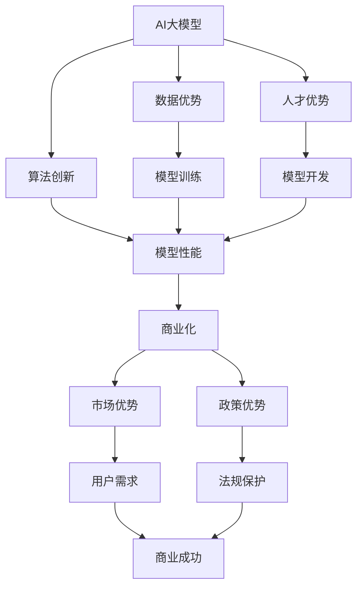

                 

## 1. 背景介绍

当前，人工智能（AI）大模型如火如荼地发展，其在各个领域的应用也日益广泛。然而，如何利用社会优势创业，将AI大模型转化为商业成功，是一个亟待解决的问题。本文将从技术、商业和社会角度出发，探讨AI大模型创业的机遇和挑战，并提供一些实用的建议。

## 2. 核心概念与联系

### 2.1 AI大模型

AI大模型是指具有数十亿甚至数千亿参数的深度学习模型，能够处理大规模、复杂的数据，并从中学习到丰富的表示和特征。它们的能力和泛化性远超小模型，可以应用于各种任务，如自然语言处理、图像和视频理解、语音识别等。

### 2.2 社会优势

社会优势指的是企业在市场、政策、文化等方面的有利条件。在AI大模型创业中，社会优势包括但不限于：

- **数据优势**：拥有大量、高质量的数据，可以帮助模型训练和优化。
- **人才优势**：拥有顶尖的AI人才，能够设计和开发先进的大模型。
- **市场优势**：拥有庞大的用户群和市场需求，可以快速推广和商业化大模型。
- **政策优势**：在政策和法规方面拥有有利条件，可以保护知识产权和市场地位。

下图展示了AI大模型创业中技术、商业和社会因素的关系：



## 3. 核心算法原理 & 具体操作步骤

### 3.1 算法原理概述

AI大模型的核心是深度学习算法，如transformer模型、生成式对抗网络（GAN）和自监督学习等。这些算法通过学习数据的表示和特征，实现了强大的泛化能力。

### 3.2 算法步骤详解

1. **数据收集和预处理**：收集大量、高质量的数据，并对其进行预处理，如清洗、标注和分割。
2. **模型架构设计**：设计深度学习模型的架构，如选择合适的层数、激活函数和优化器。
3. **模型训练**：使用收集的数据训练模型，并调整超参数以优化模型性能。
4. **模型评估**：评估模型的性能，如准确率、精确度和召回率等指标。
5. **模型部署**：将训练好的模型部署到生产环境，并监控其性能和稳定性。

### 3.3 算法优缺点

**优点**：

- 具有强大的泛化能力，可以应用于各种任务。
- 可以学习复杂的表示和特征，提高模型的性能和鲁棒性。
- 可以通过增大模型规模和数据量来提高性能。

**缺点**：

- 训练大模型需要大量的计算资源和时间。
- 存在过拟合和泛化不好的风险。
- 模型的解释性和可靠性有待提高。

### 3.4 算法应用领域

AI大模型的应用领域非常广泛，包括自然语言处理、图像和视频理解、语音识别、推荐系统、自动驾驶等。它们可以帮助企业提高效率、改善用户体验和创造新的商业机会。

## 4. 数学模型和公式 & 详细讲解 & 举例说明

### 4.1 数学模型构建

AI大模型的数学模型通常基于深度学习框架构建，如TensorFlow和PyTorch。模型的参数通过梯度下降等优化算法进行调整，以最小化损失函数。

### 4.2 公式推导过程

假设我们要构建一个简单的全连接神经网络模型，其数学表达式如下：

$$y = \sigma(wx + b)$$

其中，$y$是输出，$\sigma$是激活函数，如ReLU或sigmoid，$w$和$b$是模型的权重和偏置项，$x$是输入。

模型的损失函数可以表示为：

$$L = -\frac{1}{N}\sum_{i=1}^{N}y_{i}\log(\hat{y}_{i}) + (1 - y_{i})\log(1 - \hat{y}_{i})$$

其中，$N$是样本数，$y_{i}$是真实标签，$\hat{y}_{i}$是模型预测的输出。

模型的参数可以通过梯度下降等优化算法进行调整，以最小化损失函数：

$$\theta_{t+1} = \theta_{t} - \eta\nabla L(\theta_{t})$$

其中，$\theta$表示模型的参数，$t$表示迭代次数，$\eta$表示学习率。

### 4.3 案例分析与讲解

例如，我们要构建一个简单的二分类模型，用于预测用户是否点击广告。我们可以使用sigmoid激活函数和交叉熵损失函数构建模型。模型的输入是用户的特征，如年龄、性别和浏览历史等。模型的输出是点击概率。我们可以使用随机梯度下降（SGD）等优化算法训练模型，并调整学习率和其他超参数以优化模型性能。

## 5. 项目实践：代码实例和详细解释说明

### 5.1 开发环境搭建

要构建AI大模型，需要搭建一个完善的开发环境。环境中应包含以下组件：

- **硬件**：高性能的CPU、GPU和内存，以支持大规模模型的训练和推理。
- **软件**：深度学习框架（如TensorFlow或PyTorch）、数据处理库（如Pandas和NumPy）、可视化库（如Matplotlib和Seaborn）等。
- **数据存储**：大容量的存储设备，用于存储大规模的数据集。

### 5.2 源代码详细实现

以下是一个简单的全连接神经网络模型的Python实现示例：

```python
import numpy as np
import tensorflow as tf

# 定义模型参数
n_input = 10  # 输入特征数
n_output = 1  # 输出特征数
n_hidden = 50  # 隐藏层神经元数

# 定义模型架构
X = tf.placeholder(tf.float32, [None, n_input])
Y = tf.placeholder(tf.float32, [None, n_output])

W1 = tf.Variable(tf.random.normal([n_input, n_hidden]))
b1 = tf.Variable(tf.zeros([n_hidden]))
h1 = tf.nn.relu(tf.matmul(X, W1) + b1)

W2 = tf.Variable(tf.random.normal([n_hidden, n_output]))
b2 = tf.Variable(tf.zeros([n_output]))
y = tf.nn.sigmoid(tf.matmul(h1, W2) + b2)

# 定义损失函数和优化器
loss = tf.reduce_mean(tf.nn.sigmoid_cross_entropy_with_logits(logits=y, labels=Y))
optimizer = tf.train.GradientDescentOptimizer(learning_rate=0.01).minimize(loss)

# 训练模型
with tf.Session() as sess:
    sess.run(tf.global_variables_initializer())
    for epoch in range(1000):
        _, l = sess.run([optimizer, loss], feed_dict={X: X_train, Y: Y_train})
        if epoch % 100 == 0:
            print("Epoch %d, Loss: %f" % (epoch, l))
```

### 5.3 代码解读与分析

上述代码定义了一个简单的全连接神经网络模型，用于二分类任务。模型的输入是10个特征，输出是一个概率值，表示样本属于正类的概率。模型使用ReLU激活函数和sigmoid激活函数，交叉熵损失函数和梯度下降优化器。模型的训练过程使用了TensorFlow的会话（session）机制，并打印了每个epoch的损失值。

### 5.4 运行结果展示

训练好的模型可以用于预测新样本的类别。以下是一个示例：

```python
# 预测新样本的类别
x_test = np.array([[0.1, 0.2, 0.3, 0.4, 0.5, 0.6, 0.7, 0.8, 0.9, 1.0]])
y_pred = sess.run(y, feed_dict={X: x_test})
print("Predicted class: %d" % (y_pred[0, 0] > 0.5))
```

## 6. 实际应用场景

### 6.1 当前应用

AI大模型在各个领域都有广泛的应用，如：

- **自然语言处理**：用于机器翻译、文本生成、问答系统等。
- **图像和视频理解**：用于图像分类、目标检测、视频分析等。
- **语音识别**：用于语音转写、语音助手等。
- **推荐系统**：用于个性化推荐、广告推荐等。
- **自动驾驶**：用于感知、决策和控制等。

### 6.2 未来应用展望

未来，AI大模型的应用将更加广泛和深入，如：

- **生物医学**：用于疾病诊断、药物发现、基因组学等。
- **金融**：用于风险评估、交易预测、欺诈检测等。
- **能源**：用于需求预测、网络优化、故障检测等。
- **制造**：用于质量控制、维护预测、设计优化等。
- **城市管理**：用于交通优化、环境监测、公共服务等。

## 7. 工具和资源推荐

### 7.1 学习资源推荐

- **在线课程**：Coursera、Udacity、edX等平台上的AI和深度学习课程。
- **书籍**："深度学习"（Goodfellow、Bengio和Courville著）、"自然语言处理导论"（ Jurafsky和Martin著）等。
- **论文**：arXiv等学术期刊上的最新AI和深度学习论文。

### 7.2 开发工具推荐

- **深度学习框架**：TensorFlow、PyTorch、Keras等。
- **数据处理库**：Pandas、NumPy、SciPy等。
- **可视化库**：Matplotlib、Seaborn、Plotly等。
- **GPU加速**：NVIDIA CUDA、 cuDNN等。

### 7.3 相关论文推荐

- "Attention is All You Need"（Vaswani等人著，2017年）
- "BERT: Pre-training of Deep Bidirectional Transformers for Language Understanding"（Devlin等人著，2018年）
- "DALL-E: Generating Images from Textual Descriptions"（Ramesh等人著，2021年）
- "Transformers: State-of-the-Art Natural Language Processing"（Lample和Conneau著，2019年）

## 8. 总结：未来发展趋势与挑战

### 8.1 研究成果总结

AI大模型在各个领域取得了显著的成果，如机器翻译、图像分类、语音识别等。它们的性能和泛化能力远超小模型，可以应用于各种任务。

### 8.2 未来发展趋势

未来，AI大模型的发展趋势包括：

- **模型规模扩大**：模型的参数数量将继续增加，以提高性能和泛化能力。
- **多模式学习**：模型将能够处理多种模式的数据，如文本、图像和音频等。
- **自监督学习**：模型将能够从未标注的数据中学习表示和特征。
- **生成式模型**：模型将能够生成新的数据，如图像、文本和音乐等。

### 8.3 面临的挑战

AI大模型面临的挑战包括：

- **计算资源**：训练大模型需要大量的计算资源和时间。
- **数据隐私**：大模型需要大量的数据，但收集和使用数据可能会侵犯隐私。
- **解释性**：大模型的决策过程通常是不透明的，难以解释。
- **可靠性**：大模型可能会出现意想不到的行为，如过拟合和泛化不佳。

### 8.4 研究展望

未来的研究方向包括：

- **模型压缩**：开发新的技术，以减小模型的规模和计算成本。
- **数据增强**：开发新的技术，以增强模型的泛化能力。
- **多模式学习**：开发新的技术，以处理多种模式的数据。
- **自监督学习**：开发新的技术，以从未标注的数据中学习表示和特征。

## 9. 附录：常见问题与解答

**Q1：什么是AI大模型？**

A1：AI大模型是指具有数十亿甚至数千亿参数的深度学习模型，能够处理大规模、复杂的数据，并从中学习到丰富的表示和特征。

**Q2：AI大模型有哪些优缺点？**

A2：AI大模型的优点包括具有强大的泛化能力，可以学习复杂的表示和特征，提高模型的性能和鲁棒性。缺点包括训练大模型需要大量的计算资源和时间，存在过拟合和泛化不好的风险，模型的解释性和可靠性有待提高。

**Q3：AI大模型有哪些应用领域？**

A3：AI大模型的应用领域非常广泛，包括自然语言处理、图像和视频理解、语音识别、推荐系统、自动驾驶等。

**Q4：如何构建AI大模型？**

A4：构建AI大模型需要收集大量、高质量的数据，设计深度学习模型的架构，训练模型，评估模型的性能，并部署模型到生产环境。

**Q5：AI大模型的未来发展趋势是什么？**

A5：未来，AI大模型的发展趋势包括模型规模扩大、多模式学习、自监督学习和生成式模型。

## 作者：禅与计算机程序设计艺术 / Zen and the Art of Computer Programming

