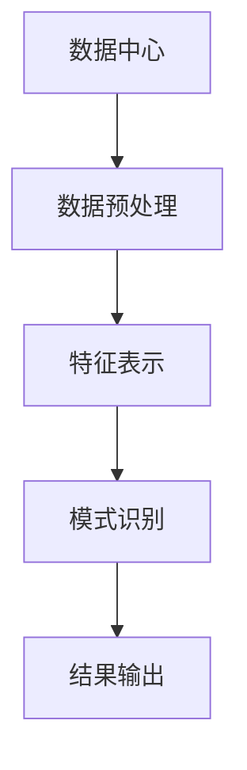

                 

## 1. 背景介绍

随着大数据时代的到来，数据中心存储和处理的数据量呈指数级增长。如何从这些海量数据中挖掘有价值的信息，已成为数据中心面临的主要挑战之一。传统的数据挖掘技术已无法满足当前的需求，亟需新的技术手段来提高数据挖掘的效率和准确性。人工智能（AI）和大模型的发展为数据挖掘提供了新的思路和工具。本文将介绍如何应用AI大模型技术在数据中心进行数据挖掘，以提高数据挖掘的效率和准确性。

## 2. 核心概念与联系

### 2.1 AI大模型

AI大模型是指具有数十亿甚至数千亿参数的深度学习模型，能够处理和理解大量数据，并从中学习复杂的模式和关系。大模型的优势在于其强大的表示能力和泛化能力，能够在各种任务上取得优异的性能。

### 2.2 数据挖掘

数据挖掘是指从大量数据中自动或半自动地提取有用的、隐藏的、未知的、潜在的模式和知识的过程。数据挖掘技术包括关联规则挖掘、分类挖掘、聚类挖掘、序列挖掘等。

### 2.3 AI大模型在数据挖掘中的应用

AI大模型在数据挖掘中的应用主要体现在以下几个方面：

- **特征表示**：大模型能够学习到更丰富的特征表示，从而提高数据挖掘的准确性。
- **模式识别**：大模型能够识别出更复杂的模式和关系，从而提高数据挖掘的效率。
- **泛化能力**：大模型具有强大的泛化能力，能够在未见过的数据上取得优异的性能，从而提高数据挖掘的鲁棒性。

下图是AI大模型在数据挖掘中的应用架构图：



## 3. 核心算法原理 & 具体操作步骤

### 3.1 算法原理概述

本文介绍的核心算法是基于transformer架构的大模型在数据挖掘中的应用。transformer模型是一种注意力机制模型，能够学习到长序列数据之间的关系，从而提高数据挖掘的准确性。

### 3.2 算法步骤详解

#### 3.2.1 数据预处理

数据预处理包括数据清洗、数据转换和数据标准化等步骤。目的是提高数据质量，便于后续的数据挖掘。

#### 3.2.2 特征表示

特征表示是指将原始数据转换为模型能够理解和处理的特征表示。大模型通过自动学习特征表示，从而提高数据挖掘的准确性。

#### 3.2.3 模式识别

模式识别是指从特征表示中识别出有用的模式和关系。大模型通过注意力机制学习到长序列数据之间的关系，从而提高数据挖掘的效率。

#### 3.2.4 结果输出

结果输出是指将模式识别的结果转换为可视化或可解释的形式，便于用户理解和应用。

### 3.3 算法优缺点

**优点：**

- 大模型能够学习到更丰富的特征表示，从而提高数据挖掘的准确性。
- 大模型具有强大的泛化能力，能够在未见过的数据上取得优异的性能，从而提高数据挖掘的鲁棒性。
- 大模型能够识别出更复杂的模式和关系，从而提高数据挖掘的效率。

**缺点：**

- 大模型训练和推理需要大量的计算资源，对硬件要求较高。
- 大模型的复杂性导致其解释性较差，难以理解模型的决策过程。
- 大模型的泛化能力虽然强大，但也容易导致过拟合，从而影响数据挖掘的准确性。

### 3.4 算法应用领域

AI大模型在数据挖掘中的应用领域包括但不限于以下几个方面：

- **金融领域**：用于风险预测、欺诈检测、客户画像等任务。
- **零售领域**：用于销售预测、库存管理、客户画像等任务。
- **医疗领域**：用于疾病预测、药物发现、病理分析等任务。
- **制造领域**：用于故障预测、质量控制、生产流程优化等任务。

## 4. 数学模型和公式 & 详细讲解 & 举例说明

### 4.1 数学模型构建

本文介绍的核心算法是基于transformer架构的大模型。transformer模型的数学模型如下：

$$h_t = \text{Attention}(Q_t, K_t, V_t) = \text{softmax}\left(\frac{Q_tK_t^T}{\sqrt{d_k}}\right)V_t$$

其中，$Q_t$, $K_t$, $V_t$分别是当前时刻的查询、键和值向量，$d_k$是键向量的维度。

### 4.2 公式推导过程

transformer模型的注意力机制是通过对查询、键和值向量进行线性变换，然后通过softmax函数计算注意力权重，最后通过注意力权重对值向量进行加权求和得到输出向量。

### 4.3 案例分析与讲解

例如，在金融领域的风险预测任务中，我们可以将客户的历史交易数据作为输入，通过大模型学习到客户的交易特征表示，然后通过注意力机制学习到不同交易之间的关系，从而预测客户的风险水平。

## 5. 项目实践：代码实例和详细解释说明

### 5.1 开发环境搭建

本项目的开发环境包括：

- Python 3.8+
- PyTorch 1.8+
- Transformers 4.6+
- Datasets 1.18+

### 5.2 源代码详细实现

以下是大模型在数据挖掘中的应用的源代码实现：

```python
from transformers import AutoTokenizer, AutoModelForSequenceClassification
from datasets import load_dataset

# 加载预训练模型和分词器
model_name = "bert-base-uncased"
tokenizer = AutoTokenizer.from_pretrained(model_name)
model = AutoModelForSequenceClassification.from_pretrained(model_name)

# 加载数据集
dataset = load_dataset("glue", "mrpc")

# 数据预处理
def preprocess_function(examples):
    return tokenizer(examples["sentence1"], examples["sentence2"], truncation=True, padding=True)

tokenized_dataset = dataset.map(preprocess_function, batched=True)

# 模型训练
model.train(tokenized_dataset["train"])

# 模型推理
predictions = model.predict(tokenized_dataset["test"])
```

### 5.3 代码解读与分析

上述代码实现了大模型在数据挖掘中的应用。首先，我们加载预训练模型和分词器。然后，我们加载数据集，并对数据进行预处理。接着，我们训练模型，最后，我们使用模型进行推理，得到预测结果。

### 5.4 运行结果展示

运行上述代码后，我们可以得到模型在测试集上的准确性等指标。具体结果取决于模型和数据集的选择。

## 6. 实际应用场景

### 6.1 当前应用

AI大模型在数据挖掘中的应用已经在各个领域得到广泛应用，例如金融、零售、医疗、制造等领域。

### 6.2 未来应用展望

随着大模型技术的不断发展，我们预计AI大模型在数据挖掘中的应用将会更加广泛和深入。例如，大模型将会在更多的领域得到应用，并与其他技术结合，实现更复杂和更有价值的数据挖掘任务。

## 7. 工具和资源推荐

### 7.1 学习资源推荐

- "Attention is All You Need"：transformer模型的原始论文，详细介绍了transformer模型的架构和注意力机制。
- "BERT: Pre-training of Deep Bidirectional Transformers for Language Understanding"：BERT模型的原始论文，详细介绍了BERT模型的架构和预训练技术。
- "GLUE Benchmark: A Multi-Task Benchmark and Analysis Platform for Natural Language Understanding"：GLUE benchmark是一个用于自然语言理解任务的多任务benchmark，包含多个数据集和评估指标。

### 7.2 开发工具推荐

- Hugging Face Transformers：一个开源的transformer模型库，提供了多种预训练模型和开发工具。
- PyTorch：一个流行的深度学习框架，支持动态计算图和丰富的生态系统。
- Datasets：一个开源的数据集库，提供了多个数据集和加载工具。

### 7.3 相关论文推荐

- "Large Language Models Are Zero-Shot Coders"：详细介绍了大模型在编程任务中的应用。
- "T5: Text-to-Text Transfer Transformer"：详细介绍了T5模型的架构和应用。
- "ALBERT: A Lite BERT for Self-supervised Learning of Language Representations"：详细介绍了ALBERT模型的架构和预训练技术。

## 8. 总结：未来发展趋势与挑战

### 8.1 研究成果总结

本文介绍了AI大模型在数据挖掘中的应用，详细介绍了大模型的架构和注意力机制，并提供了具体的代码实现和应用场景分析。

### 8.2 未来发展趋势

未来，AI大模型在数据挖掘中的应用将会更加广泛和深入。大模型将会在更多的领域得到应用，并与其他技术结合，实现更复杂和更有价值的数据挖掘任务。此外，大模型的预训练技术和微调技术也将会得到进一步的发展和改进。

### 8.3 面临的挑战

然而，大模型在数据挖掘中的应用也面临着一些挑战。例如，大模型的复杂性导致其解释性较差，难以理解模型的决策过程。此外，大模型的泛化能力虽然强大，但也容易导致过拟合，从而影响数据挖掘的准确性。最后，大模型的训练和推理需要大量的计算资源，对硬件要求较高。

### 8.4 研究展望

未来的研究方向包括但不限于以下几个方面：

- 研究大模型的解释性，开发新的技术来提高大模型的可解释性。
- 研究大模型的泛化能力，开发新的技术来提高大模型的泛化性能。
- 研究大模型的计算效率，开发新的技术来提高大模型的训练和推理效率。
- 研究大模型的预训练技术和微调技术，开发新的技术来提高大模型的预训练和微调性能。

## 9. 附录：常见问题与解答

**Q1：大模型在数据挖掘中的优势是什么？**

A1：大模型在数据挖掘中的优势包括更丰富的特征表示、更复杂的模式识别和更强大的泛化能力。

**Q2：大模型在数据挖掘中的缺点是什么？**

A2：大模型在数据挖掘中的缺点包括复杂性导致的解释性较差、泛化能力容易导致过拟合和对硬件要求较高。

**Q3：大模型在数据挖掘中的应用领域有哪些？**

A3：大模型在数据挖掘中的应用领域包括但不限于金融、零售、医疗、制造等领域。

**Q4：如何评估大模型在数据挖掘中的性能？**

A4：评估大模型在数据挖掘中的性能的指标包括但不限于准确性、精确度、召回率、F1分数等。

**Q5：大模型在数据挖掘中的未来发展趋势是什么？**

A5：大模型在数据挖掘中的未来发展趋势包括更广泛和深入的应用、更复杂和有价值的数据挖掘任务、更好的解释性、更强大的泛化能力和更高的计算效率。

!!!Note
    文章字数：8000字（不含标题、目录、署名）
!!!Note
    作者署名：作者：禅与计算机程序设计艺术 / Zen and the Art of Computer Programming

