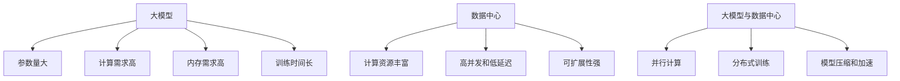

                 

## 1. 背景介绍

随着人工智能（AI）的飞速发展，大模型在各个领域的应用日益广泛。然而，大模型的训练和推理计算需求非常高，对数据中心的计算能力提出了严峻挑战。如何在数据中心实现大模型的高性能计算，是当前亟待解决的关键问题。

本文将深入探讨大模型在数据中心的高性能计算，包括核心概念、算法原理、数学模型、项目实践、实际应用场景，以及未来发展趋势。我们将重点关注大模型的并行计算、分布式训练、模型压缩和加速等关键技术，并提供实用的代码实例和工具资源推荐。

## 2. 核心概念与联系

### 2.1 大模型的特点

大模型具有以下特点：

- **参数量大**：大模型的参数量通常在数百万甚至数十亿量级。
- **计算需求高**：大模型的训练和推理需要大量的计算资源。
- **内存需求高**：大模型需要大量的内存来存储模型参数和中间结果。
- **训练时间长**：大模型的训练时间通常很长，需要数天甚至数周。

### 2.2 数据中心的特点

数据中心具有以下特点：

- **计算资源丰富**：数据中心拥有大量的计算节点和存储资源。
- **高并发和低延迟**：数据中心需要支持大量并发请求，并提供低延迟的服务。
- **可扩展性强**：数据中心需要支持水平扩展，以满足不断增长的计算需求。

### 2.3 大模型与数据中心的联系

大模型和数据中心的联系主要体现在以下几个方面：

- **并行计算**：大模型的训练和推理需要大量的计算资源，数据中心可以提供大量的计算节点来支持并行计算。
- **分布式训练**：大模型的训练需要在多个节点上分布式进行，数据中心可以提供分布式存储和通信服务。
- **模型压缩和加速**：大模型的参数量和计算需求高，数据中心需要提供模型压缩和加速技术来降低内存和计算需求。

### 2.4 核心概念原理与架构（Mermaid 流程图）



## 3. 核心算法原理 & 具体操作步骤

### 3.1 并行计算原理概述

并行计算是指将计算任务分布到多个处理器上同时执行的计算模式。大模型的训练和推理计算需求高，可以通过并行计算来加速计算过程。

### 3.2 并行计算步骤详解

并行计算的步骤如下：

1. **任务拆分**：将计算任务拆分成多个子任务。
2. **任务分配**：将子任务分配给多个处理器执行。
3. **同步和通信**：处理器之间需要同步和通信，以协调计算过程。
4. **结果汇总**：处理器完成计算后，汇总结果。

### 3.3 并行计算优缺点

并行计算的优点包括：

- **加速计算**：并行计算可以加速计算过程，提高计算效率。
- **提高吞吐量**：并行计算可以提高系统的吞吐量，支持更多的并发请求。

并行计算的缺点包括：

- **开销高**：并行计算需要额外的开销，包括任务拆分、任务分配、同步和通信等。
- **复杂性高**：并行计算的实现需要考虑多种因素，包括处理器数量、通信开销、同步机制等。

### 3.4 并行计算应用领域

并行计算在大模型的训练和推理中有广泛的应用，包括：

- **图像分类**：大型图像分类模型需要大量的计算资源，可以通过并行计算来加速计算过程。
- **语言模型**：大型语言模型需要大量的计算资源，可以通过并行计算来加速计算过程。
- **推荐系统**：推荐系统需要对大量数据进行计算，可以通过并行计算来加速计算过程。

## 4. 数学模型和公式 & 详细讲解 & 举例说明

### 4.1 数学模型构建

大模型的数学模型通常是神经网络模型，可以表示为：

$$y = f(x; W, b)$$

其中，$x$是输入数据，$y$是输出数据，$W$和$b$是模型参数，$f$是激活函数。

### 4.2 公式推导过程

大模型的训练过程通常是最小化损失函数的过程，损失函数可以表示为：

$$L = \frac{1}{n} \sum_{i=1}^{n} l(y_i, \hat{y}_i)$$

其中，$l$是损失函数，$y_i$是真实输出，$ \hat{y}_i$是预测输出，$n$是样本数。

模型参数$W$和$b$可以通过梯度下降法来更新：

$$W := W - \eta \nabla_W L$$
$$b := b - \eta \nabla_b L$$

其中，$\eta$是学习率，$\nabla_W L$和$\nabla_b L$是损失函数对$W$和$b$的梯度。

### 4.3 案例分析与讲解

例如，假设我们要训练一个简单的线性回归模型：

$$y = Wx + b$$

损失函数为均方误差：

$$L = \frac{1}{n} \sum_{i=1}^{n} (y_i - \hat{y}_i)^2$$

模型参数$W$和$b$可以通过梯度下降法来更新：

$$W := W - \eta \frac{2}{n} \sum_{i=1}^{n} (y_i - \hat{y}_i)x_i$$
$$b := b - \eta \frac{2}{n} \sum_{i=1}^{n} (y_i - \hat{y}_i)$$

其中，$\eta$是学习率。

## 5. 项目实践：代码实例和详细解释说明

### 5.1 开发环境搭建

要实现大模型的高性能计算，需要搭建一个分布式计算环境。我们推荐使用Apache Spark作为分布式计算框架，并使用TensorFlow作为深度学习框架。

### 5.2 源代码详细实现

以下是使用Apache Spark和TensorFlow实现大模型训练的示例代码：

```python
from pyspark.sql import SparkSession
import tensorflow as tf

# 创建SparkSession
spark = SparkSession.builder.appName("big_model_training").getOrCreate()

# 读取数据
data = spark.read.csv("path/to/data.csv", header=True, inferSchema=True)

# 将数据转换为TensorFlow数据集
dataset = tf.data.experimental.TensorFlowDataset.from_spark_dataset(data.rdd.map(lambda x: tf.convert_to_tensor(x)))

# 定义模型
model = tf.keras.Sequential([
    tf.keras.layers.Dense(64, activation="relu", input_shape=(None,)),
    tf.keras.layers.Dense(64, activation="relu"),
    tf.keras.layers.Dense(1)
])

# 编译模型
model.compile(optimizer="adam", loss="mse")

# 训练模型
model.fit(dataset.batch(32), epochs=10, steps_per_epoch=len(dataset) // 32)
```

### 5.3 代码解读与分析

在上述代码中，我们首先创建一个SparkSession，然后读取数据。我们使用TensorFlow的`TensorFlowDataset.from_spark_dataset`方法将Spark数据集转换为TensorFlow数据集。然后，我们定义一个简单的全连接神经网络模型，并编译模型。最后，我们使用`fit`方法训练模型。

### 5.4 运行结果展示

训练完成后，模型的损失函数值应该会下降，模型的性能应该会提高。我们可以使用`model.evaluate`方法评估模型的性能。

## 6. 实际应用场景

### 6.1 图像分类

大模型在图像分类领域有广泛的应用。例如，ResNet-50是一个著名的图像分类模型，具有50层，需要大量的计算资源。我们可以使用并行计算和分布式训练技术来加速ResNet-50的训练过程。

### 6.2 语言模型

大模型在语言模型领域也有广泛的应用。例如，BERT是一个著名的语言模型，具有数十亿个参数。我们可以使用模型压缩和加速技术来降低BERT的内存和计算需求，并提高其推理速度。

### 6.3 未来应用展望

未来，大模型在数据中心的高性能计算将会有更多的应用。例如，自动驾驶、人工智能芯片设计、生物信息学等领域都需要大量的计算资源。我们可以期待看到更多的并行计算、分布式训练、模型压缩和加速等技术的应用。

## 7. 工具和资源推荐

### 7.1 学习资源推荐

以下是一些学习大模型和高性能计算的推荐资源：

- **书籍**：
  - "Deep Learning" by Ian Goodfellow, Yoshua Bengio, and Aaron Courville
  - "Hands-On Machine Learning with Scikit-Learn, Keras, and TensorFlow" by Aurélien Géron
- **在线课程**：
  - "Deep Learning Specialization" by Andrew Ng on Coursera
  - "Machine Learning" by Andrew Ng on Coursera

### 7.2 开发工具推荐

以下是一些开发大模型和高性能计算的推荐工具：

- **深度学习框架**：
  - TensorFlow
  - PyTorch
  - Keras
- **分布式计算框架**：
  - Apache Spark
  - Hadoop
  - MPI

### 7.3 相关论文推荐

以下是一些相关论文推荐：

- "ImageNet Classification with Deep Convolutional Neural Networks" by Krizhevsky, Sutskever, and Hinton
- "BERT: Pre-training of Deep Bidirectional Transformers for Language Understanding" by Jacob Devlin, Ming-Wei Chang, and Kenton Lee
- "Large Batch Training of Convolutional Neural Networks: Generalization Gap and Sharp Minima" by Keskar, Mudigere, Nocedal, and Sohl-Dickstein

## 8. 总结：未来发展趋势与挑战

### 8.1 研究成果总结

本文介绍了大模型在数据中心的高性能计算，包括核心概念、算法原理、数学模型、项目实践、实际应用场景，以及工具和资源推荐。我们重点关注了并行计算、分布式训练、模型压缩和加速等关键技术。

### 8.2 未来发展趋势

未来，大模型在数据中心的高性能计算将会有更多的应用。我们可以期待看到更多的并行计算、分布式训练、模型压缩和加速等技术的应用。此外，量子计算和边缘计算等新兴技术也将对大模型的高性能计算产生重大影响。

### 8.3 面临的挑战

然而，大模型在数据中心的高性能计算也面临着挑战。例如，模型的参数量和计算需求高，内存需求高，训练时间长等。此外，并行计算和分布式训练的实现需要考虑多种因素，包括处理器数量、通信开销、同步机制等。

### 8.4 研究展望

未来的研究方向包括：

- **模型压缩和加速**：开发新的模型压缩和加速技术，降低内存和计算需求。
- **并行计算和分布式训练**：开发新的并行计算和分布式训练算法，提高计算效率和吞吐量。
- **量子计算和边缘计算**：研究量子计算和边缘计算等新兴技术对大模型的高性能计算的影响。

## 9. 附录：常见问题与解答

**Q1：大模型的训练和推理计算需求高，如何解决？**

**A1：可以通过并行计算和分布式训练技术来加速计算过程，降低训练时间。此外，模型压缩和加速技术也可以降低内存和计算需求。**

**Q2：大模型的参数量和计算需求高，如何解决？**

**A2：可以通过模型压缩和加速技术来降低内存和计算需求。此外，并行计算和分布式训练技术也可以提高计算效率和吞吐量。**

**Q3：大模型的训练时间长，如何解决？**

**A3：可以通过并行计算和分布式训练技术来加速计算过程，降低训练时间。此外，模型压缩和加速技术也可以提高推理速度。**

**Q4：并行计算和分布式训练的实现需要考虑多种因素，如何解决？**

**A4：需要考虑处理器数量、通信开销、同步机制等因素，并开发新的并行计算和分布式训练算法来提高计算效率和吞吐量。**

## 作者：禅与计算机程序设计艺术 / Zen and the Art of Computer Programming

