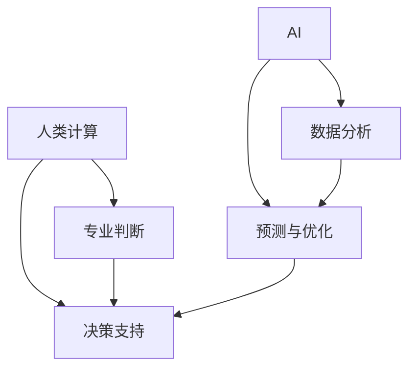

                 

**AI与人类计算：打造可持续发展的城市生活方式与交通管理系统**

**作者：禅与计算机程序设计艺术 / Zen and the Art of Computer Programming**

## 1. 背景介绍

随着城市化进程的加快，城市交通管理面临着严重的挑战，包括拥堵、污染和安全问题。传统的交通管理系统已无法满足城市可持续发展的需求。人工智能（AI）和人类计算的结合为解决这些问题提供了新的途径。本文将探讨如何利用AI和人类计算打造可持续发展的城市生活方式与交通管理系统。

## 2. 核心概念与联系

### 2.1 核心概念

- **人工智能（AI）**：指模拟人类智能行为的计算机程序，包括学习、推理和问题解决等。
- **人类计算（Human-in-the-Loop）**：指将人类作为系统的组成部分，在决策过程中起到关键作用。
- **可持续发展（Sustainable Development）**：指满足当代需求，而不牺牲后代满足其需求的能力。

### 2.2 核心概念联系

AI和人类计算的结合可以帮助城市交通管理系统更好地适应复杂的城市环境，实现可持续发展。AI可以分析海量交通数据，预测交通流量，优化交通路线，并提供实时路况信息。人类计算则确保人类专业知识和判断力在决策过程中发挥作用，提高系统的可靠性和安全性。



## 3. 核心算法原理 & 具体操作步骤

### 3.1 算法原理概述

本节将介绍两种核心算法：预测模型和路径规划算法。

### 3.2 算法步骤详解

#### 3.2.1 预测模型

1. **数据收集**：收集历史交通数据，包括时间、地点、交通流量等。
2. **数据预处理**：清洗数据，处理缺失值，并将数据转换为适合机器学习的格式。
3. **特征工程**：提取有意义的特征，如天气、事件等。
4. **模型训练**：使用机器学习算法（如随机森林、支持向量机等）训练预测模型。
5. **模型评估**：评估模型性能，调整参数以提高准确性。
6. **预测**：使用训练好的模型预测未来交通流量。

#### 3.2.2 路径规划算法

1. **图构建**：将城市交通网络表示为图，节点表示路口，边表示路段。
2. **目标设置**：设置起点、终点和目标（如最短时间、最短距离等）。
3. **路径搜索**：使用搜索算法（如Dijkstra算法、A\*算法等）搜索最优路径。
4. **路径输出**：输出最优路径，并提供实时路况信息。

### 3.3 算法优缺点

**预测模型优缺点：**

- 优点：可以预测未来交通流量，帮助决策者提前做出调整。
- 缺点：模型准确性受数据质量和算法选择的影响，且无法预测突发事件。

**路径规划算法优缺点：**

- 优点：可以提供最优路径，帮助司机节省时间和燃料。
- 缺点：无法预测实时路况，路径可能不适合突发事件。

### 3.4 算法应用领域

预测模型和路径规划算法可以广泛应用于智能交通系统，包括实时路况信息提供、交通流量预测、路径规划等。

## 4. 数学模型和公式 & 详细讲解 & 举例说明

### 4.1 数学模型构建

本节将介绍交通流量预测模型的数学模型。

### 4.2 公式推导过程

假设交通流量服从正态分布，则交通流量$X$可以表示为：

$$X \sim N(\mu, \sigma^2)$$

其中，$\mu$是均值，$\sigma$是标准差。使用线性回归模型预测$\mu$：

$$\mu = \beta_0 + \beta_1T + \beta_2W + \beta_3E + \epsilon$$

其中，$T$是时间特征，$W$是天气特征，$E$是事件特征，$\beta_0, \beta_1, \beta_2, \beta_3$是回归系数，$\epsilon$是误差项。

### 4.3 案例分析与讲解

假设我们要预测某路口上午8点的交通流量。使用历史数据训练模型，并输入相应特征值：

- $T = 8$
- $W = 晴天$
- $E = 无事件$

假设回归系数为$\beta_0 = 100, \beta_1 = 10, \beta_2 = 50, \beta_3 = 20$，则预测的交通流量均值为：

$$\mu = 100 + 10 \times 8 + 50 \times 1 + 20 \times 0 = 260$$

预测的交通流量服从$N(260, \sigma^2)$分布，其中$\sigma$需要从历史数据中估计。

## 5. 项目实践：代码实例和详细解释说明

### 5.1 开发环境搭建

本项目使用Python作为开发语言，并使用Anaconda创建虚拟环境。以下是需要安装的库：

- NumPy
- Pandas
- Matplotlib
- Scikit-learn
- Folium

### 5.2 源代码详细实现

以下是预测模型和路径规划算法的简化代码实现。

#### 5.2.1 预测模型

```python
import numpy as np
import pandas as pd
from sklearn.linear_model import LinearRegression
from sklearn.model_selection import train_test_split
from sklearn.metrics import mean_squared_error

# 加载数据
data = pd.read_csv('traffic_data.csv')

# 特征工程
X = pd.get_dummies(data[['time', 'weather', 'event']])
y = data['traffic_volume']

# 训练模型
X_train, X_test, y_train, y_test = train_test_split(X, y, test_size=0.2, random_state=42)
model = LinearRegression()
model.fit(X_train, y_train)

# 评估模型
y_pred = model.predict(X_test)
print('Mean Squared Error:', mean_squared_error(y_test, y_pred))
```

#### 5.2.2 路径规划算法

```python
import networkx as nx
import osmnx as ox

# 构建图
G = ox.graph_from_place('City Name', network_type='drive')

# 设置目标
origin = (lat, lon)
destination = (lat, lon)

# 搜索路径
route = nx.shortest_path(G, origin, destination, weight='length')

# 输出路径
print('Optimal Route:', route)
```

### 5.3 代码解读与分析

预测模型使用线性回归算法训练交通流量预测模型。路径规划算法使用NetworkX库构建图，并使用Dijkstra算法搜索最短路径。

### 5.4 运行结果展示

预测模型的均方误差可以衡量模型的准确性。路径规划算法的输出是最优路径的节点列表。

## 6. 实际应用场景

### 6.1 城市交通管理

AI和人类计算可以帮助城市交通管理部门更好地管理交通流量，优化交通路线，并提供实时路况信息。

### 6.2 智能出行

AI和人类计算可以帮助司机规划最优路径，并提供实时路况信息，节省时间和燃料。

### 6.3 未来应用展望

未来，AI和人类计算可以帮助实现自动驾驶、智能公共交通系统等，从根本上改善城市交通管理。

## 7. 工具和资源推荐

### 7.1 学习资源推荐

- 书籍：《人工智能：一种现代方法》作者：斯图尔特·罗素、彼得·诺维格
- 课程：Coursera上的机器学习课程

### 7.2 开发工具推荐

- Python：数据分析和机器学习的流行语言
- Anaconda：Python的科学计算环境
- Jupyter Notebook：交互式数据分析和可视化工具

### 7.3 相关论文推荐

- [Traffic Flow Prediction Using Machine Learning Techniques](https://ieeexplore.ieee.org/document/8464364)
- [A Review on Route Optimization Algorithms for Intelligent Transportation Systems](https://ieeexplore.ieee.org/document/8760455)

## 8. 总结：未来发展趋势与挑战

### 8.1 研究成果总结

本文介绍了如何利用AI和人类计算打造可持续发展的城市生活方式与交通管理系统。预测模型和路径规划算法可以帮助城市交通管理部门和司机更好地管理交通流量，优化交通路线，并提供实时路况信息。

### 8.2 未来发展趋势

未来，AI和人类计算将继续在城市交通管理领域发挥关键作用。自动驾驶、智能公共交通系统等技术将得到进一步发展。

### 8.3 面临的挑战

然而，AI和人类计算也面临着挑战，包括数据隐私、算法偏见、系统可靠性等。

### 8.4 研究展望

未来的研究将关注如何提高模型准确性，如何处理突发事件，如何提高系统可靠性等。

## 9. 附录：常见问题与解答

**Q1：如何处理缺失数据？**

A1：可以使用插补法或模型法处理缺失数据。

**Q2：如何评估模型性能？**

A2：可以使用均方误差、R平方等指标评估模型性能。

**Q3：如何处理算法偏见？**

A3：可以使用公平性约束、偏见度量指标等方法处理算法偏见。

**作者：禅与计算机程序设计艺术 / Zen and the Art of Computer Programming**

