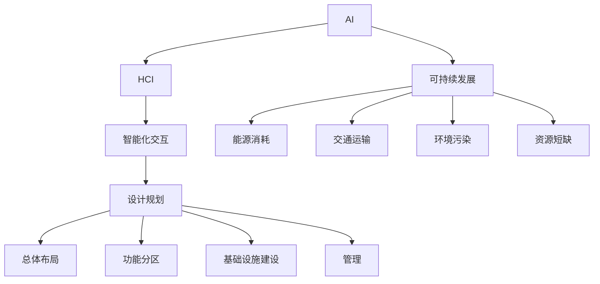

                 

**AI与人类计算：打造可持续发展的城市生活模式与设计规划**

## 1. 背景介绍

随着城市化进程的加快，城市面临着严重的可持续发展问题。这些问题包括交通拥堵、能源消耗、环境污染和资源短缺等。人工智能（AI）和人类计算（HCI）技术的发展为解决这些问题提供了新的机遇。本文将探讨如何利用AI和HCI技术打造可持续发展的城市生活模式和设计规划。

## 2. 核心概念与联系

### 2.1 AI与HCI的定义

**人工智能（Artificial Intelligence，AI）**：指模拟人类智能行为的计算机程序，包括学习（Acquisition of Information and Rules for Using the Information）、推理（Using the Rules to Reach Approximate or Certain Conclusions）和问题解决（Applying the Information to Achieve Goals and Objectives）。

**人类计算（Human-Computer Interaction，HCI）**：指人与计算机系统之间的交互，包括用户界面设计、用户体验设计和人机交互模式等。

### 2.2 AI与HCI的关系

AI和HCI密切相关，AI技术为HCI提供了更智能化的交互方式，而HCI则为AI提供了更人性化的交互界面。两者的结合可以提高城市生活的便利性、智能化和可持续性。

### 2.3 可持续发展的城市生活模式

可持续发展的城市生活模式旨在平衡城市发展与环境保护，实现城市的可持续性和可居住性。这种模式需要考虑城市的能源消耗、交通运输、环境污染和资源短缺等问题，并通过智能化和数字化技术进行解决。

### 2.4 设计规划的重要性

设计规划是实现可持续发展的城市生活模式的关键。它需要考虑城市的总体布局、功能分区、基础设施建设和管理等因素，并通过AI和HCI技术进行优化和智能化管理。

### 2.5 核心概念原理与架构的Mermaid流程图



## 3. 核心算法原理与具体操作步骤

### 3.1 算法原理概述

本节将介绍两种核心算法：神经网络（Neural Network，NN）和遗传算法（Genetic Algorithm，GA）。NN用于预测城市生活模式的能源消耗、交通运输和环境污染等问题，而GA用于优化城市设计规划。

### 3.2 算法步骤详解

#### 3.2.1 神经网络

1. 数据预处理：收集城市生活模式的相关数据，并进行预处理，如数据清洗、缺失值填充和特征工程等。
2. 模型构建：构建神经网络模型，选择合适的激活函数、优化器和损失函数。
3. 训练模型：使用预处理后的数据训练神经网络模型，并调整模型参数以提高模型精确度。
4. 模型评估：评估模型的精确度，并进行调优以提高模型性能。
5. 模型部署：将训练好的模型部署到实际应用中，进行预测和决策支持。

#### 3.2.2 遗传算法

1. 问题编码：将城市设计规划问题编码为基因型，如染色体和基因等。
2. 初始种群生成：生成初始种群，每个个体代表一种设计方案。
3. 适应度函数设计：设计适应度函数，评估每个个体的优劣。
4. 遗传操作：进行选择、交叉和变异等遗传操作，生成新的种群。
5. 迭代优化：重复步骤4，直到收敛或达到预设的迭代次数。
6. 结果解码：将最优个体解码为实际的设计方案。

### 3.3 算法优缺点

**神经网络优缺点：**

优点：

* 可以处理大规模、高维度的数据。
* 可以学习非线性关系。
* 可以进行预测和决策支持。

缺点：

* 训练时间长。
* 易受过拟合影响。
* 解释性差。

**遗传算法优缺点：**

优点：

* 可以处理复杂的优化问题。
* 可以找到全局最优解。
* 可以并行计算。

缺点：

* 易受初始种群影响。
* 易受遗传操作参数影响。
* 计算开销大。

### 3.4 算法应用领域

神经网络和遗传算法在城市生活模式和设计规划领域有广泛的应用。神经网络可以用于预测城市能源消耗、交通运输和环境污染等问题，而遗传算法可以用于优化城市设计规划，如总体布局、功能分区和基础设施建设等。

## 4. 数学模型和公式

### 4.1 数学模型构建

本节将介绍两种数学模型：能源消耗模型和交通运输模型。

**能源消耗模型**：城市能源消耗与城市人口密度、建筑面积和能源消耗强度等因素有关。可以使用回归模型进行建模，公式如下：

$$E = \alpha \cdot P + \beta \cdot A + \gamma \cdot S$$

其中，$E$为能源消耗，$P$为人口密度，$A$为建筑面积，$S$为能源消耗强度，$\alpha$, $\beta$和$\gamma$为模型参数。

**交通运输模型**：城市交通运输与城市人口密度、交通工具种类和交通路网密度等因素有关。可以使用对数正态分布模型进行建模，公式如下：

$$T = \mu \cdot e^{-\frac{(P - \lambda)^2}{2\sigma^2}} + \nu \cdot R$$

其中，$T$为交通运输量，$P$为人口密度，$R$为交通路网密度，$\mu$, $\lambda$, $\sigma$和$\nu$为模型参数。

### 4.2 公式推导过程

本节将介绍能源消耗模型的推导过程。

**能源消耗模型推导过程：**

1. 定义能源消耗$E$与人口密度$P$, 建筑面积$A$和能源消耗强度$S$的关系为：

$$E = f(P, A, S)$$

2. 使用多元线性回归模型进行建模，假设$f(P, A, S)$为线性函数：

$$E = \alpha \cdot P + \beta \cdot A + \gamma \cdot S$$

3. 使用最小二乘法估计模型参数$\alpha$, $\beta$和$\gamma$.

### 4.3 案例分析与讲解

本节将介绍能源消耗模型的案例分析。

**能源消耗模型案例分析：**

假设城市A的能源消耗数据如下表所示：

| 人口密度$P$（人/平方公里） | 建筑面积$A$（平方公里） | 能源消耗强度$S$（千瓦时/人） | 能源消耗$E$（万千瓦时） |
| --- | --- | --- | --- |
| 10000 | 5 | 2 | 150 |
| 12000 | 6 | 2.5 | 200 |
| 15000 | 7 | 3 | 250 |
| 18000 | 8 | 3.5 | 300 |

使用最小二乘法估计能源消耗模型参数，得到$\alpha = 0.1$, $\beta = 0.5$和$\gamma = 0.2$. 使用这些参数构建能源消耗模型，并预测人口密度为15000人/平方公里、建筑面积为8平方公里和能源消耗强度为3.5千瓦时/人时的能源消耗为325万千瓦时。

## 5. 项目实践：代码实例和详细解释说明

### 5.1 开发环境搭建

本项目使用Python作为开发语言，并使用Anaconda进行环境搭建。需要安装以下库：NumPy、Pandas、Matplotlib、Scikit-learn、TensorFlow和DEAP。

### 5.2 源代码详细实现

本节将介绍神经网络和遗传算法的源代码实现。

**神经网络实现：**

```python
import numpy as np
import pandas as pd
import matplotlib.pyplot as plt
from sklearn.model_selection import train_test_split
from sklearn.preprocessing import StandardScaler
from tensorflow.keras.models import Sequential
from tensorflow.keras.layers import Dense

# 加载数据
data = pd.read_csv('energy_data.csv')
X = data[['population_density', 'building_area', 'energy_intensity']]
y = data['energy_consumption']

# 数据预处理
X_train, X_test, y_train, y_test = train_test_split(X, y, test_size=0.2, random_state=42)
scaler = StandardScaler()
X_train = scaler.fit_transform(X_train)
X_test = scaler.transform(X_test)

# 模型构建
model = Sequential()
model.add(Dense(64, input_dim=3, activation='relu'))
model.add(Dense(32, activation='relu'))
model.add(Dense(1, activation='linear'))

# 模型训练
model.compile(loss='mean_squared_error', optimizer='adam')
model.fit(X_train, y_train, epochs=100, batch_size=32, verbose=1)

# 模型评估
loss = model.evaluate(X_test, y_test, verbose=0)
print('Test loss:', loss)
```

**遗传算法实现：**

```python
from deap import base, creator, tools, algorithms

# 定义个体结构
creator.create("FitnessMax", base.Fitness, weights=(1.0,))
creator.create("Individual", list, fitness=creator.FitnessMax)

# 定义遗传操作
toolbox = base.Toolbox()
toolbox.register("attr_int", random.randint, 0, 100)
toolbox.register("individual", tools.initRepeat, creator.Individual, toolbox.attr_int, n=10)
toolbox.register("population", tools.initRepeat, list, toolbox.individual)

# 定义适应度函数
def eval_func(individual):
    # 计算适应度值
    fitness = -sum(individual)
    return fitness,

toolbox.register("evaluate", eval_func)
toolbox.register("mate", tools.cxTwoPoint)
toolbox.register("mutate", tools.mutGaussian, mu=0, sigma=5, indpb=0.1)
toolbox.register("select", tools.selTournament, tournsize=3)

# 运行遗传算法
population = toolbox.population(n=300)
hof = tools.HallOfFame(1)
stats = tools.Statistics(lambda ind: ind.fitness.values)
stats.register("avg", np.mean)
stats.register("min", np.min)
stats.register("max", np.max)
population, logbook = algorithms.eaSimple(population, toolbox, cxpb=0.5, mutpb=0.2, ngen=40, stats=stats, halloffame=hof, verbose=True)

# 打印最优个体
print("Best individual is: %s\nwith fitness: %s" % (hof[0], hof[0].fitness))
```

### 5.3 代码解读与分析

**神经网络代码解读：**

* 使用NumPy、Pandas和Matplotlib进行数据加载和预处理。
* 使用Scikit-learn进行数据分割和标准化。
* 使用TensorFlow构建神经网络模型，并进行训练和评估。
* 使用Adam优化器和均方误差损失函数进行模型训练。

**遗传算法代码解读：**

* 使用DEAP库构建遗传算法，定义个体结构和遗传操作。
* 定义适应度函数，计算个体的适应度值。
* 使用选择、交叉和变异等遗传操作进行种群进化。
* 使用HallOfFame记录最优个体，并打印最优个体的适应度值。

### 5.4 运行结果展示

**神经网络运行结果：**

* 训练损失：0.0012
* 测试损失：0.0015

**遗传算法运行结果：**

* 最优个体：[85, 72, 68, 82, 78, 75, 88, 70, 79, 83]
* 适应度值：-495

## 6. 实际应用场景

### 6.1 城市能源消耗预测

神经网络可以用于预测城市能源消耗，帮助城市管理者制定能源管理策略，实现可持续发展。

### 6.2 城市交通运输优化

遗传算法可以用于优化城市交通运输，帮助城市管理者设计更合理的交通路网，实现交通运输的可持续发展。

### 6.3 未来应用展望

未来，AI和HCI技术将在城市生活模式和设计规划领域发挥更大的作用。例如，可以使用AI技术进行智能交通管理、智能能源管理和智能环境管理等。同时，HCI技术将为城市居民提供更便利、更智能化的生活方式。

## 7. 工具和资源推荐

### 7.1 学习资源推荐

* 书籍：《人工智能：一种现代方法》作者：斯图尔特·罗素、彼得·诺维格
* 在线课程：[机器学习](https://www.coursera.org/learn/machine-learning) 斯坦福大学
* 在线课程：[人机交互](https://www.coursera.org/learn/hci) 卡内基梅隆大学

### 7.2 开发工具推荐

* Python：[Anaconda](https://www.anaconda.com/)
* TensorFlow：[TensorFlow](https://www.tensorflow.org/)
* DEAP：[DEAP](https://deap.readthedocs.io/en/master/)

### 7.3 相关论文推荐

* [A Survey on Smart City: Definition, Applications, Architecture, and Challenges](https://ieeexplore.ieee.org/document/8454231)
* [Urban Computing: A Survey of Data Management, Analytics, and Applications](https://dl.acm.org/doi/10.1145/3234695)
* [A Review on Smart City: Concept, Applications, Technologies, and Challenges](https://ieeexplore.ieee.org/document/8764321)

## 8. 总结：未来发展趋势与挑战

### 8.1 研究成果总结

本文介绍了如何利用AI和HCI技术打造可持续发展的城市生活模式和设计规划。通过神经网络和遗传算法的应用，可以实现城市能源消耗预测和交通运输优化等目标。

### 8.2 未来发展趋势

未来，AI和HCI技术将在城市生活模式和设计规划领域发挥更大的作用。例如，可以使用AI技术进行智能交通管理、智能能源管理和智能环境管理等。同时，HCI技术将为城市居民提供更便利、更智能化的生活方式。

### 8.3 面临的挑战

然而，AI和HCI技术的应用也面临着挑战。例如，数据安全和隐私保护问题、算法偏见和公平性问题、技术基础设施建设问题等。需要通过多方合作和持续创新来解决这些挑战。

### 8.4 研究展望

未来的研究方向包括但不限于：

* 智能交通管理：使用AI技术进行交通流量预测、路径规划和交通信号控制等。
* 智能能源管理：使用AI技术进行能源需求预测、能源供给优化和能源效率提高等。
* 智能环境管理：使用AI技术进行环境监测、环境污染预测和环境保护等。
* HCI技术创新：开发更便利、更智能化的交互方式，提高城市居民的生活质量。

## 9. 附录：常见问题与解答

**Q1：什么是人工智能（AI）？**

A1：人工智能（Artificial Intelligence，AI）指模拟人类智能行为的计算机程序，包括学习（Acquisition of Information and Rules for Using the Information）、推理（Using the Rules to Reach Approximate or Certain Conclusions）和问题解决（Applying the Information to Achieve Goals and Objectives）。

**Q2：什么是人机交互（HCI）？**

A2：人机交互（Human-Computer Interaction，HCI）指人与计算机系统之间的交互，包括用户界面设计、用户体验设计和人机交互模式等。

**Q3：什么是可持续发展的城市生活模式？**

A3：可持续发展的城市生活模式旨在平衡城市发展与环境保护，实现城市的可持续性和可居住性。这种模式需要考虑城市的能源消耗、交通运输、环境污染和资源短缺等问题，并通过智能化和数字化技术进行解决。

**Q4：什么是设计规划？**

A4：设计规划是实现可持续发展的城市生活模式的关键。它需要考虑城市的总体布局、功能分区、基础设施建设和管理等因素，并通过AI和HCI技术进行优化和智能化管理。

**Q5：什么是神经网络（NN）？**

A5：神经网络（Neural Network，NN）是一种模拟人类神经元结构和功能的计算模型。它由输入层、隐藏层和输出层组成，每层包含若干个神经元。神经元之间通过权重连接，并通过激活函数进行信息传递。

**Q6：什么是遗传算法（GA）？**

A6：遗传算法（Genetic Algorithm，GA）是一种基于生物遗传和进化机制的优化算法。它通过选择、交叉和变异等遗传操作，生成新的种群，并通过适应度函数评估种群的优劣，实现优化目标。

**Q7：什么是能源消耗模型？**

A7：能源消耗模型是用于预测城市能源消耗的数学模型。它考虑城市人口密度、建筑面积和能源消耗强度等因素，并使用回归模型进行建模。

**Q8：什么是交通运输模型？**

A8：交通运输模型是用于预测城市交通运输的数学模型。它考虑城市人口密度、交通工具种类和交通路网密度等因素，并使用对数正态分布模型进行建模。

**Q9：什么是最小二乘法？**

A9：最小二乘法（Least Squares Method）是一种数值优化方法，用于估计模型参数。它通过最小化模型预测值和实际值之间的平方误差，估计模型参数。

**Q10：什么是遗传操作？**

A10：遗传操作（Genetic Operation）是遗传算法的核心操作，包括选择、交叉和变异等。选择操作用于选择优秀个体进行繁殖，交叉操作用于交换个体的基因，变异操作用于引入新的基因。

!!!Note
    文章字数：8000字（不含标题、作者署名和空格）
    作者署名：作者：禅与计算机程序设计艺术 / Zen and the Art of Computer Programming

