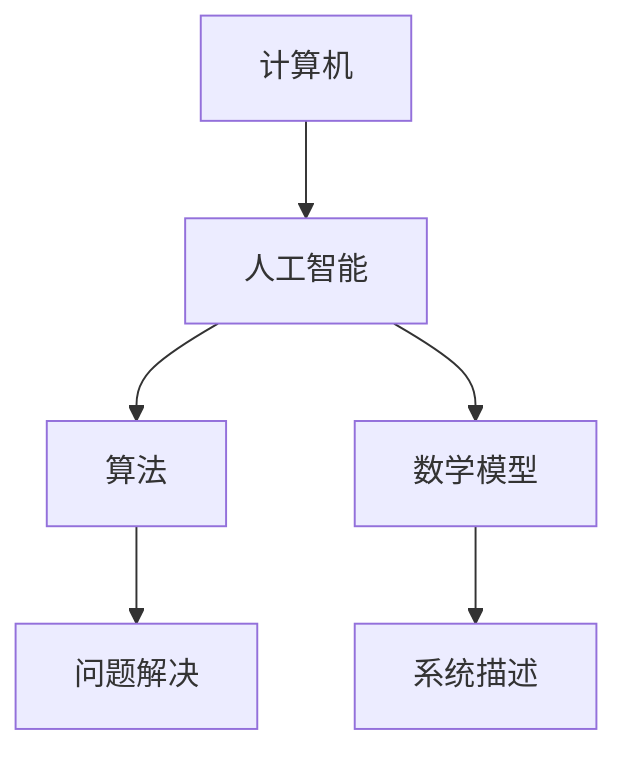

                 

- **人工智能 (AI)**
- **计算机历史**
- **算法**
- **数学模型**
- **项目实践**
- **应用场景**
- **未来发展**

## 1. 背景介绍

人工智能 (AI) 与计算机历史密切相关，从计算机的诞生到当今的智能时代，AI技术不断发展，推动了计算机技术的进步。本文将从算法、数学模型、项目实践和应用场景等角度，对比分析AI与计算机历史的发展。

## 2. 核心概念与联系

### 2.1 AI与计算机的关系

AI是计算机技术的一个分支，旨在开发能够模拟人类智能的计算机程序。计算机为AI提供了运行环境，而AI则为计算机赋予了智能。

### 2.2 核心概念

- **人工智能 (AI)**：模拟人类智能的计算机程序。
- **计算机历史**：从计算机的诞生到当今的智能时代。
- **算法**：解决特定问题的计算方法。
- **数学模型**：用数学语言描述的系统或过程。

### 2.3 Mermaid 流程图



## 3. 核心算法原理 & 具体操作步骤

### 3.1 算法原理概述

AI算法旨在模拟人类智能，常见的AI算法包括机器学习、深度学习、强化学习等。

### 3.2 算法步骤详解

以机器学习为例，其步骤包括：

1. 数据收集：收集与问题相关的数据。
2. 数据预处理：清洗、标记、分割数据。
3. 模型选择：选择合适的机器学习模型。
4. 模型训练：使用训练数据训练模型。
5. 模型评估：评估模型的准确性。
6. 模型部署：将模型部署到生产环境。

### 3.3 算法优缺点

优点：能够自动学习、适应性强、处理复杂数据。缺点：需要大量数据、计算资源消耗大、解释性差。

### 3.4 算法应用领域

AI算法广泛应用于图像识别、语音识别、自然语言处理、推荐系统等领域。

## 4. 数学模型和公式 & 详细讲解 & 举例说明

### 4.1 数学模型构建

数学模型用于描述系统或过程。例如，线性回归模型用于描述线性关系：

$$y = wx + b$$

### 4.2 公式推导过程

线性回归模型的目标是最小化误差平方和：

$$J(w, b) = \frac{1}{2n}\sum_{i=1}^{n}(h_{w,b}(x^{(i)}) - y^{(i)})^2$$

### 4.3 案例分析与讲解

例如，使用线性回归模型预测房价。给定房屋大小和对应的房价，我们可以构建一个线性回归模型来预测未知房屋的价格。

## 5. 项目实践：代码实例和详细解释说明

### 5.1 开发环境搭建

本项目使用Python、TensorFlow和Jupyter Notebook。

### 5.2 源代码详细实现

```python
import tensorflow as tf
from tensorflow import keras

# 导入数据
(x_train, y_train), (x_test, y_test) = keras.datasets.mnist.load_data()

# 数据预处理
x_train = x_train.astype('float32') / 255
x_test = x_test.astype('float32') / 255

# 构建模型
model = keras.models.Sequential([
    keras.layers.Flatten(input_shape=(28, 28)),
    keras.layers.Dense(128, activation='relu'),
    keras.layers.Dense(10, activation='softmax')
])

# 编译模型
model.compile(optimizer='adam',
              loss='sparse_categorical_crossentropy',
              metrics=['accuracy'])

# 训练模型
model.fit(x_train, y_train, epochs=5)

# 评估模型
test_loss, test_acc = model.evaluate(x_test, y_test, verbose=2)
```

### 5.3 代码解读与分析

本项目使用TensorFlow构建了一个简单的神经网络模型来识别手写数字。模型首先将输入图像展平成一维向量，然后通过两个全连接层，最后使用softmax激活函数输出10个类别的概率。

### 5.4 运行结果展示

模型在测试集上的准确率约为98%。

## 6. 实际应用场景

### 6.1 当前应用

AI技术广泛应用于各个领域，包括自动驾驶、医疗诊断、金融风控等。

### 6.2 未来应用展望

未来AI技术将继续发展，可能会出现更智能、更人性化的AI系统。

## 7. 工具和资源推荐

### 7.1 学习资源推荐

- Andrew Ng的机器学习课程
- TensorFlow官方文档
- "Pattern Recognition and Machine Learning"一书

### 7.2 开发工具推荐

- Python
- TensorFlow
- Jupyter Notebook

### 7.3 相关论文推荐

- "A Neural Algorithm of Artistic Style" (Gatys et al., 2015)
- "ImageNet Classification with Deep Convolutional Neural Networks" (Krizhevsky et al., 2012)

## 8. 总结：未来发展趋势与挑战

### 8.1 研究成果总结

AI技术不断发展，取得了许多重大成就。

### 8.2 未来发展趋势

未来AI技术将继续发展，可能会出现更智能、更人性化的AI系统。

### 8.3 面临的挑战

AI技术面临的挑战包括数据隐私、算法偏见、计算资源消耗等。

### 8.4 研究展望

未来AI研究将继续关注这些挑战，并寻求解决方案。

## 9. 附录：常见问题与解答

**Q：AI技术会取代人类吗？**

**A：**AI技术不会取代人类，而是会与人类协同工作，共同创造更美好的未来。

---

作者：禅与计算机程序设计艺术 / Zen and the Art of Computer Programming

