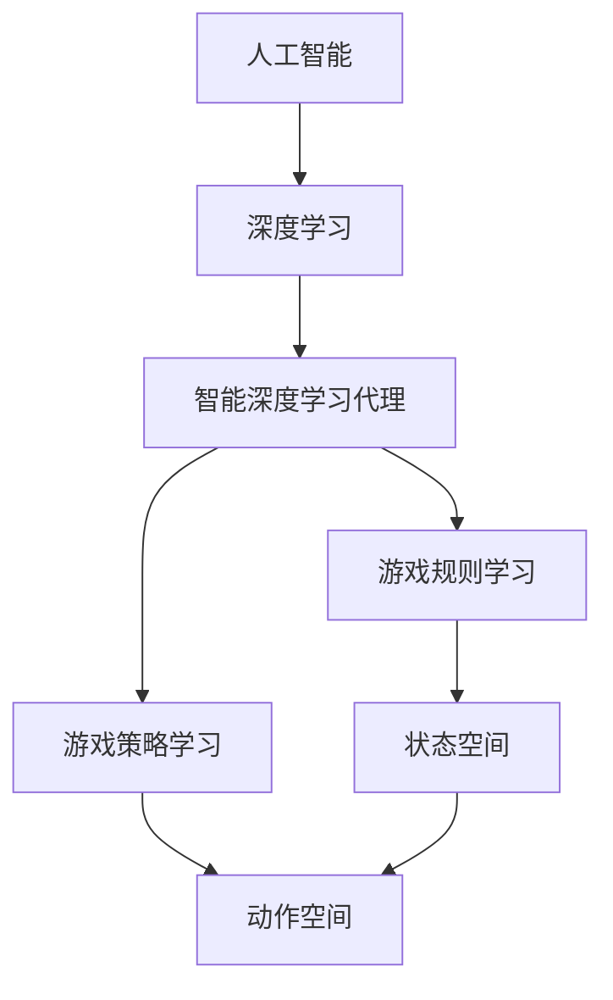

                 

## 1. 背景介绍

人工智能（AI）在视频游戏领域的应用已经不是什么新鲜事了。从早期的简单AI对手到现在的复杂AI系统，AI技术已经渗透到了游戏的方方面面。其中，深度学习算法由于其强大的学习和适应能力，正在成为游戏开发者的首选工具之一。本文将介绍一种智能深度学习代理在视频游戏场景中的应用，并详细阐述其核心概念、算法原理、数学模型，以及项目实践和实际应用场景。

## 2. 核心概念与联系

在深入讨论智能深度学习代理在视频游戏中的应用之前，我们需要先了解一些核心概念。深度学习是一种机器学习方法，它模仿人类大脑的结构和功能，使用神经网络来学习和做出决策。在游戏场景中，深度学习代理是指使用深度学习算法来学习游戏规则和策略的AI系统。

下面是这些核心概念的Mermaid流程图：



## 3. 核心算法原理 & 具体操作步骤

### 3.1 算法原理概述

智能深度学习代理的核心算法是强化学习（RL），它是一种基于奖励机制的机器学习方法。在游戏场景中，代理需要学习一系列动作以最大化累积奖励。深度Q网络（DQN）是一种常用的RL算法，它使用神经网络来近似Q函数，预测给定状态下采取动作的期望回报。

### 3.2 算法步骤详解

1. **状态观察**：代理观察当前游戏状态，并将其作为输入提供给DQN。
2. **动作选择**：DQN选择一个动作，代理执行该动作。
3. **奖励获取**：根据游戏规则，代理获得一个奖励。
4. **状态转换**：游戏状态转换为下一个状态。
5. **记忆存储**：将当前状态、动作、奖励和下一个状态存储在经验回放池中。
6. **学习**：从经验回放池中随机抽取一批样本，更新DQN的参数。
7. **重复**：重复步骤1-6，直到代理学习到一个良好的策略。

### 3.3 算法优缺点

**优点**：DQN可以学习复杂的策略，不需要人工设计特定的规则。它可以从经验中学习，并适应动态的环境。

**缺点**：DQN需要大量的训练数据，计算成本高。它也容易陷入局部最优解，需要技巧性的设计来避免。

### 3.4 算法应用领域

智能深度学习代理在各种视频游戏中都有应用，从简单的棋盘游戏到复杂的实时策略游戏。它也可以应用于自动驾驶、机器人控制等领域。

## 4. 数学模型和公式 & 详细讲解 & 举例说明

### 4.1 数学模型构建

在强化学习中，我们有状态空间S，动作空间A，奖励函数R：S×A→R，和状态转移函数P：S×A×S→[0,1]。代理的目标是学习一个策略π：S→A，使得期望的累积回报最大化。

### 4.2 公式推导过程

Q学习的目标是学习Q函数Q(s, a)，它表示在状态s采取动作a的期望回报。根据贝尔曼方程，我们有：

$$Q(s, a) = E[R_{t+1} + \gamma \max_a Q(S_{t+1}, a) | S_t = s, A_t = a]$$

其中，R<sub>t+1</sub>是当前时刻的奖励，γ是折扣因子，S<sub>t+1</sub>是下一个状态。DQN使用神经网络来近似Q函数，并使用经验回放和目标网络来稳定学习。

### 4.3 案例分析与讲解

例如，在 Atari 2600 游戏中，状态可以是当前屏幕的帧，动作可以是 joystick 的动作。代理需要学习一系列动作以最大化分数（奖励）。DQN可以从游戏中学习到有效的策略，如在Pac-Man中寻找食物，在Space Invaders中射击外星人。

## 5. 项目实践：代码实例和详细解释说明

### 5.1 开发环境搭建

我们需要一个支持深度学习的开发环境。推荐使用Python，并安装TensorFlow或PyTorch等深度学习框架。我们也需要一个游戏环境，如Atari 2600 游戏环境。

### 5.2 源代码详细实现

以下是DQN的伪代码：

```python
initialize replay memory M to capacity N
initialize action-value function Q with random weights
for episode = 1 to M do
    initialize state s
    for t = 1 to T do
        choose a from s using policy derived from Q
        execute a, observe r, s'
        store transition (s, a, r, s') in M
        if M is full then
            sample random minibatch of N transitions from M
            set y = r if s' is terminal, else y = r + γmax_a Q(s', a; θ-) (1)
            update Q using gradient descent with y as target (2)
        s = s'
    end for
end for
```

### 5.3 代码解读与分析

在每个episode中，代理选择一个动作，执行该动作，并观察到新的状态和奖励。它将当前状态、动作、奖励和下一个状态存储在经验回放池中。当经验回放池满时，它从中随机抽取一批样本，并使用这些样本来更新DQN的参数。

### 5.4 运行结果展示

在训练过程中，我们可以观察代理的学习进度。在每个episode结束时，我们可以计算代理的分数，并绘制其变化趋势。随着训练的进行，代理的分数应该会不断提高。

## 6. 实际应用场景

### 6.1 当前应用

智能深度学学代理已经应用于各种视频游戏中，如Atari 2600游戏、Dota 2、StarCraft II等。它们可以作为AI对手，也可以作为辅助工具帮助玩家。

### 6.2 未来应用展望

未来，智能深度学习代理有望应用于更复杂的游戏中，如开放世界游戏、虚拟现实游戏等。它们也可以应用于游戏设计中，帮助设计师创建更智能的AI对手和更丰富的游戏体验。

## 7. 工具和资源推荐

### 7.1 学习资源推荐

- 书籍：《深度学习》作者：Ian Goodfellow、Yoshua Bengio、Aaron Courville
- 课程：斯坦福大学的“深度学习”课程（CS231n）
- 网站：Khan Academy的“机器学习”课程

### 7.2 开发工具推荐

- TensorFlow：<https://www.tensorflow.org/>
- PyTorch：<https://pytorch.org/>
- Gym：<https://gym.openai.com/>

### 7.3 相关论文推荐

- DeepMind的“Playing Atari with Deep Reinforcement Learning”：<https://arxiv.org/abs/1312.5602>
- DeepMind的“Human-level control through deep reinforcement learning”：<https://arxiv.org/abs/1505.00521>

## 8. 总结：未来发展趋势与挑战

### 8.1 研究成果总结

智能深度学习代理在视频游戏中的应用取得了显著的成果。它们可以学习复杂的策略，并击败人类玩家。

### 8.2 未来发展趋势

未来，智能深度学习代理有望应用于更复杂的环境中，并与其他AI技术结合，创造更智能的游戏体验。

### 8.3 面临的挑战

然而，智能深度学习代理也面临着一些挑战。它们需要大量的训练数据，计算成本高。它们也容易陷入局部最优解，需要技巧性的设计来避免。

### 8.4 研究展望

未来的研究方向包括但不限于：更有效的学习算法，更智能的代理设计，以及更复杂的游戏环境。

## 9. 附录：常见问题与解答

**Q：智能深度学习代理需要多长时间才能学习到一个好的策略？**

**A：**这取决于游戏的复杂性和代理的设计。通常，代理需要数千个episode才能学习到一个好的策略。

**Q：智能深度学习代理是否可以应用于实时策略游戏？**

**A：**是的，智能深度学习代理已经应用于实时策略游戏中，如StarCraft II。它们可以学习复杂的策略，如资源管理、部队控制等。

**Q：智能深度学习代理是否可以应用于开放世界游戏？**

**A：**是的，智能深度学习代理也可以应用于开放世界游戏中。它们可以学习到更智能的AI对手，并创造更丰富的游戏体验。

!!!Note
作者：禅与计算机程序设计艺术 / Zen and the Art of Computer Programming

