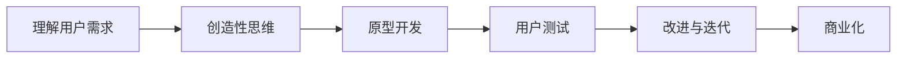

                 

**AI创业者的坚持：以用户为中心的内容创新**

## 1. 背景介绍

在当今快速变化的数字时代，内容创新已成为企业成功的关键。然而，创新并非易事，尤其是在AI领域，创业者面临着技术、市场和用户理解等挑战。本文旨在提供一条以用户为中心的内容创新之路，帮助AI创业者在激烈的竞争中脱颖而出。

## 2. 核心概念与联系

### 2.1 以用户为中心的创新

以用户为中心的创新（User-Centered Innovation, UCI）是一种创新方法，它将用户需求置于创新过程的核心。UCI强调理解用户、满足用户需求，并通过持续的用户反馈来改进产品和服务。

### 2.2 创新流程

创新流程是指导创新活动的框架。根据[Mermaid流程图](https://mermaid-js.github.io/mermaid-live-editor/)，创新流程可以表示为：



### 2.3 AI内容创新

AI内容创新是指利用人工智能技术创造新颖、有价值的内容。它包括但不限于AI生成的文本、图像、视频和音频等。

## 3. 核心算法原理 & 具体操作步骤

### 3.1 算法原理概述

AI内容创新的核心是AI生成模型，如变分自编码器（Variational Autoencoder, VAE）、生成对抗网络（Generative Adversarial Network, GAN）和transformer模型等。这些模型学习输入数据的分布，并生成新的、类似于输入数据的样本。

### 3.2 算法步骤详解

1. **数据收集**：收集与内容相关的数据，如文本、图像或音频等。
2. **数据预处理**：清洗、标记和转换数据，使其适合AI模型。
3. **模型选择**：选择适合任务的AI生成模型。
4. **模型训练**：使用预处理数据训练模型。
5. **内容生成**：使用训练好的模型生成新内容。
6. **评估与改进**：评估生成内容的质量，并根据用户反馈改进模型。

### 3.3 算法优缺点

**优点**：AI生成模型可以创造出新颖、多样的内容，并能够学习和模仿人类创作风格。

**缺点**：AI生成内容可能缺乏创意和原创性，且生成的内容可能包含错误或不相关的信息。

### 3.4 算法应用领域

AI内容创新应用广泛，包括但不限于：

- **文本生成**：新闻、博客文章、小说等。
- **图像生成**：人像、风景、建筑等。
- **视频生成**：电影、广告、动画等。
- **音频生成**：音乐、语音合成等。

## 4. 数学模型和公式 & 详细讲解 & 举例说明

### 4.1 数学模型构建

变分自编码器是一种常用的AI生成模型。它由两个网络组成：编码器网络$E$和解码器网络$G$. 编码器网络$E$将输入数据$x$编码为分布$z$, 解码器网络$G$则将$z$解码回$x$.

### 4.2 公式推导过程

VAE的目标是最大化输入数据$x$的对数似然$log p(x|z)$, 即最大化$E_{q(z|x)}[log p(x|z)]$. 其中，$q(z|x)$是编码器网络$E$学习的分布，$p(x|z)$是解码器网络$G$学习的分布。

### 4.3 案例分析与讲解

例如，在文本生成任务中，输入数据$x$是一段文本，$z$是文本的潜在表示。编码器网络$E$学习将文本转换为潜在表示$z$, 解码器网络$G$则学习将潜在表示$z$转换回文本。

## 5. 项目实践：代码实例和详细解释说明

### 5.1 开发环境搭建

- **硬件**：GPU加速的计算机。
- **软件**：Python、PyTorch或TensorFlow、Jupyter Notebook等。

### 5.2 源代码详细实现

以下是VAE的简单实现示例：

```python
import torch
from torch import nn, optim

class VAE(nn.Module):
    def __init__(self, input_dim, hidden_dim, z_dim):
        super(VAE, self).__init__()
        self.encoder = nn.Sequential(
            nn.Linear(input_dim, hidden_dim),
            nn.ReLU(),
            nn.Linear(hidden_dim, z_dim*2)
        )
        self.decoder = nn.Sequential(
            nn.Linear(z_dim, hidden_dim),
            nn.ReLU(),
            nn.Linear(hidden_dim, input_dim),
            nn.Sigmoid()
        )

    def reparameterize(self, mu, logvar):
        std = torch.exp(0.5 * logvar)
        z = mu + std * torch.randn_like(std)
        return z

    def forward(self, x):
        x = self.encoder(x)
        mu, logvar = x[:, :self.z_dim], x[:, self.z_dim:]
        z = self.reparameterize(mu, logvar)
        x_recon = self.decoder(z)
        return x_recon, mu, logvar
```

### 5.3 代码解读与分析

- **编码器**：将输入数据$x$转换为潜在表示$z$.
- **重参数化技巧**：生成$z$的方式，以便于训练。
- **解码器**：将潜在表示$z$转换回输入数据$x$.

### 5.4 运行结果展示

在训练好的模型上，输入随机$z$并生成$x$, 即可得到生成的内容。

## 6. 实际应用场景

### 6.1 当前应用

AI内容创新已在各行各业得到应用，如新闻自动生成、个性化广告、虚拟人等。

### 6.2 未来应用展望

未来，AI内容创新将更加智能化、个性化，并与其他技术如虚拟现实、增强现实结合，创造出更丰富的内容体验。

## 7. 工具和资源推荐

### 7.1 学习资源推荐

- **书籍**："Deep Learning" by Ian Goodfellow, Yoshua Bengio, and Aaron Courville.
- **课程**：Stanford University's CS231n and CS224n.

### 7.2 开发工具推荐

- **框架**：PyTorch, TensorFlow.
- **库**：Hugging Face's Transformers.

### 7.3 相关论文推荐

- "Variational Autoencoders" by Kingma and Welling.
- "Generative Adversarial Networks" by Goodfellow et al.

## 8. 总结：未来发展趋势与挑战

### 8.1 研究成果总结

AI内容创新已取得了显著成果，但仍有待改进。

### 8.2 未来发展趋势

AI内容创新将朝着更智能、更个性化的方向发展，并与其他技术结合，创造出更丰富的内容体验。

### 8.3 面临的挑战

- **创意与原创性**：AI生成内容可能缺乏创意和原创性。
- **错误信息**：AI生成内容可能包含错误或不相关的信息。
- **伦理与道德**：AI内容创新涉及伦理和道德问题，如内容所有权、版权等。

### 8.4 研究展望

未来的研究将聚焦于提高AI内容创新的创意和原创性，减少错误信息，并解决伦理和道德问题。

## 9. 附录：常见问题与解答

**Q：AI内容创新是否会取代人类创作者？**

**A**：AI内容创新不会取代人类创作者，而是为他们提供新的工具和可能性。

**Q：AI内容创新是否会导致错误信息泛滥？**

**A**：AI内容创新可能会导致错误信息，但通过改进模型和加强内容审核，可以减少错误信息的传播。

---

**作者：禅与计算机程序设计艺术 / Zen and the Art of Computer Programming**

