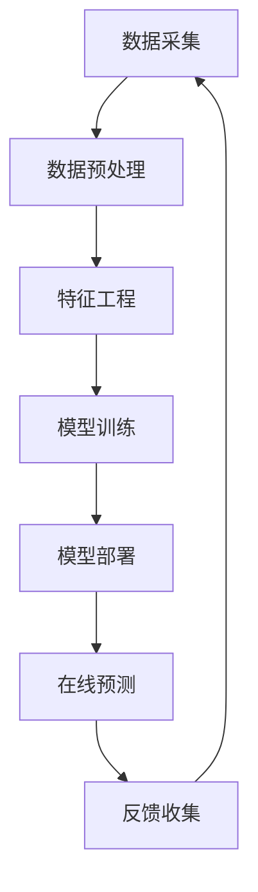

                 

## 1. 背景介绍

当前，人工智能（AI）已经渗透到我们的日常生活中，从搜索引擎到自动驾驶汽车，再到智能手机上的虚拟助手。然而，大多数AI系统都是在传统的软件架构上构建的，它们需要人类提供大量的数据和标签，才能进行学习和改进。这种方法虽然有效，但也存在一些局限性，例如数据的稀缺性、标签的昂贵性，以及模型的泛化能力有限。

最近，一种新的AI方法引起了人们的关注，那就是AI原生应用（AI-native applications）。与传统的AI系统不同，AI原生应用是从设计之初就考虑到AI的存在，它们将AI集成到软件架构的各个层次，从而实现更好的性能、可扩展性和可靠性。本文将深入探讨AI原生应用的概念，其核心概念和架构，关键算法，数学模型，项目实践，实际应用场景，工具和资源推荐，以及未来发展趋势。

## 2. 核心概念与联系

### 2.1 AI原生应用的定义

AI原生应用是一种软件架构，它将AI集成到软件的各个层次，从而实现更好的性能、可扩展性和可靠性。与传统的AI系统不同，AI原生应用是从设计之初就考虑到AI的存在，它们将AI视为软件架构的第一类公民。

### 2.2 AI原生应用的架构

AI原生应用的架构可以用下面的Mermaid流程图表示：



在该架构中，数据采集模块负责收集原始数据，数据预处理模块负责清洗和转换数据，特征工程模块负责提取有用的特征，模型训练模块负责训练AI模型，模型部署模块负责将模型部署到生产环境，在线预测模块负责使用模型进行实时预测，反馈收集模块负责收集用户反馈，并将其用于模型的持续改进。

### 2.3 AI原生应用的优势

AI原生应用具有以下优势：

* **更好的性能**：AI原生应用可以利用AI的优势，实现更好的性能，例如更快的处理速度和更高的准确性。
* **更好的可扩展性**：AI原生应用可以自动学习和适应新的数据，从而实现更好的可扩展性。
* **更好的可靠性**：AI原生应用可以监控系统的运行状态，并自动调整参数以维持系统的稳定性。

## 3. 核心算法原理 & 具体操作步骤

### 3.1 算法原理概述

AI原生应用的核心算法是深度学习算法，它是一种模仿人类神经系统的计算模型。深度学习算法可以自动学习和提取数据中的特征，从而实现更好的预测能力。

### 3.2 算法步骤详解

深度学习算法的步骤如下：

1. **数据预处理**：清洗和转换原始数据，以便于模型学习。
2. **特征工程**：提取数据中的有用特征，以便于模型学习。
3. **模型构建**：构建深度学习模型，并选择合适的激活函数和优化算法。
4. **模型训练**：使用训练数据训练模型，并调整模型参数以最小化损失函数。
5. **模型评估**：使用验证数据评估模型的性能，并调整模型参数以提高性能。
6. **模型部署**：将模型部署到生产环境，并使用模型进行实时预测。

### 3.3 算法优缺点

深度学习算法的优点包括：

* **自动特征提取**：深度学习算法可以自动学习和提取数据中的特征，无需人工干预。
* **高准确性**：深度学习算法可以实现很高的预测准确性，特别是在图像和语音识别等领域。
* **泛化能力**：深度学习算法可以泛化到新的、未见过的数据上。

深度学习算法的缺点包括：

* **计算资源要求高**：深度学习算法需要大量的计算资源，特别是在模型训练阶段。
* **数据要求高**：深度学习算法需要大量的标记数据才能实现高准确性。
* **解释性差**：深度学习算法的决策过程通常是不透明的，很难解释模型的决策过程。

### 3.4 算法应用领域

深度学习算法已经成功应用于许多领域，包括图像识别、语音识别、自然语言处理、自动驾驶汽车、医疗影像分析等。

## 4. 数学模型和公式 & 详细讲解 & 举例说明

### 4.1 数学模型构建

深度学习模型通常使用神经网络表示，它由多个神经元组成，神经元之间通过权重连接。神经网络的数学模型可以表示为：

$$y = f(wx + b)$$

其中，$x$是输入向量，$w$是权重向量，$b$是偏置向量，$f$是激活函数，$y$是输出向量。

### 4.2 公式推导过程

深度学习模型的训练过程是通过最小化损失函数来实现的。损失函数衡量模型的预测结果与真实结果之间的差异。常用的损失函数包括均方误差（MSE）和交叉熵（CE）。例如，MSE损失函数可以表示为：

$$L = \frac{1}{n}\sum_{i=1}^{n}(y_i - \hat{y}_i)^2$$

其中，$y_i$是真实结果，$ \hat{y}_i$是模型的预测结果，$n$是样本数。

### 4.3 案例分析与讲解

例如，假设我们要构建一个图像分类模型，用于识别手写数字。我们可以使用卷积神经网络（CNN）模型，它由多个卷积层和池化层组成。我们可以使用MSE损失函数和随机梯度下降（SGD）优化算法来训练模型。在训练过程中，我们可以使用验证集来评估模型的性能，并调整模型参数以提高性能。一旦模型训练完成，我们就可以使用模型进行实时预测，并将预测结果与真实结果进行比较，以评估模型的性能。

## 5. 项目实践：代码实例和详细解释说明

### 5.1 开发环境搭建

要构建AI原生应用，我们需要搭建开发环境。我们需要安装Python、TensorFlow、Keras等深度学习框架，以及Jupyter Notebook等开发工具。

### 5.2 源代码详细实现

以下是一个简单的深度学习模型的源代码实现，用于识别手写数字：

```python
import tensorflow as tf
from tensorflow.keras.datasets import mnist
from tensorflow.keras.models import Sequential
from tensorflow.keras.layers import Dense, Dropout, Flatten
from tensorflow.keras.layers import Conv2D, MaxPooling2D

# 加载数据
(x_train, y_train), (x_test, y_test) = mnist.load_data()
x_train = x_train.reshape(x_train.shape[0], 28, 28, 1)
x_test = x_test.reshape(x_test.shape[0], 28, 28, 1)
input_shape = (28, 28, 1)

# 构建模型
model = Sequential()
model.add(Conv2D(32, kernel_size=(3, 3),
                 activation='relu',
                 input_shape=input_shape))
model.add(Conv2D(64, (3, 3), activation='relu'))
model.add(MaxPooling2D(pool_size=(2, 2)))
model.add(Dropout(0.25))
model.add(Flatten())
model.add(Dense(128, activation='relu'))
model.add(Dropout(0.5))
model.add(Dense(10, activation='softmax'))

# 编译模型
model.compile(loss=tf.keras.losses.categorical_crossentropy,
              optimizer=tf.keras.optimizers.Adadelta(),
              metrics=['accuracy'])

# 训练模型
model.fit(x_train, y_train,
          batch_size=128,
          epochs=10,
          verbose=1,
          validation_data=(x_test, y_test))
```

### 5.3 代码解读与分析

在上述代码中，我们首先加载手写数字数据集，并将其reshape为合适的形状。然后，我们构建一个CNN模型，它由两个卷积层、一个池化层、一个dropout层、一个flatten层、一个全连接层和一个softmax层组成。我们使用Adadelta优化算法和交叉熵损失函数来编译模型。最后，我们使用训练数据训练模型，并使用验证数据评估模型的性能。

### 5.4 运行结果展示

运行上述代码后，我们可以看到模型的训练过程，以及每个epoch的训练和验证准确度。一旦模型训练完成，我们可以使用模型进行实时预测，并将预测结果与真实结果进行比较，以评估模型的性能。

## 6. 实际应用场景

AI原生应用已经成功应用于许多领域，包括：

* **自动驾驶汽车**：AI原生应用可以帮助自动驾驶汽车感知环境，并做出决策。
* **医疗影像分析**：AI原生应用可以帮助医生分析医疗影像，并做出诊断。
* **金融风险管理**：AI原生应用可以帮助金融机构识别风险，并做出决策。
* **客户服务**：AI原生应用可以帮助企业提供更好的客户服务，例如智能客服和个性化推荐。

### 6.4 未来应用展望

未来，AI原生应用将会继续发展，并应用于更多的领域。例如，AI原生应用可以帮助企业实现更好的自动化和智能化，从而提高生产率和效率。此外，AI原生应用还可以帮助企业实现更好的数据驱动决策，从而提高竞争力。

## 7. 工具和资源推荐

### 7.1 学习资源推荐

以下是一些学习AI原生应用的推荐资源：

* **书籍**：
	+ "Deep Learning" by Ian Goodfellow, Yoshua Bengio, and Aaron Courville
	+ "Hands-On Machine Learning with Scikit-Learn, Keras, and TensorFlow" by Aurélien Géron
* **在线课程**：
	+ "Deep Learning Specialization" by Andrew Ng on Coursera
	+ "Fast.ai Practical Deep Learning for Coders" by Jeremy Howard and Rachel Thomas

### 7.2 开发工具推荐

以下是一些开发AI原生应用的推荐工具：

* **深度学习框架**：
	+ TensorFlow
	+ PyTorch
	+ Keras
* **开发环境**：
	+ Jupyter Notebook
	+ Google Colab
	+ Anaconda

### 7.3 相关论文推荐

以下是一些相关的AI原生应用论文：

* "Deep Learning" by Ian Goodfellow, Yoshua Bengio, and Aaron Courville
* "ImageNet Classification with Deep Convolutional Neural Networks" by Krizhevsky, Sutskever, and Hinton
* "A Survey of Deep Learning on Graph Data" by Zeng, Zhang, and Chen

## 8. 总结：未来发展趋势与挑战

### 8.1 研究成果总结

本文介绍了AI原生应用的概念，其核心概念和架构，关键算法，数学模型，项目实践，实际应用场景，工具和资源推荐，以及未来发展趋势。我们还提供了一个简单的深度学习模型的源代码实现，用于识别手写数字。

### 8.2 未来发展趋势

未来，AI原生应用将会继续发展，并应用于更多的领域。例如，AI原生应用可以帮助企业实现更好的自动化和智能化，从而提高生产率和效率。此外，AI原生应用还可以帮助企业实现更好的数据驱动决策，从而提高竞争力。

### 8.3 面临的挑战

然而，AI原生应用也面临着一些挑战，例如：

* **数据安全**：AI原生应用需要大量的数据才能实现高准确性，但这也带来了数据安全的风险。
* **模型解释性**：深度学习模型的决策过程通常是不透明的，很难解释模型的决策过程。
* **计算资源要求高**：深度学习算法需要大量的计算资源，特别是在模型训练阶段。

### 8.4 研究展望

未来的研究方向包括：

* **自监督学习**：自监督学习可以帮助模型学习更多的特征，从而提高模型的泛化能力。
* **联邦学习**：联邦学习可以帮助模型在保护数据隐私的情况下进行学习和改进。
* **可解释AI**：可解释AI可以帮助我们理解模型的决策过程，从而提高模型的可靠性和可信度。

## 9. 附录：常见问题与解答

**Q1：什么是AI原生应用？**

A1：AI原生应用是一种软件架构，它将AI集成到软件的各个层次，从而实现更好的性能、可扩展性和可靠性。与传统的AI系统不同，AI原生应用是从设计之初就考虑到AI的存在，它们将AI视为软件架构的第一类公民。

**Q2：AI原生应用的优势是什么？**

A2：AI原生应用具有以下优势：

* **更好的性能**：AI原生应用可以利用AI的优势，实现更好的性能，例如更快的处理速度和更高的准确性。
* **更好的可扩展性**：AI原生应用可以自动学习和适应新的数据，从而实现更好的可扩展性。
* **更好的可靠性**：AI原生应用可以监控系统的运行状态，并自动调整参数以维持系统的稳定性。

**Q3：AI原生应用的核心算法是什么？**

A3：AI原生应用的核心算法是深度学习算法，它是一种模仿人类神经系统的计算模型。深度学习算法可以自动学习和提取数据中的特征，从而实现更好的预测能力。

**Q4：如何构建AI原生应用？**

A4：构建AI原生应用需要以下步骤：

1. **数据预处理**：清洗和转换原始数据，以便于模型学习。
2. **特征工程**：提取数据中的有用特征，以便于模型学习。
3. **模型构建**：构建深度学习模型，并选择合适的激活函数和优化算法。
4. **模型训练**：使用训练数据训练模型，并调整模型参数以最小化损失函数。
5. **模型评估**：使用验证数据评估模型的性能，并调整模型参数以提高性能。
6. **模型部署**：将模型部署到生产环境，并使用模型进行实时预测。

**Q5：AI原生应用的未来发展趋势是什么？**

A5：未来，AI原生应用将会继续发展，并应用于更多的领域。例如，AI原生应用可以帮助企业实现更好的自动化和智能化，从而提高生产率和效率。此外，AI原生应用还可以帮助企业实现更好的数据驱动决策，从而提高竞争力。

!!!Note
作者：禅与计算机程序设计艺术 / Zen and the Art of Computer Programming

