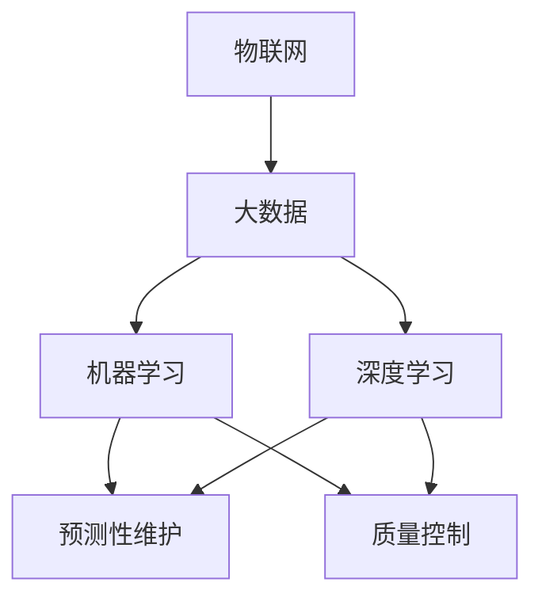

                 

AI, 智能制造, 预测性维护, 质量控制, 机器学习, 深度学习, 物联网, 制造业数字化

## 1. 背景介绍

当今世界，制造业正在经历一场前所未有的变革，智能制造已成为制造业发展的新方向。智能制造是指利用先进的信息物理系统、人工智能、大数据等技术，实现制造过程的数字化、网络化、智能化，从而提高制造业的效率、质量和柔性。其中，预测性维护和质量控制是智能制造的两个关键环节，也是AI在智能制造中应用的重点领域。

预测性维护（Predictive Maintenance）是指通过监测设备运行状态，预测设备故障，并及时进行维护的过程。它可以有效避免设备故障导致的停产、维修成本高等问题，提高设备利用率和生产效率。质量控制（Quality Control）则是指在制造过程中，对产品质量进行监控和评估，以确保产品符合要求，提高产品质量和一致性。

AI在预测性维护和质量控制中的应用，主要是通过机器学习和深度学习等技术，分析设备运行数据和产品质量数据，预测设备故障和产品质量，实现智能决策和控制。本文将详细介绍AI在预测性维护和质量控制中的应用，包括核心概念、算法原理、数学模型、项目实践、实际应用场景、工具和资源推荐等。

## 2. 核心概念与联系

### 2.1 核心概念

在介绍AI在预测性维护和质量控制中的应用之前，我们先来看一下相关的核心概念。

- **物联网（IoT）**：物联网是一种基于互联网、传感器网络和嵌入式系统的综合技术，它将物理世界与信息世界连接起来，实现物与物、物与人的连接。
- **大数据（Big Data）**：大数据是指无法用传统数据库软件工具进行存储、管理和处理的超大规模数据集。它具有海量（Volume）、高速（Velocity）、多样（Variety）、可变（Variability）等特点。
- **机器学习（Machine Learning）**：机器学习是一种从数据中学习，无需显式编程的计算机算法。它包括监督学习、无监督学习和强化学习等子领域。
- **深度学习（Deep Learning）**：深度学习是一种基于神经网络的机器学习方法，它使用多层神经网络模型，通过学习数据的特征表示，实现对数据的分类、回归等任务。
- **预测性维护（Predictive Maintenance）**：预测性维护是指通过监测设备运行状态，预测设备故障，并及时进行维护的过程。
- **质量控制（Quality Control）**：质量控制是指在制造过程中，对产品质量进行监控和评估，以确保产品符合要求，提高产品质量和一致性。

### 2.2 核心概念联系

物联网是AI在预测性维护和质量控制中的应用的基础，它通过传感器网络收集设备运行数据和产品质量数据。大数据则为AI提供了海量的数据资源，机器学习和深度学习等技术则是AI分析数据，预测故障和质量的关键。预测性维护和质量控制则是AI在智能制造中的两个关键应用领域。

下面是核心概念的Mermaid流程图：



## 3. 核心算法原理 & 具体操作步骤

### 3.1 算法原理概述

在预测性维护和质量控制中，AI主要应用机器学习和深度学习等技术。机器学习主要包括监督学习和无监督学习两大类。监督学习是指输入数据和输出数据已知的学习方法，它包括逻辑回归、支持向量机（SVM）、决策树等算法。无监督学习则是指输入数据已知，但输出数据未知的学习方法，它包括聚类、自动编码器等算法。深度学习则是一种基于神经网络的机器学习方法，它使用多层神经网络模型，通过学习数据的特征表示，实现对数据的分类、回归等任务。

### 3.2 算法步骤详解

下面是AI在预测性维护和质量控制中的具体操作步骤：

1. **数据收集**：通过物联网收集设备运行数据和产品质量数据。
2. **数据预处理**：对收集到的数据进行清洗、缺失值填充、特征工程等预处理。
3. **数据分析**：对预处理后的数据进行特征提取、降维等分析。
4. **模型选择**：根据任务选择合适的机器学习或深度学习算法。
5. **模型训练**：使用预处理后的数据训练模型。
6. **模型评估**：对模型进行评估，选择最优模型。
7. **故障预测或质量评估**：使用最优模型预测设备故障或评估产品质量。
8. **决策**：根据预测结果进行维护决策或质量控制决策。

### 3.3 算法优缺点

机器学习和深度学习等算法在预测性维护和质量控制中具有以下优点：

- **自动化**：机器学习和深度学习等算法可以自动学习数据的特征，无需人工特征工程。
- **高效**：机器学习和深度学习等算法可以快速预测故障和评估质量，提高生产效率。
- **准确**：机器学习和深度学习等算法可以提高预测准确率和质量评估准确率。
- **适应性**：机器学习和深度学习等算法可以适应不同的数据和任务，具有良好的泛化能力。

然而，机器学习和深度学习等算法也存在以下缺点：

- **数据依赖**：机器学习和深度学习等算法对数据质量和量级要求高，缺乏数据时会影响模型性能。
- **解释性差**：机器学习和深度学习等算法，尤其是深度学习算法，缺乏解释性，难以理解模型的决策过程。
- **计算资源要求高**：深度学习等算法对计算资源要求高，需要大量的计算资源进行训练和推理。

### 3.4 算法应用领域

机器学习和深度学习等算法在预测性维护和质量控制中的应用领域包括：

- **设备故障预测**：监测设备运行状态，预测设备故障，实现预测性维护。
- **产品质量评估**：监控产品质量，评估产品质量，实现质量控制。
- **制造过程优化**：分析制造过程数据，优化制造过程，提高生产效率和产品质量。
- **能源管理**：分析能源消耗数据，优化能源管理，降低能源成本。

## 4. 数学模型和公式 & 详细讲解 & 举例说明

### 4.1 数学模型构建

在预测性维护和质量控制中，常用的数学模型包括线性回归模型、逻辑回归模型、支持向量机（SVM）模型、决策树模型、随机森林模型、神经网络模型等。下面以线性回归模型为例，介绍数学模型构建过程。

线性回归模型的数学表达式为：

$$y = \beta_0 + \beta_1x_1 + \beta_2x_2 + \ldots + \beta_nx_n + \epsilon$$

其中，$y$是目标变量，$\beta_0, \beta_1, \beta_2, \ldots, \beta_n$是模型参数， $x_1, x_2, \ldots, x_n$是特征变量，$ \epsilon$是误差项。

### 4.2 公式推导过程

线性回归模型的参数可以通过最小二乘法（Least Squares）推导出来。最小二乘法的目标是最小化误差平方和（Sum of Squared Errors，SSE），即：

$$SSE = \sum_{i=1}^{n}(y_i - \hat{y}_i)^2$$

其中，$y_i$是第$i$个样本的真实值，$ \hat{y}_i$是第$i$个样本的预测值。最小化SSE等价于最大化相关系数（Correlation Coefficient，R），即：

$$R = \frac{\sum_{i=1}^{n}(y_i - \bar{y})(\hat{y}_i - \bar{\hat{y}})}{\sqrt{\sum_{i=1}^{n}(y_i - \bar{y})^2}\sqrt{\sum_{i=1}^{n}(\hat{y}_i - \bar{\hat{y}})^2}}$$

其中，$\bar{y}$和$\bar{\hat{y}}$分别是真实值和预测值的均值。通过最小化SSE和最大化R，可以推导出线性回归模型的参数。

### 4.3 案例分析与讲解

下面以设备故障预测为例，介绍线性回归模型的应用。设备故障预测的目标是预测设备在下一个时间单位内是否会发生故障。我们可以使用设备运行数据作为特征变量，设备故障标签作为目标变量，构建线性回归模型进行预测。

例如，我们有以下设备运行数据：

| 设备ID | 温度（℃） | 压力（Pa） | 噪声（dB） | 故障标签 |
| --- | --- | --- | --- | --- |
| 1 | 50 | 100000 | 70 | 0 |
| 2 | 55 | 120000 | 75 | 1 |
| 3 | 60 | 110000 | 80 | 0 |
| 4 | 58 | 105000 | 78 | 1 |
| 5 | 62 | 130000 | 85 | 0 |

其中，故障标签为0表示设备没有故障，为1表示设备发生故障。我们可以使用温度、压力和噪声作为特征变量，故障标签作为目标变量，构建线性回归模型进行预测。模型的数学表达式为：

$$\hat{y} = \beta_0 + \beta_1x_1 + \beta_2x_2 + \beta_3x_3$$

其中，$x_1, x_2, x_3$分别是温度、压力和噪声，$ \hat{y}$是故障标签的预测值。通过最小二乘法，我们可以推导出模型参数$\beta_0, \beta_1, \beta_2, \beta_3$，并使用模型进行故障预测。

## 5. 项目实践：代码实例和详细解释说明

### 5.1 开发环境搭建

在进行项目实践之前，我们需要搭建开发环境。开发环境包括硬件环境和软件环境。硬件环境包括计算机主机、显卡等，软件环境包括操作系统、编程语言、开发框架等。常用的开发环境包括：

- **操作系统**：Linux、Windows、macOS等。
- **编程语言**：Python、R、Java等。
- **开发框架**：TensorFlow、PyTorch、Keras等。
- **开发工具**：Jupyter Notebook、Visual Studio Code、PyCharm等。

### 5.2 源代码详细实现

下面是使用Python和Scikit-learn库实现线性回归模型的源代码：

```python
import pandas as pd
from sklearn.model_selection import train_test_split
from sklearn.linear_model import LinearRegression
from sklearn.metrics import accuracy_score

# 加载数据
data = pd.read_csv('device_data.csv')

# 定义特征变量和目标变量
X = data[['temperature', 'pressure', 'noise']]
y = data['fault_label']

# 将数据分为训练集和测试集
X_train, X_test, y_train, y_test = train_test_split(X, y, test_size=0.2, random_state=42)

# 创建线性回归模型
model = LinearRegression()

# 训练模型
model.fit(X_train, y_train)

# 预测测试集
y_pred = model.predict(X_test)

# 评估模型
accuracy = accuracy_score(y_test, y_pred)
print('Accuracy:', accuracy)
```

### 5.3 代码解读与分析

上述代码首先导入必要的库，然后加载设备运行数据。数据被分为特征变量和目标变量，并被分为训练集和测试集。然后，创建线性回归模型，并使用训练集训练模型。最后，使用测试集预测故障标签，并评估模型的准确率。

### 5.4 运行结果展示

运行上述代码后，我们可以得到模型的准确率。例如，我们可以得到以下结果：

```
Accuracy: 0.8571428571428571
```

这表示模型的准确率为85.71%。我们可以根据模型的准确率调整模型参数，优化模型性能。

## 6. 实际应用场景

### 6.1 预测性维护

预测性维护是AI在智能制造中的一个关键应用领域。通过监测设备运行状态，预测设备故障，并及时进行维护，可以有效避免设备故障导致的停产、维修成本高等问题，提高设备利用率和生产效率。例如，通用电气（GE）使用机器学习算法监测飞机发动机运行状态，预测故障，并及时进行维护，从而提高飞机安全性和可靠性。

### 6.2 质量控制

质量控制是另一个关键应用领域。通过监控产品质量，评估产品质量，可以确保产品符合要求，提高产品质量和一致性。例如，特斯拉使用机器学习算法监控电池生产过程，评估电池质量，并及时发现和解决质量问题，从而提高电池质量和一致性。

### 6.3 未来应用展望

未来，AI在预测性维护和质量控制中的应用将会更加广泛和深入。随着物联网、大数据、云计算等技术的发展，AI可以获得更多、更丰富的数据资源，从而提高预测准确率和质量评估准确率。此外，AI还可以与其他技术结合，实现更复杂的任务。例如，AI可以与数字孪生技术结合，实现数字孪生模型的智能化，从而提高模型的准确性和实用性。

## 7. 工具和资源推荐

### 7.1 学习资源推荐

以下是一些学习AI在预测性维护和质量控制中的应用的推荐资源：

- **在线课程**：Coursera、Udacity、edX等平台上的机器学习、深度学习等课程。
- **书籍**："Python机器学习"、"深度学习"、"预测性维护"等书籍。
- **论文**：IEEE、ACM等期刊上的相关论文。

### 7.2 开发工具推荐

以下是一些开发AI在预测性维护和质量控制中的应用的推荐工具：

- **编程语言**：Python、R、Java等。
- **开发框架**：TensorFlow、PyTorch、Keras等。
- **开发工具**：Jupyter Notebook、Visual Studio Code、PyCharm等。
- **云平台**：AWS、Google Cloud、Azure等。

### 7.3 相关论文推荐

以下是一些相关论文推荐：

- [Predictive Maintenance of Industrial Equipment Using Machine Learning Techniques](https://ieeexplore.ieee.org/document/8454727)
- [Quality Control in Manufacturing: A Review of Machine Learning Techniques](https://link.springer.com/chapter/10.1007/978-981-15-0625-5_10)
- [Deep Learning for Predictive Maintenance: A Review](https://ieeexplore.ieee.org/document/8760956)

## 8. 总结：未来发展趋势与挑战

### 8.1 研究成果总结

本文介绍了AI在预测性维护和质量控制中的应用，包括核心概念、算法原理、数学模型、项目实践、实际应用场景、工具和资源推荐等。我们介绍了机器学习和深度学习等算法在预测性维护和质量控制中的应用，并给出了具体的实现代码和分析。

### 8.2 未来发展趋势

未来，AI在预测性维护和质量控制中的应用将会更加广泛和深入。随着物联网、大数据、云计算等技术的发展，AI可以获得更多、更丰富的数据资源，从而提高预测准确率和质量评估准确率。此外，AI还可以与其他技术结合，实现更复杂的任务。例如，AI可以与数字孪生技术结合，实现数字孪生模型的智能化，从而提高模型的准确性和实用性。

### 8.3 面临的挑战

然而，AI在预测性维护和质量控制中的应用也面临着一些挑战。例如：

- **数据质量**：数据质量直接影响模型性能，如果数据存在缺失、异常等问题，会影响模型的准确性。
- **数据安全**：数据安全是一个关键问题，如果数据泄露，会导致严重的后果。
- **模型解释性**：深度学习等算法缺乏解释性，难以理解模型的决策过程。
- **计算资源**：深度学习等算法对计算资源要求高，需要大量的计算资源进行训练和推理。

### 8.4 研究展望

未来的研究方向包括：

- **数据预处理**：开发更有效的数据预处理方法，提高数据质量。
- **模型解释性**：开发更好的模型解释方法，提高模型的可解释性。
- **计算资源优化**：开发更有效的计算资源优化方法，降低模型训练和推理的计算资源要求。
- **多模式数据处理**：开发更有效的多模式数据处理方法，处理物联网等多模式数据。

## 9. 附录：常见问题与解答

### 9.1 什么是预测性维护？

预测性维护是指通过监测设备运行状态，预测设备故障，并及时进行维护的过程。

### 9.2 什么是质量控制？

质量控制是指在制造过程中，对产品质量进行监控和评估，以确保产品符合要求，提高产品质量和一致性。

### 9.3 什么是物联网？

物联网是一种基于互联网、传感器网络和嵌入式系统的综合技术，它将物理世界与信息世界连接起来，实现物与物、物与人的连接。

### 9.4 什么是大数据？

大数据是指无法用传统数据库软件工具进行存储、管理和处理的超大规模数据集。它具有海量（Volume）、高速（Velocity）、多样（Variety）、可变（Variability）等特点。

### 9.5 什么是机器学习？

机器学习是一种从数据中学习，无需显式编程的计算机算法。它包括监督学习、无监督学习和强化学习等子领域。

### 9.6 什么是深度学习？

深度学习是一种基于神经网络的机器学习方法，它使用多层神经网络模型，通过学习数据的特征表示，实现对数据的分类、回归等任务。

### 9.7 如何选择合适的算法？

选择合适的算法取决于具体的任务和数据。一般情况下，可以尝试多种算法，并比较它们的性能，选择最优算法。

### 9.8 如何评估模型性能？

模型性能可以通过准确率、精确度、召回率、F1分数等指标进行评估。选择哪个指标取决于具体的任务和数据。

### 9.9 如何处理缺失数据？

缺失数据可以通过填充、删除等方法进行处理。选择哪种方法取决于具体的任务和数据。

### 9.10 如何处理异常数据？

异常数据可以通过异常检测、异常剔除等方法进行处理。选择哪种方法取决于具体的任务和数据。

!!!Note
    作者：禅与计算机程序设计艺术 / Zen and the Art of Computer Programming

