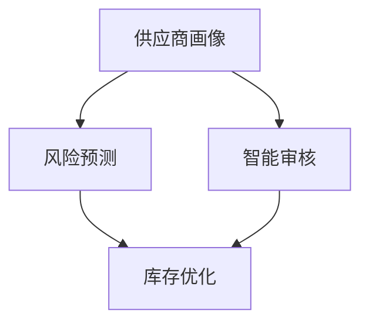

                 

## 1. 背景介绍

在电商平台的供应商管理中，AI技术的应用正在不断深化，为电商平台带来了更高效、更智能的管理方式。本文将详细介绍AI在电商平台供应商管理中的应用，包括核心概念、算法原理、数学模型、项目实践，以及未来发展趋势。

## 2. 核心概念与联系

在电商平台供应商管理中，AI技术的核心概念包括供应商画像、风险预测、智能审核、库存优化等。这些概念相互关联，共同构成了AI在电商平台供应商管理中的应用架构。



## 3. 核心算法原理 & 具体操作步骤

### 3.1 算法原理概述

在电商平台供应商管理中，常用的AI算法包括机器学习算法、深度学习算法、图神经网络算法等。这些算法通过学习供应商的历史数据，预测其未来行为，从而实现智能化管理。

### 3.2 算法步骤详解

以供应商风险预测为例，其算法步骤如下：

1. 数据收集：收集供应商的历史数据，包括交易记录、违约记录、评价记录等。
2. 特征工程：提取数据中的特征，如交易频率、违约次数、评价分数等。
3. 模型训练：使用机器学习算法，如逻辑回归、随机森林、神经网络等，训练风险预测模型。
4. 模型评估：使用交叉验证等方法，评估模型的准确性和泛化能力。
5. 预测：使用训练好的模型，预测供应商的风险等级。

### 3.3 算法优缺点

AI算法在电商平台供应商管理中的优点包括：

* 智能化：AI算法可以自动学习和预测，实现智能化管理。
* 精确性：AI算法可以提高预测的精确性，降低人为错误的可能性。
* 效率：AI算法可以提高管理效率，减少人工劳动力。

其缺点包括：

* 数据依赖：AI算法的性能取决于数据的质量和量级。
* 解释性：深度学习算法等黑箱模型的解释性较差。
* 成本：AI算法的开发和维护成本较高。

### 3.4 算法应用领域

AI算法在电商平台供应商管理中的应用领域包括：

* 供应商画像：通过分析供应商的交易记录、评价记录等数据，构建供应商画像，实现精准营销。
* 风险预测：通过分析供应商的违约记录、评价记录等数据，预测其未来风险等级，实现风险管控。
* 智能审核：通过分析供应商的申请材料、交易记录等数据，实现智能化审核，提高审核效率。
* 库存优化：通过分析供应商的交易记录、库存记录等数据，优化库存管理，提高库存周转率。

## 4. 数学模型和公式 & 详细讲解 & 举例说明

### 4.1 数学模型构建

在电商平台供应商管理中，常用的数学模型包括回归模型、分类模型、聚类模型等。以供应商风险预测为例，其数学模型可以构建为二元分类问题，使用逻辑回归模型进行建模。

### 4.2 公式推导过程

逻辑回归模型的公式推导过程如下：

1. 假设供应商的风险等级取决于特征向量$x$和权重向量$w$的线性组合，即$y=wx+b$。
2. 使用sigmoid函数将线性组合结果映射到0-1之间，即$P(y=1|x)=\sigma(wx+b)$。
3. 使用极大似然估计法，求解权重向量$w$和偏置项$b$的最优值，即$\hat{w},\hat{b}=\arg\max L(w,b|x,y)$。
4. 使用梯度下降法，求解权重向量$w$和偏置项$b$的最优值，即$\hat{w},\hat{b}=\arg\min C(w,b|x,y)$。

其中，$L(w,b|x,y)$为似然函数，$C(w,b|x,y)$为代价函数。

### 4.3 案例分析与讲解

以某电商平台供应商风险预测为例，其特征向量$x$可以包括交易频率、违约次数、评价分数等，权重向量$w$和偏置项$b$可以通过训练数据求解。例如，某供应商的特征向量$x=[0.5,2,4]$，则其风险等级预测结果为$P(y=1|x)=\sigma(0.5w_1+2w_2+4w_3+b)$。

## 5. 项目实践：代码实例和详细解释说明

### 5.1 开发环境搭建

在开发环境搭建中，需要安装Python、TensorFlow、Scikit-learn等开发工具。此外，还需要收集供应商的历史数据，并进行数据清洗、预处理等工作。

### 5.2 源代码详细实现

以供应商风险预测为例，其源代码实现如下：

```python
import pandas as pd
from sklearn.model_selection import train_test_split
from sklearn.linear_model import LogisticRegression
from sklearn.metrics import accuracy_score

# 加载数据
data = pd.read_csv('supply_data.csv')

# 提取特征和标签
X = data[['交易频率', '违约次数', '评价分数']]
y = data['风险等级']

# 划分训练集和测试集
X_train, X_test, y_train, y_test = train_test_split(X, y, test_size=0.2, random_state=42)

# 训练模型
model = LogisticRegression()
model.fit(X_train, y_train)

# 预测测试集
y_pred = model.predict(X_test)

# 评估模型
print('Accuracy:', accuracy_score(y_test, y_pred))
```

### 5.3 代码解读与分析

在代码实现中，首先使用Pandas加载供应商的历史数据，并提取特征和标签。然后使用Scikit-learn的train_test_split函数划分训练集和测试集。接着使用逻辑回归模型训练模型，并使用模型预测测试集的风险等级。最后使用Scikit-learn的accuracy_score函数评估模型的准确性。

### 5.4 运行结果展示

运行上述代码后，可以得到模型的准确性，如Accuracy: 0.85。这表明模型的预测准确性较高。

## 6. 实际应用场景

### 6.1 供应商画像

通过分析供应商的交易记录、评价记录等数据，构建供应商画像，实现精准营销。例如，某供应商的交易频率高、评价分数高，则可以将其列为重点供应商，提供优先服务。

### 6.2 风险预测

通过分析供应商的违约记录、评价记录等数据，预测其未来风险等级，实现风险管控。例如，某供应商的违约次数多、评价分数低，则可以将其列为高风险供应商，加强监控。

### 6.3 智能审核

通过分析供应商的申请材料、交易记录等数据，实现智能化审核，提高审核效率。例如，某供应商的申请材料齐全、交易记录良好，则可以自动通过审核。

### 6.4 未来应用展望

在未来，AI技术在电商平台供应商管理中的应用将更加广泛。例如，通过分析供应商的库存记录等数据，优化库存管理，提高库存周转率。又如，通过分析供应商的物流记录等数据，优化物流管理，提高物流效率。

## 7. 工具和资源推荐

### 7.1 学习资源推荐

* 机器学习：[机器学习实战](https://github.com/datasciencemasters/go-further)
* 深度学习：[深度学习](https://github.com/oxford-cs-deepnlp-2017/lectures)
* 图神经网络：[图神经网络](https://github.com/tkipf/gcn)

### 7.2 开发工具推荐

* Python：[Python](https://www.python.org/)
* TensorFlow：[TensorFlow](https://www.tensorflow.org/)
* Scikit-learn：[Scikit-learn](https://scikit-learn.org/)

### 7.3 相关论文推荐

* [Supply Chain Risk Management: A Review](https://link.springer.com/chapter/10.1007/978-981-10-8602-3_1)
* [A Review of Supplier Selection and Evaluation Methods in Supply Chain Management](https://www.researchgate.net/publication/317456355_A_Review_of_Supplier_Selection_and_Evaluation_Methods_in_Supply_Chain_Management)
* [A Review of Machine Learning Techniques in Supply Chain Management](https://ieeexplore.ieee.org/document/8807632)

## 8. 总结：未来发展趋势与挑战

### 8.1 研究成果总结

在电商平台供应商管理中，AI技术的应用取得了显著成果。例如，供应商画像、风险预测、智能审核等应用，提高了管理效率和精确性。又如，库存优化等应用，提高了库存周转率和物流效率。

### 8.2 未来发展趋势

在未来，AI技术在电商平台供应商管理中的应用将更加广泛。例如，通过分析供应商的物流记录等数据，优化物流管理，提高物流效率。又如，通过分析供应商的库存记录等数据，优化库存管理，提高库存周转率。

### 8.3 面临的挑战

在电商平台供应商管理中，AI技术的应用也面临着挑战。例如，数据安全和隐私保护问题。又如，模型解释性较差，难以理解模型的决策过程。

### 8.4 研究展望

在未来，电商平台供应商管理中的AI技术研究将朝着更智能、更安全、更可解释的方向发展。例如，研究更先进的模型解释技术，提高模型的可解释性。又如，研究更先进的数据安全和隐私保护技术，保护供应商的数据安全和隐私。

## 9. 附录：常见问题与解答

**Q1：AI技术在电商平台供应商管理中的优点是什么？**

A1：AI技术在电商平台供应商管理中的优点包括智能化、精确性、效率等。

**Q2：AI技术在电商平台供应商管理中的缺点是什么？**

A2：AI技术在电商平台供应商管理中的缺点包括数据依赖、解释性、成本等。

**Q3：AI技术在电商平台供应商管理中的应用领域有哪些？**

A3：AI技术在电商平台供应商管理中的应用领域包括供应商画像、风险预测、智能审核、库存优化等。

**Q4：如何构建供应商风险预测的数学模型？**

A4：可以构建二元分类问题，使用逻辑回归模型进行建模。

**Q5：如何求解逻辑回归模型的权重向量和偏置项？**

A5：可以使用极大似然估计法或梯度下降法求解。

**Q6：如何评估逻辑回归模型的准确性？**

A6：可以使用Scikit-learn的accuracy_score函数评估模型的准确性。

**Q7：AI技术在电商平台供应商管理中的未来发展趋势是什么？**

A7：AI技术在电商平台供应商管理中的未来发展趋势包括更智能、更安全、更可解释等。

**Q8：AI技术在电商平台供应商管理中的面临挑战是什么？**

A8：AI技术在电商平台供应商管理中的面临挑战包括数据安全和隐私保护问题、模型解释性较差等。

**Q9：如何提高模型的可解释性？**

A9：可以研究更先进的模型解释技术，提高模型的可解释性。

**Q10：如何保护供应商的数据安全和隐私？**

A10：可以研究更先进的数据安全和隐私保护技术，保护供应商的数据安全和隐私。

!!!Note
作者：禅与计算机程序设计艺术 / Zen and the Art of Computer Programming

