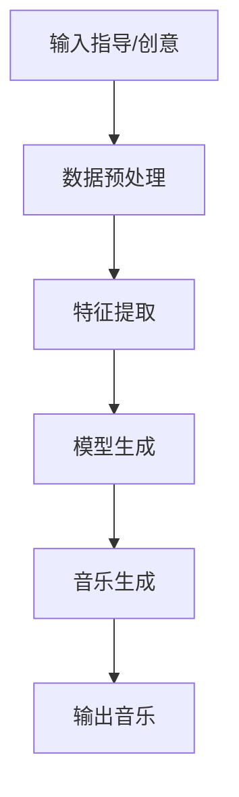

                 

## 1. 背景介绍

音乐创作是一项复杂的创造性活动，长期以来被认为是人类独有的领域。然而，随着人工智能（AI）技术的发展，AI在音乐创作中的应用变得越来越普遍。AI可以帮助音乐家和作曲家提高工作效率，扩展创作范围，甚至独立创作音乐。本文将探讨AI在音乐创作中的应用，重点介绍人机协作的新模式。

## 2. 核心概念与联系

### 2.1 AI在音乐创作中的角色

AI在音乐创作中的角色可以分为三种：

1. **辅助工具**：AI可以作为音乐家的助手，帮助他们完成繁琐的任务，如谱曲、和声等。
2. **协作伙伴**：AI可以与音乐家合作，共同创作音乐。人类提供创意指导，AI则根据这些指导进行创作。
3. **独立创作者**：AI可以独立创作音乐，无需人类的干预。

### 2.2 人机协作模式

人机协作模式可以分为以下几种：

1. **人类主导**：人类提供创意指导，AI根据这些指导进行创作。
2. **AI主导**：AI提供创意，人类对其进行修改和完善。
3. **共同创作**：人类和AI共同创作音乐，互相影响和学习。

### 2.3 核心概念原理与架构

AI在音乐创作中的原理主要基于机器学习和深度学习技术。AI通过学习大量的音乐数据，如旋律、和声、节奏等，建立音乐创作的模型。然后，根据输入的指导或创意，AI生成新的音乐。

下面是AI音乐创作的简化架构：



## 3. 核心算法原理 & 具体操作步骤

### 3.1 算法原理概述

AI音乐创作的核心算法是生成对抗网络（GAN）和变分自编码器（VAE）。GAN由生成器和判别器组成，生成器负责生成音乐，判别器负责判断生成的音乐是否真实。VAE则通过学习音乐的分布，生成新的音乐。

### 3.2 算法步骤详解

1. **数据预处理**：收集大量的音乐数据，并将其转换为机器可以理解的格式，如MIDI文件。
2. **特征提取**：提取音乐数据中的关键特征，如旋律、和声、节奏等。
3. **模型训练**：使用GAN或VAE等算法，训练音乐创作模型。
4. **音乐生成**：根据输入的指导或创意，使用训练好的模型生成新的音乐。
5. **输出音乐**：将生成的音乐转换为人类可以理解的格式，如WAV文件。

### 3.3 算法优缺点

**优点**：

* AI可以帮助音乐家提高工作效率，扩展创作范围。
* AI可以独立创作音乐，无需人类的干预。
* AI可以帮助音乐家突破创作瓶颈，提供新的创意。

**缺点**：

* AI生成的音乐可能缺乏人类音乐的情感和个性。
* AI音乐创作的质量可能不稳定，需要大量的数据和计算资源。
* AI音乐创作的版权问题尚未明确。

### 3.4 算法应用领域

AI音乐创作的应用领域包括：

* **音乐生成**：AI可以独立创作音乐，无需人类的干预。
* **音乐改编**：AI可以帮助音乐家改编音乐，适应不同的乐器或场合。
* **音乐辅助**：AI可以帮助音乐家完成繁琐的任务，如谱曲、和声等。

## 4. 数学模型和公式 & 详细讲解 & 举例说明

### 4.1 数学模型构建

AI音乐创作的数学模型可以表示为：

$$P(G|D) = \frac{P(D|G)P(G)}{P(D)}$$

其中，$P(G|D)$表示给定数据$D$的模型$G$的后验概率，$P(D|G)$表示数据$D$给定模型$G$的似然，$P(G)$表示模型$G$的先验概率，$P(D)$表示数据$D$的边缘概率。

### 4.2 公式推导过程

推导过程如下：

1. 根据贝叶斯定理，我们有：

$$P(G|D) = \frac{P(D|G)P(G)}{P(D)}$$

2. 似然$P(D|G)$表示数据$D$给定模型$G$的概率。在音乐创作中，数据$D$是音乐数据，模型$G$是音乐创作模型。似然可以通过最大化对数似然函数来估计：

$$\log P(D|G) = \sum_{i=1}^{N}\log P(d_i|G)$$

其中，$d_i$表示数据集$D$中的第$i$个数据，$N$表示数据集$D$的大小。

3. 先验$P(G)$表示模型$G$的概率。在音乐创作中，先验可以表示为模型的复杂度或参数的分布。

4. 边缘概率$P(D)$表示数据$D$的概率。在音乐创作中，边缘概率可以表示为音乐数据的分布。

### 4.3 案例分析与讲解

例如，假设我们要构建一个音乐创作模型，生成类似于贝多芬的音乐。我们可以收集大量的贝多芬音乐数据，并将其转换为机器可以理解的格式，如MIDI文件。然后，我们可以使用GAN或VAE等算法，训练音乐创作模型。最后，根据输入的指导或创意，使用训练好的模型生成新的音乐。

## 5. 项目实践：代码实例和详细解释说明

### 5.1 开发环境搭建

要实现AI音乐创作，我们需要以下软件和库：

* Python：AI音乐创作的主要编程语言。
* TensorFlow或PyTorch：用于构建和训练音乐创作模型的深度学习框架。
* MIDIUtil：用于处理MIDI文件的库。
* MuseGAN或Magenta：用于音乐创作的开源项目。

### 5.2 源代码详细实现

以下是AI音乐创作的简化源代码：

```python
import tensorflow as tf
import midiutil
import numpy as np

# 定义音乐创作模型
class MusicGenerator(tf.keras.Model):
    def __init__(self):
        super(MusicGenerator, self).__init__()
        # 定义模型结构

    def call(self, inputs):
        # 定义模型的前向传播过程

# 训练音乐创作模型
def train(model, data, epochs):
    # 定义训练过程

# 生成音乐
def generate(model, num_notes):
    # 定义音乐生成过程

# 主函数
def main():
    # 加载数据
    # 定义模型
    # 训练模型
    # 生成音乐

if __name__ == "__main__":
    main()
```

### 5.3 代码解读与分析

* `MusicGenerator`类定义了音乐创作模型的结构和前向传播过程。
* `train`函数定义了音乐创作模型的训练过程。
* `generate`函数定义了音乐生成过程。
* `main`函数是程序的入口，负责加载数据，定义模型，训练模型，并生成音乐。

### 5.4 运行结果展示

运行程序后，我们可以得到生成的音乐文件。我们可以使用音乐播放器播放这些文件，并评估其质量。

## 6. 实际应用场景

### 6.1 当前应用

AI音乐创作已经在音乐行业得到广泛应用。例如，sony music使用AI创作了第一首流行歌曲"Daddy's Car"。此外，AI音乐创作还被用于电影配乐、游戏音乐等领域。

### 6.2 未来应用展望

未来，AI音乐创作可能会得到更广泛的应用。例如，AI可以帮助音乐家突破创作瓶颈，提供新的创意。AI还可以帮助音乐家改编音乐，适应不同的乐器或场合。此外，AI音乐创作还可能会发展出新的音乐风格和流派。

## 7. 工具和资源推荐

### 7.1 学习资源推荐

* "Generative Models for Music Generation"：一篇综述文章，介绍了音乐生成模型的最新进展。
* "A Survey of Deep Learning in Music"：一篇综述文章，介绍了深度学习在音乐领域的应用。
* "Magenta"：一个开源项目，提供了音乐创作的工具和资源。

### 7.2 开发工具推荐

* TensorFlow或PyTorch：用于构建和训练音乐创作模型的深度学习框架。
* MIDIUtil：用于处理MIDI文件的库。
* MuseGAN或Magenta：用于音乐创作的开源项目。

### 7.3 相关论文推荐

* "A Data-Driven Approach to Music Generation and Transcription"：一篇论文，介绍了数据驱动的音乐生成和转录方法。
* "Deep Learning for Music Transcription and Generation"：一篇论文，介绍了深度学习在音乐转录和生成中的应用。
* "Music Transformer: A General Framework for Music Generation"：一篇论文，介绍了音乐转换器，一种通用的音乐生成框架。

## 8. 总结：未来发展趋势与挑战

### 8.1 研究成果总结

本文介绍了AI在音乐创作中的应用，重点介绍了人机协作的新模式。我们讨论了AI音乐创作的核心概念、算法原理、数学模型、项目实践等。我们还介绍了AI音乐创作的实际应用场景、工具和资源推荐。

### 8.2 未来发展趋势

未来，AI音乐创作可能会得到更广泛的应用。AI可以帮助音乐家突破创作瓶颈，提供新的创意。AI还可以帮助音乐家改编音乐，适应不同的乐器或场合。此外，AI音乐创作还可能会发展出新的音乐风格和流派。

### 8.3 面临的挑战

然而，AI音乐创作也面临着挑战。例如，AI生成的音乐可能缺乏人类音乐的情感和个性。AI音乐创作的质量可能不稳定，需要大量的数据和计算资源。AI音乐创作的版权问题尚未明确。

### 8.4 研究展望

未来的研究可以从以下几个方向展开：

* **情感表达**：如何使AI生成的音乐更具情感和个性。
* **质量稳定**：如何提高AI音乐创作的质量稳定性。
* **版权问题**：如何解决AI音乐创作的版权问题。
* **新风格**：如何发展出新的音乐风格和流派。

## 9. 附录：常见问题与解答

**Q：AI音乐创作的优点是什么？**

A：AI可以帮助音乐家提高工作效率，扩展创作范围。AI可以独立创作音乐，无需人类的干预。AI可以帮助音乐家突破创作瓶颈，提供新的创意。

**Q：AI音乐创作的缺点是什么？**

A：AI生成的音乐可能缺乏人类音乐的情感和个性。AI音乐创作的质量可能不稳定，需要大量的数据和计算资源。AI音乐创作的版权问题尚未明确。

**Q：AI音乐创作的应用领域是什么？**

A：AI音乐创作的应用领域包括音乐生成、音乐改编、音乐辅助等。

**Q：如何构建AI音乐创作的数学模型？**

A：AI音乐创作的数学模型可以表示为给定数据的模型的后验概率。我们可以使用贝叶斯定理推导出这个公式。似然表示数据给定模型的概率，可以通过最大化对数似然函数来估计。先验表示模型的概率，可以表示为模型的复杂度或参数的分布。边缘概率表示数据的概率，可以表示为音乐数据的分布。

**Q：如何实现AI音乐创作的项目？**

A：要实现AI音乐创作的项目，我们需要以下软件和库：Python、TensorFlow或PyTorch、MIDIUtil、MuseGAN或Magenta。我们需要定义音乐创作模型的结构和前向传播过程，定义模型的训练过程，定义音乐生成过程。我们还需要加载数据，定义模型，训练模型，并生成音乐。

**Q：AI音乐创作的未来发展趋势是什么？**

A：未来，AI音乐创作可能会得到更广泛的应用。AI可以帮助音乐家突破创作瓶颈，提供新的创意。AI还可以帮助音乐家改编音乐，适应不同的乐器或场合。此外，AI音乐创作还可能会发展出新的音乐风格和流派。

**Q：AI音乐创作面临的挑战是什么？**

A：AI音乐创作面临的挑战包括AI生成的音乐可能缺乏人类音乐的情感和个性，AI音乐创作的质量可能不稳定，需要大量的数据和计算资源，AI音乐创作的版权问题尚未明确等。

**Q：未来的研究方向是什么？**

A：未来的研究可以从情感表达、质量稳定、版权问题、新风格等方向展开。

!!!Note
作者：禅与计算机程序设计艺术 / Zen and the Art of Computer Programming

