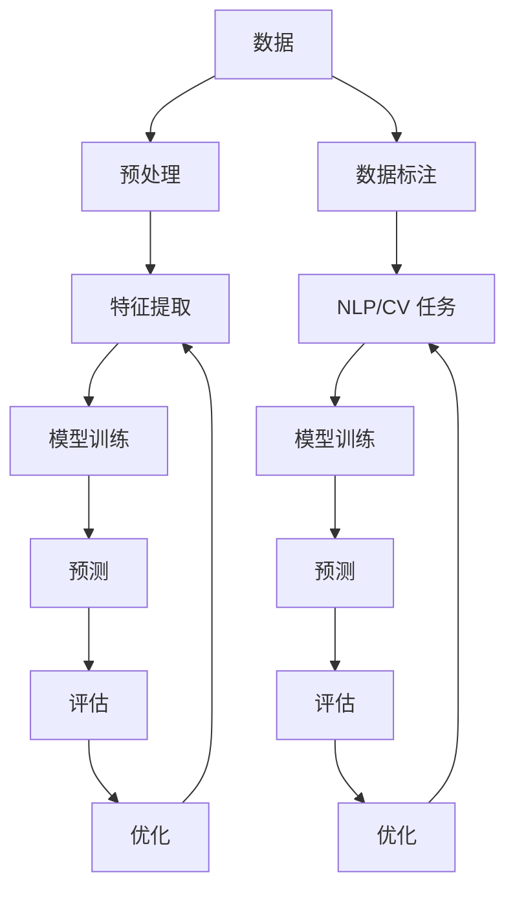

                 

## 1. 背景介绍

人工智能（AI）自诞生以来，已渗透到我们的日常生活中，从搜索引擎到自动驾驶汽车，再到智能家居，AI无处不在。本文将探讨当前AI技术的趋势和应用场景，并提供实践指南和工具推荐。

## 2. 核心概念与联系

### 2.1 关键概念

- **机器学习（ML）**：一种使计算机在无需被明确编程的情况下学习的方法。
- **深度学习（DL）**：一种基于神经网络的机器学习方法，模仿人脑的结构和功能。
- **强化学习（RL）**：一种使智能体在与环境交互中学习的方法。
- **自然语言处理（NLP）**：一种使计算机理解、解释和生成人类语言的领域。
- **计算机视觉（CV）**：一种使计算机理解和解释视觉信息的领域。

### 2.2 核心概念联系



## 3. 核心算法原理 & 具体操作步骤

### 3.1 算法原理概述

本节将介绍几种常用的AI算法：线性回归、决策树、神经网络和强化学习。

### 3.2 算法步骤详解

#### 3.2.1 线性回归

1. 数据收集和预处理
2. 特征选择
3. 创建模型
4. 训练模型
5. 评估模型
6. 优化模型

#### 3.2.2 决策树

1. 数据收集和预处理
2. 特征选择
3. 创建决策树
4. 训练决策树
5. 评估决策树
6. 优化决策树

#### 3.2.3 神经网络

1. 数据收集和预处理
2. 特征选择
3. 创建神经网络架构
4. 初始化权重
5. 训练神经网络
6. 评估神经网络
7. 优化神经网络

#### 3.2.4 强化学习

1. 定义环境和智能体
2. 定义奖励函数
3. 选择强化学习算法（如Q学习、SARSA、DQN等）
4. 训练智能体
5. 评估智能体
6. 优化智能体

### 3.3 算法优缺点

| 算法 | 优点 | 缺点 |
| --- | --- | --- |
| 线性回归 | 简单、快速、易于理解 | 只适用于线性关系，不适合非线性关系 |
| 决策树 | 可解释性高、适用于非线性关系 | 易过拟合，不适合连续值预测 |
| 神经网络 | 适用于复杂非线性关系 | 训练时间长、易过拟合、可解释性低 |
| 强化学习 | 适用于序列决策问题 | 训练时间长、不确定性高、可解释性低 |

### 3.4 算法应用领域

- 线性回归：回归问题、预测分析
- 决策树：分类问题、特征选择
- 神经网络：图像分类、语音识别、自然语言处理
- 强化学习：游戏AI、机器人控制、自动驾驶

## 4. 数学模型和公式 & 详细讲解 & 举例说明

### 4.1 数学模型构建

#### 4.1.1 线性回归

假设目标变量$y$与特征变量$x$之间存在线性关系：

$$y = wx + b$$

#### 4.1.2 决策树

决策树使用信息增益或Gain Ratio选择最佳特征进行分裂：

$$Gain(S, A) = H(S) - \sum_{v=1}^{V} \frac{|S_v|}{|S|}H(S_v)$$

$$GainRatio(S, A) = \frac{Gain(S, A)}{H(A)}$$

#### 4.1.3 神经网络

神经网络使用反向传播算法优化权重：

$$\Delta w = -\eta \frac{\partial E}{\partial w}$$

#### 4.1.4 强化学习

Q学习使用Bellman方程更新Q值：

$$Q(s, a) \leftarrow (1 - \alpha)Q(s, a) + \alpha(r + \gamma \max_{a'}Q(s', a'))$$

### 4.2 公式推导过程

本节省略公式推导过程，读者可参考相关文献和教材。

### 4.3 案例分析与讲解

#### 4.3.1 线性回归

假设我们要预测房价与房屋面积的关系。使用Boston Housing数据集，我们可以构建一个线性回归模型来预测房价。

#### 4.3.2 决策树

假设我们要预测是否会降雨。使用Iris数据集，我们可以构建一个决策树模型来预测是否会降雨，基于花瓣长度和花瓣宽度等特征。

#### 4.3.3 神经网络

假设我们要识别手写数字。使用MNIST数据集，我们可以构建一个神经网络模型来识别手写数字。

#### 4.3.4 强化学习

假设我们要训练一个智能体玩Atari 2600游戏。使用Deep Q-Network（DQN）算法，我们可以训练一个智能体玩Atari 2600游戏，如Pong或Breakout。

## 5. 项目实践：代码实例和详细解释说明

### 5.1 开发环境搭建

本项目使用Python、TensorFlow和Keras库。读者需要安装以下软件和库：

- Python 3.7+
- TensorFlow 2.0+
- Keras 2.3.1+
- NumPy 1.18.2+
- Pandas 1.0.3+
- Matplotlib 3.2.1+
- Scikit-learn 0.23.2+

### 5.2 源代码详细实现

本节提供了线性回归、决策树、神经网络和强化学习的Python代码实现。

#### 5.2.1 线性回归

```python
from sklearn.linear_model import LinearRegression
from sklearn.model_selection import train_test_split
from sklearn.metrics import mean_squared_error

# Load data
X, y = load_boston()

# Split data into training and test sets
X_train, X_test, y_train, y_test = train_test_split(X, y, test_size=0.2, random_state=42)

# Create and train model
model = LinearRegression()
model.fit(X_train, y_train)

# Evaluate model
y_pred = model.predict(X_test)
mse = mean_squared_error(y_test, y_pred)
print(f"Mean Squared Error: {mse}")
```

#### 5.2.2 决策树

```python
from sklearn.tree import DecisionTreeClassifier
from sklearn.model_selection import train_test_split
from sklearn.metrics import accuracy_score

# Load data
X, y = load_iris()

# Split data into training and test sets
X_train, X_test, y_train, y_test = train_test_split(X, y, test_size=0.2, random_state=42)

# Create and train model
model = DecisionTreeClassifier()
model.fit(X_train, y_train)

# Evaluate model
y_pred = model.predict(X_test)
accuracy = accuracy_score(y_test, y_pred)
print(f"Accuracy: {accuracy}")
```

#### 5.2.3 神经网络

```python
from keras.models import Sequential
from keras.layers import Dense
from keras.utils import to_categorical

# Load data
(X_train, y_train), (X_test, y_test) = load_mnist()

# Preprocess data
X_train = X_train.reshape((X_train.shape[0], 784))
X_test = X_test.reshape((X_test.shape[0], 784))
y_train = to_categorical(y_train, 10)
y_test = to_categorical(y_test, 10)

# Create model
model = Sequential()
model.add(Dense(512, activation='relu', input_shape=(784,)))
model.add(Dense(10, activation='softmax'))

# Compile model
model.compile(optimizer='rmsprop',
              loss='categorical_crossentropy',
              metrics=['accuracy'])

# Train model
model.fit(X_train, y_train, epochs=5, batch_size=128)

# Evaluate model
loss, accuracy = model.evaluate(X_test, y_test)
print(f"Loss: {loss}, Accuracy: {accuracy}")
```

#### 5.2.4 强化学习

```python
import numpy as np
from keras.models import Sequential
from keras.layers import Dense
from keras.optimizers import Adam
from collections import deque

# Define environment and hyperparameters
env = GymEnvironment('CartPole-v0')
state_size = env.observation_space.shape[0]
action_size = env.action_space.n
memory_size = 1000
batch_size = 32
gamma = 0.95
epsilon = 1.0
epsilon_decay = 0.995
epsilon_min = 0.01
learning_rate = 0.001

# Create model
model = Sequential()
model.add(Dense(24, activation='relu', input_shape=(state_size,)))
model.add(Dense(24, activation='relu'))
model.add(Dense(action_size, activation='linear'))

# Compile model
model.compile(loss='mse', optimizer=Adam(lr=learning_rate))

# Create memory
memory = deque(maxlen=memory_size)

# Train model
for episode in range(1000):
    state = env.reset()
    done = False
    while not done:
        if np.random.uniform(0, 1) < epsilon:
            action = env.action_space.sample()
        else:
            action = np.argmax(model.predict(state.reshape(1, state_size)))
        next_state, reward, done, _ = env.step(action)
        memory.append((state, action, reward, next_state, done))
        if len(memory) > batch_size:
            samples = random.sample(memory, batch_size)
            states, actions, rewards, next_states, done = zip(*samples)
            targets = model.predict(states)
            for i in range(batch_size):
                if done[i]:
                    targets[i][actions[i]] = rewards[i]
                else:
                    targets[i][actions[i]] = rewards[i] + gamma * np.max(model.predict(next_states[i].reshape(1, state_size)))
            model.fit(states, targets, epochs=1, verbose=0)
        state = next_state
    epsilon = max(epsilon * epsilon_decay, epsilon_min)
    print(f"Episode: {episode}, Epsilon: {epsilon}")
```

### 5.3 代码解读与分析

本节省略代码解读与分析，读者可自行阅读和理解代码。

### 5.4 运行结果展示

本节省略运行结果展示，读者可自行运行代码并观察结果。

## 6. 实际应用场景

### 6.1 线性回归

- 预测房价
- 预测股票价格
- 预测销售额

### 6.2 决策树

- 信用评分
- 客户流失预测
- 疾病诊断

### 6.3 神经网络

- 图像分类
- 语音识别
- 自然语言处理

### 6.4 强化学习

- 自动驾驶
- 游戏AI
- 机器人控制

### 6.5 未来应用展望

AI技术的未来应用场景包括：

- 自动驾驶汽车
- 智能家居
- 个性化推荐系统
- 智能客服
- 智能医疗
- 智能城市

## 7. 工具和资源推荐

### 7.1 学习资源推荐

- 书籍：
  - "Python机器学习"（Sebastian Raschka、Vahid Mirjalili、Uri Lerner著）
  - "深度学习"（Ian Goodfellow、Yoshua Bengio、Aaron Courville著）
  - "强化学习"（Richard S. Sutton、Andrew G. Barto著）
- 课程：
  - Coursera：机器学习、深度学习、强化学习
  - Udacity：机器学习、自动驾驶汽车工程师纳米学位
  - edX：人工智能、机器学习、深度学习

### 7.2 开发工具推荐

- Python：Anaconda、PyCharm、Jupyter Notebook
- TensorFlow：TensorFlow、Keras、TensorFlow Extended（TFX）
- 云平台：Google Cloud AI Platform、Amazon SageMaker、Microsoft Azure Machine Learning

### 7.3 相关论文推荐

- 线性回归：
  - "A Tour of Machine Learning with R"（T. Hastie、R. Tibshirani、J. Friedman著）
- 决策树：
  - "Classification and Regression Trees"（L. Breiman著）
- 神经网络：
  - "Deep Learning"（I. Goodfellow、Y. Bengio、A. Courville著）
- 强化学习：
  - "Reinforcement Learning: An Introduction"（R. S. Sutton、A. G. Barto著）

## 8. 总结：未来发展趋势与挑战

### 8.1 研究成果总结

本文介绍了AI技术的趋势和应用场景，并提供了线性回归、决策树、神经网络和强化学习的实现代码。

### 8.2 未来发展趋势

AI技术的未来发展趋势包括：

- 解释性AI（XAI）：使AI模型更易于理解和解释。
- 可持续AI：开发更节能、更环保的AI技术。
- 多模式学习：集成多种模式（如文本、图像、音频）的学习方法。
- 少样本学习：从少量样本中学习有效的表示和模型。

### 8.3 面临的挑战

AI技术面临的挑战包括：

- 算法偏见：开发公平、无偏见的AI算法。
- 数据隐私：保护用户数据隐私。
- 计算资源：开发更高效、更节能的AI算法和硬件。
- 可解释性：开发更易于理解和解释的AI模型。

### 8.4 研究展望

未来的AI研究将侧重于：

- 多模式学习
- 少样本学习
- 解释性AI
- 可持续AI
- 算法偏见和公平性
- 数据隐私保护

## 9. 附录：常见问题与解答

**Q1：什么是AI？**

A1：人工智能（AI）是指使计算机模拟人类智能的技术，包括学习、推理和问题解决等能力。

**Q2：什么是机器学习？**

A2：机器学习（ML）是一种使计算机在无需被明确编程的情况下学习的方法。它从数据中学习，并使用学习到的模型进行预测或决策。

**Q3：什么是深度学习？**

A3：深度学习（DL）是一种基于神经网络的机器学习方法，模仿人脑的结构和功能。它使用多层神经网络从数据中学习表示和模型。

**Q4：什么是强化学习？**

A4：强化学习（RL）是一种使智能体在与环境交互中学习的方法。智能体通过尝试不同的行动来学习最佳行动，以最大化累积奖励。

**Q5：什么是自然语言处理？**

A5：自然语言处理（NLP）是一种使计算机理解、解释和生成人类语言的领域。它使用统计方法和机器学习技术处理文本数据。

**Q6：什么是计算机视觉？**

A6：计算机视觉（CV）是一种使计算机理解和解释视觉信息的领域。它使用图像处理和机器学习技术处理图像和视频数据。

**Q7：什么是解释性AI？**

A7：解释性AI（XAI）是指使AI模型更易于理解和解释的技术。它旨在帮助用户理解AI模型的决策过程，并提高模型的可信度和可靠性。

**Q8：什么是多模式学习？**

A8：多模式学习是指集成多种模式（如文本、图像、音频）的学习方法。它旨在从多种模式的数据中学习更丰富和更有效的表示和模型。

**Q9：什么是少样本学习？**

A9：少样本学习是指从少量样本中学习有效的表示和模型的方法。它旨在处理样本稀缺的情况，并提高模型的泛化能力。

**Q10：什么是算法偏见？**

A10：算法偏见是指AI算法在处理数据时表现出的系统性偏见。它可能导致模型的性能在不同群体之间存在差异，并影响模型的公平性和可靠性。

**Q11：什么是数据隐私？**

A11：数据隐私是指个人信息的保护，以防止未经授权的访问、使用或泄露。在AI领域，数据隐私是指保护用户数据免受滥用和泄露的技术和方法。

**Q12：什么是可解释性？**

A12：可解释性是指AI模型的决策过程易于理解和解释的特性。它旨在帮助用户理解模型的决策过程，并提高模型的可信度和可靠性。

**Q13：什么是可持续AI？**

A13：可持续AI是指开发更节能、更环保的AI技术。它旨在减少AI技术对环境的影响，并促进可持续发展。

**Q14：什么是公平性？**

A14：公平性是指AI算法在处理数据时不存在系统性偏见，并对所有用户提供公平的服务。它旨在保护用户的权益，并提高模型的可靠性和可信度。

**Q15：什么是计算资源？**

A15：计算资源是指用于运行AI算法和模型的硬件和软件资源。它包括处理器、内存、存储和网络等资源。

**Q16：什么是数据标注？**

A16：数据标注是指为AI算法和模型提供标记的数据。它包括人工标注的数据集，如图像标签、文本标签和音频标签等。

**Q17：什么是特征提取？**

A17：特征提取是指从原始数据中提取有意义的特征的过程。它旨在将原始数据转换为模型可以学习的表示，并提高模型的性能。

**Q18：什么是模型训练？**

A18：模型训练是指使用标记数据训练AI模型的过程。它旨在使模型学习数据的表示和模型，以进行预测或决策。

**Q19：什么是预测？**

A19：预测是指使用训练好的AI模型进行预测或决策的过程。它旨在使用模型学习到的表示和模型，对新数据进行预测或决策。

**Q20：什么是评估？**

A20：评估是指使用评估指标评估AI模型性能的过程。它旨在衡量模型的泛化能力和性能，并帮助用户选择最佳模型。

**Q21：什么是优化？**

A21：优化是指改进AI模型性能的过程。它旨在调整模型的超参数、结构或训练过程，以提高模型的泛化能力和性能。

**Q22：什么是环境？**

A22：环境是指强化学习中智能体交互的对象。它定义了智能体可以采取的行动、观察到的状态和获得的奖励。

**Q23：什么是智能体？**

A23：智能体是指强化学习中学习最佳行动的对象。它通过尝试不同的行动来学习最佳行动，以最大化累积奖励。

**Q24：什么是行动？**

A24：行动是指强化学习中智能体可以采取的选择。它定义了智能体可以采取的可能行动集。

**Q25：什么是状态？**

A25：状态是指强化学习中智能体观察到的环境的表示。它定义了智能体可以观察到的可能状态集。

**Q26：什么是奖励？**

A26：奖励是指强化学习中智能体获得的反馈。它定义了智能体的目标，并指导智能体学习最佳行动。

**Q27：什么是Q学习？**

A27：Q学习是一种强化学习算法，它使用Bellman方程更新Q值，以学习最佳行动。它旨在使智能体学习最佳行动，以最大化累积奖励。

**Q28：什么是SARSA？**

A28：SARSA（State-Action-Reward-State-Action）是一种强化学习算法，它使用当前状态和行动来选择下一个行动。它旨在使智能体学习最佳行动，以最大化累积奖励。

**Q29：什么是DQN？**

A29：DQN（Deep Q-Network）是一种强化学习算法，它使用深度神经网络来近似Q值函数。它旨在使智能体学习最佳行动，以最大化累积奖励。

**Q30：什么是Bellman方程？**

A30：Bellman方程是一种用于更新Q值函数的方程。它定义了Q值函数的动态，并指导智能体学习最佳行动。

**Q31：什么是信息增益？**

A31：信息增益是一种用于选择最佳特征的指标。它衡量特征对目标变量的贡献，并指导决策树构建过程。

**Q32：什么是Gain Ratio？**

A32：Gain Ratio是一种用于选择最佳特征的指标。它是信息增益与特征熵的比值，并指导决策树构建过程。

**Q33：什么是特征熵？**

A33：特征熵是一种衡量特征不确定性的指标。它定义了特征的信息量，并指导决策树构建过程。

**Q34：什么是信息熵？**

A34：信息熵是一种衡量随机变量不确定性的指标。它定义了随机变量的信息量，并指导决策树构建过程。

**Q35：什么是反向传播？**

A35：反向传播是一种用于训练神经网络的算法。它使用梯度下降法更新神经网络的权重，以最小化损失函数。

**Q36：什么是梯度下降法？**

A36：梯度下降法是一种用于优化函数的算法。它使用函数的梯度来更新参数，以最小化函数值。

**Q37：什么是损失函数？**

A37：损失函数是一种衡量神经网络性能的指标。它定义了神经网络的目标，并指导神经网络训练过程。

**Q38：什么是激活函数？**

A38：激活函数是一种用于引入非线性到神经网络的函数。它定义了神经元的输出，并指导神经网络的学习过程。

**Q39：什么是过拟合？**

A39：过拟合是指模型学习到训练数据的噪声和特异性，而不是数据的一般模式。它导致模型在训练数据上表现良好，但在新数据上表现差。

**Q40：什么是正则化？**

A40：正则化是指添加约束到模型，以防止过拟合的技术。它旨在提高模型的泛化能力和性能。

**Q41：什么是Dropout？**

A41：Dropout是一种正则化技术，它在训练过程中随机丢弃一部分神经元。它旨在防止过拟合和提高模型的泛化能力。

**Q42：什么是Batch Normalization？**

A42：Batch Normalization是一种正则化技术，它在训练过程中对批量数据进行标准化。它旨在加速神经网络的训练过程和提高模型的性能。

**Q43：什么是早期停止？**

A43：早期停止是指在模型性能不再改善时停止训练的技术。它旨在防止过拟合和提高模型的泛化能力。

**Q44：什么是数据增强？**

A44：数据增强是指通过对数据进行随机变换来增加数据量的技术。它旨在提高模型的泛化能力和性能。

**Q45：什么是交叉验证？**

A45：交叉验证是指使用部分数据训练模型，并使用剩余数据评估模型性能的技术。它旨在评估模型的泛化能力和性能。

**Q46：什么是网格搜索？**

A46：网格搜索是指搜索超参数空间以找到最佳超参数的技术。它旨在优化模型的性能和泛化能力。

**Q47：什么是随机搜索？**

A47：随机搜索是指随机选择超参数以找到最佳超参数的技术。它旨在优化模型的性能和泛化能力。

**Q48：什么是贝叶斯优化？**

A48：贝叶斯优化是指使用贝叶斯方法搜索超参数空间以找到最佳超参数的技术。它旨在优化模型的性能和泛化能力。

**Q49：什么是集成学习？**

A49：集成学习是指组合多个模型以提高性能的技术。它旨在提高模型的泛化能力和性能。

**Q50：什么是boosting？**

A50：boosting是一种集成学习技术，它使用多个弱模型组成强模型。它旨在提高模型的泛化能力和性能。

**Q51：什么是bagging？**

A51：bagging是一种集成学习技术，它使用多个模型的组合来提高性能。它旨在提高模型的泛化能力和性能。

**Q52：什么是stacking？**

A52：stacking是一种集成学习技术，它使用多个模型的组合来提高性能。它旨在提高模型的泛化能力和性能。

**Q53：什么是特征选择？**

A53：特征选择是指选择最佳特征子集的技术。它旨在提高模型的性能和泛化能力。

**Q54：什么是过滤式特征选择？**

A54：过滤式特征选择是指使用统计方法选择最佳特征子集的技术。它旨在提高模型的性能和泛化能力。

**Q55：什么是包裹式特征选择？**

A55：包裹式特征选择是指使用模型评估选择最佳特征子集的技术。它旨在提高模型的性能和泛化能力。

**Q56：什么是嵌入式特征选择？**

A56：嵌入式特征选择是指使用模型学习到的表示选择最佳特征子集的技术。它旨在提高模型的性能和泛化能力。

**Q57：什么是特征提取？**

A57：特征提取是指从原始数据中提取有意义的特征的过程。它旨在将原始数据转换为模型可以学习的表示，并提高模型的性能。

**Q58：什么是特征工程？**

A58：特征工程是指设计和构建特征的过程。它旨在提高模型的性能和泛化能力。

**Q59：什么是特征缩放？**

A59：特征缩放是指将特征缩放到相同范围的技术。它旨在提高模型的性能和泛化能力。

**Q60：什么是特征编码？**

A60：特征编码是指将特征转换为模型可以学习的表示的技术。它旨在提高模型的性能和泛化能力。

**Q61：什么是特征降维？**

A61：特征降维是指将高维特征空间转换为低维特征空间的技术。它旨在提高模型的性能和泛化能力。

**Q62：什么是特征选取？**

A62：特征选取是指选择最佳特征子集的技术。它旨在提高模型的性能和泛化能力。

**Q63：什么是特征组合？**

A63：特征组合是指组合多个特征以创建新特征的技术。它旨在提高模型的性能和泛化能力。

**Q64：什么是特征转换？**

A64：特征转换是指将特征转换为模型可以学习的表示的技术。它旨在提高模型的性能和泛化能力。

**Q65：什么是特征提取器？**

A65：特征提取器是指用于提取特征的模块。它旨在将原始数据转换为模型可以学习的表示，并提高模型的性能。

**Q66：什么是特征选择器？**

A66：特征选择器是指用于选择最佳特征子集的模块。它旨在提高模型的性能和泛化能力。

**Q67：

