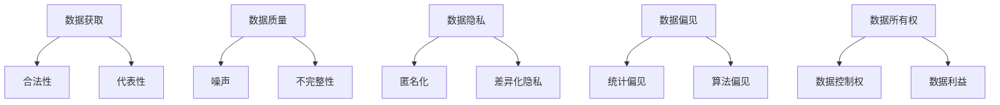

                 

**人工智能（AI）训练数据的争议：寻找平衡之道**

## 1. 背景介绍

随着人工智能技术的飞速发展，AI模型的性能和应用领域不断扩展，但其训练数据的获取和使用也面临着一系列争议和挑战。本文将深入探讨AI训练数据的争议，并尝试寻找平衡之道，以推动AI技术的负责任和可持续发展。

## 2. 核心概念与联系

### 2.1 AI训练数据的定义

AI训练数据是指用于训练AI模型的原始数据集，其质量和规模直接影响模型的性能和泛化能力。训练数据通常包括输入特征和对应的标签，用于帮助模型学习从输入到输出的映射关系。

### 2.2 AI训练数据的来源

AI训练数据可以来自各种渠道，包括公开数据集、合作伙伴提供的数据、自有数据库或通过 web 爬虫等方式收集的数据。数据的来源多样性和代表性对模型的性能和公平性至关重要。

### 2.3 AI训练数据的争议

AI训练数据的争议主要围绕数据的获取、质量、隐私、偏见和所有权等问题展开。这些争议可能会影响模型的性能、公平性和可信度，并对AI技术的伦理和法律框架提出挑战。



## 3. 核心算法原理 & 具体操作步骤

### 3.1 算法原理概述

为平衡AI训练数据的争议，我们需要开发和应用一系列算法和技术，以提高数据的质量、代表性、隐私保护和公平性。这些算法包括数据清洗、数据增强、数据平衡、数据匿名化和偏见检测等。

### 3.2 算法步骤详解

1. **数据清洗**：移除噪声数据、缺失值和异常值，提高数据质量。
2. **数据增强**：通过旋转、缩放、翻转等操作扩充数据集，提高模型的泛化能力。
3. **数据平衡**：平衡数据集中不同类别的样本数量，以避免模型过度拟合某些类别。
4. **数据匿名化**：删除或模糊敏感信息，保护个人隐私。
5. **偏见检测**：识别和量化数据集中的统计偏见和算法偏见，以提高模型的公平性。

### 3.3 算法优缺点

优点：

* 提高数据质量和代表性，改善模型性能
* 保护个人隐私，增强模型的可信度
* 降低模型偏见，提高模型的公平性

缺点：

* 算法复杂度高，计算资源需求大
* 可能导致数据丢失或模型性能下降
* 无法完全消除偏见，需要不断迭代和优化

### 3.4 算法应用领域

AI训练数据平衡算法广泛应用于图像、语音、文本和其他数据类型的处理，在计算机视觉、自然语言处理、推荐系统和自动驾驶等领域具有重要意义。

## 4. 数学模型和公式 & 详细讲解 & 举例说明

### 4.1 数学模型构建

构建数学模型时，我们需要考虑数据的分布、关系和约束条件。例如，在数据平衡问题中，我们可以使用概率模型来描述数据集中各类别的分布，并寻找平衡样本数量的最优解。

### 4.2 公式推导过程

假设数据集中有 $C$ 个类别，每个类别 $c$ 的样本数为 $n_c$。我们的目标是找到平衡样本数量 $N$ 的最优解，使得每个类别的样本数都接近 $N$。我们可以使用以下公式推导平衡样本数量：

$$N = \left\lfloor \frac{\sum_{c=1}^{C} n_c}{C} \right\rfloor$$

其中 $\left\lfloor x \right\rfloor$ 表示取整函数，用于确保平衡样本数量为整数。

### 4.3 案例分析与讲解

假设我们有一个包含三个类别的数据集，每个类别的样本数分别为 1000、1500 和 2000。根据上述公式，我们可以计算出平衡样本数量为：

$$N = \left\lfloor \frac{1000 + 1500 + 2000}{3} \right\rfloor = 1333$$

这意味着我们需要对每个类别的样本数进行调整，使其接近 1333。我们可以通过数据增强或删除样本的方式来实现数据平衡。

## 5. 项目实践：代码实例和详细解释说明

### 5.1 开发环境搭建

为平衡AI训练数据，我们需要安装以下软件和库：

* Python 3.8+
* NumPy
* Pandas
* Scikit-learn
* TensorFlow或PyTorch

### 5.2 源代码详细实现

以下是一个简单的数据平衡示例，使用 Python 和 Scikit-learn 实现了数据平衡算法：

```python
import numpy as np
import pandas as pd
from sklearn.utils import resample

# 加载数据集
data = pd.read_csv('data.csv')

# 计算平衡样本数量
N = np.floor(data['label'].value_counts().mean())

# 为每个类别创建平衡样本集
balanced_data = pd.concat([
    resample(data[data['label'] == c], replace=False, n_samples=N, random_state=42)
    for c in data['label'].unique()
])

# 保存平衡数据集
balanced_data.to_csv('balanced_data.csv', index=False)
```

### 5.3 代码解读与分析

在上述代码中，我们首先加载数据集，然后计算平衡样本数量。之后，我们为每个类别创建平衡样本集，并使用 `resample` 函数实现数据平衡。最后，我们保存平衡数据集以供后续使用。

### 5.4 运行结果展示

运行上述代码后，我们会得到一个平衡数据集，其中每个类别的样本数都接近计算出的平衡样本数量。我们可以使用这个平衡数据集来训练AI模型，以改善模型的性能和公平性。

## 6. 实际应用场景

### 6.1 图像分类

在计算机视觉领域，图像数据集往往不平衡，某些类别的图像数量远远多于其他类别。数据平衡算法可以帮助我们平衡数据集，改善模型的性能和泛化能力。

### 6.2 自然语言处理

在自然语言处理领域，文本数据集也可能存在不平衡问题。数据平衡算法可以帮助我们平衡数据集，改善模型的性能和公平性。

### 6.3 未来应用展望

随着AI技术的不断发展，数据平衡算法将在更多领域得到应用，如自动驾驶、医疗保健和金融服务等。此外，数据平衡算法也将与其他技术结合，以提高模型的性能、公平性和可信度。

## 7. 工具和资源推荐

### 7.1 学习资源推荐

* "Imbalanced Learning" 课程：<https://www.coursera.org/learn/imbalanced-learning>
* "Data Science for Dummies" 书籍：<https://www.amazon.com/Data-Science-Dummies-Wiley-Publishing/dp/1119735227>

### 7.2 开发工具推荐

* Jupyter Notebook：<https://jupyter.org/>
* Google Colab：<https://colab.research.google.com/>

### 7.3 相关论文推荐

* "Long Tail Distribution of Data in Deep Learning"：<https://arxiv.org/abs/1901.05555>
* "A Study of the Effectiveness of Data Balancing Techniques in Imbalanced Learning"：<https://ieeexplore.ieee.org/document/8454097>

## 8. 总结：未来发展趋势与挑战

### 8.1 研究成果总结

本文介绍了AI训练数据的争议，并提出了平衡数据质量、代表性、隐私保护和公平性的算法和技术。这些算法和技术可以帮助我们改善模型的性能和可信度，推动AI技术的负责任和可持续发展。

### 8.2 未来发展趋势

未来，AI训练数据的争议将继续成为关注的焦点，我们需要开发更先进的算法和技术来平衡数据的质量、代表性、隐私保护和公平性。此外，AI技术的伦理和法律框架也需要不断完善，以确保AI技术的负责任和可持续发展。

### 8.3 面临的挑战

面临的挑战包括：

* 算法复杂度高，计算资源需求大
* 可能导致数据丢失或模型性能下降
* 无法完全消除偏见，需要不断迭代和优化

### 8.4 研究展望

未来的研究方向包括：

* 开发更先进的数据平衡算法和技术
* 完善AI技术的伦理和法律框架
* 促进AI技术的负责任和可持续发展

## 9. 附录：常见问题与解答

**Q1：数据平衡算法如何改善模型的性能？**

数据平衡算法通过平衡数据集中各类别的样本数量，帮助模型学习到更全面和准确的特征表示，从而改善模型的性能和泛化能力。

**Q2：数据匿名化如何保护个人隐私？**

数据匿名化通过删除或模糊敏感信息，帮助保护个人隐私，防止数据泄露和滥用。常见的数据匿名化技术包括删除、模糊化和差异化隐私等。

**Q3：偏见检测如何提高模型的公平性？**

偏见检测通过识别和量化数据集中的统计偏见和算法偏见，帮助我们提高模型的公平性。偏见检测可以在数据预处理和模型评估阶段进行，以确保模型的决策公平和可信。

---

**作者：禅与计算机程序设计艺术 / Zen and the Art of Computer Programming**

