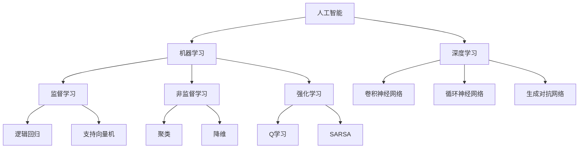

                 

**人工智能的未来发展前景**

## 1. 背景介绍

人工智能（AI）自诞生以来，就一直是计算机科学领域最具前途的研究方向之一。从早期的专家系统到当今的深度学习，AI技术不断发展，渗透到我们的日常生活中，从搜索引擎到自动驾驶汽车，无处不在。本文将从技术、应用和未来发展的角度，探讨人工智能的未来发展前景。

## 2. 核心概念与联系

### 2.1 关键概念

- **机器学习（ML）**：一种使计算机在无需被明确编程的情况下学习的技术。
- **深度学习（DL）**：一种机器学习方法，其架构受人类大脑结构的启发。
- **强人工智能（AGI）**：一种能够理解、学习和应用知识的通用人工智能。
- **弱人工智能（ANI）**：一种只能执行特定任务的人工智能。

### 2.2 关键概念联系



## 3. 核心算法原理 & 具体操作步骤

### 3.1 算法原理概述

本节将介绍一种常用的深度学习算法——卷积神经网络（CNN）。

### 3.2 算法步骤详解

1. **输入层**：接收输入数据，如图像或语音。
2. **卷积层**：使用卷积核（滤波器）提取特征。
3. **池化层**：减小特征图的空间维度，防止过拟合。
4. **全连接层**：将特征图展平成向量，进行分类。
5. **输出层**：输出分类结果。

### 3.3 算法优缺点

**优点**：
- 适合于处理网格结构数据，如图像和语音。
- 具有参数共享和局部连接特性，减少了参数数量。

**缺点**：
- 训练时间长，计算资源需求高。
- 缺乏解释性，难以理解网络的决策过程。

### 3.4 算法应用领域

- 图像分类和目标检测。
- 语音识别和自然语言处理。
- 自动驾驶和机器人控制。

## 4. 数学模型和公式 & 详细讲解 & 举例说明

### 4.1 数学模型构建

设输入图像为$X \in \mathbb{R}^{H \times W \times C}$, 其中$H$, $W$, $C$分别为高度、宽度和通道数。卷积核为$K \in \mathbb{R}^{h \times w \times C \times D}$, 其中$h$, $w$, $D$分别为卷积核的高度、宽度和深度。则特征图$Y \in \mathbb{R}^{(H-h+1) \times (W-w+1) \times D}$可以表示为：

$$Y[i, j, d] = \sigma \left( \sum_{c=0}^{C-1} \sum_{k=0}^{h-1} \sum_{l=0}^{w-1} X[i+k, j+l, c] \cdot K[k, l, c, d] + b[d] \right)$$

其中$\sigma$为激活函数，如ReLU，$b[d]$为偏置项。

### 4.2 公式推导过程

略。

### 4.3 案例分析与讲解

例如，在CIFAR-10数据集上训练一个简单的CNN，用于图像分类。输入图像大小为$32 \times 32 \times 3$, 使用$5 \times 5$的卷积核，池化层为$2 \times 2$的最大池化，全连接层为10个神经元（对应10个类别），使用ReLU激活函数和softmax输出。

## 5. 项目实践：代码实例和详细解释说明

### 5.1 开发环境搭建

- Python 3.7+
- TensorFlow 2.0+
- NumPy 1.16+
- Matplotlib 3.1.0+

### 5.2 源代码详细实现

```python
import tensorflow as tf
from tensorflow.keras import datasets, layers, models

# 加载并预处理CIFAR-10数据
(train_images, train_labels), (test_images, test_labels) = datasets.cifar10.load_data()
train_images, test_images = train_images / 255.0, test_images / 255.0

# 创建模型
model = models.Sequential()
model.add(layers.Conv2D(32, (3, 3), activation='relu', input_shape=(32, 32, 3)))
model.add(layers.MaxPooling2D((2, 2)))
model.add(layers.Conv2D(64, (3, 3), activation='relu'))
model.add(layers.MaxPooling2D((2, 2)))
model.add(layers.Conv2D(64, (3, 3), activation='relu'))
model.add(layers.Flatten())
model.add(layers.Dense(64, activation='relu'))
model.add(layers.Dense(10))

# 编译模型
model.compile(optimizer='adam',
              loss=tf.keras.losses.SparseCategoricalCrossentropy(from_logits=True),
              metrics=['accuracy'])

# 训练模型
history = model.fit(train_images, train_labels, epochs=10,
                    validation_data=(test_images, test_labels))
```

### 5.3 代码解读与分析

- 使用Keras框架创建了一个Sequential模型，添加了两个卷积-池化块和一个全连接块。
- 使用Adam优化器，交叉熵损失函数和精确度指标编译模型。
- 使用训练数据训练模型，并使用验证数据评估模型。

### 5.4 运行结果展示

模型训练完成后，可以在测试集上评估其精确度。通常，在CIFAR-10数据集上，这个简单的CNN模型可以达到约60%的精确度。

## 6. 实际应用场景

### 6.1 当前应用

- **图像识别**：CNN在图像识别领域取得了显著成功，如人脸识别和物体检测。
- **语音识别**：循环神经网络（RNN）和长短期记忆网络（LSTM）在语音识别领域广泛应用。
- **自然语言处理（NLP）**：transformer模型在机器翻译和文本生成等NLP任务中取得了突破性进展。

### 6.2 未来应用展望

- **自动驾驶**：深度学习技术将继续推动自动驾驶汽车的发展。
- **医疗保健**：AI将在疾病诊断和药物发现等领域发挥关键作用。
- **人工智能道德和安全**：未来需要解决的关键挑战之一是确保AI系统的道德和安全。

## 7. 工具和资源推荐

### 7.1 学习资源推荐

- **书籍**："Deep Learning" by Ian Goodfellow, Yoshua Bengio, and Aaron Courville。
- **在线课程**：Coursera和Udacity上的深度学习课程。

### 7.2 开发工具推荐

- **TensorFlow**：一个流行的开源机器学习库。
- **PyTorch**：一个动态计算图机器学习库。

### 7.3 相关论文推荐

- "ImageNet Classification with Deep Convolutional Neural Networks" by Krizhevsky et al.
- "Attention Is All You Need" by Vaswani et al.

## 8. 总结：未来发展趋势与挑战

### 8.1 研究成果总结

本文介绍了人工智能的关键概念，重点讨论了卷积神经网络的原理和应用，并提供了一个简单的CNN实现示例。

### 8.2 未来发展趋势

- **自监督学习**：自监督学习技术将继续发展，以提高模型的泛化能力。
- **生成模型**：生成模型，如生成对抗网络（GAN）和变分自编码器（VAE），将在合成数据生成和数据增强等领域发挥关键作用。
- **量子机器学习**：量子计算将推动机器学习的发展，使其更快、更有效。

### 8.3 面临的挑战

- **计算资源**：深度学习模型的训练需要大量计算资源。
- **数据隐私**：AI系统需要处理大量数据，这提出了数据隐私和安全挑战。
- **解释性**：深度学习模型缺乏解释性，难以理解其决策过程。

### 8.4 研究展望

未来的人工智能研究将关注模型的泛化能力、解释性和道德考虑。此外，开发新的算法和架构，以提高计算效率和降低能耗，也是未来研究的关键方向。

## 9. 附录：常见问题与解答

**Q：什么是人工智能？**
A：人工智能是计算机科学的一个分支，旨在开发能够模拟人类智能的计算机程序和系统。

**Q：什么是深度学习？**
A：深度学习是一种机器学习方法，其架构受人类大脑结构的启发，通常由多个处理层组成。

**Q：什么是卷积神经网络？**
A：卷积神经网络是一种深度学习模型，专门设计用于处理网格结构数据，如图像和语音。

!!!Note
作者：禅与计算机程序设计艺术 / Zen and the Art of Computer Programming

