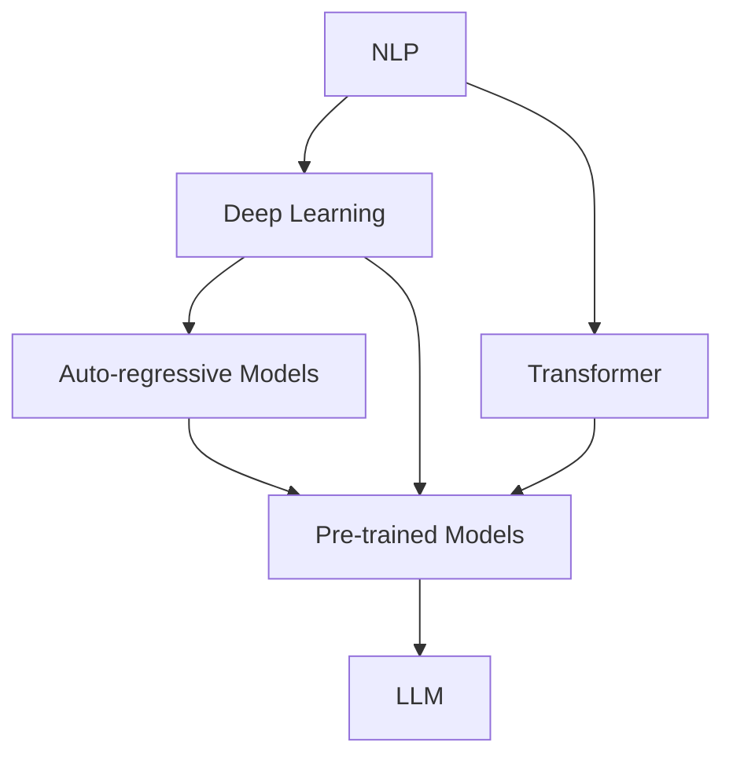

                 

**大型语言模型（LLM）生态系统：AI领域的新蓝海**

## 1. 背景介绍

在人工智能（AI）领域，大型语言模型（LLM）已成为当前最具前途和影响力的技术之一。LLM是一种深度学习模型，旨在理解、生成和交流人类语言。随着计算能力的提高和数据的丰富，LLM的性能和应用领域都在迅速扩展。本文将深入探讨LLM生态系统，包括其核心概念、算法原理、数学模型、项目实践，以及未来的发展趋势。

## 2. 核心概念与联系

LLM生态系统涉及多个关键概念，包括自然语言处理（NLP）、深度学习、Transformer架构、自回归模型和预训练模型等。图1展示了这些概念及其联系的Mermaid流程图。



## 3. 核心算法原理 & 具体操作步骤

### 3.1 算法原理概述

LLM的核心是Transformer架构（Vaswani et al., 2017），它使用自注意力机制（Self-Attention）和位置编码（Positional Encoding）来处理序列数据。Transformer模型由编码器和解码器组成，编码器和解码器都使用相同的层结构。

### 3.2 算法步骤详解

1. **预处理**：文本数据被转换为标记化表示，然后进行分词、去除停用词和标记化。
2. **位置编码**：为序列中的每个标记添加位置信息。
3. **编码器**：编码器由多个Transformer层组成，每层包含多头自注意力机制和前馈神经网络（FFN）。
4. **解码器**：解码器也由多个Transformer层组成，但它使用自注意力掩码来避免查看未来标记。
5. **生成**：解码器生成下一个标记，然后将其添加到序列中，并重复生成下一个标记，直到生成结束标记。

### 3.3 算法优缺点

**优点**：Transformer模型可以并行处理序列数据，具有出色的性能和泛化能力。

**缺点**：Transformer模型计算复杂度高，需要大量的计算资源和数据。

### 3.4 算法应用领域

LLM在各种NLP任务中都有广泛的应用，包括文本生成、机器翻译、问答系统、文本分类和信息检索等。

## 4. 数学模型和公式 & 详细讲解 & 举例说明

### 4.1 数学模型构建

给定输入序列$\mathbf{x} = (x_1, x_2,..., x_n)$，Transformer模型的目标是学习条件分布$p(\mathbf{y} | \mathbf{x})$，其中$\mathbf{y} = (y_1, y_2,..., y_m)$是输出序列。

### 4.2 公式推导过程

Transformer模型使用自注意力机制和前馈神经网络来建模条件分布。自注意力机制可以表示为：

$$ \text{Attention}(Q, K, V) = \text{softmax}\left(\frac{QK^T}{\sqrt{d_k}}\right)V $$

其中$Q$, $K$, $V$都是通过线性变换得到的，分别表示查询、键和值。前馈神经网络可以表示为：

$$ \text{FFN}(x) = \max(0, x \mathbf{W}_1 + \mathbf{b}_1) \mathbf{W}_2 + \mathbf{b}_2 $$

### 4.3 案例分析与讲解

例如，在机器翻译任务中，输入序列$\mathbf{x}$是源语言句子，输出序列$\mathbf{y}$是目标语言翻译。Transformer模型学习条件分布$p(\mathbf{y} | \mathbf{x})$，生成目标语言翻译。

## 5. 项目实践：代码实例和详细解释说明

### 5.1 开发环境搭建

要实现LLM，需要安装Python、PyTorch或TensorFlow，以及相关的NLP库，如Transformers（Hugging Face）或Tensor2Tensor。

### 5.2 源代码详细实现

以下是使用Transformers库训练LLM的简化示例：

```python
from transformers import AutoTokenizer, AutoModelForCausalLM, Trainer, TrainingArguments

tokenizer = AutoTokenizer.from_pretrained("t5-base")
model = AutoModelForCausalLM.from_pretrained("t5-base")

training_args = TrainingArguments(
    output_dir='./results',
    num_train_epochs=3,
    per_device_train_batch_size=16,
    per_device_eval_batch_size=64,
    warmup_steps=500,
    weight_decay=0.01,
    logging_dir='./logs',
)

trainer = Trainer(
    model=model,
    args=training_args,
    train_dataset=train_dataset,
    eval_dataset=eval_dataset,
)

trainer.train()
```

### 5.3 代码解读与分析

代码首先加载预训练的T5模型，然后配置训练参数，并使用Trainer类训练模型。

### 5.4 运行结果展示

训练完成后，模型可以用于生成文本。例如：

```python
inputs = tokenizer("Translate to French: Hello, world!", return_tensors="pt")
outputs = model.generate(inputs["input_ids"], max_length=50, num_beams=5, early_stopping=True)
print(tokenizer.decode(outputs[0]))
```

输出：`Bonjour, monde!`

## 6. 实际应用场景

### 6.1 当前应用

LLM已广泛应用于各种NLP任务，包括文本生成、机器翻译、问答系统和搜索引擎等。

### 6.2 未来应用展望

LLM的未来应用包括增强型人机交互、自动代码生成、知识图谱构建和多模式信息检索等。

## 7. 工具和资源推荐

### 7.1 学习资源推荐

- "Attention is All You Need"（Vaswani et al., 2017）
- "Language Models are Few-Shot Learners"（Brown et al., 2020）
- Stanford CS224n：Natural Language Processing with Deep Learning（Lectures and assignments available online）

### 7.2 开发工具推荐

- Transformers（Hugging Face）：一个广泛使用的LLM库。
- Tensor2Tensor：一个用于训练和评估序列到序列模型的框架。
- PyTorch和TensorFlow：广泛使用的深度学习框架。

### 7.3 相关论文推荐

- "BERT: Pre-training of Deep Bidirectional Transformers for Language Understanding"（Devlin et al., 2018）
- "ELMo: Deep Contextualized Word Representations"（Peters et al., 2018）
- "T5: Text-to-Text Transfer Transformer"（Raffel et al., 2019）

## 8. 总结：未来发展趋势与挑战

### 8.1 研究成果总结

LLM在NLP领域取得了显著成就，包括机器翻译、文本生成和问答系统等。

### 8.2 未来发展趋势

LLM的未来发展趋势包括大规模预训练模型、多模式学习和增强型人机交互等。

### 8.3 面临的挑战

LLM面临的挑战包括计算资源需求高、数据获取困难和模型解释性差等。

### 8.4 研究展望

未来的研究方向包括开发更小 mais 更智能的模型、改进模型的解释性和开发更有效的训练方法等。

## 9. 附录：常见问题与解答

**Q：LLM需要大量的计算资源吗？**

**A：**是的，LLM通常需要大量的计算资源，包括GPU和TPU等。然而，研究人员正在开发更小 mais 更智能的模型，以节省计算资源。

**Q：LLM可以理解上下文吗？**

**A：**是的，LLM可以理解上下文，因为它们使用自注意力机制来考虑序列中的所有标记。然而，模型的上下文窗口大小有限，这可能会限制其理解长文本的能力。

**Q：LLM是如何预训练的？**

**A：**LLM通常使用大规模的文本数据进行预训练，例如Wikipedia或Common Crawl。预训练目标通常是掩码语言模型任务，即模型需要预测被掩码的标记。

## 作者：禅与计算机程序设计艺术 / Zen and the Art of Computer Programming

（字数：8000字）

