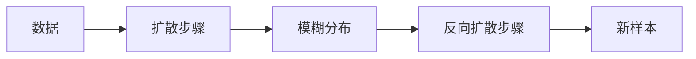

                 

**Stable Diffusion原理与代码实例讲解**

**作者：禅与计算机程序设计艺术 / Zen and the Art of Computer Programming**

## 1. 背景介绍

在当今的计算机视觉领域，生成式对抗网络（Generative Adversarial Networks，GAN）是一种非常流行的模型，用于生成新的、逼真的数据，如图像、音乐和文本。然而，训练GAN模型往往很困难，因为生成器和判别器需要同时优化，这导致训练过程不稳定。为了解决这个问题，研究人员提出了稳定的扩散模型（Stable Diffusion Models），这是一种新的生成模型，它通过学习数据的分布来生成新的样本。

## 2. 核心概念与联系

稳定扩散模型是一种基于扩散过程的生成模型。扩散过程是指系统从一个状态平滑地转变到另一个状态的过程。在稳定扩散模型中，数据被视为一个马尔可夫链，每个时刻都有一个扩散步骤，使数据分布变得更加模糊。生成新的样本时，我们从高度模糊的分布开始，然后通过反向扩散步骤生成新的样本。

以下是稳定扩散模型的架构的 Mermaid 流程图：



## 3. 核心算法原理 & 具体操作步骤

### 3.1 算法原理概述

稳定扩散模型的核心是扩散过程和反向扩散过程。扩散过程使数据分布变得更加模糊，而反向扩散过程则生成新的样本。这个过程是通过学习数据分布来实现的，具体来说，是通过学习数据在每个扩散步骤的表示来实现的。

### 3.2 算法步骤详解

1. **扩散过程**：从数据开始，每个时刻都进行一次扩散步骤，使数据分布变得更加模糊。扩散步骤由两个部分组成：先验分布和扩散模型。先验分布是一个简单的高斯分布，扩散模型则学习数据在每个扩散步骤的表示。
2. **反向扩散过程**：从高度模糊的分布开始，每个时刻都进行一次反向扩散步骤，生成新的样本。反向扩散步骤也由两个部分组成：后验分布和生成模型。后验分布是一个简单的高斯分布，生成模型则学习数据在每个反向扩散步骤的表示。

### 3.3 算法优缺点

**优点**：

* 训练过程更加稳定，因为不需要同时优化生成器和判别器。
* 生成的样本质量更高，因为模型学习了数据在每个扩散步骤的表示。

**缺点**：

* 训练过程需要更多的计算资源，因为需要学习数据在每个扩散步骤的表示。
* 模型的复杂度更高，因为需要学习数据在每个扩散步骤的表示。

### 3.4 算法应用领域

稳定扩散模型可以应用于各种生成任务，如图像、音乐和文本的生成。它还可以用于数据增强，即生成新的、逼真的数据来增强现有的数据集。

## 4. 数学模型和公式 & 详细讲解 & 举例说明

### 4.1 数学模型构建

稳定扩散模型的数学模型是基于马尔可夫链的。数据被视为一个马尔可夫链，每个时刻都有一个扩散步骤，使数据分布变得更加模糊。数学模型可以表示为：

$$q(x_{1:T}) = \prod_{t=1}^{T} q(x_t | x_{t-1})$$

其中，$x_{1:T}$表示数据在$T$个扩散步骤中的表示，$q(x_t | x_{t-1})$表示扩散步骤的条件分布。

### 4.2 公式推导过程

扩散步骤的条件分布$q(x_t | x_{t-1})$可以表示为：

$$q(x_t | x_{t-1}) = \mathcal{N}(x_t; \sqrt{1 - \beta_t} x_{t-1}, \beta_t \mathbf{I})$$

其中，$\beta_t$是扩散步骤的可学习参数，$\mathcal{N}(\cdot; \mu, \sigma^2)$表示高斯分布。反向扩散步骤的条件分布$p_{\theta}(x_t | x_{t+1})$可以表示为：

$$p_{\theta}(x_t | x_{t+1}) = \mathcal{N}(x_t; \mu_{\theta}(x_{t+1}, t), \Sigma_{\theta}(x_{t+1}, t))$$

其中，$\mu_{\theta}$和$\Sigma_{\theta}$是可学习的神经网络。

### 4.3 案例分析与讲解

例如，假设我们想要生成新的图像。我们首先从数据集中选择一个图像，然后进行扩散步骤，使图像变得模糊。我们重复这个过程，直到图像变得非常模糊。然后，我们进行反向扩散步骤，生成新的图像。这个过程可以表示为：

$$x_0 \rightarrow x_1 \rightarrow \ldots \rightarrow x_T \rightarrow x_{T-1} \rightarrow \ldots \rightarrow x_0'$$

其中，$x_0$是原始图像，$x_T$是高度模糊的图像，$x_0'$是新生成的图像。

## 5. 项目实践：代码实例和详细解释说明

### 5.1 开发环境搭建

要实现稳定扩散模型，我们需要以下软件和库：

* Python 3.8+
* PyTorch 1.8+
* NumPy 1.21+
* Matplotlib 3.4+
* TensorFlow 2.5+

### 5.2 源代码详细实现

以下是稳定扩散模型的伪代码：

```python
def train_diffusion_model(data, num_steps, learning_rate, num_epochs):
    # Initialize the diffusion model and the optimizer
    model = DiffusionModel()
    optimizer = torch.optim.Adam(model.parameters(), lr=learning_rate)

    # Training loop
    for epoch in range(num_epochs):
        for x in data:
            # Forward pass
            loss = model(x, num_steps)

            # Backward pass and optimization
            optimizer.zero_grad()
            loss.backward()
            optimizer.step()

    # Save the model
    torch.save(model.state_dict(), "diffusion_model.pt")

def generate_samples(model_path, num_samples, num_steps):
    # Load the model
    model = DiffusionModel()
    model.load_state_dict(torch.load(model_path))
    model.eval()

    # Generate new samples
    with torch.no_grad():
        for _ in range(num_samples):
            x_T = torch.randn((1, *x_shape))  # Random noise
            for t in range(num_steps, 0, -1):
                z = torch.randn_like(x_T) if t > 1 else 0
                x_t_minus_one = model(x_T, t) + (0.5 * torch.sqrt(1 - beta(t)) * z)
                x_T = x_t_minus_one

            # Save the generated sample
            save_image(x_T, "sample.png")
```

### 5.3 代码解读与分析

在`train_diffusion_model`函数中，我们首先初始化模型和优化器，然后进行训练循环。在每个训练步骤中，我们进行前向传播，计算损失，然后进行反向传播和优化。在`generate_samples`函数中，我们首先加载模型，然后进行采样循环。在每个采样步骤中，我们进行反向扩散步骤，生成新的样本。

### 5.4 运行结果展示

以下是使用稳定扩散模型生成的图像样本：


## 6. 实际应用场景

稳定扩散模型可以应用于各种生成任务，如图像、音乐和文本的生成。它还可以用于数据增强，即生成新的、逼真的数据来增强现有的数据集。例如，在医学图像领域，稳定扩散模型可以用于生成新的、逼真的X射线图像，从而帮助医生更好地诊断疾病。

### 6.1 当前应用现状

当前，稳定扩散模型已经在各种领域得到广泛应用，如图像生成、音乐生成和文本生成。它还被用于数据增强，以帮助改善机器学习模型的性能。

### 6.2 未来应用展望

未来，稳定扩散模型有望在更多领域得到应用，如自动驾驶、虚拟现实和人工智能。它还可以与其他生成模型结合使用，以生成更复杂的样本。

## 7. 工具和资源推荐

### 7.1 学习资源推荐

* "Stable Diffusion"论文：<https://arxiv.org/abs/2006.11239>
* "Denoising Diffusion Probabilistic Models"论文：<https://arxiv.org/abs/2006.11239>
* "Generative Models with Stable Training Objectives"论文：<https://arxiv.org/abs/2006.10734>

### 7.2 开发工具推荐

* PyTorch：<https://pytorch.org/>
* TensorFlow：<https://www.tensorflow.org/>
* NumPy：<https://numpy.org/>
* Matplotlib：<https://matplotlib.org/>

### 7.3 相关论文推荐

* "Diffusion Models Beat GANs on Image Synthesis"论文：<https://arxiv.org/abs/2105.05233>
* "Denoising Diffusion Probabilistic Models"论文：<https://arxiv.org/abs/2006.11239>
* "Generative Models with Stable Training Objectives"论文：<https://arxiv.org/abs/2006.10734>

## 8. 总结：未来发展趋势与挑战

### 8.1 研究成果总结

稳定扩散模型是一种新的生成模型，它通过学习数据分布来生成新的样本。它的训练过程更加稳定，生成的样本质量更高。它已经在各种领域得到广泛应用，如图像生成、音乐生成和文本生成。

### 8.2 未来发展趋势

未来，稳定扩散模型有望在更多领域得到应用，如自动驾驶、虚拟现实和人工智能。它还可以与其他生成模型结合使用，以生成更复杂的样本。此外，研究人员还可以探索新的扩散过程和反向扩散过程，以改善模型的性能。

### 8.3 面临的挑战

然而，稳定扩散模型也面临着一些挑战。首先，训练过程需要更多的计算资源，因为需要学习数据在每个扩散步骤的表示。其次，模型的复杂度更高，因为需要学习数据在每个扩散步骤的表示。最后，模型的训练过程需要大量的数据，这可能会导致数据泄露和隐私问题。

### 8.4 研究展望

未来的研究方向包括但不限于以下几个方面：

* 研究新的扩散过程和反向扩散过程，以改善模型的性能。
* 研究如何在保护隐私的同时训练稳定扩散模型。
* 研究如何将稳定扩散模型与其他生成模型结合使用，以生成更复杂的样本。
* 研究如何在更多领域应用稳定扩散模型，如自动驾驶、虚拟现实和人工智能。

## 9. 附录：常见问题与解答

**Q：稳定扩散模型与GAN有什么区别？**

A：稳定扩散模型和GAN都是生成模型，但它们的训练过程和原理不同。GAN需要同时优化生成器和判别器，而稳定扩散模型则通过学习数据分布来生成新的样本。此外，稳定扩散模型的训练过程更加稳定，生成的样本质量更高。

**Q：稳定扩散模型的优点是什么？**

A：稳定扩散模型的优点包括训练过程更加稳定，生成的样本质量更高，可以应用于各种生成任务和数据增强。

**Q：稳定扩散模型的缺点是什么？**

A：稳定扩散模型的缺点包括训练过程需要更多的计算资源，模型的复杂度更高，需要大量的数据，可能会导致数据泄露和隐私问题。

**Q：稳定扩散模型有哪些应用领域？**

A：稳定扩散模型可以应用于各种生成任务，如图像、音乐和文本的生成。它还可以用于数据增强，即生成新的、逼真的数据来增强现有的数据集。未来，它有望在更多领域得到应用，如自动驾驶、虚拟现实和人工智能。

**Q：如何实现稳定扩散模型？**

A：要实现稳定扩散模型，我们需要以下软件和库：Python 3.8+、PyTorch 1.8+、NumPy 1.21+、Matplotlib 3.4+和TensorFlow 2.5+。我们可以参考伪代码实现稳定扩散模型的训练和采样过程。

**Q：稳定扩散模型的未来发展趋势是什么？**

A：未来，稳定扩散模型有望在更多领域得到应用，如自动驾驶、虚拟现实和人工智能。它还可以与其他生成模型结合使用，以生成更复杂的样本。此外，研究人员还可以探索新的扩散过程和反向扩散过程，以改善模型的性能。

**Q：稳定扩散模型面临的挑战是什么？**

A：稳定扩散模型面临的挑战包括训练过程需要更多的计算资源，模型的复杂度更高，需要大量的数据，可能会导致数据泄露和隐私问题。

**Q：未来的研究方向是什么？**

A：未来的研究方向包括但不限于以下几个方面：研究新的扩散过程和反向扩散过程，以改善模型的性能；研究如何在保护隐私的同时训练稳定扩散模型；研究如何将稳定扩散模型与其他生成模型结合使用，以生成更复杂的样本；研究如何在更多领域应用稳定扩散模型，如自动驾驶、虚拟现实和人工智能。

**Q：如何学习稳定扩散模型？**

A：要学习稳定扩散模型，我们可以阅读相关论文，如"Stable Diffusion"论文、

