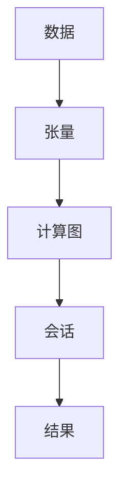

                 

## 1. 背景介绍

TensorFlow 是一个强大的开源机器学习平台，由 Google Brain 团队开发，用于进行深度学习研究和部署。它提供了一个完整的生态系统，包括高级 API、可视化工具、预训练模型和分布式训练等功能。本文将重点介绍如何使用 TensorFlow 进行图像和自然语言处理。

## 2. 核心概念与联系

### 2.1 核心概念

- **张量（Tensor）**：TensorFlow 中的核心数据结构，是一个多维数组，可以表示任何数据结构，如标量（0 维）、向量（1 维）、矩阵（2 维）等。
- **计算图（Computational Graph）**：TensorFlow 中的计算单元，表示了计算的流程，包括数据流和计算节点。
- **会话（Session）**：用于运行 TensorFlow 计算图的上下文，管理内存和资源。

### 2.2 核心概念联系 Mermaid 流程图



## 3. 核心算法原理 & 具体操作步骤

### 3.1 算法原理概述

TensorFlow 的核心算法是基于数据流图（Data Flow Graph）的，它允许并行执行计算，提高了计算效率。TensorFlow 还支持自动微分，用于计算梯度，从而优化模型参数。

### 3.2 算法步骤详解

1. 定义计算图：使用 TensorFlow API 定义计算图，包括输入数据、中间计算节点和输出结果。
2. 创建会话：创建一个会话，管理内存和资源。
3. 运行会话：在会话中运行计算图，获取结果。

### 3.3 算法优缺点

**优点：**

- 灵活性高：可以定义任意复杂的计算图。
- 并行计算：支持并行执行计算，提高了计算效率。
- 自动微分：支持自动微分，简化了模型优化过程。

**缺点：**

- 学习曲线陡峭：TensorFlow 的 API 相对复杂，需要一定的学习成本。
- 可视化困难：大型计算图的可视化比较困难。

### 3.4 算法应用领域

TensorFlow 主要应用于深度学习领域，包括图像分类、目标检测、语音识别、自然语言处理等。

## 4. 数学模型和公式 & 详细讲解 & 举例说明

### 4.1 数学模型构建

在 TensorFlow 中，数学模型通常表示为计算图，其中节点表示数学运算，边表示数据流。

### 4.2 公式推导过程

例如，在线性回归模型中，目标函数为：

$$J(\theta) = \frac{1}{2m} \sum_{i=1}^{m} (h_\theta(x^{(i)}) - y^{(i)})^2$$

其中，$h_\theta(x)$ 是模型的预测函数，$m$ 是训练样本数，$x^{(i)}$ 和 $y^{(i)}$ 分别是第 $i$ 个样本的输入和输出。

### 4.3 案例分析与讲解

在 TensorFlow 中，可以使用 `tf.GradientTape` 记录梯度，从而优化模型参数。例如：

```python
import tensorflow as tf

# 定义模型参数
theta = tf.Variable(0.0)

# 定义目标函数
def loss(theta):
    return tf.square(theta - 3.0)

# 使用 GradientTape 记录梯度
with tf.GradientTape() as tape:
    loss_value = loss(theta)

# 计算梯度
gradients = tape.gradient(loss_value, theta)

# 更新参数
theta.assign_sub(0.1 * gradients)
```

## 5. 项目实践：代码实例和详细解释说明

### 5.1 开发环境搭建

要使用 TensorFlow，需要安装 Python 和 TensorFlow。可以使用以下命令安装 TensorFlow：

```bash
pip install tensorflow
```

### 5.2 源代码详细实现

以下是一个简单的线性回归示例：

```python
import tensorflow as tf
import numpy as np

# 定义训练数据
x_train = np.linspace(-1, 1, 101)
y_train = 2 * x_train + np.random.randn(*x_train.shape) * 0.33

# 定义模型参数
theta = tf.Variable(0.0)
bias = tf.Variable(0.0)

# 定义目标函数
def loss(theta, bias):
    error = tf.square(y_train - (theta * x_train + bias))
    return tf.reduce_mean(error)

# 使用 GradientTape 记录梯度
optimizer = tf.optimizers.SGD(learning_rate=0.01)
for i in range(1000):
    with tf.GradientTape() as tape:
        loss_value = loss(theta, bias)
    gradients = tape.gradient(loss_value, [theta, bias])
    optimizer.apply_gradients(zip(gradients, [theta, bias]))
    if i % 100 == 0:
        print(f"Loss at step {i}: {loss_value.numpy()}")
```

### 5.3 代码解读与分析

在示例中，我们定义了一个简单的线性回归模型，使用梯度下降优化模型参数。我们使用 `tf.GradientTape` 记录梯度，并使用 `tf.optimizers.SGD` 更新参数。

### 5.4 运行结果展示

运行示例代码后，模型参数会逐渐接近真实参数（2 和 0），并打印出每个步骤的损失值。

## 6. 实际应用场景

### 6.1 图像分类

TensorFlow 可以用于构建卷积神经网络（CNN），进行图像分类任务。例如，可以使用预训练的 InceptionV3 模型进行图像分类：

```python
from tensorflow.keras.applications import InceptionV3
from tensorflow.keras.preprocessing import image
from tensorflow.keras.applications.inception_v3 import preprocess_input, decode_predictions
import numpy as np

# 加载预训练模型
model = InceptionV3(weights='imagenet')

# 加载图像并预处理
img_path = 'elephant.jpg'
img = image.load_img(img_path, target_size=(299, 299))
x = image.img_to_array(img)
x = np.expand_dims(x, axis=0)
x = preprocess_input(x)

# 进行预测
preds = model.predict(x)
print('Predicted:', decode_predictions(preds, top=3)[0])
```

### 6.2 自然语言处理

TensorFlow 可以用于构建循环神经网络（RNN）和注意力机制，进行自然语言处理任务。例如，可以使用预训练的 BERT 模型进行文本分类：

```python
from transformers import BertTokenizer, TFBertForSequenceClassification
import tensorflow as tf

# 加载预训练模型和分词器
tokenizer = BertTokenizer.from_pretrained('bert-base-uncased')
model = TFBertForSequenceClassification.from_pretrained('bert-base-uncased', num_labels=2)

# 加载文本数据
text = "I love this movie"
labels = [1]  # 1 表示正面评价

# 分词并转换为输入数据
inputs = tokenizer(text, return_tensors="tf")
labels = tf.constant(labels)

# 进行预测
outputs = model(inputs, labels=labels)
loss, logits = outputs[:2]
print('Predicted:', tf.argmax(logits, axis=1).numpy())
```

### 6.3 未来应用展望

随着深度学习技术的发展，TensorFlow 将继续在图像和自然语言处理领域发挥重要作用。未来，TensorFlow 可能会集成更多先进的模型和技术，如生成式对抗网络（GAN）和 transformer 等。

## 7. 工具和资源推荐

### 7.1 学习资源推荐

- TensorFlow 官方文档：<https://www.tensorflow.org/>
- TensorFlow 入门教程：<https://www.tensorflow.org/tutorials>
- Deep Learning Specialization 课程（由 Andrew Ng 讲授）：<https://www.coursera.org/specializations/deep-learning>

### 7.2 开发工具推荐

- Jupyter Notebook：一个交互式计算环境，支持 Python、R 等语言。
- TensorBoard：一个可视化工具，用于可视化 TensorFlow 计算图和训练过程。
- Colab：一个云端 Jupyter Notebook 环境，支持 GPU 加速。

### 7.3 相关论文推荐

- TensorFlow：Large-scale machine learning on heterogeneous systems：<https://arxiv.org/abs/1605.08121>
- BERT: Pre-training of Deep Bidirectional Transformers for Language Understanding：<https://arxiv.org/abs/1810.04805>

## 8. 总结：未来发展趋势与挑战

### 8.1 研究成果总结

TensorFlow 已经取得了丰富的研究成果，包括图像分类、目标检测、语音识别、自然语言处理等领域的先进模型。

### 8.2 未来发展趋势

未来，TensorFlow 可能会继续发展以下方向：

- 更先进的模型架构：如 transformer、attention mechanism 等。
- 更强大的硬件支持：如 TPU、GPU、FPGA 等。
- 更好的可解释性：如对模型决策的可解释性分析。

### 8.3 面临的挑战

TensorFlow 面临的挑战包括：

- 学习成本高：TensorFlow 的 API 相对复杂，需要一定的学习成本。
- 可视化困难：大型计算图的可视化比较困难。
- 资源消耗高：深度学习模型通常需要大量的计算资源。

### 8.4 研究展望

未来，TensorFlow 的研究可能会集中在以下领域：

- 更先进的模型架构：如 transformer、attention mechanism 等。
- 更强大的硬件支持：如 TPU、GPU、FPGA 等。
- 更好的可解释性：如对模型决策的可解释性分析。

## 9. 附录：常见问题与解答

**Q：TensorFlow 和 PyTorch 有什么区别？**

A：TensorFlow 和 PyTorch 都是流行的深度学习框架，但它们有几个关键区别：

- TensorFlow 是由 Google 开发的，而 PyTorch 是由 Facebook 的 AI 研究实验室开发的。
- TensorFlow 使用静态图进行计算，而 PyTorch 使用动态图进行计算。
- TensorFlow 的 API 相对复杂，而 PyTorch 的 API 更简单易用。
- TensorFlow 支持更多的硬件平台，包括 TPU、GPU、CPU 等，而 PyTorch 主要支持 GPU 和 CPU。

**Q：如何在 TensorFlow 中使用预训练模型？**

A：TensorFlow 提供了预训练模型的 API，可以直接加载预训练模型并进行微调。例如，可以使用以下代码加载预训练的 InceptionV3 模型：

```python
from tensorflow.keras.applications import InceptionV3

# 加载预训练模型
model = InceptionV3(weights='imagenet')
```

**Q：如何在 TensorFlow 中进行分布式训练？**

A：TensorFlow 提供了分布式训练的 API，可以在多个 GPU 或 TPU 上并行训练模型。例如，可以使用以下代码进行分布式训练：

```python
import tensorflow as tf

# 创建分布式策略
strategy = tf.distribute.MirroredStrategy()

# 创建模型
with strategy.scope():
    model = tf.keras.models.Sequential([
        tf.keras.layers.Dense(64, activation='relu', input_shape=(784,)),
        tf.keras.layers.Dense(10, activation='softmax')
    ])

# 编译模型
model.compile(optimizer='adam',
              loss='sparse_categorical_crossentropy',
              metrics=['accuracy'])

# 加载数据
(x_train, y_train), (x_test, y_test) = tf.keras.datasets.mnist.load_data()
x_train, x_test = x_train / 255.0, x_test / 255.0

# 进行分布式训练
model.fit(x_train, y_train, epochs=5)
```

## 作者：禅与计算机程序设计艺术 / Zen and the Art of Computer Programming

