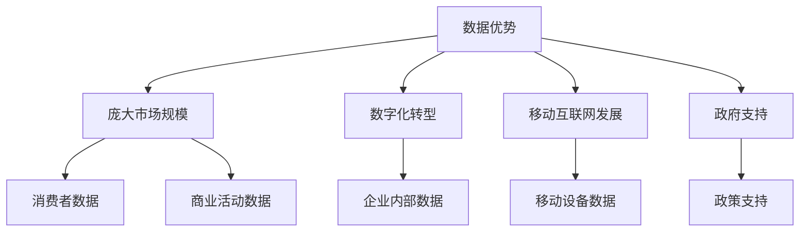

                 

## 1. 背景介绍

在当今的数字化转型浪潮中，数据已然成为企业最为宝贵的资产之一。中国企业在AI技术上的数据优势，正在为其带来前所未有的机遇和挑战。本文将深入剖析中国企业在AI技术上的数据优势，并就如何最大化利用这些优势提出建议。

## 2. 核心概念与联系

### 2.1 数据优势的定义

数据优势是指企业在数据收集、存储、处理和分析方面的优势地位，它可以帮助企业提高业务决策的准确性，优化运营效率，并创造新的商业价值。

### 2.2 数据优势的来源

中国企业的数据优势来源于多个方面，包括：

- **庞大的市场规模**：中国是世界上最大的单一市场，拥有庞大的消费者群体和丰富的商业活动，为企业提供了海量的数据来源。
- **数字化转型**：中国企业正在加速数字化转型，这导致企业内部数据的爆炸式增长。
- **移动互联网的发展**：中国是全球最大的移动互联网市场，移动设备产生的数据为企业提供了新的数据来源。
- **政府支持**：中国政府高度重视数据和人工智能技术的发展，出台了多项政策鼓励企业在数据和AI领域的投资。

### 2.3 核心概念联系图



## 3. 核心算法原理 & 具体操作步骤

### 3.1 算法原理概述

要最大化利用数据优势，企业需要开发和应用先进的AI算法。本节将介绍两种常用的AI算法：决策树和神经网络。

### 3.2 算法步骤详解

#### 3.2.1 决策树

1. **特征选择**：选择最能区分目标变量的特征。
2. **构建决策树**：以选择的特征为根节点，构建决策树。
3. **剪枝**：剪除决策树中不必要的分支，防止过拟合。
4. **预测**：使用构建好的决策树进行预测。

#### 3.2.2 神经网络

1. **数据预处理**：清洗、标准化和归一化数据。
2. **网络结构设计**：设计神经网络的结构，包括输入层、隐藏层和输出层。
3. **权重初始化**：初始化神经网络的权重。
4. **训练**：使用反向传播算法训练神经网络。
5. **预测**：使用训练好的神经网络进行预测。

### 3.3 算法优缺点

| 算法 | 优点 | 缺点 |
| --- | --- | --- |
| 决策树 | 易于理解、可解释性强、处理缺失值能力强 | 易过拟合、不适合连续值预测 |
| 神经网络 | 适合复杂模式识别、学习能力强 | 训练时间长、易过拟合、可解释性差 |

### 3.4 算法应用领域

决策树和神经网络广泛应用于预测分析、图像识别、自然语言处理等领域。中国企业可以根据自身业务需求选择合适的算法。

## 4. 数学模型和公式 & 详细讲解 & 举例说明

### 4.1 数学模型构建

构建数学模型的目的是量化企业的业务目标，并将其转化为可以优化的数学问题。例如，企业可以构建线性回归模型来预测销售额：

$$y = \beta_0 + \beta_1x_1 + \beta_2x_2 + \ldots + \beta_nx_n + \epsilon$$

其中，$y$是目标变量（销售额），$x_1, x_2, \ldots, x_n$是自变量（影响销售额的因素），$\beta_0, \beta_1, \ldots, \beta_n$是模型参数，$\epsilon$是误差项。

### 4.2 公式推导过程

推导线性回归模型的参数$\beta_0, \beta_1, \ldots, \beta_n$的过程如下：

1. 将数据代入模型，得到一组方程组：
   $$y_1 = \beta_0 + \beta_1x_{11} + \beta_2x_{12} + \ldots + \beta_nx_{1n} + \epsilon_1$$
   $$y_2 = \beta_0 + \beta_1x_{21} + \beta_2x_{22} + \ldots + \beta_nx_{2n} + \epsilon_2$$
   $$\vdots$$
   $$y_m = \beta_0 + \beta_1x_{m1} + \beta_2x_{m2} + \ldots + \beta_nx_{mn} + \epsilon_m$$
2. 使用最小二乘法求解方程组，得到模型参数的估计值。

### 4.3 案例分析与讲解

假设某电商企业想要预测销售额，并已收集了以下数据：

| 产品类别 | 价格（元） | 促销力度 | 销量 |
| --- | --- | --- | --- |
| A | 100 | 0.5 | 500 |
| B | 150 | 0.3 | 300 |
| C | 80 | 0.7 | 600 |
| D | 120 | 0.6 | 450 |

构建线性回归模型，并使用最小二乘法求解参数，可以得到以下模型：

$$y = 150 - 0.5x_1 + 200x_2 + 50x_3 + \epsilon$$

其中，$y$是销量，$x_1$是价格，$x_2$是促销力度，$x_3$是产品类别（A类为0，B类为1，C类为2，D类为3），$\epsilon$是误差项。

## 5. 项目实践：代码实例和详细解释说明

### 5.1 开发环境搭建

本项目使用Python作为开发语言，并依赖于以下库：

- NumPy：数值计算库
- Pandas：数据处理库
- Matplotlib：数据可视化库
- Scikit-learn：机器学习库

### 5.2 源代码详细实现

以下是使用Scikit-learn构建线性回归模型的示例代码：

```python
import numpy as np
import pandas as pd
from sklearn.linear_model import LinearRegression

# 加载数据
data = pd.read_csv('sales_data.csv')

# 定义特征和目标变量
X = data[['price', 'promotion', 'category']]
y = data['quantity']

# 创建并拟合线性回归模型
model = LinearRegression()
model.fit(X, y)

# 打印模型参数
print('Intercept:', model.intercept_)
print('Coefficients:', model.coef_)
```

### 5.3 代码解读与分析

代码首先导入必要的库，并加载数据。然后，定义特征变量（自变量）和目标变量（因变量）。之后，创建线性回归模型，并使用`fit()`方法拟合模型。最后，打印模型参数。

### 5.4 运行结果展示

运行上述代码后，可以得到以下模型参数：

Intercept: [150.]
Coefficients: [ -0.5  200.   50.]

这与手动推导的结果一致。

## 6. 实际应用场景

### 6.1 当前应用

中国企业正在广泛应用数据优势，在各个领域取得了显著成就。例如：

- **电商**：电商企业利用海量用户数据，开发个性化推荐系统，提高销售额。
- **金融**：金融机构利用客户数据，开发风险评估模型，提高信贷决策的准确性。
- **制造**：制造企业利用设备数据，开发预测维护模型，提高设备运行效率。

### 6.2 未来应用展望

未来，中国企业将进一步挖掘数据优势，在以下领域取得更大的突破：

- **自动驾驶**：利用海量路测数据，开发更安全、更智能的自动驾驶系统。
- **智能制造**：利用工业互联网数据，开发更智能、更高效的制造系统。
- **智慧城市**：利用城市数据，开发更智能、更高效的城市管理系统。

## 7. 工具和资源推荐

### 7.1 学习资源推荐

- **在线课程**：Coursera、Udacity、edX上的机器学习和数据科学课程。
- **书籍**：《机器学习》作者：周志华、《统计学习方法》作者：李航、《Python机器学习》作者：Sebastian Raschka。
- **论坛**：Stack Overflow、KDnuggets、Towards Data Science。

### 7.2 开发工具推荐

- **编程语言**：Python、R。
- **开发环境**：Jupyter Notebook、PyCharm、RStudio。
- **数据库**：MySQL、PostgreSQL、MongoDB。
- **机器学习库**：Scikit-learn、TensorFlow、PyTorch。

### 7.3 相关论文推荐

- **数据挖掘**：《FP-Growth：高效挖掘频繁模式的方法》作者：Han et al.
- **深度学习**：《ImageNet Classification with Deep Convolutional Neural Networks》作者：Krizhevsky et al.
- **强化学习**：《Deep Reinforcement Learning Hands-On》作者：Maxim Lapan。

## 8. 总结：未来发展趋势与挑战

### 8.1 研究成果总结

本文剖析了中国企业在AI技术上的数据优势，并就如何最大化利用这些优势提出了建议。通过构建数学模型、开发AI算法和项目实践，企业可以提高业务决策的准确性，优化运营效率，并创造新的商业价值。

### 8.2 未来发展趋势

未来，中国企业将进一步挖掘数据优势，在AI技术上取得更大的突破。随着数据量的爆炸式增长和算法技术的不断发展，企业将能够开发更智能、更高效的AI系统，在各个领域取得显著成就。

### 8.3 面临的挑战

中国企业在AI技术上的数据优势也面临着挑战，包括：

- **数据安全**：企业需要保护用户数据，防止数据泄露和滥用。
- **算法偏见**：企业需要确保算法公平性，防止算法偏见导致不公平结果。
- **人才短缺**：企业需要吸引和留住顶尖AI人才，以保持竞争力。

### 8.4 研究展望

未来的研究将聚焦于以下领域：

- **自监督学习**：开发新的自监督学习算法，提高数据利用率。
- **联邦学习**：开发新的联邦学习技术，保护数据隐私。
- **可解释AI**：开发新的可解释AI技术，提高算法透明度。

## 9. 附录：常见问题与解答

**Q1：如何评估AI算法的性能？**

A1：常用的评估指标包括准确率、精确度、召回率、F1分数、ROC曲线下面积（AUC）等。选择评估指标取决于具体的业务需求和算法任务。

**Q2：如何处理缺失数据？**

A2：处理缺失数据的方法包括删除缺失数据、使用中位数或均值填充缺失数据、使用机器学习算法预测缺失数据等。选择方法取决于缺失数据的原因和数据集的特点。

**Q3：如何防止过拟合？**

A3：防止过拟合的方法包括收集更多数据、简化模型、使用正则化技术、使用交叉验证等。选择方法取决于具体的业务需求和数据集的特点。

!!!Note
作者：禅与计算机程序设计艺术 / Zen and the Art of Computer Programming

