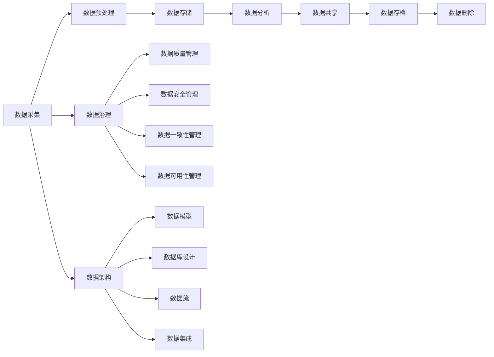

                 

## 1. 背景介绍

随着人工智能（AI）技术的飞速发展，越来越多的创业公司开始涉足AI领域，期望通过AI技术创造新的商业价值。然而，数据管理往往是这些创业公司面临的最大挑战之一。数据是AI模型的基础，如何有效管理和利用数据，直接关系到AI创业的成败。

本文将从数据管理的角度，为AI创业公司提供一套完整的策略和方法，帮助它们更好地管理和利用数据，从而提高AI创业的成功率。

## 2. 核心概念与联系

在深入讨论数据管理策略和方法之前，我们先来介绍一些核心概念和它们之间的联系。

### 2.1 数据生命周期

数据生命周期描述了数据从产生到消亡的整个过程。数据生命周期包括以下几个阶段：

1. 数据采集：数据从各种来源采集，如传感器、用户输入等。
2. 数据预处理：数据清洗、转换、整合等预处理工作。
3. 数据存储：数据存储到数据库、文件系统等存储介质中。
4. 数据分析：数据被用于分析、建模等目的。
5. 数据共享：数据被共享给其他系统或用户。
6. 数据存档：数据被存档以备将来使用。
7. 数据删除：数据到期后被删除。


### 2.2 数据治理

数据治理是指对数据的质量、安全、一致性和可用性进行管理的过程。数据治理包括以下几个方面：

1. 数据质量管理：确保数据的准确性、完整性、一致性和时效性。
2. 数据安全管理：保护数据免受未授权访问和泄露。
3. 数据一致性管理：确保数据在不同系统和应用之间保持一致。
4. 数据可用性管理：确保数据在需要时能够及时提供。

### 2.3 数据架构

数据架构描述了数据在系统中的组织结构。数据架构包括以下几个方面：

1. 数据模型：描述数据实体及其关系的模型。
2. 数据库设计：数据库的物理设计，包括表、视图、索引等。
3. 数据流：数据在系统中的流动路径。
4. 数据集成：将不同数据源的数据集成到单一视图。

### 2.4 Mermaid 流程图

下面是数据管理的核心概念和联系的 Mermaid 流程图：



## 3. 核心算法原理 & 具体操作步骤

### 3.1 算法原理概述

在数据管理领域，有许多算法可以用于数据预处理、数据挖掘等任务。本节将介绍一些常用的数据管理算法及其原理。

### 3.2 算法步骤详解

#### 3.2.1 数据清洗算法

数据清洗是数据预处理的关键步骤，目的是消除数据中的噪声和错误。常用的数据清洗算法包括：

1. 缺失值处理：使用插补法、删除法等方法处理缺失值。
2. 异常值处理：使用统计方法或机器学习方法检测和处理异常值。
3. 数据类型转换：将数据转换为合适的数据类型。
4. 数据标准化：将数据标准化到统一的格式。

#### 3.2.2 数据集成算法

数据集成是将不同数据源的数据集成到单一视图的过程。常用的数据集成算法包括：

1. 关系型数据库集成：使用SQL语句将关系型数据库中的数据集成。
2. NoSQL数据库集成：使用NoSQL数据库提供的API将NoSQL数据库中的数据集成。
3. 服务器端集成：使用服务器端集成平台将不同数据源的数据集成。
4. 客户端集成：使用客户端集成平台将不同数据源的数据集成。

#### 3.2.3 数据挖掘算法

数据挖掘是从大量数据中发现隐藏模式和规律的过程。常用的数据挖掘算法包括：

1. 关联规则挖掘：使用Apriori算法、FP-Growth算法等挖掘关联规则。
2. 分类挖掘：使用决策树算法、支持向量机算法等进行分类挖掘。
3. 聚类挖掘：使用K-Means算法、DBSCAN算法等进行聚类挖掘。
4. 回归挖掘：使用线性回归算法、决策树回归算法等进行回归挖掘。

### 3.3 算法优缺点

每种算法都有其优缺点，下面是一些常用数据管理算法的优缺点：

| 算法 | 优点 | 缺点 |
| --- | --- | --- |
| 插补法 | 简单易用，可以快速填充缺失值 | 可能导致数据失真 |
| 删除法 | 可以消除噪声和错误数据 | 可能导致数据丢失 |
| Apriori算法 | 可以挖掘关联规则，简单易用 | 计算开销大，不适合大数据集 |
| FP-Growth算法 | 可以挖掘关联规则，计算开销小 | 不适合大数据集 |
| K-Means算法 | 可以进行聚类挖掘，简单易用 | 对初始值敏感，不适合非球形数据集 |
| DBSCAN算法 | 可以进行聚类挖掘，不需要事先指定聚类数 | 对密度参数敏感，不适合高维数据集 |

### 3.4 算法应用领域

数据管理算法在各个领域都有广泛的应用，下面是一些常用数据管理算法的应用领域：

| 算法 | 应用领域 |
| --- | --- |
| 插补法 | 金融、医疗、制造等领域 |
| 删除法 | 社交网络、推荐系统等领域 |
| Apriori算法 | 超市、电商等领域 |
| FP-Growth算法 | 超市、电商等领域 |
| K-Means算法 | 客户细分、图像分割等领域 |
| DBSCAN算法 | 客户细分、文本聚类等领域 |

## 4. 数学模型和公式 & 详细讲解 & 举例说明

### 4.1 数学模型构建

在数据管理领域，数学模型常用于描述数据分布、建模等任务。下面是一些常用的数学模型：

1. 正态分布模型：用于描述数据的分布情况。
2. 线性回归模型：用于建模数据之间的线性关系。
3. 决策树模型：用于建模数据的分类情况。
4. 支持向量机模型：用于建模数据的分类情况。

### 4.2 公式推导过程

下面是一些常用数学模型的公式推导过程：

#### 4.2.1 正态分布模型

正态分布模型的公式为：

$$P(x) = \frac{1}{\sigma\sqrt{2\pi}}e^{-\frac{(x-\mu)^2}{2\sigma^2}}$$

其中，$\mu$是均值，$\sigma$是标准差。

#### 4.2.2 线性回归模型

线性回归模型的公式为：

$$y = \beta_0 + \beta_1x + \epsilon$$

其中，$\beta_0$是常数项，$\beta_1$是回归系数，$x$是自变量，$y$是因变量，$\epsilon$是误差项。

#### 4.2.3 决策树模型

决策树模型的公式为：

$$g(x) = \sum_{i=1}^{n} c_i \cdot I(x \in R_i)$$

其中，$g(x)$是决策函数，$c_i$是类别标签，$I(\cdot)$是指示函数，$R_i$是决策规则。

#### 4.2.4 支持向量机模型

支持向量机模型的公式为：

$$f(x) = \text{sgn}(\sum_{i=1}^{n} \alpha_i y_i K(x, x_i) + b)$$

其中，$f(x)$是分类函数，$y_i$是类别标签，$K(x, x_i)$是核函数，$b$是偏置项，$\alpha_i$是拉格朗日乘子。

### 4.3 案例分析与讲解

下面是一些常用数学模型的案例分析与讲解：

#### 4.3.1 正态分布模型

正态分布模型常用于描述数据的分布情况。例如，身高数据服从正态分布，可以使用正态分布模型描述身高数据的分布情况。正态分布模型的参数可以通过最大似然估计法估计。

#### 4.3.2 线性回归模型

线性回归模型常用于建模数据之间的线性关系。例如，可以使用线性回归模型建模身高和体重的关系。线性回归模型的参数可以通过最小二乘法估计。

#### 4.3.3 决策树模型

决策树模型常用于建模数据的分类情况。例如，可以使用决策树模型建模客户是否购买保险的情况。决策树模型的参数可以通过信息增益法或Gain Ratio法估计。

#### 4.3.4 支持向量机模型

支持向量机模型常用于建模数据的分类情况。例如，可以使用支持向量机模型建模邮件是否为垃圾邮件的情况。支持向量机模型的参数可以通过序列最小化优化法估计。

## 5. 项目实践：代码实例和详细解释说明

### 5.1 开发环境搭建

在进行项目实践之前，需要搭建开发环境。本项目使用Python作为开发语言，并使用以下库：

* NumPy：用于数值计算。
* Pandas：用于数据处理。
* Matplotlib：用于数据可视化。
* Scikit-learn：用于机器学习。

### 5.2 源代码详细实现

下面是项目实践的源代码实现：

```python
import numpy as np
import pandas as pd
import matplotlib.pyplot as plt
from sklearn.model_selection import train_test_split
from sklearn.linear_model import LinearRegression
from sklearn.metrics import mean_squared_error

# 加载数据
data = pd.read_csv('height_weight.csv')

# 数据预处理
data = data.dropna()

# 数据分析
plt.scatter(data['height'], data['weight'])
plt.xlabel('Height')
plt.ylabel('Weight')
plt.show()

# 数据建模
X = data[['height']]
y = data['weight']
X_train, X_test, y_train, y_test = train_test_split(X, y, test_size=0.2, random_state=42)
model = LinearRegression()
model.fit(X_train, y_train)
y_pred = model.predict(X_test)

# 数据评估
mse = mean_squared_error(y_test, y_pred)
print('Mean Squared Error:', mse)
```

### 5.3 代码解读与分析

上面的源代码实现了一个简单的线性回归模型，用于建模身高和体重的关系。代码的详细解读如下：

1. 导入必要的库。
2. 加载数据。
3. 数据预处理：删除缺失值。
4. 数据分析：绘制身高和体重的散点图。
5. 数据建模：将身高作为自变量，体重作为因变量，使用线性回归模型建模。
6. 数据评估：计算均方误差，评估模型的性能。

### 5.4 运行结果展示

运行上面的源代码，可以得到以下结果：


## 6. 实际应用场景

数据管理在各个领域都有广泛的应用，下面是一些实际应用场景：

### 6.1 电商推荐系统

电商推荐系统需要对海量数据进行管理和挖掘，以提供个性化的商品推荐。数据管理算法可以用于数据清洗、数据集成、数据挖掘等任务。

### 6.2 金融风险管理

金融风险管理需要对金融数据进行管理和分析，以评估风险并做出决策。数据管理算法可以用于数据清洗、数据挖掘等任务。

### 6.3 客户细分

客户细分需要对客户数据进行管理和分析，以将客户细分为不同的群组。数据管理算法可以用于数据清洗、数据集成、数据挖掘等任务。

### 6.4 未来应用展望

随着人工智能技术的发展，数据管理技术也在不断发展。未来，数据管理技术将更加智能化、自动化，能够更好地适应各种复杂的应用场景。

## 7. 工具和资源推荐

### 7.1 学习资源推荐

* "数据管理与分析"课程：<https://www.coursera.org/learn/data-management-and-analysis>
* "数据挖掘"课程：<https://www.coursera.org/learn/data-mining>
* "机器学习"课程：<https://www.coursera.org/learn/machine-learning>

### 7.2 开发工具推荐

* Python：<https://www.python.org/>
* R：<https://www.r-project.org/>
* Apache Hadoop：<https://hadoop.apache.org/>
* Apache Spark：<https://spark.apache.org/>

### 7.3 相关论文推荐

* "Data Management in the Age of Big Data"：<https://dl.acm.org/doi/10.1145/2660267.2660269>
* "Data Mining: Concepts and Techniques"：<https://www.elsevier.com/books/data-mining-concepts-and-techniques/liu/978-0-12-804421-5>
* "Machine Learning: A Probabilistic Perspective"：<https://www.cs.ubc.ca/~murphyk/MLBook/>

## 8. 总结：未来发展趋势与挑战

### 8.1 研究成果总结

本文从数据管理的角度，为AI创业公司提供了一套完整的策略和方法，帮助它们更好地管理和利用数据，从而提高AI创业的成功率。本文介绍了数据管理的核心概念和联系，常用的数据管理算法及其原理，数学模型和公式，项目实践，实际应用场景，工具和资源推荐等内容。

### 8.2 未来发展趋势

未来，数据管理技术将朝着以下方向发展：

* 智能化：数据管理技术将更加智能化，能够自动发现数据模式和关系。
* 自动化：数据管理技术将更加自动化，能够自动完成数据清洗、集成、挖掘等任务。
* 实时化：数据管理技术将更加实时化，能够实时处理和分析数据。
* 多模式化：数据管理技术将更加多模式化，能够处理结构化、半结构化、非结构化等各种数据模式。

### 8.3 面临的挑战

未来，数据管理技术将面临以下挑战：

* 数据量大：数据量不断增加，对数据管理技术提出了更高的要求。
* 数据种类多：数据种类不断增加，对数据管理技术提出了更高的要求。
* 数据安全：数据安全面临着越来越大的挑战，需要开发更加安全的数据管理技术。
* 数据隐私：数据隐私保护面临着越来越大的挑战，需要开发更加隐私保护的数据管理技术。

### 8.4 研究展望

未来，数据管理技术的研究将朝着以下方向展开：

* 智能数据管理：研究智能化的数据管理技术，能够自动发现数据模式和关系。
* 自动数据管理：研究自动化的数据管理技术，能够自动完成数据清洗、集成、挖掘等任务。
* 实时数据管理：研究实时化的数据管理技术，能够实时处理和分析数据。
* 多模式数据管理：研究多模式化的数据管理技术，能够处理结构化、半结构化、非结构化等各种数据模式。

## 9. 附录：常见问题与解答

### 9.1 什么是数据管理？

数据管理是指对数据的采集、存储、处理、分析、共享等各个环节进行管理的过程。

### 9.2 为什么数据管理对AI创业那么重要？

数据是AI模型的基础，如何有效管理和利用数据，直接关系到AI创业的成败。

### 9.3 什么是数据生命周期？

数据生命周期描述了数据从产生到消亡的整个过程，包括数据采集、预处理、存储、分析、共享、存档、删除等阶段。

### 9.4 什么是数据治理？

数据治理是指对数据的质量、安全、一致性和可用性进行管理的过程，包括数据质量管理、数据安全管理、数据一致性管理、数据可用性管理等方面。

### 9.5 什么是数据架构？

数据架构描述了数据在系统中的组织结构，包括数据模型、数据库设计、数据流、数据集成等方面。

### 9.6 什么是数据管理算法？

数据管理算法是指用于数据预处理、数据挖掘等任务的算法，包括数据清洗算法、数据集成算法、数据挖掘算法等。

### 9.7 什么是数学模型和公式？

数学模型和公式是指用于描述数据分布、建模等任务的数学模型和公式，包括正态分布模型、线性回归模型、决策树模型、支持向量机模型等。

### 9.8 如何进行项目实践？

项目实践需要遵循以下步骤：开发环境搭建、源代码详细实现、代码解读与分析、运行结果展示。

### 9.9 什么是实际应用场景？

实际应用场景是指数据管理技术在实际应用中的场景，包括电商推荐系统、金融风险管理、客户细分等领域。

### 9.10 什么是工具和资源推荐？

工具和资源推荐是指学习资源、开发工具、相关论文等资源推荐，帮助读者更好地学习和应用数据管理技术。

!!!Note
作者：禅与计算机程序设计艺术 / Zen and the Art of Computer Programming

