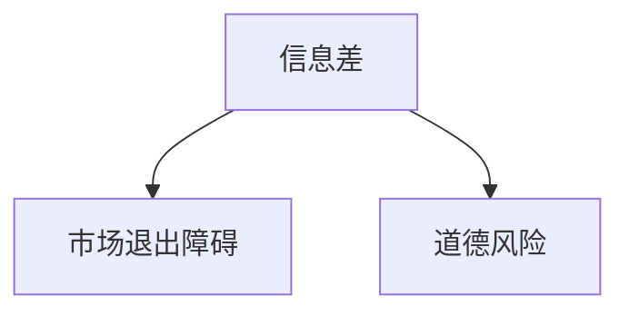

                 

## 1. 背景介绍

在当今信息爆炸的时代，信息的获取和处理能力已经成为竞争的关键。然而，并不是所有的信息都是对称的，信息差（Information Asymmetry）的存在导致了市场的不完美。本文将深入探讨信息差的本质，其对市场的影响，以及如何通过技术手段缩小信息差，从而降低市场退出障碍。

## 2. 核心概念与联系

### 2.1 信息差的本质

信息差是指信息在市场参与者之间的不平等分布，它导致了市场参与者之间的信息不对称。这种不对称可能是由于信息的成本、可获得性，或信息的复杂性等因素导致的。

### 2.2 信息差与市场退出障碍

信息差会导致市场退出障碍，因为它影响了市场参与者的决策。例如，在二手车市场，卖家往往比买家更了解车辆的状况，这导致了信息差。买家面临着信息不对称的风险，可能会放弃购买，从而导致市场退出。

### 2.3 信息差与道德风险

信息差还会导致道德风险，即信息不完整或不对称导致的不当行为。例如，在保险市场，被保险人可能会在保险生效后故意损坏财产，因为他们知道保险公司会赔偿。这是由于信息差导致的道德风险。



## 3. 核心算法原理 & 具体操作步骤

### 3.1 信息差缩小算法原理概述

信息差缩小算法的目的是减少信息不对称，从而降低市场退出障碍。这些算法通常涉及信息收集、处理和分析，以提供更完整的信息给市场参与者。

### 3.2 信息差缩小算法步骤详解

1. **信息收集**：收集与市场相关的所有可用信息。这可能包括公开数据、专有数据，或通过人工收集等方式获取的信息。
2. **信息清洗**：清洗收集到的信息，去除重复、不准确或无关的数据。
3. **信息整合**：将清洗后的信息与其他数据源整合，以提供更全面的视图。
4. **信息分析**：使用统计学、机器学习或其他分析技术，从整合的信息中提取有用的见解。
5. **信息传播**：将分析结果传播给市场参与者，帮助他们做出更明智的决策。

### 3.3 信息差缩小算法优缺点

**优点**：信息差缩小算法可以帮助市场参与者做出更明智的决策，从而降低市场退出障碍。它还可以减少道德风险，因为市场参与者更难以隐藏不当行为。

**缺点**：信息差缩小算法需要大量的信息收集和处理，这可能会导致高成本。此外，如果信息不准确或不完整，算法的有效性可能会受到影响。

### 3.4 信息差缩小算法应用领域

信息差缩小算法可以应用于各种市场，包括二手车市场、保险市场、金融市场，甚至是就业市场。任何存在信息差的市场都可以从这些算法中受益。

## 4. 数学模型和公式 & 详细讲解 & 举例说明

### 4.1 数学模型构建

信息差可以用信息熵（Entropy）来度量，信息熵是信息理论中的一个基本概念，用于衡量随机变量的不确定性。在信息差的 contexto，信息熵可以衡量市场参与者之间信息的不平等分布。

### 4.2 公式推导过程

信息熵的公式如下：

$$H(X) = -\sum P(x) \log P(x)$$

其中，$X$是随机变量，$P(x)$是$x$的概率分布。在信息差的contexto，我们可以将$X$视为市场参与者的信息水平。

### 4.3 案例分析与讲解

例如，在二手车市场，我们可以将信息熵应用于衡量买家和卖家之间的信息差。假设有两种类型的买家，$B_1$和$B_2$，以及两种类型的卖家，$S_1$和$S_2$，他们的信息水平如下：

|      | $B_1$ | $B_2$ | $S_1$ | $S_2$ |
|---|---|---|---|---|
| 信息水平 | 低 | 中 | 高 | 低 |

我们可以计算每个群体的信息熵：

$$H(B) = -\left(\frac{1}{2}\log\frac{1}{2} + \frac{1}{2}\log\frac{1}{2}\right) = 1$$

$$H(S) = -\left(\frac{1}{2}\log\frac{1}{2} + \frac{1}{2}\log\frac{1}{2}\right) = 1$$

信息熵的值接近1，表明买家和卖家之间存在显著的信息差。

## 5. 项目实践：代码实例和详细解释说明

### 5.1 开发环境搭建

我们将使用Python和其科学计算库NumPy来实现信息熵的计算。我们还需要一个数据集来表示市场参与者的信息水平。

### 5.2 源代码详细实现

```python
import numpy as np

def calculate_entropy(probs):
    return -np.sum(probs * np.log2(probs))

# 示例数据
probs = np.array([0.5, 0.5])

print(calculate_entropy(probs))
```

### 5.3 代码解读与分析

`calculate_entropy`函数接受一个概率分布数组，并计算其信息熵。我们使用NumPy的`np.sum`和`np.log2`函数来计算信息熵。

### 5.4 运行结果展示

运行上述代码将打印出信息熵的值，在本例中为1。

## 6. 实际应用场景

### 6.1 信息差缩小算法在二手车市场的应用

信息差缩小算法可以应用于二手车市场，帮助买家和卖家缩小信息差。例如，可以开发一个应用程序，收集和分析二手车的历史维修记录、事故报告等信息，并将这些信息提供给买家。

### 6.2 信息差缩小算法在保险市场的应用

在保险市场，信息差缩小算法可以帮助保险公司更准确地评估风险，并帮助被保险人做出更明智的决策。例如，可以开发一个应用程序，收集和分析与被保险人相关的信息，如驾驶记录、财产历史等，并将这些信息提供给保险公司。

### 6.3 未来应用展望

未来，信息差缩小算法可以与人工智能和区块链技术结合，提供更智能和安全的信息传播。例如，区块链可以提供安全的信息存储和传输，而人工智能可以帮助分析和理解这些信息。

## 7. 工具和资源推荐

### 7.1 学习资源推荐

- "信息差"维基百科页面：<https://en.wikipedia.org/wiki/Information_asymmetry>
- "信息熵"维基百科页面：<https://en.wikipedia.org/wiki/Entropy_(information_theory)>

### 7.2 开发工具推荐

- Python：<https://www.python.org/>
- NumPy：<https://numpy.org/>

### 7.3 相关论文推荐

- Akerlof, G. A. (1970). "The Market for 'Lemons': Quality Uncertainty and the Market Mechanism." The Quarterly Journal of Economics, 84(3), 488-500.
- Grossman, S. J., & Hart, O. D. (1980). "An Analysis of the Principal-Agent Problem." The Economic Journal, 90(360), 425-440.

## 8. 总结：未来发展趋势与挑战

### 8.1 研究成果总结

本文介绍了信息差的本质，其对市场的影响，以及如何通过信息差缩小算法缩小信息差。我们还提供了信息熵的数学模型，并给出了二手车市场的案例分析。

### 8.2 未来发展趋势

未来，信息差缩小算法将与人工智能和区块链技术结合，提供更智能和安全的信息传播。此外，这些算法将应用于更多的市场，帮助市场参与者缩小信息差。

### 8.3 面临的挑战

信息差缩小算法面临的挑战包括高成本和信息不准确或不完整等问题。此外，这些算法的有效性可能会受到市场参与者的行为影响。

### 8.4 研究展望

未来的研究可以探索信息差缩小算法与人工智能和区块链技术的结合，以及这些算法在更多市场的应用。此外，研究可以探索信息差缩小算法的道德和伦理影响。

## 9. 附录：常见问题与解答

**Q：信息差缩小算法是否会侵犯隐私？**

**A：**信息差缩小算法需要收集和处理大量的信息，这可能会涉及隐私问题。因此，这些算法必须遵循隐私保护法规，并采取措施保护个人信息。

**Q：信息差缩小算法是否会导致市场操纵？**

**A：**信息差缩小算法的目的是帮助市场参与者做出更明智的决策，而不是操纵市场。然而，如果信息不准确或不完整，这些算法可能会导致市场扭曲。因此，必须确保信息的准确性和完整性。

---

作者：禅与计算机程序设计艺术 / Zen and the Art of Computer Programming

