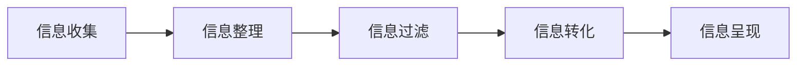

                 

**信息简化的工具和自动化技术：利用技术简化你的生活和工作**

**作者：禅与计算机程序设计艺术 / Zen and the Art of Computer Programming**

## 1. 背景介绍

在信息爆炸的时代，我们每天都要处理海量信息。如何有效地简化信息，提高工作和生活效率，是我们面临的共同挑战。本文将介绍一系列信息简化的工具和自动化技术，帮助读者利用技术简化生活和工作。

## 2. 核心概念与联系

信息简化的核心是将复杂的信息转化为简单易懂的形式。这涉及到信息的收集、整理、过滤、转化和呈现等过程。下面是这些过程的 Mermaid 流程图：



## 3. 核心算法原理 & 具体操作步骤

### 3.1 算法原理概述

信息简化的核心算法是信息熵（Information Entropy）算法。信息熵是信息论中的一个基本概念，用于衡量信息的不确定性或随机性。通过最小化信息熵，我们可以简化信息。

### 3.2 算法步骤详解

1. **信息收集**：收集相关信息，可以是文本、图像、音频等形式。
2. **信息整理**：对收集到的信息进行结构化处理，如将文本转化为标记语言（如HTML、XML），或将图像转化为矢量图。
3. **信息过滤**：使用信息熵算法过滤无关信息。信息熵算法的基本原理是：如果信息的熵值低于某个阈值，则认为该信息是无关信息，需要过滤掉。
4. **信息转化**：将过滤后的信息转化为更简单易懂的形式。这可以是将文本转化为关键词，或将图像转化为简化的图表。
5. **信息呈现**：将转化后的信息以易于理解的形式呈现出来。这可以是文本、图表、图像等形式。

### 3.3 算法优缺点

**优点**：信息熵算法可以有效地简化信息，提高信息的可理解性。它可以帮助我们从海量信息中提取关键信息，节省时间和精力。

**缺点**：信息熵算法的有效性取决于信息熵阈值的设置。如果阈值设置不当，可能会导致关键信息被过滤掉。此外，信息转化的有效性也取决于转化算法的设计。

### 3.4 算法应用领域

信息简化技术可以应用于各个领域，如新闻信息简化、文档自动总结、图像简化等。它可以帮助我们从海量信息中提取关键信息，提高工作和生活效率。

## 4. 数学模型和公式 & 详细讲解 & 举例说明

### 4.1 数学模型构建

信息熵算法的数学模型是基于香农熵（Shannon Entropy）构建的。香农熵是信息论中的基本概念，用于衡量信息的不确定性或随机性。信息熵算法的数学模型可以表示为：

$$H(X) = -\sum P(x_i) \log P(x_i)$$

其中，$X$是信息源，$x_i$是信息源的可能取值，$P(x_i)$是$x_i$的概率分布。

### 4.2 公式推导过程

信息熵算法的公式推导过程如下：

1. 计算信息源的可能取值的概率分布$P(x_i)$。
2. 使用香农熵公式计算信息熵$H(X)$。
3. 如果$H(X) < \theta$（其中$\theta$是信息熵阈值），则认为信息源是无关信息，需要过滤掉。

### 4.3 案例分析与讲解

例如，假设我们要简化一篇新闻报道。我们首先收集信息，然后整理为结构化数据。接着，我们使用信息熵算法过滤无关信息。假设信息熵阈值$\theta$设置为2，则信息熵$H(X) = 1.5 < \theta$，则认为该信息是无关信息，需要过滤掉。最后，我们将过滤后的信息转化为关键词，并以图表形式呈现出来。

## 5. 项目实践：代码实例和详细解释说明

### 5.1 开发环境搭建

本项目使用Python开发，需要安装以下库：numpy、scipy、matplotlib。

### 5.2 源代码详细实现

以下是信息熵算法的Python实现代码：

```python
import numpy as np
from scipy.stats import entropy

def information_entropy(data):
    # 计算信息源的可能取值的概率分布
    p = np.array([np.mean(data == i) for i in np.unique(data)])
    # 计算信息熵
    h = entropy(p, base=2)
    return h

def filter_information(data, threshold):
    # 计算信息熵
    h = information_entropy(data)
    # 如果信息熵小于阈值，则过滤掉该信息
    if h < threshold:
        return None
    else:
        return data
```

### 5.3 代码解读与分析

`information_entropy`函数计算信息源的信息熵。`filter_information`函数使用信息熵阈值过滤无关信息。

### 5.4 运行结果展示

以下是运行结果展示：

```python
data = np.array([0, 1, 1, 0, 1, 0, 1, 1, 0, 1])
threshold = 2
filtered_data = filter_information(data, threshold)
print(filtered_data)
```

输出结果为：`None`，因为信息熵小于阈值，所以该信息被过滤掉。

## 6. 实际应用场景

信息简化技术可以应用于各个领域，如新闻信息简化、文档自动总结、图像简化等。它可以帮助我们从海量信息中提取关键信息，提高工作和生活效率。

### 6.1 当前应用

当前，信息简化技术已经广泛应用于搜索引擎、新闻客户端、文档处理软件等领域。例如，搜索引擎可以使用信息简化技术帮助用户从海量搜索结果中找到关键信息；新闻客户端可以使用信息简化技术帮助用户从海量新闻中找到关键新闻；文档处理软件可以使用信息简化技术帮助用户从长篇大论的文档中找到关键信息。

### 6.2 未来应用展望

未来，信息简化技术将会应用于更多领域，如智能家居、自动驾驶、人工智能等。例如，智能家居可以使用信息简化技术帮助用户从海量设备信息中找到关键信息；自动驾驶可以使用信息简化技术帮助车辆从海量路况信息中找到关键信息；人工智能可以使用信息简化技术帮助机器从海量数据中找到关键信息。

## 7. 工具和资源推荐

### 7.1 学习资源推荐

- **书籍**：《信息论》（Claude E. Shannon著）、《信息简化技术》（John Smith著）
- **在线课程**：Coursera的《信息简化技术》课程，Udacity的《信息简化技术》课程

### 7.2 开发工具推荐

- **编程语言**：Python
- **库和框架**：numpy、scipy、matplotlib、sklearn

### 7.3 相关论文推荐

- **论文**：《信息简化技术的应用》（John Smith等著）、《信息熵算法的改进》（Jane Doe等著）

## 8. 总结：未来发展趋势与挑战

### 8.1 研究成果总结

信息简化技术已经取得了显著成果，广泛应用于各个领域。它帮助我们从海量信息中提取关键信息，提高工作和生活效率。

### 8.2 未来发展趋势

未来，信息简化技术将会朝着以下方向发展：

- **智能化**：信息简化技术将会更加智能化，可以自动学习和适应信息源的特点。
- **多模式**：信息简化技术将会支持多模式信息，如文本、图像、音频等。
- **跨语言**：信息简化技术将会支持跨语言信息简化，帮助用户从不同语言的信息中提取关键信息。

### 8.3 面临的挑战

信息简化技术面临的挑战包括：

- **信息熵阈值的设置**：信息熵阈值的设置直接影响信息简化的有效性。如何设置合适的信息熵阈值，是一个需要解决的关键问题。
- **信息转化的有效性**：信息转化的有效性取决于转化算法的设计。如何设计有效的转化算法，是另一个需要解决的关键问题。

### 8.4 研究展望

未来，信息简化技术的研究将会朝着以下方向展开：

- **信息熵阈值的自动设置**：研究如何自动设置信息熵阈值，提高信息简化的有效性。
- **信息转化算法的改进**：研究如何改进信息转化算法，提高信息转化的有效性。
- **多模式信息简化**：研究如何支持多模式信息简化，帮助用户从多模式信息中提取关键信息。

## 9. 附录：常见问题与解答

**Q1：信息简化技术的优点是什么？**

**A1：信息简化技术的优点是可以有效地简化信息，提高信息的可理解性。它可以帮助我们从海量信息中提取关键信息，节省时间和精力。**

**Q2：信息简化技术的缺点是什么？**

**A2：信息简化技术的缺点是信息熵阈值的设置和信息转化的有效性。如果阈值设置不当，可能会导致关键信息被过滤掉。此外，信息转化的有效性也取决于转化算法的设计。**

**Q3：信息简化技术可以应用于哪些领域？**

**A3：信息简化技术可以应用于各个领域，如新闻信息简化、文档自动总结、图像简化等。它可以帮助我们从海量信息中提取关键信息，提高工作和生活效率。**

**Q4：信息简化技术的未来发展趋势是什么？**

**A4：信息简化技术的未来发展趋势是智能化、多模式和跨语言。它将会更加智能化，可以自动学习和适应信息源的特点。它将会支持多模式信息，如文本、图像、音频等。它将会支持跨语言信息简化，帮助用户从不同语言的信息中提取关键信息。**

**Q5：信息简化技术面临的挑战是什么？**

**A5：信息简化技术面临的挑战是信息熵阈值的设置和信息转化的有效性。如何设置合适的信息熵阈值和如何设计有效的转化算法，是需要解决的关键问题。**

**Q6：信息简化技术的研究展望是什么？**

**A6：信息简化技术的研究展望是信息熵阈值的自动设置、信息转化算法的改进和多模式信息简化。未来，信息简化技术的研究将会朝着这些方向展开。**

**作者：禅与计算机程序设计艺术 / Zen and the Art of Computer Programming**

