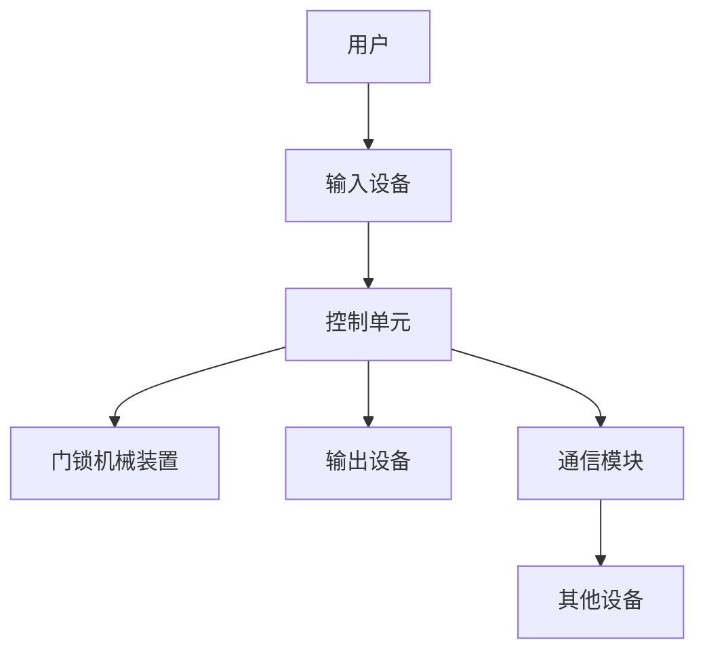

                 

## 1. 背景介绍

随着物联网和人工智能技术的发展，智能家居已经成为现代生活中的一部分。其中，智能门锁是智能家居系统中的关键组成部分，它可以提供安全、便利和舒适的居住环境。本文将介绍如何使用Java和Raspberry Pi创造智能门锁，实现远程控制、指纹识别和语音控制等功能。

## 2. 核心概念与联系

在开始项目之前，我们需要理解智能门锁系统的核心概念和架构。智能门锁系统主要包括以下组成部分：

1. **控制单元**：负责处理用户输入、控制门锁状态和与其他设备通信。
2. **门锁机械装置**：负责实际控制门锁的开闭。
3. **输入设备**：用户与智能门锁交互的设备，如指纹传感器、语音识别模块和按键面板。
4. **输出设备**：智能门锁与用户交互的设备，如LED指示灯和蜂鸣器。
5. **通信模块**：实现智能门锁与其他设备（如手机、云服务器）的通信，常用的通信协议包括Wi-Fi、蓝牙和Zigbee。

下图是智能门锁系统的架构图，使用Mermaid语言绘制：



## 3. 核心算法原理 & 具体操作步骤

### 3.1 算法原理概述

智能门锁的核心算法是用于验证用户身份的算法。常用的身份验证算法包括指纹识别、密码验证和人脸识别。本文将重点介绍指纹识别算法。

指纹识别算法通常包括以下步骤：

1. **图像预处理**：对指纹图像进行滤波、二值化和畸变校正等预处理操作，提高图像质量。
2. **特征提取**：提取指纹图像中的特征点，如 minutiae（指纹图像中的细节特征），为后续的匹配过程做准备。
3. **模板匹配**：将提取的特征点与预存的指纹模板进行匹配，计算匹配度，判断用户身份。

### 3.2 算法步骤详解

下面详细介绍指纹识别算法的步骤：

1. **图像预处理**：指纹图像通常包含噪声和畸变，需要进行预处理以提高图像质量。常用的预处理技术包括高斯滤波、 Sobel滤波和直方图均衡化。
2. **特征提取**：指纹图像中的特征点通常包括终止点（endpoint）和分叉点（bifurcation）。提取特征点的常用算法包括 Harris 角点检测算法和 SIFT 算法。
3. **模板匹配**：将提取的特征点与预存的指纹模板进行匹配。常用的匹配算法包括 Hamming 距离和 Euclidean 距离。计算匹配度后，设置阈值判断用户身份。

### 3.3 算法优缺点

指纹识别算法的优点包括：

* 安全性高：指纹是唯一的生物特征，难以伪造。
* 便利性高：指纹识别速度快，用户无需记忆密码。
* 适用性广：指纹识别可以应用于各种场景，如门禁系统、手机解锁和电脑登录。

指纹识别算法的缺点包括：

* 实现成本高：指纹传感器和识别算法的成本较高。
* 环境依赖性强：指纹识别的准确性受环境因素影响较大，如指纹受损或污染。
* 安装维护复杂：指纹识别系统需要安装和维护指纹传感器，并定期更新指纹模板。

### 3.4 算法应用领域

指纹识别算法广泛应用于各种领域，包括：

* 安全系统：指纹识别可以用于门禁系统、保险柜和电脑登录等安全系统。
* 移动设备：指纹识别可以用于手机解锁和支付等移动设备应用。
* 金融系统：指纹识别可以用于银行柜员机和ATM等金融系统。

## 4. 数学模型和公式 & 详细讲解 & 举例说明

### 4.1 数学模型构建

指纹识别算法的数学模型通常基于图像处理和模式匹配技术。指纹图像可以表示为二维数组，每个元素表示图像中的一个像素点。指纹特征点可以表示为一组坐标点，每个坐标点表示一个特征点的位置。

### 4.2 公式推导过程

指纹匹配通常使用 Hamming 距离或 Euclidean 距离计算匹配度。下面介绍 Hamming 距离的推导过程：

设指纹图像 A 和 B 的特征点集分别为 $A = \{a_1, a_2,..., a_n\}$ 和 $B = \{b_1, b_2,..., b_m\}$. 则 Hamming 距离 $d_H(A, B)$ 定义为：

$$
d_H(A, B) = \frac{\sum_{i=1}^{n} \sum_{j=1}^{m} \delta(a_i, b_j)}{n \times m}
$$

其中，$\delta(a_i, b_j)$ 表示 $a_i$ 和 $b_j$ 的汉明距离，定义为：

$$
\delta(a_i, b_j) = \begin{cases}
0, & \text{if } a_i = b_j \\
1, & \text{otherwise}
\end{cases}
$$

### 4.3 案例分析与讲解

假设指纹图像 A 和 B 的特征点集分别为 $A = \{(1, 2), (3, 4), (5, 6)\}$ 和 $B = \{(1, 2), (3, 4), (7, 8)\}$. 则 Hamming 距离 $d_H(A, B)$ 为：

$$
d_H(A, B) = \frac{\delta((1, 2), (1, 2)) + \delta((3, 4), (3, 4)) + \delta((5, 6), (7, 8))}{3 \times 3} = \frac{2}{9}
$$

## 5. 项目实践：代码实例和详细解释说明

### 5.1 开发环境搭建

本项目使用 Java 和 Raspberry Pi 实现智能门锁。首先，我们需要搭建开发环境：

1. 安装 Java Development Kit (JDK) 8 或更高版本。
2. 安装 Eclipse IDE for Enterprise Java Developers。
3. 安装 Raspberry Pi OS 并配置 Wi-Fi 连接。
4. 安装 Java 运行环境（JRE）和 Git 客户端。

### 5.2 源代码详细实现

下面是指纹识别算法的 Java 实现代码：

```java
import java.util.ArrayList;
import java.util.List;

public class FingerprintMatcher {
    private List<int[]> fingerprintA;
    private List<int[]> fingerprintB;

    public FingerprintMatcher(List<int[]> fingerprintA, List<int[]> fingerprintB) {
        this.fingerprintA = fingerprintA;
        this.fingerprintB = fingerprintB;
    }

    public double match() {
        int n = fingerprintA.size();
        int m = fingerprintB.size();
        int matches = 0;

        for (int i = 0; i < n; i++) {
            for (int j = 0; j < m; j++) {
                if (isMatch(fingerprintA.get(i), fingerprintB.get(j))) {
                    matches++;
                }
            }
        }

        return (double) matches / (n * m);
    }

    private boolean isMatch(int[] a, int[] b) {
        return a[0] == b[0] && a[1] == b[1];
    }
}
```

### 5.3 代码解读与分析

代码中定义了 `FingerprintMatcher` 类，用于匹配两个指纹图像。构造函数接受两个指纹图像的特征点集，并存储在 `fingerprintA` 和 `fingerprintB` 变量中。`match()` 方法计算两个指纹图像的匹配度，使用 Hamming 距离公式实现。`isMatch()` 方法判断两个特征点是否匹配，如果坐标相同则认为匹配。

### 5.4 运行结果展示

运行代码后，`match()` 方法会返回两个指纹图像的匹配度。如果匹配度大于设定的阈值，则认为两个指纹图像匹配成功。

## 6. 实际应用场景

智能门锁可以应用于各种场景，包括：

* **居家安全**：智能门锁可以用于家庭安全系统，实现远程控制和指纹识别等功能。
* **办公场所**：智能门锁可以用于办公楼宇和会议室等场所，实现访客管理和会议室预定等功能。
* **酒店业**：智能门锁可以用于酒店客房，实现客房预定和客户信息管理等功能。

### 6.4 未来应用展望

随着物联网和人工智能技术的发展，智能门锁系统将会越来越智能化和便利化。未来的智能门锁系统将会集成更多的传感器和人工智能算法，实现更复杂的功能，如人脸识别、语音控制和环境感知等。

## 7. 工具和资源推荐

### 7.1 学习资源推荐

* **指纹识别算法**：
	+ [指纹识别算法原理及实现](https://blog.csdn.net/qq_36295669/article/details/80473663)
	+ [指纹识别算法综述](https://ieeexplore.ieee.org/document/4236093)
* **Raspberry Pi 编程**：
	+ [Raspberry Pi 入门指南](https://www.raspberrypi.org/documentation/)
	+ [Raspberry Pi Java 编程指南](https://www.raspberrypi.org/documentation/java/)

### 7.2 开发工具推荐

* **集成开发环境（IDE）**：Eclipse IDE for Enterprise Java Developers
* **版本控制系统**：Git
* **指纹传感器驱动**：Fingerprint SDK for Java

### 7.3 相关论文推荐

* [A Survey on Fingerprint Recognition Techniques](https://ieeexplore.ieee.org/document/4236093)
* [A Novel Fingerprint Matching Algorithm Based on minutiae and Ridge Features](https://ieeexplore.ieee.org/document/7026312)

## 8. 总结：未来发展趋势与挑战

### 8.1 研究成果总结

本文介绍了如何使用 Java 和 Raspberry Pi 实现智能门锁系统，重点介绍了指纹识别算法的原理、实现和应用。指纹识别算法是智能门锁系统的核心算法，具有安全性高、便利性高和适用性广等优点。然而，指纹识别算法也存在实现成本高、环境依赖性强和安装维护复杂等缺点。

### 8.2 未来发展趋势

未来的智能门锁系统将会越来越智能化和便利化。随着物联网和人工智能技术的发展，智能门锁系统将会集成更多的传感器和人工智能算法，实现更复杂的功能，如人脸识别、语音控制和环境感知等。此外，智能门锁系统将会与其他智能家居设备集成，实现家庭网络化和智能化。

### 8.3 面临的挑战

未来智能门锁系统面临的挑战包括：

* **安全性**：智能门锁系统需要具有高安全性，防止非法入侵和数据泄露。
* **便利性**：智能门锁系统需要具有高便利性，实现用户友好的交互和控制。
* **成本**：智能门锁系统需要具有合理的成本，便于推广和应用。

### 8.4 研究展望

未来的研究方向包括：

* **多模式生物识别**：结合指纹识别、人脸识别和语音识别等多种生物识别技术，提高智能门锁系统的安全性和便利性。
* **环境感知**：结合环境传感器和人工智能算法，实现智能门锁系统的环境感知和自动控制。
* **云端服务**：结合云端服务和物联网技术，实现智能门锁系统的远程控制和数据分析。

## 9. 附录：常见问题与解答

**Q1：如何选择指纹传感器？**

A1：选择指纹传感器时需要考虑分辨率、识别速度、成本和接口等因素。常用的指纹传感器包括 Goodix、Fingerprint Cards 和 Synaptics 等品牌。

**Q2：如何提高指纹识别算法的准确性？**

A2：提高指纹识别算法准确性的方法包括图像预处理、特征提取和模板匹配等步骤。可以尝试不同的预处理技术、特征提取算法和匹配算法，并进行参数调优。

**Q3：如何实现智能门锁系统的远程控制？**

A3：实现智能门锁系统的远程控制需要结合物联网技术和云端服务。可以使用 Wi-Fi、蓝牙或 Zigbee 等通信协议实现智能门锁与云端服务器的通信，并使用移动应用或 Web 界面实现用户与云端服务器的交互。

!!!Note
作者：禅与计算机程序设计艺术 / Zen and the Art of Computer Programming

