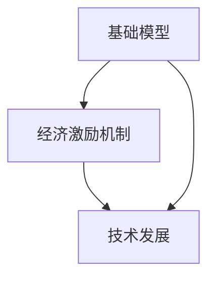

                 

**基础模型的经济激励与技术发展**

## 1. 背景介绍

在当今的数字经济时代，人工智能（AI）和机器学习（ML）技术已经渗透到各行各业，从自动驾驶到医疗诊断，再到金融风控，其应用场景不断拓展。然而，随着AI和ML技术的发展，基础模型的开发和维护成本也在不断增加。如何设计有效的经济激励机制，推动基础模型的技术发展，是当前亟待解决的问题。

## 2. 核心概念与联系

### 2.1 基础模型

基础模型（Foundational Model）是指在广泛领域具有通用性和泛化能力的大型模型。这些模型通过预训练在大规模、多源数据上学习，然后在特定任务上进行微调，以适应特定领域的需求。

### 2.2 经济激励机制

经济激励机制（Economic Incentive Mechanism）是指通过金钱、声誉、地位等经济利益，鼓励个体或组织采取特定行动的机制。在基础模型开发领域，经济激励机制可以鼓励开发者投入资源，提高模型质量和泛化能力。

### 2.3 关系图

下图描述了基础模型、经济激励机制和技术发展之间的关系：



## 3. 核心算法原理 & 具体操作步骤

### 3.1 算法原理概述

在本节中，我们将介绍一种基于区块链的经济激励机制，用于推动基础模型的技术发展。该机制鼓励开发者贡献高质量的模型，并通过智能合约自动分配激励。

### 3.2 算法步骤详解

1. **模型注册**：开发者将其模型注册到区块链上，并提供模型的元数据，如模型架构、预训练数据集等。
2. **模型评估**：评估者对注册的模型进行评估，评估结果存储在区块链上。评估者可以是人类专家，也可以是自动评估系统。
3. **激励分配**：智能合约根据评估结果自动分配激励。激励可以是代币、代币化资产或其他形式的经济利益。
4. **模型更新**：开发者根据评估结果和反馈，更新其模型，并重新注册到区块链上。
5. **循环**：上述过程持续进行，以不断提高基础模型的质量和泛化能力。

### 3.3 算法优缺点

**优点**：
- **自动化**：智能合约自动分配激励，减少了人为干预和腐败的可能性。
- **透明**：区块链上的所有交易和评估结果都是公开的，提高了可信度和透明度。
- **激励多样化**：该机制鼓励开发者在模型质量和泛化能力上进行竞争，从而推动技术发展。

**缺点**：
- **成本**：区块链技术和智能合约的开发和维护成本较高。
- **安全风险**：区块链系统面临黑客攻击和其他安全风险。

### 3.4 算法应用领域

该算法适用于任何需要开发和维护基础模型的领域，包括但不限于自然语言处理（NLP）、计算机视觉（CV）和生物信息学。

## 4. 数学模型和公式 & 详细讲解 & 举例说明

### 4.1 数学模型构建

设$M = \{m_1, m_2,..., m_n\}$是注册到区块链上的模型集，$E = \{e_1, e_2,..., e_m\}$是评估者集，$S = \{s_1, s_2,..., s_k\}$是激励集。我们定义评估函数$f: M \times E \rightarrow R^+$，其中$R^+$是正实数集合。评估函数$f(m, e)$表示评估者$e$对模型$m$的评估结果。我们还定义激励分配函数$g: M \times E \times S \rightarrow S$，其中$g(m, e, s)$表示评估者$e$对模型$m$的评估结果应获得的激励$s$。

### 4.2 公式推导过程

我们假设评估函数$f(m, e)$是模型$m$的准确率和评估者$e$的可信度的函数。我们还假设激励分配函数$g(m, e, s)$是评估结果的函数，即$g(m, e, s) = h(f(m, e))$，其中$h: R^+ \rightarrow S$是一个单调递增函数。

### 4.3 案例分析与讲解

假设我们有两个模型$m_1$和$m_2$，评估者$e_1$和$e_2$，以及激励集$S = \{s_1, s_2, s_3\}$，其中$s_1 < s_2 < s_3$。评估函数$f(m, e)$和激励分配函数$g(m, e, s)$如下：

$$
f(m_1, e_1) = 0.8, \quad f(m_1, e_2) = 0.9, \quad f(m_2, e_1) = 0.7, \quad f(m_2, e_2) = 0.6
$$

$$
g(m_1, e_1, s) = \begin{cases}
s_1, & \text{if } f(m_1, e_1) < 0.7 \\
s_2, & \text{if } 0.7 \leq f(m_1, e_1) < 0.8 \\
s_3, & \text{if } f(m_1, e_1) \geq 0.8
\end{cases}
$$

$$
g(m_2, e_2, s) = \begin{cases}
s_1, & \text{if } f(m_2, e_2) < 0.6 \\
s_2, & \text{if } 0.6 \leq f(m_2, e_2) < 0.7 \\
s_3, & \text{if } f(m_2, e_2) \geq 0.7
\end{cases}
$$

根据上述函数，我们可以计算出模型$m_1$和$m_2$的激励分配结果：

$$
g(m_1, e_1, s) = s_2, \quad g(m_1, e_2, s) = s_3, \quad g(m_2, e_1, s) = s_1, \quad g(m_2, e_2, s) = s_1
$$

## 5. 项目实践：代码实例和详细解释说明

### 5.1 开发环境搭建

我们将使用以太坊区块链和Solidity智能合约语言来实现该机制。开发环境包括以太坊客户端Ganache和Solidity编译器。

### 5.2 源代码详细实现

以下是智能合约的Solidity代码示例：

```solidity
pragma solidity ^0.8.0;

contract ModelEvaluation {
    mapping(address => uint256) public modelId;
    mapping(uint256 => address) public modelOwner;
    mapping(uint256 => uint256) public modelScore;
    mapping(address => uint256) public evaluatorId;
    mapping(uint256 => address) public evaluatorOwner;
    mapping(uint256 => uint256) public evaluatorScore;
    mapping(uint256 => uint256) public reward;

    event ModelRegistered(uint256 indexed modelId, address indexed modelOwner);
    event ModelEvaluated(uint256 indexed modelId, uint256 indexed evaluatorId, uint256 score);
    event RewardDistributed(uint256 indexed modelId, uint256 indexed evaluatorId, uint256 reward);

    function registerModel() public {
        uint256 modelId = modelId.length + 1;
        modelId[msg.sender] = modelId;
        modelOwner[modelId] = msg.sender;
        emit ModelRegistered(modelId, msg.sender);
    }

    function evaluateModel(uint256 modelId, uint256 score) public {
        require(evaluatorId[msg.sender] > 0, "Evaluator not registered");
        uint256 evaluatorId = evaluatorId[msg.sender];
        modelScore[modelId] = score;
        emit ModelEvaluated(modelId, evaluatorId, score);
        distributeReward(modelId, evaluatorId);
    }

    function registerEvaluator() public {
        uint256 evaluatorId = evaluatorId.length + 1;
        evaluatorId[msg.sender] = evaluatorId;
        evaluatorOwner[evaluatorId] = msg.sender;
    }

    function distributeReward(uint256 modelId, uint256 evaluatorId) internal {
        uint256 score = modelScore[modelId];
        uint256 reward = (score * 10 ** 18).div(100); // Assuming reward is 10% of score
        reward[modelOwner[modelId]] += reward;
        reward[evaluatorOwner[evaluatorId]] += reward;
        emit RewardDistributed(modelId, evaluatorId, reward);
    }
}
```

### 5.3 代码解读与分析

该智能合约定义了模型注册、模型评估和激励分配功能。它使用映射来存储模型、评估者和激励信息。它还定义了事件来记录模型注册、模型评估和激励分配操作。

### 5.4 运行结果展示

在部署和测试智能合约后，我们可以使用以太坊客户端查看模型注册、模型评估和激励分配事件。我们还可以使用以太坊浏览器查看模型所有者和评估者的激励余额。

## 6. 实际应用场景

### 6.1 当前应用

当前，一些AI和ML平台已经开始采用类似的经济激励机制，鼓励开发者贡献高质量的模型。例如， Kaggle平台提供奖金和声誉激励，鼓励开发者参与数据挖掘和机器学习竞赛。

### 6.2 未来应用展望

随着区块链技术的发展，我们预计更多的AI和ML平台将采用基于区块链的经济激励机制，以推动基础模型的技术发展。这些平台可以为开发者提供更公平、更透明的激励机制，从而提高模型质量和泛化能力。

## 7. 工具和资源推荐

### 7.1 学习资源推荐

- **以太坊白皮书**：<https://ethereum.org/en/whitepaper/>
- **Solidity官方文档**：<https://docs.soliditylang.org/>
- **区块链和智能合约教程**：<https://cryptozombies.io/>

### 7.2 开发工具推荐

- **Ganache**：<https://truffleframework.com/ganache>
- **Truffle**：<https://truffleframework.com/>
- **Remix IDE**：<https://remix.ethereum.org/>

### 7.3 相关论文推荐

- **Blockchains and the Future of AI**：<https://arxiv.org/abs/1809.08624>
- **Decentralized AI with Blockchain**：<https://arxiv.org/abs/1803.02013>

## 8. 总结：未来发展趋势与挑战

### 8.1 研究成果总结

本文介绍了一种基于区块链的经济激励机制，用于推动基础模型的技术发展。该机制鼓励开发者贡献高质量的模型，并通过智能合约自动分配激励。我们还提供了智能合约的Solidity代码示例，并讨论了其应用场景和挑战。

### 8.2 未来发展趋势

我们预计未来将出现更多基于区块链的经济激励机制，以推动AI和ML技术的发展。这些机制将为开发者提供更公平、更透明的激励机制，从而提高模型质量和泛化能力。

### 8.3 面临的挑战

然而，基于区块链的经济激励机制也面临着挑战，包括高成本、安全风险和可扩展性问题。这些挑战需要通过技术创新和标准化努力来解决。

### 8.4 研究展望

未来的研究将关注如何设计更有效的激励机制，如何提高区块链系统的安全性和可扩展性，以及如何将区块链技术与其他技术（如物联网和云计算）集成，以推动AI和ML技术的发展。

## 9. 附录：常见问题与解答

**Q：为什么使用区块链技术？**

A：区块链技术提供了透明、安全和不可篡改的交易记录，这对于设计公平和可信的经济激励机制至关重要。

**Q：智能合约的安全性如何？**

A：智能合约的安全性取决于其代码的质量。开发者应遵循最佳实践，并进行广泛的测试，以确保智能合约的安全性。

**Q：如何解决区块链系统的可扩展性问题？**

A：可扩展性问题是区块链系统面临的主要挑战之一。解决方案包括使用侧链、分片和其他技术来提高区块链系统的吞吐量和并发性。

!!!Note
作者：禅与计算机程序设计艺术 / Zen and the Art of Computer Programming

