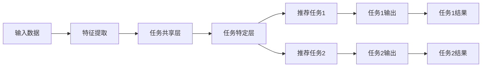

                 

## 1. 背景介绍

随着互联网的发展，用户面对海量信息时，需要推荐系统帮助他们发现感兴趣的内容。传统的推荐系统通常只关注单一任务，如电影推荐或新闻推荐。然而，用户的兴趣往往是多元化的，单一任务推荐系统无法满足用户的多样化需求。因此，多任务推荐系统应运而生，它可以同时处理多个推荐任务，为用户提供更个性化的推荐服务。

## 2. 核心概念与联系

### 2.1 多任务推荐系统的定义

多任务推荐系统（Multi-Task Recommender System, MTRS）是指能够同时处理多个推荐任务的推荐系统。它可以为用户提供多个推荐列表，每个列表对应一个推荐任务。

### 2.2 多任务学习的概念

多任务学习（Multi-Task Learning, MTL）是机器学习的一个分支，它允许模型在学习一个任务的同时学习其他相关任务。MTL的目标是利用任务之间的共享信息，提高每个任务的学习效果。

### 2.3 多任务推荐系统的架构

多任务推荐系统的架构可以分为两种：硬并行（Hard Parallel）和软并行（Soft Parallel）。硬并行架构将多个推荐任务分别训练，然后将结果合并。软并行架构则是将多个推荐任务共享一个模型进行训练。下面是软并行架构的Mermaid流程图：



## 3. 核心算法原理 & 具体操作步骤

### 3.1 算法原理概述

多任务推荐系统的核心算法是基于多任务学习的推荐算法。它首先提取输入数据的特征，然后在任务共享层进行特征表示学习，最后在任务特定层进行任务特异的学习，得到每个推荐任务的结果。

### 3.2 算法步骤详解

1. **特征提取**：从用户行为数据、内容数据和上下文数据中提取特征。
2. **任务共享层**：使用全连接层或转换器等模型学习任务共享的特征表示。
3. **任务特定层**：使用全连接层或转换器等模型学习任务特异的表示。
4. **推荐任务**：使用任务特定的表示进行推荐任务的预测。
5. **结果合并**：将每个推荐任务的结果合并，得到最终的推荐列表。

### 3.3 算法优缺点

**优点**：多任务推荐系统可以为用户提供多个推荐列表，满足用户的多样化需求。此外，它可以利用任务之间的共享信息，提高每个推荐任务的学习效果。

**缺点**：多任务推荐系统的训练过程比单一任务推荐系统更复杂，需要更多的计算资源。此外，任务之间的共享信息如果不足，反而会降低学习效果。

### 3.4 算法应用领域

多任务推荐系统可以应用于各种领域，如电子商务、视频推荐、新闻推荐等。它可以为用户提供个性化的购物推荐、视频推荐和新闻推荐等服务。

## 4. 数学模型和公式 & 详细讲解 & 举例说明

### 4.1 数学模型构建

设输入数据为$X \in \mathbb{R}^{n \times d}$，其中$n$是样本数，$d$是特征维数。任务共享层使用全连接层学习任务共享的特征表示$Z \in \mathbb{R}^{n \times k}$，其中$k$是任务共享层的输出维数。任务特定层使用全连接层学习任务特异的表示$Y_{i} \in \mathbb{R}^{n \times m_{i}}$，其中$m_{i}$是任务$i$的输出维数。推荐任务$i$的预测结果为$P_{i} \in \mathbb{R}^{n \times l_{i}}$，其中$l_{i}$是任务$i$的输出维数。

### 4.2 公式推导过程

任务共享层的学习目标是最小化损失函数$L_{shared}$，任务特定层的学习目标是最小化损失函数$L_{task_{i}}$。总损失函数为$L = \lambda L_{shared} + (1 - \lambda) \sum_{i=1}^{T} L_{task_{i}}$，其中$\lambda$是超参数，控制任务共享层和任务特定层的权重。

### 4.3 案例分析与讲解

例如，在电子商务领域，多任务推荐系统可以同时进行商品推荐和用户画像任务。商品推荐任务的目标是预测用户对商品的喜好度，用户画像任务的目标是描述用户的特征。任务共享层可以学习用户和商品的共享特征表示，任务特定层可以学习商品推荐任务和用户画像任务的特异表示。最终，多任务推荐系统可以为用户提供个性化的商品推荐和用户画像服务。

## 5. 项目实践：代码实例和详细解释说明

### 5.1 开发环境搭建

本项目使用Python开发，需要安装以下库：TensorFlow、NumPy、Pandas、Scikit-learn。

### 5.2 源代码详细实现

```python
import tensorflow as tf
from tensorflow.keras.layers import Dense, Input
from tensorflow.keras.models import Model

# 定义任务共享层
shared_input = Input(shape=(d,))
shared_layer = Dense(k, activation='relu')(shared_input)

# 定义任务特定层
task1_input = Input(shape=(d,))
task1_layer = Dense(m1, activation='relu')(shared_layer)
task1_output = Dense(l1, activation='sigmoid')(task1_layer)

task2_input = Input(shape=(d,))
task2_layer = Dense(m2, activation='relu')(shared_layer)
task2_output = Dense(l2, activation='sigmoid')(task2_layer)

# 定义模型
model = Model(inputs=[shared_input, task1_input, task2_input], outputs=[task1_output, task2_output])

# 编译模型
model.compile(optimizer='adam', loss='binary_crossentropy', metrics=['accuracy'])

# 训练模型
model.fit([X_shared, X_task1, X_task2], [y_task1, y_task2], epochs=10, batch_size=32)
```

### 5.3 代码解读与分析

代码首先定义任务共享层，然后定义任务特定层。任务共享层使用全连接层学习任务共享的特征表示，任务特定层使用全连接层学习任务特异的表示。最后，代码定义模型，编译模型，并训练模型。

### 5.4 运行结果展示

训练好的模型可以用于预测推荐任务的结果。例如，对于商品推荐任务，模型可以预测用户对商品的喜好度。对于用户画像任务，模型可以描述用户的特征。

## 6. 实际应用场景

多任务推荐系统可以应用于各种领域，如电子商务、视频推荐、新闻推荐等。它可以为用户提供个性化的购物推荐、视频推荐和新闻推荐等服务。例如，在电子商务领域，多任务推荐系统可以同时进行商品推荐和用户画像任务，为用户提供个性化的商品推荐和用户画像服务。

### 6.4 未来应用展望

未来，多任务推荐系统可以结合大数据和人工智能技术，为用户提供更个性化的推荐服务。此外，多任务推荐系统可以应用于更复杂的推荐任务，如跨平台推荐和时空推荐等。

## 7. 工具和资源推荐

### 7.1 学习资源推荐

推荐阅读以下文献：

* V. Vasile et al. "Multi-Task Learning for Recommender Systems." arXiv preprint arXiv:1904.06690 (2019).
* J. Wang et al. "MTL-Recommender: A Multi-Task Learning Framework for Recommender Systems." In Proceedings of the 12th ACM conference on Recommender systems (2018).

### 7.2 开发工具推荐

推荐使用以下开发工具：

* TensorFlow：用于构建和训练多任务推荐系统的模型。
* Jupyter Notebook：用于开发和调试多任务推荐系统的代码。

### 7.3 相关论文推荐

推荐阅读以下论文：

* V. Vasile et al. "Multi-Task Learning for Recommender Systems." arXiv preprint arXiv:1904.06690 (2019).
* J. Wang et al. "MTL-Recommender: A Multi-Task Learning Framework for Recommender Systems." In Proceedings of the 12th ACM conference on Recommender systems (2018).

## 8. 总结：未来发展趋势与挑战

### 8.1 研究成果总结

多任务推荐系统是一种有效的推荐系统，它可以为用户提供多个推荐列表，满足用户的多样化需求。此外，它可以利用任务之间的共享信息，提高每个推荐任务的学习效果。

### 8.2 未来发展趋势

未来，多任务推荐系统可以结合大数据和人工智能技术，为用户提供更个性化的推荐服务。此外，多任务推荐系统可以应用于更复杂的推荐任务，如跨平台推荐和时空推荐等。

### 8.3 面临的挑战

多任务推荐系统的训练过程比单一任务推荐系统更复杂，需要更多的计算资源。此外，任务之间的共享信息如果不足，反而会降低学习效果。

### 8.4 研究展望

未来的研究可以探索多任务推荐系统的新应用领域，如跨平台推荐和时空推荐等。此外，可以研究任务之间共享信息的有效表示方法，提高多任务推荐系统的学习效果。

## 9. 附录：常见问题与解答

**Q1：多任务推荐系统与单一任务推荐系统有何区别？**

A1：多任务推荐系统可以同时处理多个推荐任务，为用户提供多个推荐列表。单一任务推荐系统只关注单一任务，如电影推荐或新闻推荐。

**Q2：多任务推荐系统的优点是什么？**

A2：多任务推荐系统可以为用户提供多个推荐列表，满足用户的多样化需求。此外，它可以利用任务之间的共享信息，提高每个推荐任务的学习效果。

**Q3：多任务推荐系统的缺点是什么？**

A3：多任务推荐系统的训练过程比单一任务推荐系统更复杂，需要更多的计算资源。此外，任务之间的共享信息如果不足，反而会降低学习效果。

!!!Note
作者：禅与计算机程序设计艺术 / Zen and the Art of Computer Programming

