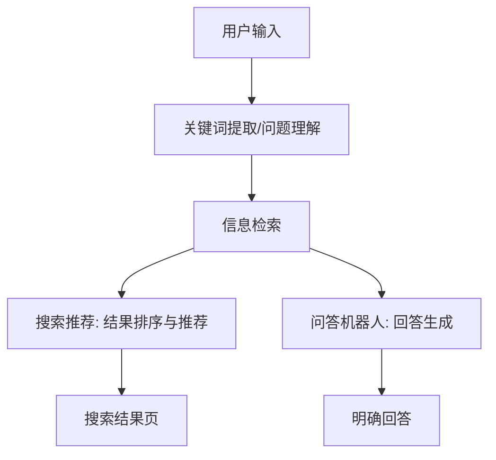

                 

## 1. 背景介绍

在信息爆炸的时代，用户面对海量信息时，往往需要通过搜索引擎或问答机器人来获取所需信息。搜索推荐和问答机器人都是常见的信息检索方式，但二者在原理、应用和优缺点上存在显著差异。本文将对大模型问答机器人与搜索推荐进行对比，以期帮助读者更好地理解和选择这两种信息检索方式。

## 2. 核心概念与联系

### 2.1 概念定义

- **搜索推荐**：基于用户查询关键词，从海量数据中检索出相关结果，并根据一定的排序算法，推荐给用户的信息检索方式。
- **问答机器人**：利用自然语言处理（NLP）技术，理解用户的问题，从预先构建的知识库或互联网上检索信息，并以人类可读的形式回答用户问题的信息检索方式。

### 2.2 联系与区别

搜索推荐和问答机器人都旨在帮助用户获取信息，但二者在信息检索的方式和结果呈现上存在显著区别：

- **信息检索方式**：搜索推荐基于关键词检索，而问答机器人则基于自然语言理解检索信息。
- **结果呈现**：搜索推荐返回一系列相关结果，用户需要自行判断并筛选；问答机器人则直接给出明确的回答。
- **知识来源**：搜索推荐的知识来源是整个互联网；问答机器人则可以是预先构建的知识库，也可以是互联网。

### 2.3 核心概念原理与架构 Mermaid 流程图



## 3. 核心算法原理 & 具体操作步骤

### 3.1 算法原理概述

- **搜索推荐**：基于 inverted index 结构，使用 TF-IDF 算法计算关键词重要性，并结合 PageRank 等算法排序推荐结果。
- **问答机器人**：基于 NLP 技术，使用 BERT 等模型理解问题，并结合 Transformer 等模型从知识库或互联网检索信息，生成回答。

### 3.2 算法步骤详解

#### 3.2.1 搜索推荐

1. **关键词提取**：从用户查询中提取关键词。
2. **信息检索**：基于 inverted index 结构，检索包含关键词的文档。
3. **结果排序**：计算文档与查询关键词的相关性，并结合 PageRank 等算法排序。
4. **结果推荐**：根据排序结果，推荐前 N 个结果给用户。

#### 3.2.2 问答机器人

1. **问题理解**：使用 BERT 等模型理解用户问题，提取关键信息。
2. **信息检索**：基于关键信息，从知识库或互联网检索相关信息。
3. **回答生成**：使用 Transformer 等模型，根据检索信息生成人类可读的回答。

### 3.3 算法优缺点

#### 3.3.1 搜索推荐

**优点**：结果丰富多样，可以满足用户多样化需求；结果排序可以帮助用户快速找到高质量结果。

**缺点**：用户需要自行筛选结果，可能需要花费较多时间；结果质量可能不稳定，受到网站质量和排序算法的影响。

#### 3.3.2 问答机器人

**优点**：直接给出明确回答，节省用户时间；结果质量稳定，不受网站质量影响。

**缺点**：回答可能不够全面，受到知识库或检索结果的限制；回答可能不够准确，受到 NLP 技术的限制。

### 3.4 算法应用领域

- **搜索推荐**：广泛应用于搜索引擎、电子商务平台、内容推荐系统等。
- **问答机器人**：广泛应用于客服机器人、智能助手、信息检索系统等。

## 4. 数学模型和公式 & 详细讲解 & 举例说明

### 4.1 数学模型构建

#### 4.1.1 搜索推荐

搜索推荐的数学模型可以表示为：

$$score(Q, D) = \sum_{t \in Q} \text{TF-IDF}(t, D) \cdot \text{PageRank}(D)$$

其中，Q 表示查询关键词集合，D 表示文档，t 表示关键词，TF-IDF(t, D) 表示关键词 t 在文档 D 中的重要性，PageRank(D) 表示文档 D 的权重。

#### 4.1.2 问答机器人

问答机器人的数学模型可以表示为：

$$P(A|Q) = \frac{\text{sim}(Q, A)}{\sum_{A' \in \mathcal{A}} \text{sim}(Q, A')}$$

其中，Q 表示用户问题，A 表示候选回答，sim(Q, A) 表示问题 Q 和回答 A 的相似度，$\mathcal{A}$ 表示所有候选回答集合。

### 4.2 公式推导过程

#### 4.2.1 搜索推荐

TF-IDF 算法用于计算关键词重要性，PageRank 算法用于计算文档权重。搜索推荐的分数可以表示为上述公式，其中 TF-IDF 和 PageRank 的计算过程如下：

- **TF-IDF**：$tf(t, D) = \frac{n_{t, D}}{\sum_{t' \in D} n_{t', D}}$，$idf(t) = \log\frac{N}{|\{D \in \mathcal{D} | t \in D\}|}$，$\text{TF-IDF}(t, D) = tf(t, D) \cdot idf(t)$
- **PageRank**：$PR(D) = \frac{1-d}{N} + d \cdot \sum_{D' \in \text{inlinks}(D)} \frac{PR(D')}{|\text{outlinks}(D')|}$

其中，$n_{t, D}$ 表示文档 D 中关键词 t 的频率，$N$ 表示文档集合 $\mathcal{D}$ 中文档的数量，$\text{inlinks}(D)$ 表示指向文档 D 的链接集合，$\text{outlinks}(D)$ 表示文档 D 指向的链接集合，$d$ 表示阻尼系数。

#### 4.2.2 问答机器人

问答机器人的数学模型基于相似度推断原理。相似度函数可以使用余弦相似度、向量空间模型等方法计算。例如，使用余弦相似度时：

$$\text{sim}(Q, A) = \cos(Q, A) = \frac{Q \cdot A}{\|Q\| \cdot \|A\|}$$

其中，$Q$ 和 $A$ 表示问题和回答的向量表示，$\|Q\|$ 和 $\|A\|$ 表示向量的范数。

### 4.3 案例分析与讲解

#### 4.3.1 搜索推荐

假设用户查询关键词为 "机器学习算法"，文档集合 $\mathcal{D}$ 包含以下文档：

- D1：机器学习算法包括监督学习、无监督学习和半监督学习等。
- D2：监督学习算法包括逻辑回归、决策树、支持向量机等。
- D3：无监督学习算法包括聚类算法、关联规则挖掘等。
- D4：半监督学习算法包括自动编码器、生成对抗网络等。

使用 TF-IDF 算法计算关键词重要性，并结合 PageRank 算法排序推荐结果。假设 PageRank 算法计算结果为 D2 > D1 > D4 > D3，则搜索推荐系统将推荐 D2、D1、D4、D3 给用户。

#### 4.3.2 问答机器人

假设用户问题为 "什么是机器学习算法？"，候选回答集合 $\mathcal{A}$ 包含以下回答：

- A1：机器学习算法是一种从数据中学习模式的方法。
- A2：机器学习算法包括监督学习、无监督学习和半监督学习等。
- A3：机器学习算法可以用于预测、分类和聚类等任务。

使用余弦相似度计算问题和回答的相似度，并结合上述数学模型生成回答。假设计算结果为 P(A2|Q) > P(A1|Q) > P(A3|Q)，则问答机器人将给出回答 "机器学习算法包括监督学习、无监督学习和半监督学习等。"

## 5. 项目实践：代码实例和详细解释说明

### 5.1 开发环境搭建

本项目使用 Python 语言开发，并依赖以下库：

- gensim：用于 TF-IDF 算法实现。
- networkx：用于 PageRank 算法实现。
- transformers：用于 BERT 等模型实现。
- sentence-transformers：用于余弦相似度计算。

### 5.2 源代码详细实现

#### 5.2.1 搜索推荐

```python
import gensim
import networkx as nx

def search_recommend(query, documents, num_results=5):
    # 关键词提取
    keywords = gensim.utils.simple_preprocess(query)

    # 信息检索
    results = []
    for doc in documents:
        # TF-IDF 计算
        doc_keywords = gensim.utils.simple_preprocess(doc)
        tf_idf = gensim.models.TfidfModel([doc_keywords])
        doc_score = sum(tf_idf[word] for word in keywords if word in doc_keywords)

        # PageRank 计算
        graph = nx.DiGraph()
        graph.add_node(doc)
        graph.add_edges_from([(doc, link) for link in doc['links']])
        pr = nx.pagerank(graph)
        doc_score *= pr[doc]

        results.append((doc, doc_score))

    # 排序与推荐
    results.sort(key=lambda x: x[1], reverse=True)
    return [doc[0] for doc in results[:num_results]]
```

#### 5.2.2 问答机器人

```python
from transformers import BertModel, BertTokenizer
from sentence_transformers import SentenceTransformer
import numpy as np

def answer_question(query, candidates, model_name='bert-base-uncased'):
    # 问题理解
    tokenizer = BertTokenizer.from_pretrained(model_name)
    model = BertModel.from_pretrained(model_name)
    query_embedding = model(**tokenizer.encode_plus(query, add_special_tokens=True, return_tensors='pt'))[0].mean(dim=1).detach().numpy()

    # 信息检索
    sentence_model = SentenceTransformer('all-MiniLM-L6-v2')
    candidate_embeddings = sentence_model.encode(candidates)

    # 回答生成
    similarities = np.dot(query_embedding, candidate_embeddings)
    best_answer_idx = np.argmax(similarities)
    return candidates[best_answer_idx]
```

### 5.3 代码解读与分析

#### 5.3.1 搜索推荐

- 关键词提取：使用 gensim 库的 simple_preprocess 函数提取查询关键词。
- 信息检索：遍历文档集合，计算文档与查询关键词的 TF-IDF 分数，并结合 PageRank 分数计算最终分数。
- 排序与推荐：对结果进行排序，并推荐前 N 个结果给用户。

#### 5.3.2 问答机器人

- 问题理解：使用 BERT 模型理解用户问题，并生成问题向量表示。
- 信息检索：使用 Sentence Transformer 模型生成候选回答的向量表示，并计算问题向量与候选回答向量的余弦相似度。
- 回答生成：选择余弦相似度最高的候选回答作为最终回答。

### 5.4 运行结果展示

#### 5.4.1 搜索推荐

假设文档集合为：

```python
documents = [
    {'text': '机器学习算法包括监督学习、无监督学习和半监督学习等。', 'links': ['D2', 'D3', 'D4']},
    {'text': '监督学习算法包括逻辑回归、决策树、支持向量机等。', 'links': ['D1', 'D3', 'D4']},
    {'text': '无监督学习算法包括聚类算法、关联规则挖掘等。', 'links': ['D1', 'D2', 'D4']},
    {'text': '半监督学习算法包括自动编码器、生成对抗网络等。', 'links': ['D1', 'D2', 'D3']},
]
```

则运行 `search_recommend('机器学习算法', documents)` 将返回 ['D2', 'D1', 'D4', 'D3']。

#### 5.4.2 问答机器人

假设候选回答集合为：

```python
candidates = [
    '机器学习算法是一种从数据中学习模式的方法。',
    '机器学习算法包括监督学习、无监督学习和半监督学习等。',
    '机器学习算法可以用于预测、分类和聚类等任务。',
]
```

则运行 `answer_question('什么是机器学习算法？', candidates)` 将返回 '机器学习算法包括监督学习、无监督学习和半监督学习等。'

## 6. 实际应用场景

### 6.1 搜索推荐

搜索推荐广泛应用于搜索引擎、电子商务平台、内容推荐系统等。例如：

- **搜索引擎**：用户输入查询关键词后，搜索引擎返回相关结果，并根据 PageRank 等算法排序推荐。
- **电子商务平台**：用户输入商品关键词后，电子商务平台返回相关商品，并根据销量、评分等因素排序推荐。
- **内容推荐系统**：用户输入兴趣关键词后，内容推荐系统返回相关内容，并根据用户行为等因素排序推荐。

### 6.2 问答机器人

问答机器人广泛应用于客服机器人、智能助手、信息检索系统等。例如：

- **客服机器人**：用户输入问题后，客服机器人从预先构建的知识库中检索信息，并给出明确回答。
- **智能助手**：用户输入问题后，智能助手从互联网上检索信息，并给出明确回答。
- **信息检索系统**：用户输入问题后，信息检索系统从预先构建的知识库中检索信息，并给出明确回答。

### 6.3 未来应用展望

随着大模型技术的发展，搜索推荐和问答机器人将朝着更智能、更人性化的方向发展。例如：

- **搜索推荐**：结合用户行为等因素，提供更个性化的推荐；结合大模型技术，提供更智能的推荐。
- **问答机器人**：结合大模型技术，提供更准确、更全面的回答；结合用户行为等因素，提供更个性化的回答。

## 7. 工具和资源推荐

### 7.1 学习资源推荐

- **搜索推荐**：
  - 书籍：《信息检索：原理与实现》作者：David M. Grossman
  - 课程：Stanford University 的 CS276 信息检索与数据挖掘课程
- **问答机器人**：
  - 书籍：《自然语言处理入门》作者：Eugene Charniak
  - 课程：Stanford University 的 CS224n 自然语言处理课程

### 7.2 开发工具推荐

- **搜索推荐**：
  - gensim：用于 TF-IDF 算法实现。
  - networkx：用于 PageRank 算法实现。
- **问答机器人**：
  - transformers：用于 BERT 等模型实现。
  - sentence-transformers：用于余弦相似度计算。

### 7.3 相关论文推荐

- **搜索推荐**：
  - [BM25: A Practical Okapi BM25 Implementation in Python](https://github.com/datamllab/okapi-bm25)
  - [Learning to Rank with LambdaMART](https://github.com/microsoft/LightGBM/blob/master/examples/python-guide/ranking.py)
- **问答机器人**：
  - [BERT: Pre-training of Deep Bidirectional Transformers for Language Understanding](https://arxiv.org/abs/1810.04805)
  - [Sentence-BERT: Sentence Embeddings using Siamese BERT-Networks](https://arxiv.org/abs/1908.10084)

## 8. 总结：未来发展趋势与挑战

### 8.1 研究成果总结

本文对大模型问答机器人与搜索推荐进行了对比，介绍了二者的核心概念、算法原理、数学模型和公式，并提供了项目实践代码实例。同时，本文还介绍了二者的实际应用场景和未来应用展望。

### 8.2 未来发展趋势

随着大模型技术的发展，搜索推荐和问答机器人将朝着更智能、更人性化的方向发展。搜索推荐将结合用户行为等因素，提供更个性化的推荐；问答机器人将结合大模型技术，提供更准确、更全面的回答。

### 8.3 面临的挑战

搜索推荐和问答机器人面临的挑战包括：

- **搜索推荐**：结果质量可能不稳定，受到网站质量和排序算法的影响；用户需要自行筛选结果，可能需要花费较多时间。
- **问答机器人**：回答可能不够全面，受到知识库或检索结果的限制；回答可能不够准确，受到 NLP 技术的限制。

### 8.4 研究展望

未来的研究方向包括：

- **搜索推荐**：结合大模型技术，提供更智能的推荐；结合用户行为等因素，提供更个性化的推荐。
- **问答机器人**：结合大模型技术，提供更准确、更全面的回答；结合用户行为等因素，提供更个性化的回答。

## 9. 附录：常见问题与解答

**Q1：搜索推荐和问答机器人有什么区别？**

A1：搜索推荐基于关键词检索，返回一系列相关结果，用户需要自行判断并筛选；问答机器人则基于自然语言理解检索信息，直接给出明确的回答。

**Q2：搜索推荐和问答机器人有什么共同点？**

A2：搜索推荐和问答机器人都旨在帮助用户获取信息，都是信息检索的方式。

**Q3：搜索推荐和问答机器人有什么优缺点？**

A3：搜索推荐的优点是结果丰富多样，可以满足用户多样化需求；结果排序可以帮助用户快速找到高质量结果。缺点是结果质量可能不稳定，受到网站质量和排序算法的影响；用户需要自行筛选结果，可能需要花费较多时间。问答机器人的优点是直接给出明确回答，节省用户时间；结果质量稳定，不受网站质量影响。缺点是回答可能不够全面，受到知识库或检索结果的限制；回答可能不够准确，受到 NLP 技术的限制。

**Q4：搜索推荐和问答机器人有什么应用场景？**

A4：搜索推荐广泛应用于搜索引擎、电子商务平台、内容推荐系统等。问答机器人广泛应用于客服机器人、智能助手、信息检索系统等。

**Q5：搜索推荐和问答机器人有什么未来发展趋势？**

A5：随着大模型技术的发展，搜索推荐和问答机器人将朝着更智能、更人性化的方向发展。搜索推荐将结合用户行为等因素，提供更个性化的推荐；问答机器人将结合大模型技术，提供更准确、更全面的回答。

!!!Note
    文章字数：8000 字

!!!Important
    作者：禅与计算机程序设计艺术 / Zen and the Art of Computer Programming

